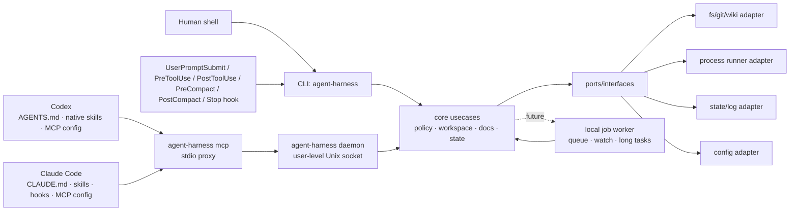

# agent-harness 아키텍처

---

## 1. 핵심 판단: plugin-only가 아니라 외부 하네스 코어

| 선택지 | 장점 | 단점 | 판단 |
|--------|------|------|------|
| Codex plugin/skill 중심 | Codex 경험에 깊게 통합 가능, 설치 UX가 좋음 | Claude Code와 공유가 어렵고, plugin API 변화에 core가 종속됨 | 단독 core로 부적절 |
| Claude Code command/hook 중심 | Claude 사용성이 좋고 MCP와 맞음 | Codex에서 같은 동작을 재사용하기 어렵고, hook에 정책이 흩어짐 | 단독 core로 부적절 |
| 외부 CLI/MCP/worker 중심 | 양쪽 host에서 같은 binary와 schema를 호출, 테스트 가능, 상태 관리 일관 | 초기 설치/IPC/보안 설계 필요 | **채택** |
| Hybrid | 외부 core + host별 얇은 래퍼 | adapter 관리 비용이 있음 | **최종 구조** |

결론: **Go로 작성한 외부 하네스 코어를 만들고, Codex plugin과 Claude Code 설정은 core를 호출하는 얇은 adapter로 둔다.**

---

## 2. Target Architecture

Mermaid는 보조 자료다. 규칙·경계·검증 명령은 아래 텍스트를 우선한다.

### Core engine / port / host adapter 구조

설치와 host 통합은 SOLID 경계로 나눈다.

- `internal/core.InstallNative`: host-neutral core engine. skill 목록, root/bin/wiki 경로 같은 공통 입력을 정규화하고 `port.HostInstaller`만 호출한다.
- `internal/port`: `NativeInstallRequest`, `NativeInstallResult`, `HostInstaller` interface, 설치 DTO를 정의한다. core는 concrete host를 모른다.
- `internal/adapter/codex`: Codex 구현체. user skill symlink, `~/.codex/config.toml` MCP 등록, `~/.codex/hooks.json` lifecycle hook을 기본 갱신한다.
- `internal/adapter/claude`: Claude Code 구현체. user skill symlink, user-scope MCP 등록 경로, `~/.claude/settings.json` lifecycle hook 등록을 기본 사용한다. Claude hook은 Codex와 같은 `agent-harness hook user-prompt/pre-tool-use/post-tool-use/pre-compact/post-compact/stop` CLI를 호출한다.
- repo-local `.claude/skills`, `.claude/settings.json`, `.mcp.json`은 적용 대상 repo에 커밋될 수 있으므로 `--project-local` 같은 명시적 opt-in에서만 생성한다.

이 구조에서 새 host를 추가할 때는 core 수정 없이 `port.HostInstaller` 구현체만 추가하는 것이 원칙이다.

---

## 3. 실행 모드

| 모드 | 도입 단계 | 용도 | 원칙 |
|------|----------|------|------|
| `agent-harness` CLI one-shot | 구현됨 | 모든 host에서 공통으로 호출 가능한 최소 표면 | `bin/agent-harness inspect/preflight/doctor/docs/policy/state/self-verify/self-augment` 사용 |
| `agent-harness mcp` stdio proxy | 구현됨 | Codex/Claude Code가 같은 MCP schema로 daemon에 연결 | `agent-harness` daemon을 자동 시작하고 stdio를 Unix socket으로 proxy한다. |
| `agent-harness daemon` user-level daemon | 구현됨 | 여러 host/session의 공통 MCP backend, 상태 공유 | `HARNESS_DAEMON_DIR` 또는 `~/.local/state/agent-harness/daemon`; stale lock, pid, socket, stop/status 제공 |
| `agent-harness issueops` | 구현됨 | issue-driven 루프의 durable 상태와 direct/Orca execution v1 lease | IssueOps가 단일 authority다. Orca는 readiness, workspace, native owner launch/inventory만 제공하고 generation/actor/CWD fence는 core가 소유한다. |
| `agent-harness loop` | 구현됨 | verify-until-done 루프 계약의 durable 상태와 PR readiness 게이트 | 하네스는 검증 명령을 실행하지 않고 `verify_argv`, 시도 evidence, stop 상태를 기록·게이트한다. |
| `agent-harness worker` one-shot jobs | 부분 구현 | no-shell lifecycle job record와 draft-wiki queue 처리 | 현재 daemon은 MCP proxy backend이며 장기 상주 job daemon이 아니다. `worker draft-wiki`는 메인 에이전트가 명시 적재한 queue를 한 번 처리하고 `agy -p` argv만 호출한다. |
| Codex plugin/skill | Phase 5 | Codex에서 설치·명령·문서 UX 개선 | core 로직 금지, CLI/MCP 호출 래퍼만 허용 |
| Claude commands/hooks | Phase 6 | Claude Code UX 개선 | core 정책 우회 금지 |

---

## 4. Planned package boundaries

| 경로 | 책임 | 금지/주의 |
|------|------|----------|
| `cmd/harness` | binary entrypoint, CLI flag 처리, MCP JSON-RPC mapping/proxy, daemon lifecycle, guard CLI, self-verify QA loop, self-augment curriculum orchestration | host별 정책 복제 금지 |
| `internal/port` | core interface, DTO, error contract | adapter concrete type 의존 금지 |
| `internal/adapter/cli` | flag parsing, stdout/stderr, exit code mapping | core 정책 복제 금지 |
| `internal/adapter/mcp` | MCP tool schema, stdio server, JSON-RPC mapping | CLI와 다른 의미의 schema 금지 |
| `internal/core/toolconformance` | host-neutral fixture manifest, schema projection/validation, call classification, benchmark gate, behavioral replay | host argv, credentials, production dispatch 의존 금지 |
| `internal/core/failurecause` | `failure_class`와 직교하는 typed causal evidence 분류 | stderr 문자열 추측이나 model blame 금지 |
| `internal/core/operationalhealth` | normalized Git/IssueOps/Orca/user-state snapshot과 주입된 clock/preserve set을 판정하는 pure classifier | filesystem/process/SQLite I/O, cleanup mutation, host별 정책 금지 |
| `internal/adapter/hostprobe` | Codex/Claude의 격리된 live probe 실행과 증거 정규화 | 사용자 host 설정·credential DB 수정 금지 |
| `internal/adapter/orca` | 설치된 Orca CLI의 bounded argv/timeout/envelope projection | IssueOps 상태·복구 정책 복제, generic driver registry, 설치 대행 금지 |
| `internal/adapter/operationalhealth` | Git, 전체 IssueOps record/binding, 선택적 Orca inventory를 read-only snapshot으로 수집 | health 판정 복제, state 생성, cleanup mutation 금지 |
| `internal/adapter/codex` | Codex user skill symlink와 user MCP config 설치 | 대상 repo 파일 쓰기 금지 |
| `internal/adapter/claude` | Claude user skill symlink와 user-scope MCP 설정 | 기본 설치에서 `.claude/skills`, `.claude/settings.json`, `.mcp.json` 같은 repo-local 파일 쓰기 금지 |
| `internal/adapter/worker` | local IPC, job lifecycle, daemon state | shell policy 우회 금지 |
| `internal/adapter/fs` | filesystem, git, process runner | workspace boundary 검증 필요 |
| `configs/codex` | Codex plugin/skill 템플릿 | core 로직 금지 |
| `skills` | Codex/Claude 공용 skill source of truth | host별 복사본을 만들어 drift 유발 금지 |
| `.mcp.json` | 이 하네스 repo의 dogfood/project-local MCP server 설정 | 기본 설치는 user-scope MCP를 사용하므로 대상 repo에 복사 금지 |
| `scripts/install-native.sh` | native skill/MCP 설치 및 갱신 | 사용자 홈 skill symlink만 기본 생성. repo-local 파일은 `--project-local` 명시 때만 생성 |

### 4.1 Cross-host tool contract boundary

`contract conformance`는 production MCP 의미를 바꾸기 전에 host가 실제로 생성한 raw arguments를 측정한다. `internal/adapter/mcp`의 capture-only probe는 episode마다 한 tool만 광고하고 production catalog handler를 등록하거나 호출하지 않는다. 세 host의 argv, 임시 config/plugin, 인증 격리는 `internal/adapter/hostprobe`가 소유하고 schema 의미와 판정은 `internal/core/toolconformance` 하나가 소유한다.

Deterministic baseline과 live evidence는 advertised schema validity와 closed canonical-intent validity를 별도로 기록한다. 재현 gate가 동일 diagnostic signature를 두 번 이상 확인한 경우에만 production advertised schema와 SDK/legacy call entry를 같은 canonical validator로 원자적으로 강화한다. 이 gate가 열리지 않은 상태에서는 benchmark, failure-cause axis, self-verify coverage만 유지하고 production argument semantics는 변경하지 않는다.

### 4.2 Operational-health boundary

기존 top-level `doctor`가 cross-system operational health의 유일한 공개 표면이다. `internal/adapter/operationalhealth`가 read-only inventory를 정규화하고, `internal/core/operationalhealth`가 deterministic finding을 만든다. IssueOps stale scan은 같은 cycle-authority 판정만 재사용하되 기존 strong-signal release policy와 locked re-probe를 유지한다. Stability audit는 ownership/residue 규칙을 다시 구현하지 않고 방금 빌드한 binary의 `doctor` 결과를 gate로 소비한다.

### 4.3 Dependency fitness ratchet

`internal/architecture`는 production import graph의 test-only fitness boundary다. `go list -json ./...`의 direct `Imports`만 정렬된 `importer -> imported` edge로 수집하며, test import와 transitive dependency는 graph에 포함하지 않는다.

- `internal/core/... -> internal/adapter/...|cmd/...`, `internal/adapter/... -> cmd/...`, `internal/port -> internal/...`는 baseline 없이 즉시 실패한다.
- legacy infrastructure·adapter-to-core·composition root 밖 concrete-adapter edge는 `internal/architecture/testdata/legacy_imports.txt`와 정확히 일치해야 한다. 신규·이동·삭제 후 남은 stale edge는 `legacy_baseline` rule과 edge를 함께 출력한다.
- baseline을 줄이는 변경은 의도된 architecture 개선으로 같은 review에서만 허용한다. production package 이동이나 runtime wiring은 이 ratchet의 범위가 아니다.

---

## 5. Docs / state / config / logs

현재 `agent-harness docs`는 에이전트가 읽어야 할 markdown source of truth를 index로 노출한다. `agent-harness project bootstrap`은 적용 대상 레포에 명시 실행될 때만 `AGENTS.md` marker block, `.agent-harness/*.md` 프로젝트 운영 문서, user-state repo profile metadata를 생성/갱신한다.

- 대상: `AGENTS.md`, `CLAUDE.md`, `GENIUS_THINK.md`, `.agent-harness/*.md`, `skills/self-verify/*.md`, `skills/self-augment/*.md`
- 필드: relative path, absolute path, title, headings, byte size
- 제공 표면: CLI `docs --json`, MCP `docs_index`, resource `harness://docs`
- 제외: `.agent-harness/draft-wiki/**`는 사용자가 검토하는 wiki 후보 staging area이므로 source-of-truth docs index에 섞지 않는다.

Project docs bootstrap:

- 대상: 적용 대상 repo의 `AGENTS.md`, `.agent-harness/ARCHITECTURE.md`, `.agent-harness/CAUTIONS.md`, `.agent-harness/COMMIT_POLICY.md`, `.agent-harness/CONSTITUTION.md`, `.agent-harness/CONVENTIONS.md`, `.agent-harness/TECH_STACK.md`, `.agent-harness/TESTING.md`, `.agent-harness/ADR.md`, `.agent-harness/OPERATIONS.md`, `.agent-harness/AGENT_WORKFLOW.md`
- 기본 동작: `agent-harness project bootstrap`은 누락된 파일과 user-state repo profile metadata를 생성한다. 계획만 볼 때는 `--dry-run`, 기존 문서/프로필을 현재 템플릿과 repo evidence로 다시 맞출 때는 `--sync`를 쓴다.
- 안전: `AGENTS.md` 전체를 덮어쓰지 않고 `AGENT_HARNESS` marker block만 관리한다.
- MCP: `project_docs_bootstrap_plan`, `project_docs_route`, `harness://project-docs`와 lifecycle profile metadata로 어떤 작업에 어떤 문서/레포 맥락을 확인해야 하는지 제공한다.

Draft wiki staging:

- 위치: 적용 대상 repo의 `.agent-harness/draft-wiki/{draft,approved,rejected}/`
- 목적: 장기 재사용 가치가 있다고 판단한 후보를 사용자가 파일 diff로 직접 검토·수정·승인하는 repo-local staging area로 둔다.
- 제공 표면: CLI `agent-harness project draft-wiki init/list/suggest/queue/approve/reject/promote`
- Hook/worker 흐름: hook은 draft-wiki 가치 판단이나 queue append를 자동 수행하지 않는다. UserPromptSubmit은 “메인 에이전트가 장기 재사용 가치 여부를 판단하라”는 지침만 주입하고, 메인 에이전트가 의미 있는 후보라고 판단한 경우에만 `agent-harness project draft-wiki queue --stdin`(heredoc 권장) 또는 `--input`으로 bounded/redacted user-state queue(`draft-wiki-queue.jsonl`)에 명시 적재한다. hook critical path에서는 `agy`를 실행하지 않는다. `agent-harness worker draft-wiki`가 queue를 읽어 `agy -p`를 argv 실행하고 응답을 `.agent-harness/draft-wiki/draft/*.md`에 쓴다.
- 경계: `suggest`와 `worker draft-wiki`만 `agy -p`를 호출한다. `promote --confirm`은 승인된 draft를 repo-local `exported/` 디렉토리로 이동하고 `export.log`만 append한다. 외부 wiki ingest, lint, index, query-pack은 하네스 promote의 책임이 아니다.

현재 `agent-harness state`는 작은 에이전트 체크포인트를 state root의 SQLite 데이터베이스(`harness.db`의 `state` bucket row)로 저장한다. project lifecycle state는 같은 user-state root 아래 `projects/<repo-id>/`에 격리되며 target repo의 `.agent-harness/`에는 쓰지 않는다. IssueOps v1 상태는 독립 namespace `issueops_v1/harness.db`의 `issueops_v1` bucket에 저장해 Codex와 Claude 세션을 넘어 이어간다. Loop 상태는 같은 user-state root 아래 `loop/harness.db`의 `loop` bucket에 저장한다. 모든 read-modify-write span은 해당 root의 `harness.lock.db`에 BEGIN IMMEDIATE 트랜잭션을 유지하는 sqlstore span으로 직렬화된다(프로세스 사망 시 자동 해제, span 중첩 금지).

- 기본 위치: `~/.local/state/agent-harness/`
- project lifecycle 위치: `~/.local/state/agent-harness/projects/<repo-id>/project.json` 및 `doc-upkeep-queue.jsonl`; `<repo-id>`는 repo fingerprint hash라 같은 머신의 여러 repo가 섞이지 않는다.
- IssueOps 위치: `~/.local/state/agent-harness/issueops_v1/harness.db`, bucket `issueops_v1`. 한 row는 lifecycle evidence와 정확히 하나의 `Execution`을 저장한다. Execution은 canonical workspace, direct/Orca mode, generation-fenced lease, native process receipt, pending external intent, Orca resource identity, sealed owner artifacts, completion receipt를 가진다. 사용자 요청과 설계 검토 같은 freeform 값은 secret-like 패턴을 redaction한 뒤 저장한다.
- IssueOps v1의 현재 쓰기 버전은 `schema_version=1`이다. Missing/zero v1 row는 1로 정규화하지만 legacy write-authority key, mixed schema, 또는 future schema는 byte-identical fail-closed다. Legacy namespace와 row/file은 자동 변환하지 않는다. `issueops reset-legacy preview/status/confirm`의 fingerprint-CAS, live-process barrier, staged-binary binding, exact file manifest를 통과한 명시적 destructive reset 뒤에만 v1 mutation이 열린다.
- `execution release`는 첫 production vertical이다. CLI/MCP transport facade는 injected release handler만 호출하고, `internal/contract/issueopslease`의 stable v1 canonicalization → pure `internal/domain/issueopslease` → capability-local `internal/application/issueopslease` → inbound/outbound adapter 순서로 흐른다. `cmd/harness/harnessapp`만 SQLite store, process observation, clock, filesystem path matcher를 조립하며, 기존 two-argument `ReleaseExecution`은 외부 Go surface와 differential oracle을 위한 compatibility facade로만 남는다.
- Loop 위치: `~/.local/state/agent-harness/loop/<loop-id>.json`. CLI `loop start/record-attempt/status/stop`와 MCP `loop_start/loop_record_attempt/loop_status/loop_stop`가 같은 state machine을 사용한다. 같은 repo+name의 active loop는 resume되고 terminal loop는 새 name이 필요하다. strict PR readiness는 같은 repo의 `active`/`exhausted` loop를 `loop_incomplete:<loop-id>`로 막고, `stopped`/`succeeded` loop는 통과한다.
- Actor model: main agent는 safety/reversibility/user-intent judgement와 child result acceptance를 소유한다. IssueOps의 active native holder는 exact lifecycle ID, generation, process receipt, canonical cwd 안에서만 쓴다. Hook은 관찰·차단·relay만 담당하고, phase 진행·workspace 준비·테스트·publication·merge·cleanup을 대신 실행하지 않는다.
- override: `HARNESS_STATE_DIR`
- 파일: `<key>.json`
- key 제한: `[A-Za-z0-9._-]`, 최대 128자, `/`, `\`, `..` 금지
- schema: current `schema_version=1`; version이 없는 legacy record는 read-compatible하고 `state migrate`로 승격한다.
- 제공 표면: CLI `state write/read/list/prune/doctor/migrate`, MCP `state_write/state_read/state_list/state_prune/state_doctor/state_migrate`, resource `harness://state`
- IssueOps 제공 표면: 기존 lifecycle/domain CLI와 함께 `issueops execution prepare/status/claim/release/replace/reconcile/switch-mode/complete`, generation-fenced `issueops remote create-pr`, destructive migration boundary인 `issueops reset-legacy preview/status/confirm`을 제공한다. 이원 구조 운영 표면으로 `issueops artifact stage/unstage`(prepare 전 스테이징·materialize·orca packet manifest 봉인), `issueops implementation-review record`(orca 모드 publication fail-closed 게이트, 변경 집합 fingerprint 바인딩), `issueops list`(read-only 다중 사이클 집계, scanned_records 비용 노출), `issueops cleanup finish`(record-backed 머지 후 정리 — orca 회수→git worktree 제거→브랜치 CAS 삭제→감사 라인 멱등 반영→레코드 삭제, resumable), `issueops remote reflect-completion/close-issue`(completion 섹션 보존·부모 이슈 close, 원격 readback fail-closed)를 제공한다. execution prepare는 `--owner-model` 미지정 시 host별 implementer 기본값(codex gpt-5.6-terra/xhigh, claude claude-sonnet-5/high)을 적용하고, owner 프롬프트에 planner급 reviewer 모델(codex gpt-5.6-sol/xhigh, claude claude-opus-5/high)을 렌더한다. Claude의 Fable 5는 자동 기본값이나 폴백으로 쓰지 않고 명시적 수동 지정으로만 사용한다. IssueOps MCP 표면은 정확히 하나인 `issueops_execution`이며 action으로 같은 execution state machine을 호출한다. `execution prepare`가 provider branch의 exact base SHA에서 fixed sibling worktree를 만들고, direct는 caller에게 generation 1을 부여하며 Orca는 sealed packet/prompt/token file과 claimable lease를 만든다. External mutation은 intent-first이고 ambiguity는 reconcile 전까지 fail closed다. `execution complete`는 phase `pr`, active generation, final HEAD, committed Turing report, verification, exact verified remote URL을 요구하며 `done` 전이와 lease release를 원자적으로 기록한다.
- cleanup: `state prune --max-age DURATION`은 기본 dry-run이고, 실제 삭제에는 `--confirm`이 필요하다.
- integrity: `state doctor`는 checkpoint 파일을 수정하지 않고 invalid JSON, key mismatch, byte count drift, timestamp 오류를 보고한다.
- comprehensive diagnostics: `agent-harness doctor`는 state doctor를 포함해 install, hooks, MCP, daemon, project docs, lifecycle namespace, repo-local runtime/schema 흔적을 종합 점검한다.
- migration: `state migrate`는 기본 dry-run이고, 실제 legacy schema rewrite에는 `--confirm`이 필요하다.
- self-verify summary checkpoint는 `self-verify history/compare/promote`와 MCP `self_verify_history/self_verify_compare/self_verify_promote`로 조회·비교·승격한다.

기준:

| 종류 | 권장 위치 | 추적 여부 |
|------|-----------|----------|
| 프로젝트 지식 | `.agent-harness/`, `AGENTS.md`, `CLAUDE.md` | git 추적 |
| 사용자 전역 설정 | `~/.config/agent-harness/config.yaml` | git 비추적 |
| 사용자 전역 state/log | `~/.local/state/agent-harness/` 또는 OS별 state dir | git 비추적 |
| workspace local cache | `.harness/` | `.gitignore` 대상 |
| secret | OS keychain 또는 env reference | 원문 저장 금지 |

구현 시 XDG base directory를 우선 검토하고, macOS에서도 예측 가능한 fallback을 둔다.

---

## 6. Command / policy model

명령 실행 기능은 가장 위험한 capability이므로 별도 policy로 관리한다.

현재 구현은 실제 shell runner가 아니라 **policy check + fake runner**다.

- CLI: `policy check`, `policy fake-run`
- MCP: `command_policy_check`, `command_fake_run`
- Resource: `harness://command-policy`
- fake runner는 policy 결과와 audit id만 반환하며 명령을 실행하지 않는다.
- allow/deny 목록은 `internal/core/policy.go`의 catalog table이 source of truth이며, `CommandPolicySummary()`의 `catalog` 필드로 노출된다.

필수 필드:

- `workspace_root`
- `cwd`
- `argv` 배열(shell string보다 우선)
- `timeout`
- `env_allowlist` 또는 scrub rule
- `network_allowed` 여부
- `write_allowed` 여부
- `audit_log_id`

기본 정책:

- read-only inspection은 허용 범위를 넓게, write/process/network는 명시적으로 좁게 시작한다.
- shell interpolation이 필요한 경우 이유를 기록하고, 가능하면 argv 실행을 사용한다.
- stdout/stderr에서 secret pattern을 redaction한다.

현재 기본 거부:

- `cwd`가 `workspace_root` 밖인 요청
- path-like argv가 `workspace_root` 밖 파일/디렉터리를 가리키는 요청(`~/path`, symlink escape 포함)
- shell interpreter(`sh`, `bash`, `zsh` 등) without reason
- `network_allowed=false`에서 network성 명령
- `write_allowed=false`에서 write성 명령
- read-only allowlist 밖 명령
- secret-like path/argument

현재 catalog 범주:

- shell interpreters: `sh`, `bash`, `zsh`, `fish`, `dash`, `ksh`
- network commands/subcommands: `curl`, `wget`, `ssh`, package manager류, `git fetch/pull/push/clone` 등
- write commands/subcommands: 파일 변경 명령, `go build/test/run`, `git add/commit/reset/...` 등
- read-only commands/subcommands: `ls`, `cat`, `rg`, `git status/diff/log`, `go env/list/version` 등

---

## 7. Codex / Claude integration map

| Host | 최소 통합 | 권장 통합 | 주의 |
|------|----------|----------|------|
| Codex | `AGENTS.md` + shell에서 `agent-harness` 실행 | `~/.codex/skills/*` native skills + `~/.codex/config.toml` MCP server + `~/.codex/hooks.json` UserPromptSubmit/PreToolUse/PostToolUse/PreCompact/PostCompact/Stop lifecycle hooks | plugin에 core logic을 넣지 않는다. 대상 repo 파일을 기본 생성하지 않는다 |
| Claude Code | `CLAUDE.md` + shell에서 `agent-harness` 실행 | `~/.claude/skills/*` native skills + user-scope MCP server + `~/.claude/settings.json` UserPromptSubmit/PreToolUse/PostToolUse/PreCompact/PostCompact/Stop lifecycle hooks | hook에서 위험 명령을 직접 실행하지 않는다. `.claude/skills`/`.claude/settings.json`/`.mcp.json` repo-local 파일은 explicit project-local opt-in에서만 쓴다 |

---

## 8. 변경 체크리스트

- core behavior 변경: CLI, MCP, worker adapter가 같은 결과를 내는지 테스트한다.
- command policy 변경: CAUTIONS와 TESTING에 위험과 검증을 업데이트한다.
- guard 변경: portable anti-pattern rule은 `internal/core/guard/guard_test.go`로 block/warn/review 판정을 고정하고, CLI/contract golden을 함께 갱신한다.
- host adapter 변경: core contract를 복제하지 않았는지 확인하고 `internal/adapter` contract matrix golden으로 Codex/Claude 설치 표면이 drift되지 않았는지 검증한다.
- shared skill 변경: `skills/<name>` 원본과 user-level host skill 연결(`~/.codex/skills`, `~/.claude/skills`)이 같은 대상을 가리키는지 확인한다. repo-local skill link는 기본 설치에 포함하지 않는다.
- state 위치 변경: migration/backward compatibility와 cleanup 전략을 문서화한다.

## 9. Pioneer Skills Layer

agent-harness는 12개의 pioneer skill을 `skills/` 디렉토리에 단일 진실 원천(single source of truth)으로 관리한다. 각 스킬은 컴퓨터 과학 선구자의 이름을 따서 명명되었으며, 그 선구자의 핵심 통찰을 설계 철학으로 삼는다. 자세한 namesake 설명과 실제 사용 계약은 각 `skills/<name>/SKILL.md`의 frontmatter와 identity를 참조한다.

### 스킬 목록과 IssueOps 연동

| 스킬 | 역할 | IssueOps phase |
|------|------|---------------|
| `von-neumann` | Strategic Planning — decision-complete 계획 수립 | problem, grill, issue, plan |
| `turing` | Evidence-Bound Execution — 증거 기반 목표 실행 | implement, ai-slop-clean, feedback, pr, cleanup |
| `berners-lee` | Web Research — 출처 인용 다중 소스 조사 | grill, issue, feedback |
| `boehm` | Risk-driven planning-document analysis — Kordoc·OCR·시각 증거 조정 | grill, issue, plan, compatibility-review |
| `brooks` | Devil's-advocate design/plan critic — 구현 전 계획 적대 검증 | plan, compatibility-review |
| `codd` | Database Design & Optimization — 정규화·인덱스·쿼리 최적화 | issue, plan, implement |
| `dijkstra` | Algorithm Design & Complexity Optimization | plan, implement, ai-slop-clean |
| `engelbart` | Meeting-record augmentation / team-memory | 직접 연동 없음 |
| `hopper` | Systematic Debugging — 7단계 과학적 디버깅 | implement, feedback |
| `shannon` | Signal-to-Noise Quality Measurement | ai-slop-clean |
| `karpathy` | Prompt Engineering & Optimization | plan, ai-slop-clean, pr |
| `torvalds` | Git Operations — atomic commit, bisect, rebase, worktree | implement, pr, cleanup |

### Cross-reference mesh

스킬 간 참조는 hub-and-spoke 토폴로지를 따른다:

- **Hub**: `turing`과 operational skill인 `issueops`가 실행·조정 중심
- **Spoke**: 전문 스킬들이 hub를 통해 간접 연결되며, 직접 cross-reference도 유지
- 각 스킬의 실제 cross-reference와 IssueOps 연동 여부는 해당 `SKILL.md`가 기준이며, 독립적인 역할은 직접 연동을 강제하지 않음

### 설계 원칙

- **Language/tech agnostic**: 어떤 스킬도 특정 언어·프레임워크를 강제하지 않는다(6f31c55에서 검증 완료). 모든 언어별 예시는 여러 언어의 동등한 명령어를 나란히 제시한다.
- **Namesake philosophy**: 각 스킬의 방법론은 그 이름이 된 과학자의 핵심 기여에서 파생된다(예: Codd → 정규화 이론, Dijkstra → 구조적 프로그래밍 + 최단 경로).
- **Host-neutral**: 모든 스킬은 `skills/` 원본 하나로 Codex와 Claude Code에서 동일하게 사용된다.

## Standalone Runtime Policy

`agent-harness install`, `bootstrap`, `update`, and `scripts/install-native.sh` install only agent-harness native integrations. They must not clone, install, patch, or register third-party toolchains as a side effect.

External tools may be useful in a user's environment, but they are not agent-harness dependencies. If a workflow benefits from one of them, the user installs it through that tool's own documented path and the harness consumes only explicit, inspectable boundaries such as files, command output, or MCP data the user has already configured.

Readiness gates, self-verification, install/update success, and core CLI/MCP contracts must remain reproducible without external accounts, API keys, companion hooks, or companion MCP servers. Do not add fallback shims that patch external plugin caches or weaken harness contracts when an external tool is missing or broken.

## Optional Orca execution boundary

Orca integration is an optional execution adapter, not a native-install
dependency or second scheduler. `issueops execution prepare --mode auto`
probes readiness before mutation. `auto` resolves to direct only when Orca is
absent or unready at that pre-mutation boundary. After a possible Orca mutation,
the durable pending intent and explicit reconciliation path are authoritative.
Provider capability is part of that boundary. GitLab-linked execution accepts
one bounded, exact-identity issue snapshot observed through a host-configured
`glab_api` capability, or reads the same fields through the generic `glab api`
provider adapter when no MCP snapshot is supplied. MCP server namespace,
personal wrapper identity, credential profile, and token remain outside core;
only the normalized provider/source/URL/body/state DTO crosses the port. Exact
base SHA and branch upstream are separate identities; the SHA creates the
worktree and the remote issue branch is restored as upstream after namespace
canonicalization.
엄브렐라 자식 cycle은 branch prepare의 명시적 `parent_worktree`와
`base_branch`에서 canonical 부모 worktree 경로를 봉인한다. 기존 delegation
cycle은 명시값이 없을 때 같은 경로를 계산해 하위 호환한다. Orca adapter는 생성 시 그 경로를
`--parent-worktree`로 명시하고, 응답의 lineage가
`explicit-cli-flag`/`explicit`인지 검증한다. 독립 cycle만 `--no-parent`를
사용하므로 Orca UI 계층과 IssueOps의 provider-native 부모 관계가 일치한다.

## IssueOps execution v1 threat model and invariants

### Adversarial multi-session model

- One record has one `Execution`, one canonical worktree, and one active
  generation at a time.
- The trust boundary is the exact native actor: host, session/agent ID, process
  PID/start/executable receipt, canonical cwd, lifecycle ID, and generation.
- Branch names, source cwd, generic session bindings, terminal handles, and
  stable diffs are not write authority.
- Hooks are default-deny guards for mismatched mutation, not schedulers or lease
  grantors.

### Generation fence and sealed owner context

- Every mutating transition requires the active generation and matching native
  actor/cwd. Stale generations fail before CAS.
- Direct preparation grants generation 1 to the caller. Orca preparation stores
  a claimable generation and seals the remote issue digest, private context
  packet, fully rendered prompt, token-file path, owner host/model/effort, and
  stable Orca resource IDs.
- Orca claim consumes the private token file exactly once and requires both
  sealed SHA-256 values. Token contents never enter state, prompts, logs, or
  responses.

### External intent and lock discipline

- Workspace and remote PR/MR creation persist intent before calling the adapter.
  Timeout or error is ambiguity, not absence; retry and mode fallback remain
  blocked until `execution reconcile` proves one exact outcome.
- sqlstore `BEGIN IMMEDIATE` spans serialize record CAS. No Git, provider, or
  Orca process call runs while the cycle lock is held.
- Remote intent stores generation and native actor. Finish/reconcile rejects a
  changed generation, holder, cwd, branch, or provider result.

### Replacement and completion

- Replacement is preview → revoke → finalize-preview → finalize. Inventory and
  quiescence fingerprints, expected generation, actor, cwd, and explicit
  confirm are required; there is no unsafe override.
- Completion requires phase `pr`, active generation, exact final HEAD, committed
  Turing report, verification evidence, and a durable verified remote artifact
  at the exact URL. The completion receipt, `done` transition, and lease release
  are one atomic state mutation.
- Completion never merges or deletes local/remote resources. Cleanup remains a
  separate human-authorized operation based on current merge and cleanliness
  evidence.

## MCP tool design guidance

- Tool descriptions must state: purpose, when to use, whether it writes, required arguments, and expected result shape.
- Prefer bounded, task-specific tools over catch-all tools.
- Keep tool list ordering deterministic for stable client caching and golden tests.
- Use resources for reusable context, tools for actions, and project docs routing for deciding what to read.
- Writable MCP tools should either be dry-run by default or append-only with narrow target files.

## Execution boundary

Workspace provisioning and lease grant are one execution transaction. The
source main worktree remains available before, during, and after direct or Orca
execution for unrelated work. A generic session binding is routing metadata
only. The fence selects the exact lifecycle ID, generation, native process
receipt, canonical worktree, and persisted Orca identity.

One active execution exists per record, not per source repository. Exact-ID
routing therefore keeps parallel cycles independent. The active holder performs
the remaining gates, implementation, publication, and completion in its
canonical worktree. Completion records `done` and releases the generation;
later merge and cleanup require separate current evidence and authority.

Post-merge cleanup ordering is a contract: `reflect-completion`(completion
섹션에 최종 head·PR URL·검증 요약·artifact 본문 보존) → `close-issue` →
`cleanup finish`. finish는 preview 게이트(원격 readback fail-closed·터미널
quiescence·head OID CAS·fingerprint) 뒤에만 파괴 단계를 수행하고 마지막에
레코드를 삭제한다 — 결정적 ID(`sha256(repo+branch)`) 재사용과 충돌하지 않는
유일한 수명 종료다. 각 파괴 단계는 멱등이며, 실패 시 레코드가 보존되고 재실행
전 preview 재발급이 요구된다. prune은 completion 미반영 + RemoteArtifact 보유
레코드를 나이와 무관하게 보존한다(보존 불변식). staged artifact의 수명은
레코드와 같다(deleteIssueOps가 스테이지 버킷을 동반 삭제).
## 현재 hardening 추가 사항

- `internal/adapter/cli`는 top-level command catalog와 canonical usage text를 소유한다. `cmd/harness`는 process entrypoint와 dispatch layer로 남는다.
- `internal/adapter/mcp`는 compatibility/worker 계열 adapter-level MCP tool descriptor를 소유한다. `cmd/harness`는 JSON-RPC request handling과 core usecase 호출을 유지한다.
- `agent-harness contract schema|check`는 CLI/MCP command list, MCP tool name, required response field를 검증하는 DTO compatibility 표면이다.
- `agent-harness policy audit`는 redacted command-policy decision을 append-only JSONL로 기록하며 command를 실행하지 않는다.
- `agent-harness worker`의 generic `enqueue/status/list/cancel`은 no-shell lifecycle MVP다. 예외적으로 `worker draft-wiki`는 메인 에이전트가 명시 적재한 user-state draft-wiki queue 처리 전용 one-shot worker이며 shell을 거치지 않고 `agy -p` argv만 호출해 repo-local draft를 만든다.
