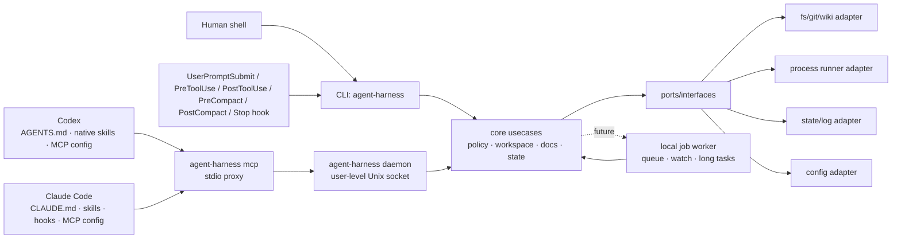

# agent-harness 아키텍처

---

## 1. 핵심 판단: plugin-only가 아니라 외부 하네스 코어

| 선택지 | 장점 | 단점 | 판단 |
|--------|------|------|------|
| Codex plugin/skill 중심 | Codex 경험에 깊게 통합 가능, 설치 UX가 좋음 | Claude Code와 공유가 어렵고, plugin API 변화에 core가 종속됨 | 단독 core로 부적절 |
| Claude Code command/hook 중심 | Claude 사용성이 좋고 MCP와 맞음 | Codex에서 같은 동작을 재사용하기 어렵고, hook에 정책이 흩어짐 | 단독 core로 부적절 |
| 외부 CLI/MCP/worker 중심 | 양쪽 host에서 같은 binary와 schema를 호출, 테스트 가능, 상태 관리 일관 | 초기 설치/IPC/보안 설계 필요 | **채택** |
| Hybrid | 외부 core + host별 얇은 래퍼 | adapter 관리 비용이 있음 | **최종 구조** |

결론: **Go로 작성한 외부 하네스 코어를 만들고, Codex plugin과 Claude Code 설정은 core를 호출하는 얇은 adapter로 둔다.**

---

## 2. Target Architecture

Mermaid는 보조 자료다. 규칙·경계·검증 명령은 아래 텍스트를 우선한다.

### Core engine / port / host adapter 구조

설치와 host 통합은 SOLID 경계로 나눈다.

- `internal/core.InstallNative`: host-neutral core engine. skill 목록, root/bin/wiki 경로 같은 공통 입력을 정규화하고 `port.HostInstaller`만 호출한다.
- `internal/port`: `NativeInstallRequest`, `NativeInstallResult`, `HostInstaller` interface, 설치 DTO를 정의한다. core는 concrete host를 모른다.
- `internal/adapter/codex`: Codex 구현체. user skill symlink, `~/.codex/config.toml` MCP 등록, `~/.codex/hooks.json` lifecycle hook을 기본 갱신한다.
- `internal/adapter/claude`: Claude Code 구현체. user skill symlink, user-scope MCP 등록 경로, `~/.claude/settings.json` lifecycle hook 등록을 기본 사용한다. Claude hook은 Codex와 같은 `agent-harness hook user-prompt/pre-tool-use/post-tool-use/pre-compact/post-compact/stop` CLI를 호출한다.
- repo-local `.claude/skills`, `.claude/settings.json`, `.mcp.json`은 적용 대상 repo에 커밋될 수 있으므로 `--project-local` 같은 명시적 opt-in에서만 생성한다.

이 구조에서 새 host를 추가할 때는 core 수정 없이 `port.HostInstaller` 구현체만 추가하는 것이 원칙이다.

---

## 3. 실행 모드

| 모드 | 도입 단계 | 용도 | 원칙 |
|------|----------|------|------|
| `agent-harness` CLI one-shot | 구현됨 | 모든 host에서 공통으로 호출 가능한 최소 표면 | `bin/agent-harness inspect/preflight/doctor/docs/policy/state/self-verify/self-augment` 사용 |
| `agent-harness mcp` stdio proxy | 구현됨 | Codex/Claude Code가 같은 MCP schema로 daemon에 연결 | `agent-harness` daemon을 자동 시작하고 stdio를 Unix socket으로 proxy한다. |
| `agent-harness daemon` user-level daemon | 구현됨 | 여러 host/session의 공통 MCP backend, 상태 공유 | `HARNESS_DAEMON_DIR` 또는 `~/.local/state/agent-harness/daemon`; stale lock, pid, socket, stop/status 제공 |
| `agent-harness issueops` | 구현됨 | issue-driven 루프의 durable 상태와 선택적 Orca supervised execution lease | IssueOps가 단일 authority다. Orca는 worktree/terminal/task/dispatch만 수행하며 inline fallback에는 `execution_handoff`를 만들지 않는다. |
| `agent-harness loop` | 구현됨 | verify-until-done 루프 계약의 durable 상태와 PR readiness 게이트 | 하네스는 검증 명령을 실행하지 않고 `verify_argv`, 시도 evidence, stop 상태를 기록·게이트한다. |
| `agent-harness worker` one-shot jobs | 부분 구현 | no-shell lifecycle job record와 draft-wiki queue 처리 | 현재 daemon은 MCP proxy backend이며 장기 상주 job daemon이 아니다. `worker draft-wiki`는 메인 에이전트가 명시 적재한 queue를 한 번 처리하고 `agy -p` argv만 호출한다. |
| Codex plugin/skill | Phase 5 | Codex에서 설치·명령·문서 UX 개선 | core 로직 금지, CLI/MCP 호출 래퍼만 허용 |
| Claude commands/hooks | Phase 6 | Claude Code UX 개선 | core 정책 우회 금지 |

---

## 4. Planned package boundaries

| 경로 | 책임 | 금지/주의 |
|------|------|----------|
| `cmd/harness` | binary entrypoint, CLI flag 처리, MCP JSON-RPC mapping/proxy, daemon lifecycle, guard CLI, self-verify QA loop, self-augment curriculum orchestration | host별 정책 복제 금지 |
| `internal/port` | core interface, DTO, error contract | adapter concrete type 의존 금지 |
| `internal/adapter/cli` | flag parsing, stdout/stderr, exit code mapping | core 정책 복제 금지 |
| `internal/adapter/mcp` | MCP tool schema, stdio server, JSON-RPC mapping | CLI와 다른 의미의 schema 금지 |
| `internal/adapter/orca` | 설치된 Orca CLI의 bounded argv/timeout/envelope projection | IssueOps 상태·복구 정책 복제, generic driver registry, 설치 대행 금지 |
| `internal/adapter/codex` | Codex user skill symlink와 user MCP config 설치 | 대상 repo 파일 쓰기 금지 |
| `internal/adapter/claude` | Claude user skill symlink와 user-scope MCP 설정 | 기본 설치에서 `.claude/skills`, `.claude/settings.json`, `.mcp.json` 같은 repo-local 파일 쓰기 금지 |
| `internal/adapter/worker` | local IPC, job lifecycle, daemon state | shell policy 우회 금지 |
| `internal/adapter/fs` | filesystem, git, process runner | workspace boundary 검증 필요 |
| `configs/codex` | Codex plugin/skill 템플릿 | core 로직 금지 |
| `skills` | Codex/Claude 공용 skill source of truth | host별 복사본을 만들어 drift 유발 금지 |
| `.mcp.json` | 이 하네스 repo의 dogfood/project-local MCP server 설정 | 기본 설치는 user-scope MCP를 사용하므로 대상 repo에 복사 금지 |
| `scripts/install-native.sh` | native skill/MCP 설치 및 갱신 | 사용자 홈 skill symlink만 기본 생성. repo-local 파일은 `--project-local` 명시 때만 생성 |

---

## 5. Docs / state / config / logs

현재 `agent-harness docs`는 에이전트가 읽어야 할 markdown source of truth를 index로 노출한다. `agent-harness project bootstrap`은 적용 대상 레포에 명시 실행될 때만 `AGENTS.md` marker block, `.agent-harness/*.md` 프로젝트 운영 문서, user-state repo profile metadata를 생성/갱신한다.

- 대상: `AGENTS.md`, `CLAUDE.md`, `GENIUS_THINK.md`, `.agent-harness/*.md`, `skills/self-verify/*.md`, `skills/self-augment/*.md`
- 필드: relative path, absolute path, title, headings, byte size
- 제공 표면: CLI `docs --json`, MCP `docs_index`, resource `harness://docs`
- 제외: `.agent-harness/draft-wiki/**`는 사용자가 검토하는 wiki 후보 staging area이므로 source-of-truth docs index에 섞지 않는다.

Project docs bootstrap:

- 대상: 적용 대상 repo의 `AGENTS.md`, `.agent-harness/ARCHITECTURE.md`, `.agent-harness/CAUTIONS.md`, `.agent-harness/COMMIT_POLICY.md`, `.agent-harness/CONSTITUTION.md`, `.agent-harness/CONVENTIONS.md`, `.agent-harness/TECH_STACK.md`, `.agent-harness/TESTING.md`, `.agent-harness/ADR.md`, `.agent-harness/OPERATIONS.md`, `.agent-harness/AGENT_WORKFLOW.md`
- 기본 동작: `agent-harness project bootstrap`은 누락된 파일과 user-state repo profile metadata를 생성한다. 계획만 볼 때는 `--dry-run`, 기존 문서/프로필을 현재 템플릿과 repo evidence로 다시 맞출 때는 `--sync`를 쓴다.
- 안전: `AGENTS.md` 전체를 덮어쓰지 않고 `AGENT_HARNESS` marker block만 관리한다.
- MCP: `project_docs_bootstrap_plan`, `project_docs_route`, `harness://project-docs`와 lifecycle profile metadata로 어떤 작업에 어떤 문서/레포 맥락을 확인해야 하는지 제공한다.

Draft wiki staging:

- 위치: 적용 대상 repo의 `.agent-harness/draft-wiki/{draft,approved,rejected}/`
- 목적: 장기 재사용 가치가 있다고 판단한 후보를 사용자가 파일 diff로 직접 검토·수정·승인하는 repo-local staging area로 둔다.
- 제공 표면: CLI `agent-harness project draft-wiki init/list/suggest/queue/approve/reject/promote`
- Hook/worker 흐름: hook은 draft-wiki 가치 판단이나 queue append를 자동 수행하지 않는다. UserPromptSubmit은 “메인 에이전트가 장기 재사용 가치 여부를 판단하라”는 지침만 주입하고, 메인 에이전트가 의미 있는 후보라고 판단한 경우에만 `agent-harness project draft-wiki queue --stdin`(heredoc 권장) 또는 `--input`으로 bounded/redacted user-state queue(`draft-wiki-queue.jsonl`)에 명시 적재한다. hook critical path에서는 `agy`를 실행하지 않는다. `agent-harness worker draft-wiki`가 queue를 읽어 `agy -p`를 argv 실행하고 응답을 `.agent-harness/draft-wiki/draft/*.md`에 쓴다.
- 경계: `suggest`와 `worker draft-wiki`만 `agy -p`를 호출한다. `promote --confirm`은 승인된 draft를 repo-local `exported/` 디렉토리로 이동하고 `export.log`만 append한다. 외부 wiki ingest, lint, index, query-pack은 하네스 promote의 책임이 아니다.

현재 `agent-harness state`는 작은 에이전트 체크포인트를 state root의 SQLite 데이터베이스(`harness.db`의 `state` bucket row)로 저장한다. project lifecycle state는 같은 user-state root 아래 `projects/<repo-id>/`에 격리되며 target repo의 `.agent-harness/`에는 쓰지 않는다. IssueOps 상태는 같은 user-state root 아래 `issueops/harness.db`의 `issueops`/`session` bucket에 저장해 host와 세션을 넘겨 이어갈 수 있게 한다. Loop 상태는 같은 user-state root 아래 `loop/harness.db`의 `loop` bucket에 저장한다. 모든 read-modify-write span은 해당 root의 `harness.lock.db`에 BEGIN IMMEDIATE 트랜잭션을 유지하는 sqlstore span으로 직렬화된다(프로세스 사망 시 자동 해제, span 중첩 금지).

- 기본 위치: `~/.local/state/agent-harness/`
- project lifecycle 위치: `~/.local/state/agent-harness/projects/<repo-id>/project.json` 및 `doc-upkeep-queue.jsonl`; `<repo-id>`는 repo fingerprint hash라 같은 머신의 여러 repo가 섞이지 않는다.
- IssueOps 위치: `~/.local/state/agent-harness/issueops/<id>.json`; issue URL, intent contract, design review, domain review, plan path, feedback log(+resolution), PR/MR readiness evidence, 그리고 phase별 진입/완료를 인덱싱하는 additive `phase_ledger`를 저장한다. delegated child cycle은 같은 record의 additive child/delegation 필드에 저장하고, parent/child 세션 binding은 scoped binding 파일로 분리해 같은 repo 안에서도 각 agent가 자기 worktree를 resume할 수 있게 한다. `phase_ledger`는 phase 전이 시에만 실관측 timestamp로 stamp되고(매 write 아님), 없으면 status가 read 시 sentinel timestamp로 파생한다. `grill` 진입은 problem 완료(intent), `plan` 진입은 grill 완료(issue_url+branch+plan_prep+split_decision+domain_review)를 fail-closed로 요구한다. 사용자 요청과 설계 검토 같은 freeform 값은 secret-like 패턴을 redaction한 뒤 저장한다.
- IssueOps root record는 `schema_version=5`다. missing/zero/v1/v2/v3/v4는 인식 가능한 필드를 보존한 채 read-compatible하고 다음 write에서 v5가 된다. legacy mailbox identity migration은 v3까지만 적용하고 v4 sealed identity는 그대로 보존한다. v1 binary는 v2+ handoff row를, v2 binary는 stable terminal tab/leaf가 추가된 v3 row를, v3 binary는 sealed mailbox/completion projection이 추가된 v4 row를, v4 binary는 exact-head publish receipt와 cleanup approval/ordered receipt가 추가된 v5 row를 future schema로 byte-equivalent reject한다. v5보다 큰 row는 bounded identity와 invalid marker만 hook scan에 남겨 fail-closed한다.
- Workpool 위치: `~/.local/state/agent-harness/workpool/<pool-id>.json` 및 task record. Pool은 main agent가 분해·검증하는 host-neutral durable queue이며, worker agent는 claim한 task와 lease/heartbeat만 갱신한다. Harness는 agent를 spawn하지 않고, state/lease/gate만 기록한다.
- Loop 위치: `~/.local/state/agent-harness/loop/<loop-id>.json`. CLI `loop start/record-attempt/status/stop`와 MCP `loop_start/loop_record_attempt/loop_status/loop_stop`가 같은 state machine을 사용한다. 같은 repo+name의 active loop는 resume되고 terminal loop는 새 name이 필요하다. strict PR readiness는 같은 repo의 `active`/`exhausted` loop를 `loop_incomplete:<loop-id>`로 막고, `stopped`/`succeeded` loop는 통과한다.
- Actor model: main agent는 dispatch, safety/reversibility/user-intent judgement, child/pool result acceptance를 소유한다. child agent와 pool worker는 각자 할당된 isolated worktree와 heartbeat를 소유한다. Hook은 관찰·차단·relay만 담당하고, phase 진행·branch/worktree 준비·테스트·merge·cleanup을 대신 실행하지 않는다.
- override: `HARNESS_STATE_DIR`
- 파일: `<key>.json`
- key 제한: `[A-Za-z0-9._-]`, 최대 128자, `/`, `\`, `..` 금지
- schema: current `schema_version=1`; version이 없는 legacy record는 read-compatible하고 `state migrate`로 승격한다.
- 제공 표면: CLI `state write/read/list/prune/doctor/migrate`, MCP `state_write/state_read/state_list/state_prune/state_doctor/state_migrate`, resource `harness://state`
- IssueOps 제공 표면: CLI `issueops start/status/intent record/link-issue/link-child/branch prepare/link-worktree/design review/link-plan/compatibility review/execution decide/worktree prepare-tools/phase/feedback add/feedback mark-issue-updated/pr-readiness/cleanup status/cleanup close-children/remote score/remote verify-artifact/benchmark run/benchmark compare/benchmark gate`, MCP `issueops_start/issueops_status/issueops_record_intent/issueops_link_issue/issueops_link_child/issueops_prepare_branch/issueops_link_worktree/issueops_review_design/issueops_link_plan/issueops_record_compatibility_review/issueops_record_execution_decision/issueops_prepare_worktree_tools/issueops_add_feedback/issueops_mark_issue_updated/issueops_set_phase/issueops_verify_remote_artifact/issueops_pr_readiness/issueops_cleanup_status/issueops_cleanup_close_children/issueops_remote_score`. Child-cycle and workpool surfaces are additive orchestration controls layered on this state model; they do not replace the main phase state machine. phase는 problem/grill/plan/compatibility-review/implement/ai-slop-clean/feedback/pr/done 9단계이며 `plan`은 linked issue와 intent contract를, `compatibility-review`는 linked worktree+approved design review+plan에 근거한 backward compatibility, side effects, rollback plan, verification, blocker-free approval을, `implement`는 issue+provider-linked branch+linked worktree+approved design review(refactor plan, alternatives, risks, verification, no open questions)+plan+approved compatibility review+durable worktree tool preparation(dependency readiness, supported install/symlink/copy/manual action)+execution decision(auto-proceed, hook-blocked work, HITL gates, sub-agent tradeoff judgement)을, `ai-slop-clean`은 추가로 implementation changes를, `pr`은 strict PR readiness를, `done`은 verified PR/MR artifact를 요구한다. feedback은 선택적 classification(contract_change/defect/question/noise)을 기록한다. `branch prepare`는 provider-linked branch 생성의 MCP-first/provider API fallback/fail-closed 순서를 상태에 기록하고, GitLab branch는 issue/task number prefix를 검증한다. `link-worktree`는 이슈 기반 작업의 정확한 isolated worktree를 상태에 고정하고, strict readiness는 해당 worktree의 branch/clean/upstream sync까지 확인한다. `worktree prepare-tools`는 linked worktree의 dependency 준비 결과를 IssueOps state에 저장하고, `compatibility review`와 `execution decide`가 각각 compatibility/side-effect 승인과 implementation 자동 진행 범위를 기록한 뒤 implementation 진입을 해제한다. `cleanup close-children`은 child PR/MR가 parent work branch에 merge된 뒤 linked child task만 닫고 parent issue는 umbrella로 유지한다. benchmark run/compare/gate는 CLI 전용 개발/autoresearch 도구다.
- cleanup: `state prune --max-age DURATION`은 기본 dry-run이고, 실제 삭제에는 `--confirm`이 필요하다.
- integrity: `state doctor`는 checkpoint 파일을 수정하지 않고 invalid JSON, key mismatch, byte count drift, timestamp 오류를 보고한다.
- comprehensive diagnostics: `agent-harness doctor`는 state doctor를 포함해 install, hooks, MCP, daemon, project docs, lifecycle namespace, repo-local runtime/schema 흔적을 종합 점검한다.
- migration: `state migrate`는 기본 dry-run이고, 실제 legacy schema rewrite에는 `--confirm`이 필요하다.
- self-verify summary checkpoint는 `self-verify history/compare/promote`와 MCP `self_verify_history/self_verify_compare/self_verify_promote`로 조회·비교·승격한다.

기준:

| 종류 | 권장 위치 | 추적 여부 |
|------|-----------|----------|
| 프로젝트 지식 | `.agent-harness/`, `AGENTS.md`, `CLAUDE.md` | git 추적 |
| 사용자 전역 설정 | `~/.config/agent-harness/config.yaml` | git 비추적 |
| 사용자 전역 state/log | `~/.local/state/agent-harness/` 또는 OS별 state dir | git 비추적 |
| workspace local cache | `.harness/` | `.gitignore` 대상 |
| secret | OS keychain 또는 env reference | 원문 저장 금지 |

구현 시 XDG base directory를 우선 검토하고, macOS에서도 예측 가능한 fallback을 둔다.

---

## 6. Command / policy model

명령 실행 기능은 가장 위험한 capability이므로 별도 policy로 관리한다.

현재 구현은 실제 shell runner가 아니라 **policy check + fake runner**다.

- CLI: `policy check`, `policy fake-run`
- MCP: `command_policy_check`, `command_fake_run`
- Resource: `harness://command-policy`
- fake runner는 policy 결과와 audit id만 반환하며 명령을 실행하지 않는다.
- allow/deny 목록은 `internal/core/policy.go`의 catalog table이 source of truth이며, `CommandPolicySummary()`의 `catalog` 필드로 노출된다.

필수 필드:

- `workspace_root`
- `cwd`
- `argv` 배열(shell string보다 우선)
- `timeout`
- `env_allowlist` 또는 scrub rule
- `network_allowed` 여부
- `write_allowed` 여부
- `audit_log_id`

기본 정책:

- read-only inspection은 허용 범위를 넓게, write/process/network는 명시적으로 좁게 시작한다.
- shell interpolation이 필요한 경우 이유를 기록하고, 가능하면 argv 실행을 사용한다.
- stdout/stderr에서 secret pattern을 redaction한다.

현재 기본 거부:

- `cwd`가 `workspace_root` 밖인 요청
- path-like argv가 `workspace_root` 밖 파일/디렉터리를 가리키는 요청(`~/path`, symlink escape 포함)
- shell interpreter(`sh`, `bash`, `zsh` 등) without reason
- `network_allowed=false`에서 network성 명령
- `write_allowed=false`에서 write성 명령
- read-only allowlist 밖 명령
- secret-like path/argument

현재 catalog 범주:

- shell interpreters: `sh`, `bash`, `zsh`, `fish`, `dash`, `ksh`
- network commands/subcommands: `curl`, `wget`, `ssh`, package manager류, `git fetch/pull/push/clone` 등
- write commands/subcommands: 파일 변경 명령, `go build/test/run`, `git add/commit/reset/...` 등
- read-only commands/subcommands: `ls`, `cat`, `rg`, `git status/diff/log`, `go env/list/version` 등

---

## 7. Codex / Claude / GJC integration map

| Host | 최소 통합 | 권장 통합 | 주의 |
|------|----------|----------|------|
| Codex | `AGENTS.md` + shell에서 `agent-harness` 실행 | `~/.codex/skills/*` native skills + `~/.codex/config.toml` MCP server + `~/.codex/hooks.json` UserPromptSubmit/PreToolUse/PostToolUse/PreCompact/PostCompact/Stop lifecycle hooks | plugin에 core logic을 넣지 않는다. 대상 repo 파일을 기본 생성하지 않는다 |
| Claude Code | `CLAUDE.md` + shell에서 `agent-harness` 실행 | `~/.claude/skills/*` native skills + user-scope MCP server + `~/.claude/settings.json` UserPromptSubmit/PreToolUse/PostToolUse/PreCompact/PostCompact/Stop lifecycle hooks | hook에서 위험 명령을 직접 실행하지 않는다. `.claude/skills`/`.claude/settings.json`/`.mcp.json` repo-local 파일은 explicit project-local opt-in에서만 쓴다 |
| GJC (gajae-code) | `AGENTS.md` + shell에서 `agent-harness` 실행 | `~/.gjc/agent/skills/*` native skills + `gjc plugin install` MCP bundle + `~/.gjc/agent/hooks/agent-harness.ts` HookAPI shim(`before_agent_start`, `session_start`, `turn_end`, `auto_compaction_*`, `tool_call`, `tool_result`) | shim은 `(event, ctx)`의 `ctx.sessionManager.getSessionId()`와 `ctx.cwd`를 전달하고 PreToolUse block/reason을 await한다. `.gjc/skills` repo-local 파일은 explicit project-local opt-in에서만 쓴다 |

---

## 8. 변경 체크리스트

- core behavior 변경: CLI, MCP, worker adapter가 같은 결과를 내는지 테스트한다.
- command policy 변경: CAUTIONS와 TESTING에 위험과 검증을 업데이트한다.
- guard 변경: portable anti-pattern rule은 `internal/core/guard/guard_test.go`로 block/warn/review 판정을 고정하고, CLI/contract golden을 함께 갱신한다.
- host adapter 변경: core contract를 복제하지 않았는지 확인하고 `internal/adapter` contract matrix golden으로 Codex/Claude 설치 표면이 drift되지 않았는지 검증한다.
- shared skill 변경: `skills/<name>` 원본과 user-level host skill 연결(`~/.codex/skills`, `~/.claude/skills`)이 같은 대상을 가리키는지 확인한다. repo-local skill link는 기본 설치에 포함하지 않는다.
- state 위치 변경: migration/backward compatibility와 cleanup 전략을 문서화한다.

## 9. Pioneer Skills Layer

agent-harness는 10개의 pioneer skill을 `skills/` 디렉토리에 단일 진실 원천(single source of truth)으로 관리한다. 각 스킬은 컴퓨터 과학 선구자의 이름을 따서 명명되었으며, 그 선구자의 핵심 통찰을 설계 철학으로 삼는다. 자세한 namesake 설명은 `README.md`의 "Skills & Their Namesakes" 표를 참조한다.

### 스킬 목록과 IssueOps 연동

| 스킬 | 역할 | IssueOps phase |
|------|------|---------------|
| `von-neumann` | Strategic Planning — decision-complete 계획 수립 | problem, grill, issue, plan |
| `turing` | Evidence-Bound Execution — 증거 기반 목표 실행 | implement, ai-slop-clean, feedback, pr, cleanup |
| `berners-lee` | Web Research — 출처 인용 다중 소스 조사 | grill, issue, feedback |
| `codd` | Database Design & Optimization — 정규화·인덱스·쿼리 최적화 | issue, plan, implement |
| `dijkstra` | Algorithm Design & Complexity Optimization | plan, implement, ai-slop-clean |
| `hopper` | Systematic Debugging — 7단계 과학적 디버깅 | implement, feedback |
| `shannon` | Signal-to-Noise Quality Measurement | ai-slop-clean |
| `karpathy` | Prompt Engineering & Optimization | plan, ai-slop-clean, pr |
| `torvalds` | Git Operations — atomic commit, bisect, rebase, worktree | implement, pr, cleanup |
| `issueops` | Issue-Driven Work Cycle Router — 9단계 phase 관리 | 전체 cycle orchestration |

### Cross-reference mesh

스킬 간 참조는 hub-and-spoke 토폴로지를 따른다:

- **Hub**: `turing`(9개 스킬 참조), `issueops`(10개 스킬 참조)가 실행·조정 중심
- **Spoke**: 전문 스킬들이 hub를 통해 간접 연결되며, 직접 cross-reference도 유지
- 모든 스킬이 `## Relationship with Other Skills` 섹션과 `## IssueOps Integration` 섹션을 갖춤

### 설계 원칙

- **Language/tech agnostic**: 어떤 스킬도 특정 언어·프레임워크를 강제하지 않는다(6f31c55에서 검증 완료). 모든 언어별 예시는 여러 언어의 동등한 명령어를 나란히 제시한다.
- **Namesake philosophy**: 각 스킬의 방법론은 그 이름이 된 과학자의 핵심 기여에서 파생된다(예: Codd → 정규화 이론, Dijkstra → 구조적 프로그래밍 + 최단 경로).
- **Host-neutral**: 모든 스킬은 `skills/` 원본 하나로 Codex·Claude Code·Reasonix에서 동일하게 사용된다.

## Standalone Runtime Policy

`agent-harness install`, `bootstrap`, `update`, and `scripts/install-native.sh` install only agent-harness native integrations. They must not clone, install, patch, or register third-party toolchains as a side effect.

External tools may be useful in a user's environment, but they are not agent-harness dependencies. If a workflow benefits from one of them, the user installs it through that tool's own documented path and the harness consumes only explicit, inspectable boundaries such as files, command output, or MCP data the user has already configured.

Readiness gates, self-verification, install/update success, and core CLI/MCP contracts must remain reproducible without external accounts, API keys, companion hooks, or companion MCP servers. Do not add fallback shims that patch external plugin caches or weaken harness contracts when an external tool is missing or broken.

## Optional Orca execution boundary

Orca integration is an optional CLI adapter, not a native-install dependency or second scheduler. `issueops worktree prepare --orchestrator auto|orca|inline` probes with structured status before mutation. `auto` may return the legacy inline result only on a pre-mutation probe failure; after any Orca mutation is invoked, the durable `pending_operation` journal and explicit recovery path are authoritative.

Every supervised attempt records attempt/epoch/context, native host session identity, coordinator/worker roots, sealed coordinator and worker mailbox recipients, refreshable live terminal control identity, and stable Orca domain ids in the IssueOps record. Runtime rollover recovery treats tab/leaf as the stable terminal locator, joins the bounded visual-layout tab title only for legacy rows that never observed those IDs, and atomically refreshes runtime + exact current worktree instance + live terminal tuple after complete worktree/terminal inventories agree; it never overwrites either sealed mailbox. Completed finish writes the submitted result and deterministic `worker_done` projection intent or terminal diagnostic in the same cycle lock, then performs at most one argv-only Orca send outside the lock from the sealed worker mailbox to the sealed coordinator mailbox. State compare-and-set runs under the existing cycle lock, but no Orca process call may run while that lock is held. Hooks are limited to SessionStart claim guidance and PreToolUse ownership enforcement; that ownership check includes exact source-root plan authority and blocks non-source terminal control before it can bypass a target terminal's hooks. Coordinator acceptance and cleanup remain explicit commands.

## MCP tool design guidance

- Tool descriptions must state: purpose, when to use, whether it writes, required arguments, and expected result shape.
- Prefer bounded, task-specific tools over catch-all tools.
- Keep tool list ordering deterministic for stable client caching and golden tests.
- Use resources for reusable context, tools for actions, and project docs routing for deciding what to read.
- Writable MCP tools should either be dry-run by default or append-only with narrow target files.

## 현재 hardening 추가 사항

- `internal/adapter/cli`는 top-level command catalog와 canonical usage text를 소유한다. `cmd/harness`는 process entrypoint와 dispatch layer로 남는다.
- `internal/adapter/mcp`는 compatibility/worker 계열 adapter-level MCP tool descriptor를 소유한다. `cmd/harness`는 JSON-RPC request handling과 core usecase 호출을 유지한다.
- `agent-harness contract schema|check`는 CLI/MCP command list, MCP tool name, required response field를 검증하는 DTO compatibility 표면이다.
- `agent-harness policy audit`는 redacted command-policy decision을 append-only JSONL로 기록하며 command를 실행하지 않는다.
- `agent-harness worker`의 generic `enqueue/status/list/cancel`은 no-shell lifecycle MVP다. 예외적으로 `worker draft-wiki`는 메인 에이전트가 명시 적재한 user-state draft-wiki queue 처리 전용 one-shot worker이며 shell을 거치지 않고 `agy -p` argv만 호출해 repo-local draft를 만든다.
