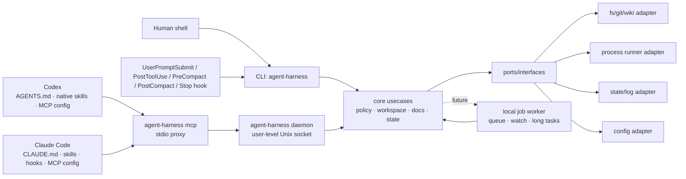

# agent-harness 아키텍처

---

## 1. 핵심 판단: plugin-only가 아니라 외부 하네스 코어

| 선택지 | 장점 | 단점 | 판단 |
|--------|------|------|------|
| Codex plugin/skill 중심 | Codex 경험에 깊게 통합 가능, 설치 UX가 좋음 | Claude Code와 공유가 어렵고, plugin API 변화에 core가 종속됨 | 단독 core로 부적절 |
| Claude Code command/hook 중심 | Claude 사용성이 좋고 MCP와 맞음 | Codex에서 같은 동작을 재사용하기 어렵고, hook에 정책이 흩어짐 | 단독 core로 부적절 |
| 외부 CLI/MCP/worker 중심 | 양쪽 host에서 같은 binary와 schema를 호출, 테스트 가능, 상태 관리 일관 | 초기 설치/IPC/보안 설계 필요 | **채택** |
| Hybrid | 외부 core + host별 얇은 래퍼 | adapter 관리 비용이 있음 | **최종 구조** |

결론: **Go로 작성한 외부 하네스 코어를 만들고, Codex plugin과 Claude Code 설정은 core를 호출하는 얇은 adapter로 둔다.**

---

## 2. Target Architecture

Mermaid는 보조 자료다. 규칙·경계·검증 명령은 아래 텍스트를 우선한다.

### Core engine / port / host adapter 구조

설치와 host 통합은 SOLID 경계로 나눈다.

- `internal/core.InstallNative`: host-neutral core engine. skill 목록, root/bin/wiki 경로 같은 공통 입력을 정규화하고 `port.HostInstaller`만 호출한다.
- `internal/port`: `NativeInstallRequest`, `NativeInstallResult`, `HostInstaller` interface, 설치 DTO를 정의한다. core는 concrete host를 모른다.
- `internal/adapter/codex`: Codex 구현체. user skill symlink, `~/.codex/config.toml` MCP 등록, `~/.codex/hooks.json` lifecycle hook을 기본 갱신한다.
- `internal/adapter/claude`: Claude Code 구현체. user skill symlink, user-scope MCP 등록 경로, `~/.claude/settings.json` lifecycle hook 등록을 기본 사용한다. Claude hook은 Codex와 같은 `agent-harness hook user-prompt/post-tool-use/pre-compact/post-compact/stop` CLI를 호출한다.
- repo-local `.claude/skills`, `.claude/settings.json`, `.mcp.json`은 적용 대상 repo에 커밋될 수 있으므로 `--project-local` 같은 명시적 opt-in에서만 생성한다.

이 구조에서 새 host를 추가할 때는 core 수정 없이 `port.HostInstaller` 구현체만 추가하는 것이 원칙이다.

---

## 3. 실행 모드

| 모드 | 도입 단계 | 용도 | 원칙 |
|------|----------|------|------|
| `agent-harness` CLI one-shot | 구현됨 | 모든 host에서 공통으로 호출 가능한 최소 표면 | `bin/agent-harness inspect/preflight/doctor/docs/policy/state/self-verify/self-augment` 사용 |
| `agent-harness mcp` stdio proxy | 구현됨 | Codex/Claude Code가 같은 MCP schema로 daemon에 연결 | `agent-harness` daemon을 자동 시작하고 stdio를 Unix socket으로 proxy한다. |
| `agent-harness daemon` user-level daemon | 구현됨 | 여러 host/session의 공통 MCP backend, 상태 공유 | `HARNESS_DAEMON_DIR` 또는 `~/.local/state/agent-harness/daemon`; stale lock, pid, socket, stop/status 제공 |
| `agent-harness worker` job daemon | Future | 장기 작업, concurrent job, file watch | 현재 daemon은 MCP proxy backend이며 job queue worker가 아니다. queue/cancel/audit hardening 후 별도 확장 |
| Codex plugin/skill | Phase 5 | Codex에서 설치·명령·문서 UX 개선 | core 로직 금지, CLI/MCP 호출 래퍼만 허용 |
| Claude commands/hooks | Phase 6 | Claude Code UX 개선 | core 정책 우회 금지 |

---

## 4. Planned package boundaries

| 경로 | 책임 | 금지/주의 |
|------|------|----------|
| `cmd/harness` | binary entrypoint, CLI flag 처리, MCP JSON-RPC mapping/proxy, daemon lifecycle, guard CLI, self-verify QA loop, self-augment curriculum orchestration | host별 정책 복제 금지 |
| `internal/port` | core interface, DTO, error contract | adapter concrete type 의존 금지 |
| `internal/adapter/cli` | flag parsing, stdout/stderr, exit code mapping | core 정책 복제 금지 |
| `internal/adapter/mcp` | MCP tool schema, stdio server, JSON-RPC mapping | CLI와 다른 의미의 schema 금지 |
| `internal/adapter/codex` | Codex user skill symlink와 user MCP config 설치 | 대상 repo 파일 쓰기 금지 |
| `internal/adapter/claude` | Claude user skill symlink와 user-scope MCP 설정 | 기본 설치에서 `.claude/skills`, `.claude/settings.json`, `.mcp.json` 같은 repo-local 파일 쓰기 금지 |
| `internal/adapter/worker` | local IPC, job lifecycle, daemon state | shell policy 우회 금지 |
| `internal/adapter/fs` | filesystem, git, process runner | workspace boundary 검증 필요 |
| `configs/codex` | Codex plugin/skill 템플릿 | core 로직 금지 |
| `skills` | Codex/Claude 공용 skill source of truth | host별 복사본을 만들어 drift 유발 금지 |
| `.mcp.json` | 이 하네스 repo의 dogfood/project-local MCP server 설정 | 기본 설치는 user-scope MCP를 사용하므로 대상 repo에 복사 금지 |
| `scripts/install-native.sh` | native skill/MCP 설치 및 갱신 | 사용자 홈 skill symlink만 기본 생성. repo-local 파일은 `--project-local` 명시 때만 생성 |

---

## 5. Docs / state / config / logs

현재 `agent-harness docs`는 에이전트가 읽어야 할 markdown source of truth를 index로 노출한다. `agent-harness project bootstrap`은 적용 대상 레포에 명시 실행될 때만 `AGENTS.md` marker block, `.agent-harness/*.md` 프로젝트 운영 문서, user-state repo profile metadata를 생성/갱신한다.

- 대상: `AGENTS.md`, `CLAUDE.md`, `GENIUS_THINK.md`, `.agent-harness/*.md`, `skills/self-verify/*.md`, `skills/self-augment/*.md`
- 필드: relative path, absolute path, title, headings, byte size
- 제공 표면: CLI `docs --json`, MCP `docs_index`, resource `harness://docs`

Project docs bootstrap:

- 대상: 적용 대상 repo의 `AGENTS.md`, `.agent-harness/ARCHITECTURE.md`, `.agent-harness/CAUTIONS.md`, `.agent-harness/COMMIT_POLICY.md`, `.agent-harness/CONSTITUTION.md`, `.agent-harness/CONVENTIONS.md`, `.agent-harness/TECH_STACK.md`, `.agent-harness/TESTING.md`, `.agent-harness/ADR.md`, `.agent-harness/OPERATIONS.md`, `.agent-harness/AGENT_WORKFLOW.md`
- 기본 동작: `agent-harness project bootstrap`은 누락된 파일과 user-state repo profile metadata를 생성한다. 계획만 볼 때는 `--dry-run`, 기존 문서/프로필을 현재 템플릿과 repo evidence로 다시 맞출 때는 `--sync`를 쓴다.
- 안전: `AGENTS.md` 전체를 덮어쓰지 않고 `AGENT_HARNESS` marker block만 관리한다.
- MCP: `project_docs_bootstrap_plan`, `project_docs_route`, `harness://project-docs`와 lifecycle profile metadata로 어떤 작업에 어떤 문서/레포 맥락을 확인해야 하는지 제공한다.

현재 `agent-harness state`는 작은 에이전트 체크포인트를 JSON 파일로 저장한다. project lifecycle state는 같은 user-state root 아래 `projects/<repo-id>/`에 격리되며 target repo의 `.agent-harness/`에는 쓰지 않는다.

- 기본 위치: `~/.local/state/agent-harness/`
- project lifecycle 위치: `~/.local/state/agent-harness/projects/<repo-id>/project.json` 및 `doc-upkeep-queue.jsonl`; `<repo-id>`는 repo fingerprint hash라 같은 머신의 여러 repo가 섞이지 않는다.
- override: `HARNESS_STATE_DIR`
- 파일: `<key>.json`
- key 제한: `[A-Za-z0-9._-]`, 최대 128자, `/`, `\`, `..` 금지
- schema: current `schema_version=1`; version이 없는 legacy record는 read-compatible하고 `state migrate`로 승격한다.
- 제공 표면: CLI `state write/read/list/prune/doctor/migrate`, MCP `state_write/state_read/state_list/state_prune/state_doctor/state_migrate`, resource `harness://state`
- cleanup: `state prune --max-age DURATION`은 기본 dry-run이고, 실제 삭제에는 `--confirm`이 필요하다.
- integrity: `state doctor`는 checkpoint 파일을 수정하지 않고 invalid JSON, key mismatch, byte count drift, timestamp 오류를 보고한다.
- comprehensive diagnostics: `agent-harness doctor`는 state doctor를 포함해 install, hooks, MCP, daemon, project docs, lifecycle namespace, repo-local runtime/schema 흔적을 종합 점검한다.
- migration: `state migrate`는 기본 dry-run이고, 실제 legacy schema rewrite에는 `--confirm`이 필요하다.
- self-verify summary checkpoint는 `self-verify history/compare/promote`와 MCP `self_verify_history/self_verify_compare/self_verify_promote`로 조회·비교·승격한다.

기준:

| 종류 | 권장 위치 | 추적 여부 |
|------|-----------|----------|
| 프로젝트 지식 | `.agent-harness/`, `AGENTS.md`, `CLAUDE.md` | git 추적 |
| 사용자 전역 설정 | `~/.config/agent-harness/config.yaml` | git 비추적 |
| 사용자 전역 state/log | `~/.local/state/agent-harness/` 또는 OS별 state dir | git 비추적 |
| workspace local cache | `.harness/` | `.gitignore` 대상 |
| secret | OS keychain 또는 env reference | 원문 저장 금지 |

구현 시 XDG base directory를 우선 검토하고, macOS에서도 예측 가능한 fallback을 둔다.

---

## 6. Command / policy model

명령 실행 기능은 가장 위험한 capability이므로 별도 policy로 관리한다.

현재 구현은 실제 shell runner가 아니라 **policy check + fake runner**다.

- CLI: `policy check`, `policy fake-run`
- MCP: `command_policy_check`, `command_fake_run`
- Resource: `harness://command-policy`
- fake runner는 policy 결과와 audit id만 반환하며 명령을 실행하지 않는다.
- allow/deny 목록은 `internal/core/policy.go`의 catalog table이 source of truth이며, `CommandPolicySummary()`의 `catalog` 필드로 노출된다.

필수 필드:

- `workspace_root`
- `cwd`
- `argv` 배열(shell string보다 우선)
- `timeout`
- `env_allowlist` 또는 scrub rule
- `network_allowed` 여부
- `write_allowed` 여부
- `audit_log_id`

기본 정책:

- read-only inspection은 허용 범위를 넓게, write/process/network는 명시적으로 좁게 시작한다.
- shell interpolation이 필요한 경우 이유를 기록하고, 가능하면 argv 실행을 사용한다.
- stdout/stderr에서 secret pattern을 redaction한다.

현재 기본 거부:

- `cwd`가 `workspace_root` 밖인 요청
- path-like argv가 `workspace_root` 밖 파일/디렉터리를 가리키는 요청(`~/path`, symlink escape 포함)
- shell interpreter(`sh`, `bash`, `zsh` 등) without reason
- `network_allowed=false`에서 network성 명령
- `write_allowed=false`에서 write성 명령
- read-only allowlist 밖 명령
- secret-like path/argument

현재 catalog 범주:

- shell interpreters: `sh`, `bash`, `zsh`, `fish`, `dash`, `ksh`
- network commands/subcommands: `curl`, `wget`, `ssh`, package manager류, `git fetch/pull/push/clone` 등
- write commands/subcommands: 파일 변경 명령, `go build/test/run`, `git add/commit/reset/...` 등
- read-only commands/subcommands: `ls`, `cat`, `rg`, `git status/diff/log`, `go env/list/version` 등

---

## 7. Codex / Claude integration map

| Host | 최소 통합 | 권장 통합 | 주의 |
|------|----------|----------|------|
| Codex | `AGENTS.md` + shell에서 `agent-harness` 실행 | `~/.codex/skills/*` native skills + `~/.codex/config.toml` MCP server + `~/.codex/hooks.json` UserPromptSubmit/PostToolUse/PreCompact/PostCompact/Stop lifecycle hooks | plugin에 core logic을 넣지 않는다. 대상 repo 파일을 기본 생성하지 않는다 |
| Claude Code | `CLAUDE.md` + shell에서 `agent-harness` 실행 | `~/.claude/skills/*` native skills + user-scope MCP server + `~/.claude/settings.json` UserPromptSubmit/PostToolUse/PreCompact/PostCompact/Stop lifecycle hooks | hook에서 위험 명령을 직접 실행하지 않는다. `.claude/skills`/`.claude/settings.json`/`.mcp.json` repo-local 파일은 explicit project-local opt-in에서만 쓴다 |

---

## 8. 변경 체크리스트

- core behavior 변경: CLI, MCP, worker adapter가 같은 결과를 내는지 테스트한다.
- command policy 변경: CAUTIONS와 TESTING에 위험과 검증을 업데이트한다.
- guard 변경: portable anti-pattern rule은 `internal/core/guard_test.go`로 block/warn/review 판정을 고정하고, CLI/contract golden을 함께 갱신한다.
- host adapter 변경: core contract를 복제하지 않았는지 확인하고 `internal/adapter` contract matrix golden으로 Codex/Claude 설치 표면이 drift되지 않았는지 검증한다.
- shared skill 변경: `skills/<name>` 원본과 user-level host skill 연결(`~/.codex/skills`, `~/.claude/skills`)이 같은 대상을 가리키는지 확인한다. repo-local skill link는 기본 설치에 포함하지 않는다.
- state 위치 변경: migration/backward compatibility와 cleanup 전략을 문서화한다.

## LLM Wiki 정책

LLM Wiki 기능은 agent-harness가 직접 제공하지 않는다. 중복 구현을 피하기 위해 upstream `nvk/llm-wiki`의 Codex/Claude plugin 또는 portable AGENTS.md를 사용한다. 하네스 CLI/MCP에 llm-wiki 전용 명령, tool, resource, SessionStart hook을 추가하지 않는다.

## 바퀴를 재발명하지 않는 companion tool 정책

이 하네스의 철학은 **바퀴를 재발명하지 않는다**이다. agent-harness는 Codex/Claude 공통 CLI, MCP proxy, state, policy, project docs, native skill 설치 같은 작은 공통 core와 접착제를 맡고, 전문 도구의 core 기능은 upstream 구현을 그대로 쓴다.

- LLM Wiki: `nvk/llm-wiki` plugin을 설치/갱신한다. wiki vault, research, query, compile 기능을 하네스에 복제하지 않는다.
- CodeGraph: `colbymchenry/codegraph` CLI/MCP를 설치/설정한다. symbol graph, AST parser, impact analysis를 하네스에 재구현하지 않는다.
- claude-mem: `thedotmack/claude-mem` plugin을 설치/갱신한다. memory capture/compression/store logic을 하네스 core에 넣지 않는다.

`scripts/install-native.sh --with-upstream-tools`는 이 세 도구를 user-level dependency로 연결하는 convenience path다. 기본 설치는 여전히 하네스 자체의 user/global Codex/Claude integration만 수행하며, upstream 설치는 네트워크와 user-level host 설정 변경이 필요하므로 명시 opt-in이다.

## MCP tool design guidance

- Tool descriptions must state: purpose, when to use, whether it writes, required arguments, and expected result shape.
- Prefer bounded, task-specific tools over catch-all tools.
- Keep tool list ordering deterministic for stable client caching and golden tests.
- Use resources for reusable context, tools for actions, and project docs routing for deciding what to read.
- Writable MCP tools should either be dry-run by default or append-only with narrow target files.

## 현재 hardening 추가 사항

- `internal/adapter/cli`는 top-level command catalog와 canonical usage text를 소유한다. `cmd/harness`는 process entrypoint와 dispatch layer로 남는다.
- `internal/adapter/mcp`는 compatibility/worker 계열 adapter-level MCP tool descriptor를 소유한다. `cmd/harness`는 JSON-RPC request handling과 core usecase 호출을 유지한다.
- `agent-harness contract schema|check`는 CLI/MCP command list, MCP tool name, required response field를 검증하는 DTO compatibility 표면이다.
- `agent-harness policy audit`는 redacted command-policy decision을 append-only JSONL로 기록하며 command를 실행하지 않는다.
- `agent-harness worker`는 현재 no-shell lifecycle MVP다. enqueue, status, list, cancel은 job record만 저장하며 아직 process runner가 아니다.
