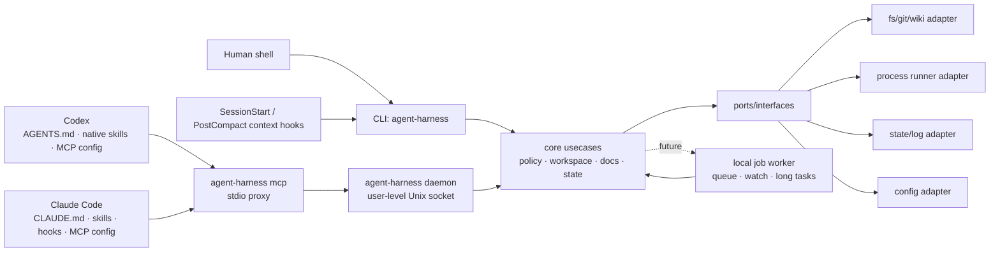

# Hexagonal core, ports, and adapters

> Family index: [`../ARCHITECTURE.md`](../ARCHITECTURE.md). This module owns the
> dependency direction, component boundaries, and the core/port/adapter
> structure. Host-specific integration detail lives in
> [`host-integration.md`](host-integration.md); runtime, state, and process
> topology live in [`runtime.md`](runtime.md).

## Core decision: external harness core, not plugin-only

| 선택지 | 장점 | 단점 | 판단 |
|--------|------|------|------|
| Codex plugin/skill 중심 | Codex 경험에 깊게 통합 가능, 설치 UX가 좋음 | Claude Code와 공유가 어렵고, plugin API 변화에 core가 종속됨 | 단독 core로 부적절 |
| Claude Code command/hook 중심 | Claude 사용성이 좋고 MCP와 맞음 | Codex에서 같은 동작을 재사용하기 어렵고, hook에 정책이 흩어짐 | 단독 core로 부적절 |
| 외부 CLI/MCP/worker 중심 | 양쪽 host에서 같은 binary와 schema를 호출, 테스트 가능, 상태 관리 일관 | 초기 설치/IPC/보안 설계 필요 | **채택** |
| Hybrid | 외부 core + host별 얇은 래퍼 | adapter 관리 비용이 있음 | **최종 구조** |

결론: **Go로 작성한 외부 하네스 코어를 만들고, Codex plugin과 Claude Code 설정은 core를 호출하는 얇은 adapter로 둔다.**

## Target architecture

Mermaid는 보조 자료다. 규칙·경계·검증 명령은 아래 텍스트를 우선한다.

### Core engine / port / host adapter 구조

설치와 host 통합은 SOLID 경계로 나눈다.

- `internal/core.InstallNative`: host-neutral core engine. skill 목록, root/bin/wiki 경로 같은 공통 입력을 정규화하고 `port.HostInstaller`만 호출한다.
- `internal/port`: `NativeInstallRequest`, `NativeInstallResult`, `HostInstaller` interface, 설치 DTO를 정의한다. core는 concrete host를 모른다.
- `internal/adapter/codex`: Codex 구현체. user skill symlink, `~/.codex/config.toml` MCP 등록, `~/.codex/hooks.json` lifecycle hook을 기본 갱신한다.
- `internal/adapter/claude`: Claude Code 구현체. user skill symlink, user-scope MCP 등록 경로, `~/.claude/settings.json`의 `SessionStart`/`PostCompact` context hook만 기본 갱신한다. legacy hook CLI subcommand는 명시적 진단 경로로만 유지한다.
- repo-local `.claude/skills`, `.claude/settings.json`, `.mcp.json`은 적용 대상 repo에 커밋될 수 있으므로 `--project-local` 같은 명시적 opt-in에서만 생성한다.

이 구조에서 새 host를 추가할 때는 core 수정 없이 `port.HostInstaller` 구현체만 추가하는 것이 원칙이다.

## Planned package boundaries

| 경로 | 책임 | 금지/주의 |
|------|------|----------|
| `cmd/harness` | binary entrypoint, CLI flag 처리, MCP JSON-RPC mapping/proxy, daemon lifecycle, guard CLI, self-verify QA loop, self-augment curriculum orchestration | host별 정책 복제 금지 |
| `internal/port` | core interface, DTO, error contract | adapter concrete type 의존 금지 |
| `internal/adapter/cli` | flag parsing, stdout/stderr, exit code mapping | core 정책 복제 금지 |
| `internal/adapter/mcp` | MCP tool schema, stdio server, JSON-RPC mapping | CLI와 다른 의미의 schema 금지 |
| `internal/core/toolconformance` | host-neutral fixture manifest, schema projection/validation, call classification, benchmark gate, behavioral replay | host argv, credentials, production dispatch 의존 금지 |
| `internal/core/failurecause` | `failure_class`와 직교하는 typed causal evidence 분류 | stderr 문자열 추측이나 model blame 금지 |
| `internal/core/operationalhealth` | normalized Git/IssueOps/Orca/user-state snapshot과 주입된 clock/preserve set을 판정하는 pure classifier | filesystem/process/SQLite I/O, cleanup mutation, host별 정책 금지 |
| `internal/adapter/hostprobe` | Codex/Claude의 격리된 live probe 실행과 증거 정규화 | 사용자 host 설정·credential DB 수정 금지 |
| `internal/adapter/orca` | 설치된 Orca CLI의 bounded argv/timeout/envelope projection | IssueOps 상태·복구 정책 복제, generic driver registry, 설치 대행 금지 |
| `internal/adapter/operationalhealth` | Git, 전체 IssueOps record/binding, 선택적 Orca inventory를 read-only snapshot으로 수집 | health 판정 복제, state 생성, cleanup mutation 금지 |
| `internal/adapter/codex` | Codex user skill symlink와 user MCP config 설치 | 대상 repo 파일 쓰기 금지 |
| `internal/adapter/claude` | Claude user skill symlink와 user-scope MCP 설정 | 기본 설치에서 `.claude/skills`, `.claude/settings.json`, `.mcp.json` 같은 repo-local 파일 쓰기 금지 |
| `internal/adapter/worker` | local IPC, job lifecycle, daemon state | shell policy 우회 금지 |
| `internal/adapter/fs` | filesystem, git, process runner | workspace boundary 검증 필요 |
| `configs/codex` | Codex plugin/skill 템플릿 | core 로직 금지 |
| `skills` | Codex/Claude 공용 skill source of truth | host별 복사본을 만들어 drift 유발 금지 |
| `.mcp.json` | 이 하네스 repo의 dogfood/project-local MCP server 설정 | 기본 설치는 user-scope MCP를 사용하므로 대상 repo에 복사 금지 |
| `scripts/install-native.sh` | native skill/MCP 설치 및 갱신 | 사용자 홈 skill symlink만 기본 생성. repo-local 파일은 `--project-local` 명시 때만 생성 |

### Cross-host tool contract boundary

`contract conformance`는 production MCP 의미를 바꾸기 전에 host가 실제로 생성한 raw arguments를 측정한다. `internal/adapter/mcp`의 capture-only probe는 episode마다 한 tool만 광고하고 production catalog handler를 등록하거나 호출하지 않는다. 세 host의 argv, 임시 config/plugin, 인증 격리는 `internal/adapter/hostprobe`가 소유하고 schema 의미와 판정은 `internal/core/toolconformance` 하나가 소유한다.

Deterministic baseline과 live evidence는 advertised schema validity와 closed canonical-intent validity를 별도로 기록한다. 재현 gate가 동일 diagnostic signature를 두 번 이상 확인한 경우에만 production advertised schema와 SDK/legacy call entry를 같은 canonical validator로 원자적으로 강화한다. 이 gate가 열리지 않은 상태에서는 benchmark, failure-cause axis, self-verify coverage만 유지하고 production argument semantics는 변경하지 않는다.

### Operational-health boundary

기존 top-level `doctor`가 cross-system operational health의 유일한 공개 표면이다. `internal/adapter/operationalhealth`가 read-only inventory를 정규화하고, `internal/core/operationalhealth`가 deterministic finding을 만든다. IssueOps stale scan은 같은 cycle-authority 판정만 재사용하되 기존 strong-signal release policy와 locked re-probe를 유지한다. Stability audit는 ownership/residue 규칙을 다시 구현하지 않고 방금 빌드한 binary의 `doctor` 결과를 gate로 소비한다.

### Dependency fitness ratchet

`internal/architecture`는 production import graph의 test-only fitness boundary다. `go list -json ./...`의 direct `Imports`만 정렬된 `importer -> imported` edge로 수집하며, test import와 transitive dependency는 graph에 포함하지 않는다.

- `internal/core/... -> internal/adapter/...|cmd/...`, `internal/adapter/... -> cmd/...`, `internal/port -> internal/...`는 baseline 없이 즉시 실패한다.
- legacy adapter edge는 0이다. `internal/adapter/*`는 composition root(`cmd/harness/harnessapp`)에서만 import한다. 예외는 둘뿐이다 — 같은 capability의 하위 package 사이 edge는 구현 정리이므로 세지 않고(capability는 `internal/adapter/` 다음 경로 요소, `outbound`/`inbound`는 방향 분류이므로 그 다음 요소까지 읽는다), `outbound/sqlstore`는 capability가 아니라 공유 저장 엔진이므로 다른 outbound 어댑터가 직접 쓸 수 있다. 그 밖의 edge는 `TestProductionGraphHasNoLegacyAdapterEdges`가 막는다.
- baseline을 줄이는 변경은 의도된 architecture 개선으로 같은 review에서만 허용한다. production package 이동이나 runtime wiring은 이 ratchet의 범위가 아니다.

## 현재 hardening 추가 사항

- `internal/adapter/cli`는 top-level command catalog와 canonical usage text를 소유한다. `cmd/harness`는 process entrypoint와 dispatch layer로 남는다.
- `internal/adapter/mcp`는 compatibility/worker 계열 adapter-level MCP tool descriptor를 소유한다. `cmd/harness`는 JSON-RPC request handling과 core usecase 호출을 유지한다.
- `agent-harness contract schema|check`는 CLI/MCP command list, MCP tool name, required response field를 검증하는 DTO compatibility 표면이다.
- `agent-harness policy audit`는 redacted command-policy decision을 append-only JSONL로 기록하며 command를 실행하지 않는다.
- `agent-harness worker`의 generic `enqueue/status/list/cancel`은 no-shell lifecycle MVP다.
