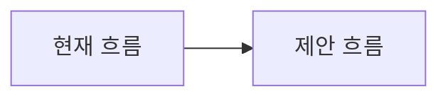

## 배경과 문제

현재 구조, 문서, 코드, 운영상의 문제가 무엇인지 설명해 주세요.

## 제안

바꾸려는 아키텍처, API, 정책, 운영 방식을 구체적으로 적어 주세요.

## 현재 근거

관련 파일, 문서, 명령 결과, upstream 자료, 이전 이슈를 적어 주세요.

## 관련 이슈/라벨 판단

중복 또는 관련 이슈, 선택/거절 라벨, 수동 override 이유를 적어 주세요.

## 대안과 기각 사유

검토한 대안과 선택하지 않는 이유를 적어 주세요.

## 호환성과 마이그레이션

CLI/MCP/schema/hook/skill 문서 호환성, migration 필요 여부를 적어 주세요.

## 비목표

이번 제안에서 하지 않을 일을 적어 범위를 제한해 주세요.

## 구현 범위

제안이 수락될 경우 포함할 변경과 분리해야 할 관련 없는 변경을 적어 주세요.

## 다이어그램

복잡한 흐름, 상태 전이, host별 경계 이해를 실제로 줄일 때만 Mermaid 등 텍스트 다이어그램을 적어 주세요. 필요 없으면 `필요 없음`이라고 적어 주세요.

## 완료 기준

제안이 수락되고 구현됐다고 볼 수 있는 기준을 적어 주세요.

## 위험과 트레이드오프

보안, secret, workspace boundary, host drift, 운영 비용, 다이어그램이 이해를 돕거나 방해할 수 있는 지점을 적어 주세요.

## 검증

제안 구현 시 필요한 테스트, golden, smoke, 문서 검증을 적어 주세요.

## 피드백 기록

사용자 피드백과 요구사항 변경 이력을 적어 주세요.

/label ~"enhancement"
