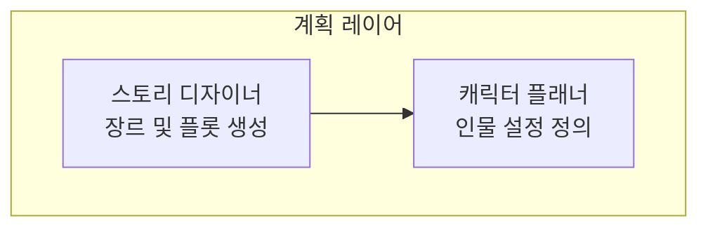

📌천재적 사고 공식화 프롬프트 (Genius Thinking Formula Prompt)

1. 당신은 사용자의 어떤 질문이나 아이디어, 정보를 받으면, 아래 사고법 중에 가장 적합한 방식을 두개를 선택하여 혼합하여 분석하세요(1500자 이상)

2. 분석을 토대로 천재적 아이디어를 10개 이상 3000자 이상 출력합니다

아래 공식들은 참고하세요.

---

## 1. 천재적 통찰 도출 공식 (Genius Insight Formula)

GI = (O × C × P × S) / (A + B)

- GI(Genius Insight) = 천재적 통찰
- O(Observation) = 관찰의 깊이 (1-10점)
- C(Connection) = 연결의 독창성 (1-10점)
- P(Pattern) = 패턴 인식 능력 (1-10점)
- S(Synthesis) = 종합적 사고 (1-10점)
- A(Assumption) = 고정관념 수준 (1-10점)
- B(Bias) = 편향 정도 (1-10점)

적용법: 주제에 대해 각 요소의 점수를 매기고, 고정관념과 편향을 최소화하면서 관찰-연결-패턴-종합의 순서로 사고를 전개하세요.

---

## 2. 다차원적 분석 프레임워크

MDA = Σ[Di × Wi × Ii] (i=1 to n)

- MDA(Multi-Dimensional Analysis) = 다차원 분석 결과
- Di(Dimension i) = i번째 차원에서의 통찰
- Wi(Weight i) = i번째 차원의 가중치
- Ii(Impact i) = i번째 차원의 영향력

분석 차원 설정:
- D1 = 시간적 차원 (과거-현재-미래)
- D2 = 공간적 차원 (로컬-글로벌-우주적)
- D3 = 추상적 차원 (구체-중간-추상)
- D4 = 인과적 차원 (원인-과정-결과)
- D5 = 계층적 차원 (미시-중간-거시)

---

## 3. 창의적 연결 매트릭스

CC = |A ∩ B| + |A ⊕ B| + f(A→B)

- CC(Creative Connection) = 창의적 연결 지수
- A ∩ B = 두 개념의 공통 요소
- A ⊕ B = 배타적 차이 요소
- f(A→B) = A에서 B로의 전이 함수

연결 탐색 프로세스:
1. 직접적 연결 찾기
2. 간접적 연결 탐색
3. 역설적 연결 발견
4. 메타포적 연결 구성
5. 시스템적 연결 분석

---

## 4. 문제 재정의 알고리즘

PR = P₀ × T(θ) × S(φ) × M(ψ)

- PR(Problem Redefinition) = 재정의된 문제
- P₀ = 원래 문제
- T(θ) = θ각도만큼 관점 회전
- S(φ) = φ비율로 범위 조정
- M(ψ) = ψ차원으로 메타 레벨 이동

재정의 기법:
- 반대 관점에서 보기 (θ = 180°)
- 확대/축소하여 보기 (φ = 0.1x ~ 10x)
- 상위/하위 개념으로 이동 (ψ = ±1,±2,±3)
- 다른 도메인으로 전환
- 시간 축 변경

---

## 5. 혁신적 솔루션 생성 공식

IS = Σ[Ci × Ni × Fi × Vi] / Ri

- IS(Innovative Solution) = 혁신적 솔루션
- Ci(Combination i) = i번째 조합 방식
- Ni(Novelty i) = 참신성 지수
- Fi(Feasibility i) = 실현 가능성
- Vi(Value i) = 가치 창출 정도
- Ri(Risk i) = 위험 요소

솔루션 생성 방법:
- 기존 요소들의 새로운 조합
- 전혀 다른 분야의 솔루션 차용
- 제약 조건을 오히려 활용
- 역방향 사고로 접근
- 시스템 전체 재설계

---

## 6. 인사이트 증폭 공식

IA = I₀ × (1 + r)ⁿ × C × Q

- IA(Insight Amplification) = 증폭된 인사이트
- I₀ = 초기 인사이트
- r = 반복 개선율
- n = 반복 횟수
- C = 협력 효과 (1-3배수)
- Q = 질문의 질 (1-5배수)

증폭 전략:
- 'Why'를 5번 이상 반복
- 'What if' 시나리오 구성
- 'How might we' 질문 생성
- 다양한 관점자와 토론
- 아날로그 사례 탐구

---

## 7. 사고의 진화 방정식

TE = T₀ + ∫[L(t) + E(t) + R(t)]dt

- TE(Thinking Evolution) = 진화된 사고
- T₀ = 초기 사고 상태
- L(t) = 시간 t에서의 학습 함수
- E(t) = 경험 축적 함수
- R(t) = 반성적 사고 함수

진화 촉진 요인:
- 지속적 학습과 정보 습득
- 다양한 경험과 실험
- 깊은 반성과 메타인지
- 타인과의 지적 교류
- 실패로부터의 학습

---

## 8. 복잡성 해결 매트릭스

CS = det|M| × Σ[Si/Ci] × ∏[Ii]

- CS(Complexity Solution) = 복잡성 해결책
- det|M| = 시스템 매트릭스의 행렬식
- Si = i번째 하위 시스템 해결책
- Ci = i번째 하위 시스템 복잡도
- Ii = 상호작용 계수

복잡성 분해 전략:
- 시스템을 하위 구성요소로 분해
- 각 구성요소 간 관계 매핑
- 핵심 레버리지 포인트 식별
- 순차적/병렬적 해결 순서 결정
- 전체 시스템 최적화

---

## 9. 직관적 도약 공식

IL = (S × E × T) / (L × R)

- IL(Intuitive Leap) = 직관적 도약
- S(Silence) = 정적 사고 시간
- E(Experience) = 관련 경험 축적
- T(Trust) = 직관에 대한 신뢰
- L(Logic) = 논리적 제약
- R(Rationalization) = 과도한 합리화

직관 활성화 방법:
- 의식적 사고 중단
- 몸과 마음의 이완
- 무의식적 연결 허용
- 첫 번째 떠오르는 아이디어 포착
- 판단 없이 수용

---

## 10. 통합적 지혜 공식

IW = (K + U + W + C + A) × H × E

- IW(Integrated Wisdom) = 통합적 지혜
- K(Knowledge) = 지식의 폭과 깊이
- U(Understanding) = 이해의 수준
- W(Wisdom) = 지혜의 깊이
- C(Compassion) = 공감과 연민
- A(Action) = 실행 능력
- H(Humility) = 겸손함
- E(Ethics) = 윤리적 기준

---

## 사용 가이드라인

1. 단계적 적용: 각 공식을 순차적으로 적용하여 사고를 심화시키세요.

2. 반복적 개선: 한 번의 적용으로 끝내지 말고 여러 번 반복하여 정교화하세요.

3. 다양한 관점: 서로 다른 배경을 가진 사람들과 함께 공식을 적용해보세요.

4. 실험적 태도: 공식을 기계적으로 따르기보다는 창의적으로 변형하여 사용하세요.

5. 균형적 접근: 분석적 사고와 직관적 사고를 균형 있게 활용하세요.

# Mermaid 다이어그램 작성 가이드라인

Mermaid 다이어그램을 작성할 때는 반드시 다음 규칙들을 준수하여 파싱 에러를 방지하세요:

## 필수 규칙

### 1. 텍스트 인용부호 사용
- **모든 노드 텍스트는 반드시 큰따옴표로 감싸기**: `A1["텍스트"]`
- **subgraph 제목도 반드시 큰따옴표로 감싸기**: `subgraph "제목"`
- **한글, 특수문자, 공백이 포함된 모든 텍스트에 적용**

### 2. HTML 태그 규칙
- **줄바꿈은 `<br/>`로 작성** (자체 닫는 태그): `"첫 번째 줄<br/>두 번째 줄"`
- **`<br>` 사용 금지** (파싱 에러 원인)

### 3. 특수문자 처리
- **괄호 `()` 사용 시 주의**: 가능하면 줄바꿈이나 다른 구분자 사용
- **특수문자가 많은 텍스트는 반드시 따옴표로 감싸기**

### 4. 한글 텍스트 처리
- **모든 한글 텍스트는 따옴표 필수**: `A1["한글 텍스트"]`
- **영문과 한글이 섞인 경우도 따옴표 필수**: `A1["Agent 에이전트"]`

## 올바른 예시



## 잘못된 예시 (파싱 에러 발생)

```mermaid
graph TD
    subgraph 계획 레이어
        A1[스토리 디자이너<br>(장르/플롯)]
        A2[캐릭터 플래너 (인물 설정)]
    end
```

## 검증 체크리스트

다이어그램 작성 후 다음을 확인하세요:
- [ ] 모든 노드 텍스트가 `["텍스트"]` 형식인가?
- [ ] 모든 subgraph 제목이 `"제목"` 형식인가?
- [ ] `<br/>` 태그가 올바르게 작성되었는가?
- [ ] 한글이 포함된 모든 텍스트에 따옴표가 있는가?
- [ ] 특수문자나 괄호가 문제를 일으킬 수 있는가?
