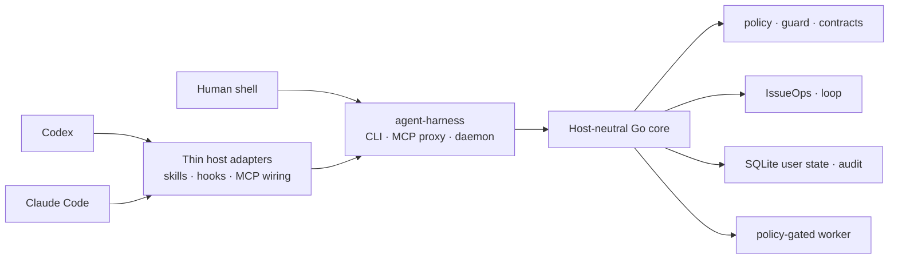

# agent-harness

<p align="center">
  <a href="README.md">한국어</a>
</p>

<p align="center">
  
</p>

**agent-harness** is a personal agent harness that gives multiple AI coding agents the same local execution rules and durable work records. Codex, Claude Code, and a human shell share one Go core, CLI/MCP contracts, command policy, user-state store, and skill source tree.

The goal is not to run more agents. It is to make every host preserve the same decisions, respect the same safety boundaries, and require the same evidence before work is considered complete.

## Why it exists

Capable coding agents do not make teamwork repeatable by themselves. Context can stay trapped in a conversation, ambiguous requests can become code too early, plan changes and feedback can disappear from the issue, and PRs or MRs can reach review without verifiable evidence.

agent-harness addresses those failures through a shared set of surfaces:

- a host-neutral Go core with thin host adapters;
- CLI and daemon-backed MCP surfaces with shared response contracts;
- durable IssueOps state linking issues, plans, worktrees, feedback, and verification evidence;
- command policy before execution and quality gates after changes;
- SQLite user state kept outside repository source;
- one `skills/` source tree installed across hosts.

## Quick start

From a fresh clone:

```bash
./install.sh
./bin/agent-harness inspect --json
./bin/agent-harness doctor --repo . --json
```

Run the harness quality gate:

```bash
./bin/agent-harness self-verify \
  --seed=100 \
  --target-score=95 \
  --llm-eval=false \
  --json
```

Refresh installed integrations from the current checkout:

```bash
git pull --ff-only
agent-harness update
agent-harness inspect --json
```

`agent-harness update` rebuilds the current checkout and refreshes user-level integrations. It does not run `git pull`.

## Host integrations

The default installer connects exactly two first-party host adapters to the same execution contract.

| Host | Default user-level integration |
| --- | --- |
| Codex | `~/.codex/skills/`, MCP config, lifecycle hooks |
| Claude Code | `~/.claude/skills/`, user-scope MCP, lifecycle hooks |

The default install does not create host configuration in target repositories. Repo-local skills, hooks, and MCP files require explicit project-local opt-in.

## Architecture



The following boundaries are deliberate:

1. Core behavior belongs in Go, not in a host plugin or hook.
2. CLI JSON, MCP responses, and daemon responses keep the same meaning.
3. Host adapters cannot bypass authentication, command policy, or workspace boundaries.
4. Hooks provide context and deterministic guards; they do not create issues or PRs, edit files, or run tests for the agent.
5. The worker manages lifecycle jobs and policy-gated read-only evidence commands. It is not a general writable shell runner.

## Core surfaces

| Area | Representative commands | Purpose |
| --- | --- | --- |
| Install and refresh | `install`, `update`, `bootstrap` | Refresh the binary, skills, hooks, and MCP wiring |
| Health and docs | `inspect`, `status`, `doctor`, `docs` | Inspect installation, daemon, state, and project docs |
| Safety and quality | `policy`, `guard`, `quality`, `verify-work`, `trace`, `contract`, `api-doc` | Check execution policy, change quality, evidence, and public contracts |
| Workflows | `issueops`, `loop` | Manage durable workflows and verify-until-done contracts |
| State and runtime | `state`, `daemon`, `mcp`, `worker` | Manage user state, the MCP backend, and constrained local jobs |
| Improvement and research | `self-verify`, `self-augment`, `web-fetch` | Verify the harness, record improvements, and fetch public web content resiliently |

Read the complete CLI and MCP contracts from the running binary:

The current checkout's response-contract schema pins 29 top-level CLI commands and 100 MCP tools.

```bash
agent-harness --help
agent-harness contract schema --json
agent-harness contract check --json
```

## IssueOps

IssueOps moves work context out of private conversations and into issues, plans, worktrees, feedback, and verification evidence that survive session and host changes.

Its current formal phase order is:

```text
problem → grill → plan → compatibility-review → implement
        → ai-slop-clean → feedback → pr → done
```

Remote issues, branches and worktrees, design reviews, Brooks devil's-advocate reviews, plan links, and execution decisions are durable evidence and gates around those phases. Hooks can surface missing boundaries or block deterministic violations, but they do not execute workflow actions.

Start and inspect a cycle:

```bash
agent-harness issueops start \
  --repo "$PWD" \
  --branch "123-short-description" \
  --json

agent-harness issueops status --id "<id from the start output>" --json
```

See [`skills/issueops/SKILL.md`](skills/issueops/SKILL.md) and the [operations map](.agent-harness/OPERATIONS.md) for the complete cycle and remote-artifact rules.

## Skills

[`skills/`](skills/) is the single source of truth for shared skills. The installer links that directory into each host's user-level skill path.

- Planning and critique: `von-neumann`, `brooks`, `karpathy`
- Execution and verification: `turing`, `hopper`, `dijkstra`, `codd`, `shannon`
- Research and team memory: `berners-lee`, `engelbart`
- Git and workflow operations: `torvalds`, `atomic-commit-push`, `issueops`, `self-verify`, `self-augment`

Each skill's `SKILL.md` is its authoritative usage contract.

## Safety boundaries

- Default installation updates user-level host configuration only. Target repositories change only through explicit bootstrap or project-local opt-in.
- Command execution follows policy for workspace root, cwd, write/network/shell intent, timeouts, and redaction.
- Raw secrets do not belong in documentation, state responses, audit logs, or test fixtures.
- External tools are not dependencies of native install, update, readiness, or self-verification.
- Integrations such as Orca supervised execution are optional adapters; IssueOps remains the durable authority.
- When the GitOps kubectl guard is enabled, it blocks direct mutating cluster commands and requires host-specific explicit approval for live access.

## Repository map

```text
cmd/harness/       Single Go binary and CLI/MCP/daemon/hook entry points
internal/core/     Host-neutral use cases and policy/state/workflow behavior
internal/port/     Interfaces and DTOs consumed by the core
internal/adapter/  Filesystem, install, host, and external-boundary adapters
configs/           Codex and Claude Code configuration templates
skills/            Skill source shared by every host
.agent-harness/    Architecture, operations, testing, and ADR project docs
scripts/           Install, release, smoke, and validation scripts
docs/              Supporting documents and assets
```

## Release and rollback

Verify a release checkout with:

```bash
scripts/release-repro-smoke.sh
scripts/release-build-matrix.sh
```

Current distribution decision: prefer a tarball or manual archive and defer Homebrew until the release gates have enough evidence. Rollback changes the checkout, so review the [release reproducibility and rollback criteria](.agent-harness/operations/release-reproducibility.md) before running any rollback command.

After a known-good commit is selected and `git status --short` is empty, use this rollback path. `git reset --hard` deletes uncommitted changes, so do not run it before confirming a clean worktree.

```bash
git switch main
git reset --hard <known-good-sha>
agent-harness update
agent-harness inspect --json
```

## Verification

Quick sanity checks for README changes:

```bash
./bin/agent-harness contract check --json
./bin/agent-harness docs --json
git diff --check
```

For Go or public-contract changes:

```bash
go test ./... -count=1
go test -race ./... -count=1
go build -o bin/agent-harness ./cmd/harness
```

See [`.agent-harness/TESTING.md`](.agent-harness/TESTING.md) for change-specific verification requirements.

## Project docs

| Document | Purpose |
| --- | --- |
| [`AGENTS.md`](AGENTS.md) | Repository rules and verification priorities |
| [`.agent-harness/CONSTITUTION.md`](.agent-harness/CONSTITUTION.md) | Instruction hierarchy and safety principles |
| [`.agent-harness/ARCHITECTURE.md`](.agent-harness/ARCHITECTURE.md) | Component boundaries and responsibilities |
| [`.agent-harness/OPERATIONS.md`](.agent-harness/OPERATIONS.md) | Install, host, CLI/MCP, and runtime operations map |
| [`.agent-harness/TESTING.md`](.agent-harness/TESTING.md) | Test and verification gates |
| [`.agent-harness/ADR.md`](.agent-harness/ADR.md) | Structural decisions, rationale, and rejected alternatives |

Installation and operational procedures are split into [install](.agent-harness/operations/install.md), [hosts](.agent-harness/operations/hosts.md), [CLI/MCP](.agent-harness/operations/cli-and-mcp.md), and [verification](.agent-harness/operations/verification.md) guides.

## License

MIT. See [`LICENSE`](LICENSE).
