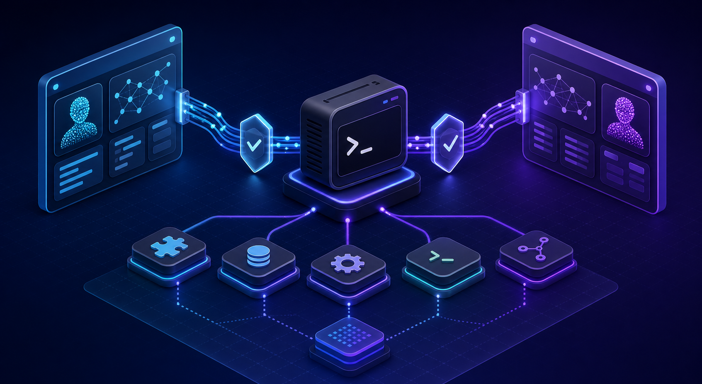
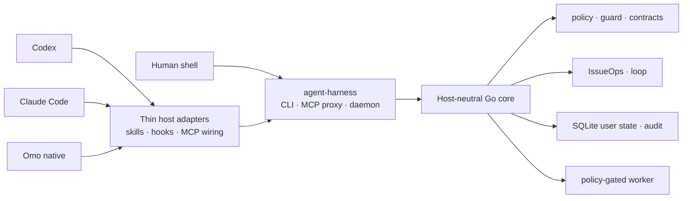

<p align="center">
  
</p>

<h1 align="center">agent-harness</h1>

<p align="center">
  Connect Codex, Claude Code, and Omo native to one execution contract,<br />
  with workflow state, safety boundaries, and evidence preserved locally
</p>

<p align="center">
  <a href="README.md">한국어</a>
  ·
  <a href="README.en.md"><strong>English</strong></a>
</p>

> [!IMPORTANT]
> agent-harness 0.1.0 is an actively developed local tool. The default install
> updates user-level host configuration and command shims under
> `~/.local/bin`. Review the complete plan first with
> `./install.sh --dry-run --json`.

## At a glance

**agent-harness** gives a human shell and multiple coding agents the same Go
core, CLI/MCP contracts, command policy, user-state store, and skill source
tree. It does not replace a host or auto-approve work. It preserves execution
evidence outside the host so the same work contract survives session changes.

| Capability | What it provides |
|---|---|
| Cross-host integration | Codex, Claude Code, and Omo native share one core and response contract |
| CLI, MCP, and daemon | Human-facing CLI and agent-facing MCP through a shared daemon |
| IssueOps | Durable state from problem and issue through plan, worktree, feedback, PR/MR, and cleanup |
| Project docs | Create, route, and incrementally maintain `AGENTS.md` and `.agent-harness/` |
| Execution safety | Workspace/cwd, write/network intent, timeout, redaction, and executable-fence policy |
| Verification and improvement | Contract, quality, self-verify, self-augment, and benchmark evidence |
| Shared skills | One `skills/` source linked into every first-party host |
| Browser QA | Functional, UI/UX, and combined web QA skills driven by an installed Aside CLI |

## Quick start

Requirements:

- Git
- Go 1.26.3
- Any host you plan to use: Codex, Claude Code, or Omo (optional)

From a fresh clone, review the install plan before applying it:

```bash
./install.sh --dry-run --json
./install.sh
./bin/agent-harness inspect --json
./bin/agent-harness doctor --repo . --json
```

Run the harness quality gate:

```bash
./bin/agent-harness self-verify \
  --seed=100 \
  --target-score=95 \
  --llm-eval=false \
  --json
```

Refresh installed integrations from the current checkout:

```bash
git pull --ff-only
ah update
ah inspect --json
```

`agent-harness` is the canonical command; `ah` is the short symlink managed by the installer. Installation fails instead of overwriting an existing `ah` file or a different symlink. `ah update` rebuilds the current checkout and refreshes user-level integrations. It does not run `git pull`.

## Basic workflow

### Connect project docs to a repository

Preview the change, then create the managed `AGENTS.md` routing block,
`.agent-harness/` document family, and repository profile. Existing documents
are not replaced wholesale.

```bash
agent-harness project bootstrap --repo . --dry-run --json
agent-harness project bootstrap --repo . --json
agent-harness project route-docs --repo . --task "test" --json
```

`project-docs-bootstrap` owns first creation, `project-docs-update` owns
incremental maintenance, and `project-docs-optimize` restructures oversized
document families.

### Check daily health

```bash
ah status --json
ah doctor --repo . --json
ah docs --json
ah daemon status --json
```

`doctor` diagnoses installation, state, hooks, MCP, daemon, and project docs
together. `status` is the daily summary; `inspect` is the detailed installation
and native-integration projection.

### Start an IssueOps cycle

```bash
agent-harness issueops start \
  --repo "$PWD" \
  --branch "123-short-description" \
  --json
```

IssueOps keeps the following transition in one durable record and one
generation-fenced `Execution`:

```text
problem → grill → issue → plan → compatibility-review → implement
        → ai-slop-clean → feedback → pr → cleanup
```

Remote issue/PR/MR creation and cleanup default to preview or dry-run. External
changes require explicit `--confirm` plus the matching fingerprint and actor
contract.

## Host integrations

The default installer connects three first-party host adapters to the same execution contract.

| Host | Default user-level integration |
| --- | --- |
| Codex | `~/.codex/skills/`, MCP config, lifecycle hooks |
| Claude Code | `~/.claude/skills/`, user-scope MCP, lifecycle hooks |
| Omo native | `~/.omo/agent/skills/`, `~/.omo/mcp.json`, lifecycle extension |

The default install does not create host configuration in target repositories. Repo-local skills, hooks, and MCP files require explicit project-local opt-in.

## Architecture



The following boundaries are deliberate:

1. Core behavior belongs in Go, not in a host plugin or hook.
2. CLI JSON, MCP responses, and daemon responses keep the same meaning.
3. Host adapters cannot bypass authentication, command policy, or workspace boundaries.
4. Hooks provide context and deterministic guards; they do not create issues or PRs, edit files, or run tests for the agent.
5. The worker manages lifecycle jobs and policy-gated read-only evidence commands. It is not a general writable shell runner.

## Core surfaces

| Area | Representative commands | Purpose |
| --- | --- | --- |
| Install and refresh | `install`, `update`, `bootstrap`, `version` | Refresh the binary, skills, hooks, and MCP wiring; report version |
| Health and docs | `inspect`, `status`, `doctor`, `docs` | Inspect installation, daemon, state, and project docs |
| Safety and quality | `policy`, `guard`, `quality`, `verify-work`, `trace`, `contract`, `api-doc`, `preflight` | Check execution policy, change quality, evidence, public contracts, and pre-commit repository state |
| Workflows | `issueops`, `loop`, `gates`, `channel` | Manage durable workflows, task gate ledgers, and cross-session message channels |
| Docs and hooks | `project`, `hook` | Create, route, and maintain project docs; host lifecycle hook entry points |
| State and runtime | `state`, `daemon`, `mcp`, `worker` | Manage user state, the MCP backend, and constrained local jobs |
| Improvement and research | `self-verify`, `self-augment`, `web-fetch` | Verify the harness, record improvements, and fetch public web content resiliently |

Read the complete CLI and MCP contracts from the running binary:

The current checkout's response-contract schema pins 29 top-level CLI commands and 51 MCP tools.

```bash
agent-harness --help
agent-harness contract schema --json
agent-harness contract check --json
```

## Current verified state

These values come from the running binary's contract and quality projection.
They are not a separately maintained README score.

| Verification axis | Current state |
| --- | --- |
| Public contract | 29 CLI commands, 51 MCP tools |
| Quality collection | `ok` |
| Quality health | `needs_attention` |
| Quality gate | `report_only` |
| Open verification/augmentation candidates | 0 / 0 |
| Tracked quality candidates | 6 |
| Active audit P1/P2 findings | 0 |

The current `needs_attention` status reports 12 low-coverage packages and
branch-complexity debt without blocking the gate. A collection failure becomes
`collection_status=error`, `health_status=unknown`, and `gate_status=block`.

Recompute the current projection with:

```bash
agent-harness contract schema --json
agent-harness quality inspect --json
agent-harness issueops benchmark run \
  --fixtures testdata/issueops/fixtures \
  --json
```

`quality inspect` reports `collection_status`, `health_status`, and `gate_status` separately. Collection failure blocks the gate; non-blocking debt such as existing low coverage remains `report_only`.

## IssueOps

IssueOps records conversational work context as issues, plans, worktrees, feedback, and verification evidence so the same work contract survives session and host changes.

Its current formal phase order is:

```text
problem → grill → issue → plan → compatibility-review → implement
        → ai-slop-clean → feedback → pr → cleanup
```

Remote issues, branches and worktrees, design reviews, Brooks devil's-advocate reviews, plan links, and execution decisions are recorded as the durable evidence and gates required to pass each phase. Hooks can surface missing boundaries or block deterministic violations, but they do not execute workflow actions.

Remote issue creation is a dry run by default. The `--confirm` path stores project authority, request digest, and operation marker as a durable intent before invoking the provider. An ambiguous result blocks automatic retry; `reconcile-issue` adopts only one live candidate from the same project.

Inspect a cycle with
`agent-harness issueops status --id "<cycle id>" --json`. `execution prepare`
previews the mode and readiness fingerprint; its returned `next_command`
performs the confirmed transition. `direct` and `orca` are execution adapters,
while IssueOps remains the durable authority.

Without `--confirm`, `create-issue` prints a preview and does not create an intent. Use `reconcile-issue` only when a confirmed remote call has left a durable intent with an ambiguous result; adopting a candidate requires a separate `--confirm`. See the [IssueOps provider guide](.agent-harness/operations/guides/issueops-providers.md) for complete command and provider constraints.

See [`skills/issueops/SKILL.md`](skills/issueops/SKILL.md) and the [operations map](.agent-harness/OPERATIONS.md) for the complete cycle and remote-artifact rules.

## Skills

[`skills/`](skills/) is the single source of truth for 33 shared skills. The installer links that directory into each host's user-level skill path.

- Planning and critique: `von-neumann`, `boehm`, `brooks`, `karpathy`
- Execution and verification: `turing`, `hopper`, `dijkstra`, `codd`, `shannon`
- Research and collaboration: `berners-lee`, `engelbart`, `slack-delegate`
- Git and workflow operations: `torvalds`, `atomic-commit-push`, `gitlab-usecase`, `issueops`, `issueops-cleanup`, `issue-branch-worktree`
- Project docs: `project-bootstrap`, `project-docs-bootstrap`, `project-docs-update`, `project-docs-optimize`
- Browser QA: `aside-functional-qa`, `aside-visual-qa`, `aside-web-qa`, `read-public-artifact`
- Code review: `parnas`, `review-agent-feedback`
- Operational improvement: `self-verify`, `self-augment`, `stability-audit`
- Korean writing: `fluent-korean`
- Diagrams and visualization: `diagram-design`

Each skill's `SKILL.md` is its authoritative usage contract.

The 12 pioneer skills are evaluated across primary, boundary, and operational cases. Committed cases are reproduction inputs, not answer fixtures. Execution receipts, case hashes, and semantic verdicts live under [`testdata/pioneer-holdouts/`](testdata/pioneer-holdouts/).

## Local data and safety boundaries

- Default installation updates user-level host configuration only. Target repositories change only through explicit bootstrap or project-local opt-in.
- Runtime state is stored in SQLite under `~/.local/state/agent-harness/` by default and can be isolated with `HARNESS_STATE_DIR`.
- Command execution follows policy for workspace root, cwd, write/network/shell intent, timeouts, and redaction.
- MCP tool arguments reject unknown fields and missing or incorrectly typed fields against the published schema.
- Executable shell fences are checked without execution for syntax, swallowed failures, destructive commands, dynamic shells, and symlink bypasses.
- Raw secrets do not belong in documentation, state responses, audit logs, or test fixtures.
- External tools are not dependencies of native install, update, readiness, or self-verification.
- Integrations such as Orca supervised execution are optional adapters; IssueOps remains the durable authority.
- When the GitOps kubectl guard is enabled, it blocks direct mutating cluster commands and requires host-specific explicit approval for live access.

## Repository map

```text
cmd/harness/          Composition root and CLI/MCP/daemon/hook entry points
internal/contract/    Versioned DTOs shared by transports and persistence
internal/domain/      Pure rules, reducers, and classifiers
internal/application/ Use cases that compose domain logic with ports
internal/port/        External capability interfaces and error contracts
internal/adapter/     Host, filesystem, process, database, and network boundaries
internal/architecture/ Production import-graph fitness tests
configs/              Codex, Claude Code, and Omo configuration templates
skills/               Skill source shared by every host
.agent-harness/       Architecture, operations, testing, and ADR project docs
scripts/              Install, release, smoke, and validation scripts
docs/                 Supporting documents and assets
openwiki/             Code documentation wiki (OpenWiki) quickstart and pages
```

## Release and rollback

agent-harness is an actively developed `0.1.0` project. **Current distribution
decision**: prefer a tarball or manual archive and defer Homebrew until the
release gates are sufficiently validated. The release matrix cross-builds
`darwin/arm64`, `darwin/amd64`, `linux/amd64`, and `linux/arm64`.

Release verification refreshes local build artifacts, while rollback changes
the checkout and installed state. Review the
[release reproducibility and rollback criteria](.agent-harness/operations/release-reproducibility.md)
before either operation. This README does not provide destructive rollback
commands.

## Verification

Documentation-only changes still run the project's minimum gate:

```bash
./bin/agent-harness contract check --json
./bin/agent-harness docs --json
./bin/agent-harness inspect --json
./bin/agent-harness quality inspect --json
./bin/agent-harness self-verify \
  --seed=100 \
  --target-score=95 \
  --llm-eval=false \
  --json
go test ./... -count=1
go build -o bin/agent-harness ./cmd/harness
git diff --check
```

For Go or public-contract changes:

```bash
go test ./... -count=1
go test -race ./... -count=1
go build -o bin/agent-harness ./cmd/harness
```

See [`.agent-harness/TESTING.md`](.agent-harness/TESTING.md) for change-specific verification requirements.

## Troubleshooting

| Symptom | What to check |
|---|---|
| `ah` is missing after installation | Open a new shell or refresh its command cache, then verify `~/.local/bin` is on PATH |
| Installation refuses an existing `ah` or `agent-harness` | This is the installer protecting unrelated files; inspect the conflict path in `--dry-run --json` |
| A host does not show a new MCP tool | Run `ah update`, reopen the host session, then inspect catalog/config state with `ah inspect --json` |
| Daemon health is abnormal | Run `ah doctor --repo . --json` and `ah daemon status --json` |
| Self-verify appears idle | Add `--progress=jsonl` to display per-step heartbeat events |
| Project docs are stale | Update one document with `project-docs-update`; use `project-docs-optimize` for structural problems |

## Project docs

| Document | Purpose |
| --- | --- |
| [`AGENTS.md`](AGENTS.md) | Repository rules and verification priorities |
| [`.agent-harness/CONSTITUTION.md`](.agent-harness/CONSTITUTION.md) | Instruction hierarchy and safety principles |
| [`.agent-harness/ARCHITECTURE.md`](.agent-harness/ARCHITECTURE.md) | Component boundaries and responsibilities |
| [`.agent-harness/OPERATIONS.md`](.agent-harness/OPERATIONS.md) | Install, host, CLI/MCP, and runtime operations map |
| [`.agent-harness/TESTING.md`](.agent-harness/TESTING.md) | Test and verification gates |
| [`.agent-harness/operations/quality-dashboard.md`](.agent-harness/operations/quality-dashboard.md) | Quality projections and pioneer evidence interpretation |
| [`.agent-harness/ADR.md`](.agent-harness/ADR.md) | Structural decisions, rationale, and rejected alternatives |
| [`openwiki/quickstart.md`](openwiki/quickstart.md) | OpenWiki entry point for code structure and workflows |

Installation and operational procedures are split into [install](.agent-harness/operations/install.md), [hosts](.agent-harness/operations/hosts.md), [CLI/MCP](.agent-harness/operations/cli-and-mcp.md), and [verification](.agent-harness/operations/verification.md) guides.

## License

MIT. See [`LICENSE`](LICENSE).
