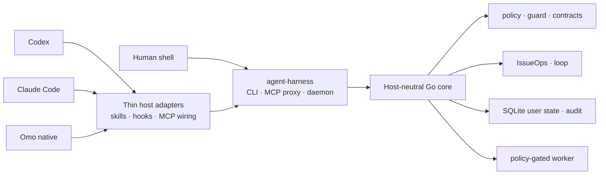

# agent-harness

<p align="center">
  <a href="README.md">한국어</a>
</p>

<p align="center">
  
</p>

**agent-harness** connects Codex, Claude Code, Omo native, and a human shell to one local execution contract. Every host uses the same Go core, CLI/MCP contracts, command policy, user-state store, and skill source tree.

It does not replace a host or auto-approve work. It keeps workflow state, execution boundaries, and verification evidence outside the host so work can resume under the same rules when the session changes.

## Why it exists

Capable coding agents do not make teamwork repeatable by themselves. Context can stay trapped in a conversation, ambiguous requests can become code too early, plan changes and feedback can disappear from the issue, and PRs or MRs can reach review without verifiable evidence.

It addresses these problems with:

- a host-neutral Go core with thin host adapters;
- CLI and daemon-backed MCP surfaces with shared response contracts;
- durable IssueOps state linking issues, plans, worktrees, feedback, and verification evidence;
- command policy before execution and quality gates after changes;
- SQLite user state kept outside repository source;
- one `skills/` source tree installed across hosts.

## Quick start

From a fresh clone:

```bash
./install.sh
./bin/agent-harness inspect --json
./bin/agent-harness doctor --repo . --json
```

Run the harness quality gate:

```bash
./bin/agent-harness self-verify \
  --seed=100 \
  --target-score=95 \
  --llm-eval=false \
  --json
```

Refresh installed integrations from the current checkout:

```bash
git pull --ff-only
ah update
ah inspect --json
```

`agent-harness` is the canonical command; `ah` is the short symlink managed by the installer. Installation fails instead of overwriting an existing `ah` file or a different symlink. `ah update` rebuilds the current checkout and refreshes user-level integrations. It does not run `git pull`.

## Host integrations

The default installer connects three first-party host adapters to the same execution contract.

| Host | Default user-level integration |
| --- | --- |
| Codex | `~/.codex/skills/`, MCP config, lifecycle hooks |
| Claude Code | `~/.claude/skills/`, user-scope MCP, lifecycle hooks |
| Omo native | `~/.omo/agent/skills/`, `~/.omo/mcp.json`, lifecycle extension |

The default install does not create host configuration in target repositories. Repo-local skills, hooks, and MCP files require explicit project-local opt-in.

## Architecture



The following boundaries are deliberate:

1. Core behavior belongs in Go, not in a host plugin or hook.
2. CLI JSON, MCP responses, and daemon responses keep the same meaning.
3. Host adapters cannot bypass authentication, command policy, or workspace boundaries.
4. Hooks provide context and deterministic guards; they do not create issues or PRs, edit files, or run tests for the agent.
5. The worker manages lifecycle jobs and policy-gated read-only evidence commands. It is not a general writable shell runner.

## Core surfaces

| Area | Representative commands | Purpose |
| --- | --- | --- |
| Install and refresh | `install`, `update`, `bootstrap` | Refresh the binary, skills, hooks, and MCP wiring |
| Health and docs | `inspect`, `status`, `doctor`, `docs` | Inspect installation, daemon, state, and project docs |
| Safety and quality | `policy`, `guard`, `quality`, `verify-work`, `trace`, `contract`, `api-doc` | Check execution policy, change quality, evidence, and public contracts |
| Workflows | `issueops`, `loop` | Manage durable workflows and verify-until-done contracts |
| State and runtime | `state`, `daemon`, `mcp`, `worker` | Manage user state, the MCP backend, and constrained local jobs |
| Improvement and research | `self-verify`, `self-augment`, `web-fetch` | Verify the harness, record improvements, and fetch public web content resiliently |

Read the complete CLI and MCP contracts from the running binary:

The current checkout's response-contract schema pins 27 top-level CLI commands and 44 MCP tools.

```bash
agent-harness --help
agent-harness contract schema --json
agent-harness contract check --json
```

## Current verified state

These values come from the running binary's contract and quality projection. They are not a separately maintained README score.

| Verification axis | Current state |
| --- | --- |
| Public contract | 27 CLI commands, 44 MCP tools |
| Pioneer skill coverage | benchmark 12/12, reproduction 12/12 |
| Fresh-context evaluation | 36 cases, 24 executions, 34 passed, 2 capability-blocked, 0 failed |
| Deterministic benchmark | 18 fixtures, average/minimum 100, 0 critical failures |
| Release gate | full test, full race, vet, build, contract, and self-verify passed |

The two blocked cases require Boehm's Kordoc document surface and a source document, neither of which was available. Reproduction fixtures are not presented as hidden holdouts, and missing capability is not converted into a pass.

Recompute the current projection with:

```bash
agent-harness contract schema --json
agent-harness quality inspect --json
agent-harness issueops benchmark run \
  --fixtures testdata/issueops/fixtures \
  --json
```

`quality inspect` reports `collection_status`, `health_status`, and `gate_status` separately. Collection failure blocks the gate; non-blocking debt such as existing low coverage remains `report_only`.

## IssueOps

IssueOps records conversational work context as issues, plans, worktrees, feedback, and verification evidence so the same work contract survives session and host changes.

Its current formal phase order is:

```text
problem → grill → plan → compatibility-review → implement
        → ai-slop-clean → feedback → pr → done
```

Remote issues, branches and worktrees, design reviews, Brooks devil's-advocate reviews, plan links, and execution decisions are recorded as the durable evidence and gates required to pass each phase. Hooks can surface missing boundaries or block deterministic violations, but they do not execute workflow actions.

Remote issue creation is a dry run by default. The `--confirm` path stores project authority, request digest, and operation marker as a durable intent before invoking the provider. An ambiguous result blocks automatic retry; `reconcile-issue` adopts only one live candidate from the same project.

Start and inspect a cycle:

```bash
agent-harness issueops start \
  --repo "$PWD" \
  --branch "123-short-description" \
  --json

agent-harness issueops status --id "<id from the start output>" --json
```

Without `--confirm`, `create-issue` prints a preview and does not create an intent. Use `reconcile-issue` only when a confirmed remote call has left a durable intent with an ambiguous result; adopting a candidate requires a separate `--confirm`. See the [IssueOps provider guide](.agent-harness/operations/guides/issueops-providers.md) for complete command and provider constraints.

See [`skills/issueops/SKILL.md`](skills/issueops/SKILL.md) and the [operations map](.agent-harness/OPERATIONS.md) for the complete cycle and remote-artifact rules.

## Skills

[`skills/`](skills/) is the single source of truth for shared skills. The installer links that directory into each host's user-level skill path.

- Planning and critique: `von-neumann`, `boehm`, `brooks`, `karpathy`
- Execution and verification: `turing`, `hopper`, `dijkstra`, `codd`, `shannon`
- Research and team memory: `berners-lee`, `engelbart`
- Git and workflow operations: `torvalds`, `atomic-commit-push`, `issueops`, `self-verify`, `self-augment`

Each skill's `SKILL.md` is its authoritative usage contract.

The 12 pioneer skills are evaluated across primary, boundary, and operational cases. Committed cases are reproduction inputs, not answer fixtures. Execution receipts, case hashes, and semantic verdicts live under [`testdata/pioneer-holdouts/`](testdata/pioneer-holdouts/).

## Safety boundaries

- Default installation updates user-level host configuration only. Target repositories change only through explicit bootstrap or project-local opt-in.
- Command execution follows policy for workspace root, cwd, write/network/shell intent, timeouts, and redaction.
- MCP tool arguments reject unknown fields and missing or incorrectly typed fields against the published schema.
- Executable shell fences are checked without execution for syntax, swallowed failures, destructive commands, dynamic shells, and symlink bypasses.
- Raw secrets do not belong in documentation, state responses, audit logs, or test fixtures.
- External tools are not dependencies of native install, update, readiness, or self-verification.
- Integrations such as Orca supervised execution are optional adapters; IssueOps remains the durable authority.
- When the GitOps kubectl guard is enabled, it blocks direct mutating cluster commands and requires host-specific explicit approval for live access.

## Repository map

```text
cmd/harness/          Composition root and CLI/MCP/daemon/hook entry points
internal/contract/    Versioned DTOs shared by transports and persistence
internal/domain/      Pure rules, reducers, and classifiers
internal/application/ Use cases that compose domain logic with ports
internal/port/        External capability interfaces and error contracts
internal/adapter/     Host, filesystem, process, database, and network boundaries
internal/architecture/ Production import-graph fitness tests
configs/              Codex, Claude Code, and Omo configuration templates
skills/               Skill source shared by every host
.agent-harness/       Architecture, operations, testing, and ADR project docs
scripts/              Install, release, smoke, and validation scripts
docs/                 Supporting documents and assets
```

## Release and rollback

Current distribution decision: prefer a tarball or manual archive and defer Homebrew until the release gates are sufficiently validated. Release verification refreshes local build artifacts, while rollback changes the checkout and installed state. Review the [release reproducibility and rollback criteria](.agent-harness/operations/release-reproducibility.md) before either operation. This README does not provide destructive rollback commands.

## Verification

Quick sanity checks for README changes:

```bash
./bin/agent-harness contract check --json
./bin/agent-harness docs --json
./bin/agent-harness quality inspect --json
python3 scripts/verify-skill-shell.py skills/
git diff --check
```

For Go or public-contract changes:

```bash
go test ./... -count=1
go test -race ./... -count=1
go build -o bin/agent-harness ./cmd/harness
```

See [`.agent-harness/TESTING.md`](.agent-harness/TESTING.md) for change-specific verification requirements.

## Project docs

| Document | Purpose |
| --- | --- |
| [`AGENTS.md`](AGENTS.md) | Repository rules and verification priorities |
| [`.agent-harness/CONSTITUTION.md`](.agent-harness/CONSTITUTION.md) | Instruction hierarchy and safety principles |
| [`.agent-harness/ARCHITECTURE.md`](.agent-harness/ARCHITECTURE.md) | Component boundaries and responsibilities |
| [`.agent-harness/OPERATIONS.md`](.agent-harness/OPERATIONS.md) | Install, host, CLI/MCP, and runtime operations map |
| [`.agent-harness/TESTING.md`](.agent-harness/TESTING.md) | Test and verification gates |
| [`.agent-harness/operations/quality-dashboard.md`](.agent-harness/operations/quality-dashboard.md) | Quality projections and pioneer evidence interpretation |
| [`.agent-harness/ADR.md`](.agent-harness/ADR.md) | Structural decisions, rationale, and rejected alternatives |

Installation and operational procedures are split into [install](.agent-harness/operations/install.md), [hosts](.agent-harness/operations/hosts.md), [CLI/MCP](.agent-harness/operations/cli-and-mcp.md), and [verification](.agent-harness/operations/verification.md) guides.

## License

MIT. See [`LICENSE`](LICENSE).
