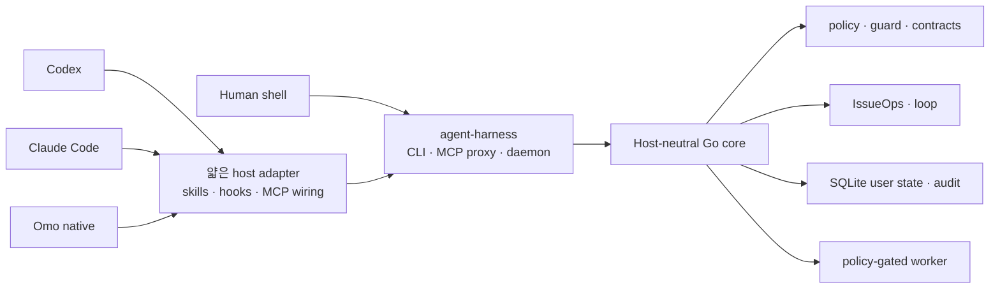

# agent-harness

<p align="center">
  <a href="README.en.md">English</a>
</p>

<p align="center">
  
</p>

**agent-harness**는 여러 AI 코딩 에이전트가 같은 로컬 실행 규칙과 작업 기록을 공유하게 만드는 개인용 에이전트 하네스입니다. Codex, Claude Code, Omo native와 사람이 쓰는 shell이 하나의 Go core, CLI/MCP 계약, command policy, user-state 저장소, shared skill 원본을 사용합니다.

핵심 목표는 에이전트를 더 많이 실행하는 것이 아니라, 어떤 host에서 작업하더라도 같은 결정을 남기고 같은 안전 경계를 지키며 같은 근거로 완료를 판단하게 만드는 것입니다.

## 왜 필요한가

에이전트의 코딩 능력만으로는 팀 작업이 반복 가능해지지 않습니다. 맥락이 대화에 갇히고, 모호한 요청이 곧바로 구현으로 바뀌며, plan 변경과 feedback이 issue에서 사라지고, 검증 근거가 없는 PR/MR이 만들어질 수 있습니다.

agent-harness는 이 문제를 다음 공통 표면으로 다룹니다.

- host-neutral Go core와 얇은 host adapter
- CLI와 daemon-backed MCP가 공유하는 response contract
- issue, plan, worktree, feedback, 검증 근거를 잇는 IssueOps state
- 실행 전 command policy와 변경 후 quality gate
- repo source와 분리된 SQLite user state
- `skills/` 하나를 원본으로 사용하는 native skill 설치

## 빠른 시작

fresh clone에서 처음 설치할 때:

```bash
./install.sh
./bin/agent-harness inspect --json
./bin/agent-harness doctor --repo . --json
```

하네스 품질 gate까지 확인하려면:

```bash
./bin/agent-harness self-verify \
  --seed=100 \
  --target-score=95 \
  --llm-eval=false \
  --json
```

현재 checkout의 코드와 설정으로 설치 상태를 갱신할 때:

```bash
git pull --ff-only
ah update
ah inspect --json
```

`agent-harness`가 canonical command이고 `ah`는 installer가 관리하는 짧은
symlink입니다. 기존 `ah` 파일이나 다른 symlink가 있으면 덮어쓰지 않고 설치가
실패합니다. `ah update`는 현재 checkout을 build하고 user-level integration을
갱신하지만 `git pull`은 실행하지 않습니다.

## Host 통합

기본 installer는 세 first-party host adapter를 같은 실행 계약에 연결합니다.

| Host | 기본 user-level 통합 |
| --- | --- |
| Codex | `~/.codex/skills/`, MCP config, lifecycle hooks |
| Claude Code | `~/.claude/skills/`, user-scope MCP, lifecycle hooks |
| Omo native | `~/.omo/skills/`, `~/.omo/mcp.json`, lifecycle extension |

기본 설치는 대상 repo에 host 설정을 만들지 않습니다. repo-local skill, hook, MCP 파일은 명시적 project-local opt-in에서만 생성합니다.

## 아키텍처



다음 경계를 유지합니다.

1. 핵심 동작은 host plugin이나 hook이 아니라 Go core에 둡니다.
2. CLI JSON, MCP response, daemon response는 같은 의미를 유지합니다.
3. host adapter는 인증, command policy, workspace 경계를 우회하지 않습니다.
4. hooks는 context와 deterministic guard를 제공하지만 issue/PR 생성, 파일 편집, 테스트 실행을 대신하지 않습니다.
5. worker는 lifecycle job과 policy-gated read-only evidence command를 다루며 범용 writable shell runner가 아닙니다.

## 핵심 표면

| 영역 | 대표 명령 | 역할 |
| --- | --- | --- |
| 설치와 갱신 | `install`, `update`, `bootstrap` | binary, skills, hooks, MCP wiring 갱신 |
| 상태 진단 | `inspect`, `status`, `doctor`, `docs` | 설치, daemon, state, project docs 상태 확인 |
| 안전과 품질 | `policy`, `guard`, `quality`, `verify-work`, `trace`, `contract`, `api-doc` | 실행 정책, 변경 품질, evidence와 public contract 검사 |
| 작업 흐름 | `issueops`, `loop` | durable workflow와 verify-until-done 계약 관리 |
| 상태와 실행 | `state`, `daemon`, `mcp`, `worker` | user state, MCP backend, 제한된 local job 관리 |
| 개선과 조사 | `self-verify`, `self-augment`, `web-fetch` | 하네스 검증, 개선 후보, resilient public web fetch |

전체 command와 MCP tool 계약은 실행 중인 binary에서 확인합니다.

현재 checkout의 response-contract schema는 최상위 CLI command 29개와 MCP tool 100개를 고정합니다.

```bash
agent-harness --help
agent-harness contract schema --json
agent-harness contract check --json
```

## IssueOps

IssueOps는 대화 안의 작업 맥락을 issue, plan, worktree, feedback, verification evidence로 옮겨 세션과 host가 바뀌어도 이어지는 작업 계약을 만듭니다.

현재 formal phase 순서는 다음과 같습니다.

```text
problem → grill → plan → compatibility-review → implement
        → ai-slop-clean → feedback → pr → done
```

remote issue, branch/worktree, design review, Brooks devil's-advocate review, plan link, execution decision은 이 phase를 통과하기 위한 durable evidence와 gate로 기록됩니다. Hook은 누락된 경계를 알리거나 deterministic violation을 차단할 뿐, workflow action을 대신 실행하지 않습니다.

시작과 상태 확인:

```bash
agent-harness issueops start \
  --repo "$PWD" \
  --branch "123-short-description" \
  --json

agent-harness issueops status --id "<start 출력의 id>" --json
```

상세한 cycle과 remote artifact 규칙은 [`skills/issueops/SKILL.md`](skills/issueops/SKILL.md)와 [운영 문서](.agent-harness/OPERATIONS.md)를 따릅니다.

## 스킬

공용 skill은 [`skills/`](skills/)가 single source of truth입니다. 설치기는 각 host의 user-level skill 경로에서 이 디렉터리를 참조하게 합니다.

- 계획과 비판: `von-neumann`, `boehm`, `brooks`, `karpathy`
- 실행과 검증: `turing`, `hopper`, `dijkstra`, `codd`, `shannon`
- 조사와 팀 기억: `berners-lee`, `engelbart`
- Git과 작업 운영: `torvalds`, `atomic-commit-push`, `issueops`, `self-verify`, `self-augment`

각 skill의 실제 사용 계약은 해당 `SKILL.md`가 기준입니다.

## 안전 경계

- 기본 설치는 user-level host 설정만 갱신합니다. 대상 repo는 명시적 bootstrap이나 project-local opt-in에서만 변경합니다.
- command 실행은 workspace root, cwd, write/network/shell intent, timeout, redaction을 포함한 policy를 따릅니다.
- secret 원문은 문서, 상태 응답, audit log, test fixture에 남기지 않습니다.
- 외부 도구는 native install, update, readiness, self-verification의 dependency가 아닙니다.
- Orca supervised execution 같은 연동은 선택적 adapter이며 IssueOps가 계속 durable authority를 가집니다.
- GitOps kubectl guard를 활성화하면 direct mutating cluster command를 차단하고 live access에 host별 명시적 승인을 요구합니다.

## 저장소 구조

```text
cmd/harness/          composition root와 CLI/MCP/daemon/hook 진입점
internal/contract/    transport와 저장소가 공유하는 versioned DTO
internal/domain/      I/O를 모르는 순수 규칙, reducer, classifier
internal/application/ domain과 port를 조합하는 use case
internal/port/        외부 capability interface와 error contract
internal/adapter/     host, filesystem, process, DB 등 boundary 구현
internal/architecture/ production import graph fitness test
configs/              Codex, Claude Code, Omo native 설정 template
skills/               모든 host가 공유하는 skill 원본
.agent-harness/       architecture, operations, testing, ADR 등 project docs
scripts/              install, release, smoke, validation script
docs/                 보조 문서와 asset
```

## 릴리스와 롤백

release checkout을 검증할 때:

```bash
scripts/release-repro-smoke.sh
scripts/release-build-matrix.sh
```

현재 배포 결정은 tarball/manual archive를 우선하고 Homebrew는 release gate가 충분히 검증될 때까지 보류하는 것입니다. 롤백은 checkout을 변경하는 작업이므로, 명령을 복사해 실행하기 전에 [release reproducibility와 rollback 기준](.agent-harness/operations/release-reproducibility.md)을 확인하세요.

known-good commit이 확정되고 `git status --short`가 비어 있을 때의 rollback 경로는 다음과 같습니다. `git reset --hard`는 commit되지 않은 변경을 삭제하므로 clean worktree를 확인하기 전에는 실행하지 마세요.

```bash
git switch main
git reset --hard <known-good-sha>
agent-harness update
agent-harness inspect --json
```

## 검증

README 변경의 빠른 sanity check:

```bash
./bin/agent-harness contract check --json
./bin/agent-harness docs --json
git diff --check
```

Go 코드나 public contract를 변경했다면:

```bash
go test ./... -count=1
go test -race ./... -count=1
go build -o bin/agent-harness ./cmd/harness
```

변경 종류별 기준은 [`.agent-harness/TESTING.md`](.agent-harness/TESTING.md)를 따릅니다.

## 프로젝트 문서

| 문서 | 용도 |
| --- | --- |
| [`AGENTS.md`](AGENTS.md) | 저장소 작업 규칙과 검증 우선순위 |
| [`.agent-harness/CONSTITUTION.md`](.agent-harness/CONSTITUTION.md) | instruction hierarchy와 안전 원칙 |
| [`.agent-harness/ARCHITECTURE.md`](.agent-harness/ARCHITECTURE.md) | component 경계와 책임 |
| [`.agent-harness/OPERATIONS.md`](.agent-harness/OPERATIONS.md) | 설치, host, CLI/MCP, runtime 운영 map |
| [`.agent-harness/TESTING.md`](.agent-harness/TESTING.md) | 테스트와 verification gate |
| [`.agent-harness/ADR.md`](.agent-harness/ADR.md) | 구조적 결정, 근거, 기각한 대안 |

설치와 운영 절차는 [install](.agent-harness/operations/install.md), [hosts](.agent-harness/operations/hosts.md), [CLI/MCP](.agent-harness/operations/cli-and-mcp.md), [verification](.agent-harness/operations/verification.md) 문서로 나뉘어 있습니다.

## 라이선스

MIT. [`LICENSE`](LICENSE)를 확인하세요.
