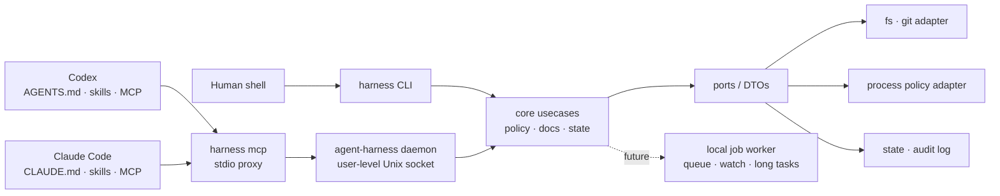

# agent-harness

<p align="center">
  
</p>

**agent-harness**는 Codex와 Claude Code에서 같은 방식으로 쓰는 개인용 에이전트 하네스입니다. 핵심 로직은 Go CLI/MCP/daemon 코어에 두고, Codex plugin·native skill·Claude Code 설정은 그 코어를 호출하는 얇은 어댑터로 유지합니다.

**agent-harness** is a personal agent harness designed to behave consistently across Codex and Claude Code. Its shared behavior lives in a Go CLI/MCP/daemon core, while Codex plugin/native-skill and Claude Code integrations stay as thin host adapters.

---

## 핵심 요약 / Highlights

| 한국어 | English |
| --- | --- |
| Codex와 Claude Code가 같은 binary, schema, state 규칙을 사용합니다. | Codex and Claude Code use the same binary, schemas, and state rules. |
| Plugin-only가 아니라 외부 Go 하네스 코어 + 얇은 host adapter 구조입니다. | It is an external Go harness core with thin host adapters, not a plugin-only design. |
| CLI one-shot, daemon-backed MCP stdio proxy, state-only worker MVP를 제공합니다. | It provides one-shot CLI commands, a daemon-backed MCP stdio proxy, and a state-only worker MVP. |
| 명령 실행은 실제 shell runner가 아니라 policy check/fake-run/audit 중심으로 시작합니다. | Command execution starts with policy check/fake-run/audit rather than a real shell runner. |
| 공용 skill은 `skills/`를 단일 source of truth로 두고 user-level host skill 경로에 연결합니다. | Shared skills live under `skills/` as the single source of truth and are linked into user-level host skill paths. |

---

## 현재 제공 기능 / Current capabilities

| 기능 | Capability |
| --- | --- |
| `inspect`, `preflight`, `docs`, `contract`, `version`으로 설치·문서·계약 상태를 확인합니다. | Inspect installation, docs, and compatibility contracts with `inspect`, `preflight`, `docs`, `contract`, and `version`. |
| `policy check`, `policy fake-run`, `policy audit`로 위험 명령을 실행하지 않고 정책 판단과 감사 기록을 남깁니다. | Evaluate and audit risky command requests without executing them through `policy check`, `policy fake-run`, and `policy audit`. |
| `state write/read/list/prune/doctor/migrate`로 작은 에이전트 체크포인트를 관리합니다. | Manage small agent checkpoints with `state write/read/list/prune/doctor/migrate`. |
| `harness mcp`는 user-level daemon 뒤의 MCP stdio proxy입니다. | `harness mcp` is an MCP stdio proxy backed by a user-level daemon. |
| `daemon start/status/stop`으로 공용 MCP backend lifecycle을 관리합니다. | Manage the shared MCP backend lifecycle with `daemon start/status/stop`. |
| `worker enqueue/status/list/cancel`은 현재 shell을 실행하지 않는 state-only worker MVP입니다. | `worker enqueue/status/list/cancel` is currently a state-only, no-shell worker MVP. |
| `install-native`는 Codex/Claude user-level skill과 MCP 설정 설치를 담당합니다. | `install-native` installs user-level Codex/Claude skills and MCP configuration. |
| `project bootstrap/docs/route-docs/record`로 대상 repo의 agent 운영 문서를 생성·조회·라우팅합니다. | Generate, read, route, and record target-repo agent operating docs with `project bootstrap/docs/route-docs/record`. |
| `api-doc check/static-check/review`로 endpoint/DTO/OpenAPI 변경의 문서 drift를 검사합니다. | Check API documentation drift for endpoint/DTO/OpenAPI changes with `api-doc check/static-check/review`. |
| `self-verify`, `self-augment` 계열 명령으로 하네스 자체 검증과 개선 루프를 실행합니다. | Run harness verification and improvement loops through `self-verify` and `self-augment` commands. |

---

## 아키텍처 / Architecture



### 설계 원칙 / Design principles

| 한국어 | English |
| --- | --- |
| **Host-neutral core first** — Codex/Claude 차이는 adapter에 격리하고, 정책과 계약은 core에 둡니다. | **Host-neutral core first** — Codex/Claude differences stay in adapters; policy and contracts stay in core. |
| **Same contract everywhere** — CLI JSON 출력과 MCP tool response는 같은 의미와 schema를 유지해야 합니다. | **Same contract everywhere** — CLI JSON output and MCP tool responses must keep the same meaning and schema. |
| **Safe by default** — workspace 경계, secret redaction, dry-run/append-only 동작, no-shell worker를 우선합니다. | **Safe by default** — Workspace boundaries, secret redaction, dry-run/append-only behavior, and no-shell workers come first. |
| **Single source of truth for skills** — `skills/<name>/`을 원본으로 두고 host별 복사본 drift를 피합니다. | **Single source of truth for skills** — `skills/<name>/` is the source of truth to avoid host-specific copy drift. |
| **Incremental worker** — persistent worker는 shell 실행 없이 lifecycle state부터 검증합니다. | **Incremental worker** — The persistent worker starts with lifecycle state only, before shell execution. |

---

## 저장소 구조 / Repository map

```text
cmd/harness/              Go binary entrypoint, CLI dispatch, MCP/daemon/self-* commands
internal/core/            Host-neutral use cases: docs, policy, state, install, worker contracts
internal/port/            Core-facing interfaces and DTOs
internal/adapter/         Codex, Claude, CLI, MCP, install utility adapters
configs/codex/            Codex hook/MCP templates
configs/claude/           Claude MCP template
skills/                   Shared native skills used by Codex and Claude Code
.agent-harness/           Project operating docs, ADRs, cautions, testing rules
scripts/install-native.sh Native install convenience script
```

- `cmd/harness/`: 사람이 직접 실행하는 CLI와 MCP/daemon entrypoint입니다. / The human-facing CLI plus MCP/daemon entrypoint.
- `internal/core/`: host와 무관한 usecase와 정책을 둡니다. / Host-neutral use cases and policies.
- `internal/adapter/`: Codex, Claude, CLI, MCP 등 외부 표면을 core에 연결합니다. / Connects Codex, Claude, CLI, MCP, and other external surfaces to core.
- `skills/`: Codex와 Claude Code가 공유하는 native skill 원본입니다. / Source-of-truth native skills shared by Codex and Claude Code.
- `.agent-harness/`: 아키텍처, 운영, 테스트, 주의사항, ADR 문서입니다. / Architecture, operations, testing, cautions, and ADR documents.

---

## 빠른 시작 / Quick start

### 1. 빌드 / Build

```bash
go build -o bin/harness ./cmd/harness
./bin/harness version
```

### 2. 하네스 확인 / Inspect the harness

```bash
./bin/harness inspect --json
./bin/harness docs --json
./bin/harness contract check --json
```

### 3. 명령을 실행하지 않고 정책 확인 / Check command policy without executing the command

```bash
./bin/harness policy check \
  --workspace-root "$PWD" \
  --cwd "$PWD" \
  --json -- git status --short
```

### 4. daemon/MCP smoke 확인 / Run daemon/MCP smoke checks

```bash
./bin/harness daemon status --json
./bin/harness daemon start --json
./bin/harness daemon status --json
./bin/harness daemon stop --json
```

### 5. Native host integration 설치 / Install native host integration

먼저 dry-run으로 확인합니다. / Check with dry-run first.

```bash
./bin/harness install-native --dry-run --json
```

user-level integration을 적용합니다. / Apply user-level integration.

```bash
./scripts/install-native.sh
./bin/harness install-native --json
```

기본 설치는 user-level Codex/Claude 위치를 대상으로 합니다. Project-local `.claude/skills`, `.claude/settings.json`, `.mcp.json` 형태 파일은 명시적인 project-local opt-in이 있을 때만 생성해야 합니다.

By default, install commands target user-level Codex/Claude locations. Project-local `.claude/skills`, `.claude/settings.json`, or `.mcp.json` style files require explicit project-local opt-in.

---

## 자주 쓰는 명령 / Common commands

```bash
# 문서와 라우팅 / Docs and routing
./bin/harness docs --json
./bin/harness project route-docs --repo "$PWD" --task "update command policy" --json

# 상태 체크포인트 / State checkpoints
./bin/harness state write --key checkpoint --value "ready" --json
./bin/harness state read --key checkpoint --json
./bin/harness state doctor --json

# Worker MVP: shell 실행 없이 state만 관리 / state only, no shell execution
./bin/harness worker enqueue --kind smoke --payload "hello" --json
./bin/harness worker list --json

# API 문서 gate / API documentation gate
./bin/harness api-doc check --json
./bin/harness api-doc review --json

# 자기 검증과 자가 증강 / Self-verification and augmentation
./bin/harness self-verify --iterations=10 --seed=100 --target-score=95 --json
./bin/harness self-augment --cycles=1 --target-score=95 --json
```

---

## Shared skills

| Skill | 한국어 | English |
| --- | --- | --- |
| `atomic-commit-push` | 작은 단위의 commit을 만들고 Conventional Commit subject + Lore body 형식으로 안전하게 push합니다. | Creates focused commits and pushes safely with a Conventional Commit subject plus Lore-style body. |
| `project-bootstrap` | repo 증거를 바탕으로 agent 운영 문서를 생성하거나 갱신합니다. | Generates or updates repo-local agent operating docs from repository evidence. |
| `self-verify` | 하네스 95점 검증 루프를 실행하거나 결과를 해석합니다. | Runs or interprets the harness 95-point verification loop. |
| `self-augment` | 안전하고 가치 있는 하네스 개선 1개를 선택·실행하고 검증합니다. | Chooses and executes one safe high-value harness improvement, then verifies it. |

---

## 안전 모델 / Safety model

| 한국어 | English |
| --- | --- |
| Secret 원문은 문서, 로그, 테스트 fixture, CLI JSON, MCP response에 남기지 않습니다. | Secret values must not appear in docs, logs, test fixtures, CLI JSON, or MCP responses. |
| shell/process 실행은 기본 capability가 아닙니다. 현재 policy 명령은 요청을 평가, fake-run, audit합니다. | Shell/process execution is not a default capability. Current policy commands evaluate, fake-run, or audit requests. |
| Worker 명령은 현재 의도적으로 **no-shell** lifecycle record만 다룹니다. | Worker commands are intentionally **no-shell** lifecycle records at this stage. |
| `workspace_root`, `cwd`, argv, write/network intent, timeout, audit id를 명시적으로 다룹니다. | `workspace_root`, `cwd`, argv, write/network intent, timeout, and audit identifiers are explicit policy inputs. |
| Host adapter는 core policy를 우회할 수 없습니다. | Host adapters must not bypass core policy. |

---

## 검증 / Verification

권장 baseline은 다음과 같습니다. / Recommended baseline:

```bash
go test ./... -count=1
go test -race ./... -count=1
go vet ./...
go build -o bin/harness ./cmd/harness
./bin/harness inspect --json
./bin/harness docs --json
./bin/harness contract check --json
```

문서만 변경한 경우에도 최소한 파일·경로·빌드·문서 인덱스를 확인합니다. / For document-only changes, at minimum verify files, paths, build, and docs index.

```bash
find . -maxdepth 3 -type f | sort
find .agent-harness -maxdepth 1 -type f -name '*.md' | sort
go build -o bin/harness ./cmd/harness
./bin/harness docs --json
```

---

## 프로젝트 문서 / Project docs

| 문서 | 역할 / Role |
| --- | --- |
| `AGENTS.md` | 루트 agent 규칙과 프로젝트 결정 / Root agent rules and project decisions |
| `CLAUDE.md` | Claude Code entrypoint, shared rule pointer |
| `.agent-harness/CONSTITUTION.md` | Source-of-truth hierarchy and safety principles |
| `.agent-harness/ARCHITECTURE.md` | Target architecture and boundaries |
| `.agent-harness/CONVENTIONS.md` | Implementation and integration conventions |
| `.agent-harness/TESTING.md` | Verification expectations |
| `.agent-harness/OPERATIONS.md` | Install, CLI, MCP, and skill usage |
| `.agent-harness/ADR.md` | Implementation roadmap and architectural decisions |

---

## 이미지 / Image

- README hero 이미지는 `$imagegen`으로 생성했고 프로젝트 안의 `docs/assets/agent-harness-hero.png`에 저장했습니다.
- The README hero image was generated with `$imagegen` and stored at `docs/assets/agent-harness-hero.png`.
- 이미지는 central CLI harness, 양쪽 AI host panel, policy/tool/state node를 표현해 이 프로젝트의 핵심 구조를 시각화합니다.
- The image visualizes the project’s core shape: a central CLI harness, two AI host panels, and policy/tool/state nodes.

---

## 현재 상태 / Status

이 저장소는 초기이지만 동작 가능한 Go 기반 하네스 MVP입니다. Core CLI, MCP/daemon surface, state checkpoint, policy check, project-doc tooling, native install adapter, self-verification/self-augmentation 명령이 존재합니다.

This repository is an early but functional Go-based harness MVP. The core CLI, MCP/daemon surface, state checkpointing, policy checks, project-doc tooling, native install adapters, and self-verification/self-augmentation commands are present.

장기 실행 job worker는 command policy, audit, cancellation, secret-redaction 경계가 충분히 단단해질 때까지 의도적으로 no-shell lifecycle state로 제한합니다.

The long-running job worker remains intentionally limited to no-shell lifecycle state until command policy, audit, cancellation, and secret-redaction boundaries are hardened enough for real process execution.
