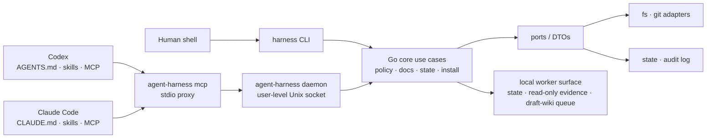

# agent-harness

<p align="center">
  <a href="#english">English</a> ·
  <a href="#한국어">한국어</a>
</p>

<a id="english"></a>

## English

<p align="right"><a href="#한국어">한국어로 보기</a></p>

<p align="center">
  
</p>

**agent-harness** is a personal automation harness for AI coding agents. It gives **Codex** and **Claude Code** the same local Go binary, the same MCP tools, the same command-policy checks, and the same shared skill source tree.

The project is intentionally not “just a Codex plugin” or “just Claude commands.” The reusable behavior lives in a host-neutral Go core; host integrations are thin adapters that call that core.

The project philosophy is **do not reinvent the wheel**: agent-harness owns the small shared core for orchestration, policy, state, project docs, and install glue. Specialized knowledge/retrieval tools stay upstream — for example `nvk/llm-wiki`, `colbymchenry/codegraph`, and `thedotmack/claude-mem` are installed or configured as optional dependencies instead of being reimplemented inside the harness.

> Status: early but functional MVP. The CLI, daemon-backed MCP proxy, policy checker, read-only command evidence runner, state checkpoints, project-doc and draft-wiki tools, lifecycle hooks, guard/verify-work/trace evidence gates, API-doc review gate, native skill installer, self-verification loop, and self-augmentation loop are implemented. The worker surface is still **state-first and policy-gated**: it can record lifecycle jobs, run argv-only read-only evidence commands, and process draft-wiki queue items, but it is not a general writable shell runner.

---

## Why this exists

AI coding agents become hard to trust when every host has different prompts, tools, state, and safety rules. `agent-harness` keeps those concerns in one portable place.

Use it when you want to:

- run the same agent workflow from Codex, Claude Code, MCP, or a shell;
- keep shared skills in one `skills/` source of truth instead of copying them per host;
- expose repo operating docs to agents in a structured way;
- check command safety before execution rather than letting agents run arbitrary shell strings;
- store small, inspectable agent checkpoints outside the repository;
- continuously verify and improve the harness itself.

## What you get

| Area | Commands / files | What it does |
| --- | --- | --- |
| Install and inspection | `bootstrap`, `update`, `install-native`, `inspect`, `preflight`, `status`, `version` | Build/update user-level Codex/Claude integrations, inspect the installation, and summarize health. |
| MCP backend | `agent-harness mcp`, `daemon start/status/stop` | Run a stdio MCP proxy backed by a user-level daemon so Codex and Claude see the same tools. |
| Command policy | `policy check`, `policy fake-run`, `policy run --read-only`, `policy audit` | Evaluate argv, workspace root, cwd, timeout, env allowlists, shell/write/network intent, read-only execution, and audit metadata. |
| Doctor | `doctor` | Diagnose install, hooks, MCP, daemon, user-state, lifecycle namespace, and project docs. |
| State checkpoints | `state write/read/list/prune/doctor/migrate` | Store small JSON checkpoints in user state, not tracked repo files. |
| Project docs and draft wiki | `project bootstrap/docs/route-docs/record`, `project draft-wiki ...`; MCP `project_docs_*` | Generate, index, route, update, append, stage, approve, reject, and promote project operating knowledge under `.agent-harness/`. |
| API docs gate | `api-doc check/static-check/review` | Catch endpoint/DTO/OpenAPI documentation drift. |
| Shared skills | `skills/atomic-commit-push`, `skills/workflows`, `skills/ultracode`, `skills/project-bootstrap`, `skills/draft-wiki-promoter`, `skills/stability-audit`, `skills/self-verify`, `skills/self-augment` | Codex and Claude Code use one source tree; host-targeted skills can opt into one host. |
| Evidence and contracts | `guard check`, `verify-work`, `trace analyze`, `contract schema/check` | Check anti-patterns, collect completion evidence matrices, analyze trace/lifecycle evidence, and keep CLI/MCP contracts aligned. |
| Self-improvement | `self-verify`, `self-verify history/compare/promote/candidates`, `self-augment`, `self-augment lesson` | Run a 95-point verification gate, compare/promote checkpoints, and record safe improvement candidates or lessons. |
| Worker MVP | `worker enqueue/status/list/cancel`, `worker run --read-only`, `worker draft-wiki` | Record job lifecycle state, run policy-gated read-only evidence commands, and process draft-wiki queue items; no writable shell jobs. |

## Issue-Driven Development

Issue-Driven Development, or IDD, is the collaboration model this harness is moving toward. SDD and TDD still matter, but the source of truth above them is the issue graph.

In IDD, every meaningful decision becomes an issue or an issue update. Related decisions are linked so a teammate can reconstruct why a branch exists, which alternatives were rejected, which acceptance criteria changed, and which follow-up issues are still open. Implementation starts from an issue-based branch and an isolated git worktree, not from an ad hoc edit in the main checkout.

The intended loop is:

1. Capture the problem, current evidence, acceptance criteria, non-goals, verification, open decisions, and related issues in an issue.
2. Link decision issues together when one decision depends on, blocks, supersedes, or follows from another.
3. Derive an issue-based branch and sibling worktree, then verify `pwd`, branch, `HEAD`, and expected worktree path before any implementation, TDD, review, QA, commit, or PR/MR step.
4. Write the plan from the issue contract, then use TDD and subagent work only inside the isolated worktree.
5. Record feedback as issue/plan/test/implementation decisions, then update the linked issue graph instead of losing the rationale in chat.
6. Draft the PR/MR only when the issue link, plan link, worktree evidence, verification, and cleanup status are ready.

Current support is partial. `skills/issueops/SKILL.md` defines the advisory workflow, `agent-harness issueops` stores durable cycle state, MCP exposes matching tools, and the benchmark checks issue quality, branch/worktree evidence, isolation, cleanup, TDD, subagent prompts, and PR/MR draft quality. The remaining IDD work is documented in [`docs/IDD_IMPLEMENTATION_NEEDS.md`](docs/IDD_IMPLEMENTATION_NEEDS.md): durable linked issue graphs, first-class decision records, real git worktree orchestration, stricter PR/MR readiness evidence, provider integration boundaries, and stale-binary drift checks.

## Architecture



Design rules:

1. **Host-neutral core first** — core behavior belongs in Go, not in host-specific plugin code.
2. **Same contract everywhere** — CLI JSON, MCP responses, and daemon responses must mean the same thing.
3. **Safe by default** — command policy, workspace boundaries, audit records, redaction, and dry-run/default no-shell behavior come first.
4. **One skill source** — `skills/<name>/` is the source of truth; user-level Codex/Claude skill paths point back to it.
5. **Incremental worker** — worker functionality starts with lifecycle state and argv-only read-only evidence before any writable or long-running process execution.
6. **Do not reinvent the wheel** — integrate upstream tools such as llm-wiki, CodeGraph, and claude-mem through their own installers/plugins; do not copy their core behavior into agent-harness.

## Repository map

```text
cmd/harness/              Go binary entrypoint and CLI/MCP/daemon commands
internal/core/            Host-neutral use cases: docs, policy, state, install, worker contracts
internal/port/            Core-facing interfaces and DTOs
internal/adapter/         Host/install adapter tests and integration boundaries
configs/codex/            Codex MCP and hook templates
configs/claude/           Claude MCP template
skills/                   Shared native skills used by Codex and Claude Code
.agent-harness/           Project operating docs, ADRs, cautions, testing rules
scripts/install-native.sh Native install convenience script
bin/agent-harness         Locally built binary
```

## Requirements

- Go toolchain available on your machine.
- Codex and/or Claude Code if you want native host integration.
- A Unix-like local environment for the current daemon/socket implementation.

The project currently has no external Go module dependencies beyond the standard library; check the current tree before assuming additional dependencies.

## Quick start

From the repository root:

```bash
go build -o bin/agent-harness ./cmd/harness
./bin/agent-harness version
./bin/agent-harness inspect --json
./bin/agent-harness docs --json
```

Check command policy without executing the command:

```bash
./bin/agent-harness policy check \
  --workspace-root "$PWD" \
  --cwd "$PWD" \
  --json -- git status --short
```

Smoke-test the daemon lifecycle:

```bash
./bin/agent-harness daemon status --json
./bin/agent-harness daemon start --json
./bin/agent-harness daemon status --json
./bin/agent-harness daemon stop --json
```

Install or update user-level Codex/Claude integration after reviewing the dry run. First-time setup should use `agent-harness bootstrap`; later refreshes should use `agent-harness update`, like `claude-mem update`. Both commands use the recommended full path by default: they rebuild this checkout, refresh host integrations, and install/update upstream companion tools. The installer also creates/refreshes `~/.local/bin/agent-harness`, so new shells can run `agent-harness ...` from anywhere:

```bash
./bin/agent-harness install-native --dry-run --json

# Recommended first-time full setup.
./bin/agent-harness bootstrap

# Recommended ongoing update, like `claude-mem update`.
agent-harness update

# Minimal/low-level path: update only agent-harness native Codex/Claude integration.
./scripts/install-native.sh --skip-upstream-tools
./bin/agent-harness install-native --json
```

`agent-harness update` and `agent-harness bootstrap` delegate to `./scripts/install-native.sh --with-upstream-tools`. The script rebuilds `bin/agent-harness` from the current checkout every run, refreshes `~/.local/bin/agent-harness`, and then updates host integrations, so an existing install is updated in place. It does not run `git pull`; update the checkout yourself first when you want remote changes. Use `--skip-build` only when you intentionally want to leave the existing binary unchanged, and `--skip-upstream-tools` only for a minimal harness-only refresh.

Default installation targets user-level host locations, including Codex hooks in `~/.codex/hooks.json` and Claude hooks in `~/.claude/settings.json`. It must not create project-local `.claude/skills`, `.claude/settings.json`, or `.mcp.json` files in a target repository unless project-local mode is explicitly requested.

`--with-upstream-tools` is the recommended full setup for this harness philosophy: do not reinvent the wheel, and keep specialized capabilities on their upstream implementations. It modifies user-level Codex/Claude/plugin/MCP configuration and may use the network. It wires these upstream tools without vendoring or reimplementing them:

| Tool | Upstream | What the installer does |
| --- | --- | --- |
| LLM Wiki | `nvk/llm-wiki` | Adds/updates the Codex and Claude `wiki@llm-wiki` plugin. |
| CodeGraph | `colbymchenry/codegraph` | Installs `@colbymchenry/codegraph`, registers its MCP server for Codex/Claude, and initializes this repo's `.codegraph/` index when enabled. |
| claude-mem | `thedotmack/claude-mem` | Runs `npx claude-mem@latest install` for Codex and Claude Code to add/update hooks, MCP, and worker wiring. |

During the migration to claude-mem, the full setup removes legacy agentmemory plugin/marketplace wiring.

Set `HARNESS_INSTALL_UPSTREAM_TOOLS=1` for the same behavior, or `HARNESS_INIT_CODEGRAPH=0` to skip local CodeGraph indexing.

## Common commands

```bash
# Installation and environment
./bin/agent-harness inspect --json
./bin/agent-harness preflight --json "$PWD"
./bin/agent-harness status --repo . --json
./bin/agent-harness contract check --json

# Docs, routing, and durable project knowledge
./bin/agent-harness docs --json
./bin/agent-harness project route-docs --repo "$PWD" --task "update command policy" --json
./bin/agent-harness project draft-wiki list --repo . --json

# State checkpoints
./bin/agent-harness doctor --repo . --json
./bin/agent-harness state write --key checkpoint --value "ready" --json
./bin/agent-harness state read --key checkpoint --json
./bin/agent-harness state doctor --json

# Policy and read-only command evidence
./bin/agent-harness policy fake-run --workspace-root "$PWD" --cwd "$PWD" --json -- git status --short
./bin/agent-harness policy run --read-only --workspace-root "$PWD" --cwd "$PWD" --json -- git status --short
./bin/agent-harness policy audit --workspace-root "$PWD" --cwd "$PWD" --json -- git status --short
./bin/agent-harness guard check --repo . --all --json
./bin/agent-harness verify-work --repo . --all --json -- git status --short

# Worker MVP: state plus policy-gated read-only evidence
./bin/agent-harness worker enqueue --kind smoke --payload "hello" --json
./bin/agent-harness worker list --json
./bin/agent-harness worker run --read-only --kind smoke --workspace-root "$PWD" --cwd "$PWD" --json -- git status --short

# API documentation gate and trace analysis
./bin/agent-harness api-doc check --json
./bin/agent-harness api-doc review --json
# Replace self-verify-latest with a saved state key or JSONL trace file.
./bin/agent-harness trace analyze --input self-verify-latest --json

# Harness verification and improvement loops
./bin/agent-harness self-verify --iterations=10 --seed=100 --target-score=95 --json
./bin/agent-harness self-verify candidates --json
./bin/agent-harness self-augment --cycles=1 --target-score=95 --json
```

## Native host integration

### Codex

`install-native` links shared skills into user-level Codex skill paths and registers the MCP server plus SessionStart/UserPromptSubmit/PreToolUse/PostToolUse/PreCompact/PostCompact/Stop lifecycle hooks.

Useful checks:

```bash
test -f ~/.codex/skills/atomic-commit-push/SKILL.md && echo "Codex skill linked"
codex mcp get agent_harness
```

### Claude Code

`install-native` links the same shared skills into user-level Claude skill paths, registers a user-scope MCP server, and installs SessionStart/UserPromptSubmit/PreToolUse/PostToolUse/PreCompact/PostCompact/Stop lifecycle hooks in `~/.claude/settings.json`.

Useful checks:

```bash
test -f ~/.claude/skills/atomic-commit-push/SKILL.md && echo "Claude skill linked"
claude mcp list
test -f ~/.claude/settings.json && rg "hook (session-start|user-prompt|pre-tool-use|post-tool-use|pre-compact|post-compact|stop)" ~/.claude/settings.json
```

## Shared skills

| Skill | Purpose |
| --- | --- |
| `atomic-commit-push` | Review local changes, split focused commits, and push safely with a Conventional Commit subject plus Lore body. |
| `workflows` | Codex-only explicit dynamic workflow runner with batched subagents, ledger, verification, and synthesis. |
| `ultracode` | Codex-only mode that automatically applies workflows to substantive tasks, matching Claude Code ultracode’s direction. |
| `project-bootstrap` | Generate or update repo-local agent operating docs from repository evidence. |
| `draft-wiki-promoter` | Review, approve/reject, and promote `.agent-harness/draft-wiki` candidates into upstream llm-wiki notes. |
| `stability-audit` | Run exhaustive install/update, hook, MCP, daemon, worker, state, and process-hygiene audits. |
| `self-verify` | Run or interpret the harness 95-point verification loop. |
| `self-augment` | Choose one safe high-value harness improvement, implement it, and verify it. |

## Safety model

- Secret values must not appear in prompts, docs, logs, fixtures, CLI JSON, or MCP responses.
- Host adapters must not bypass core policy.
- Policy commands reason about argv form, workspace root, cwd, write/network intent, timeout, env allowlists, shell use, and audit metadata.
- `policy run --read-only` and `worker run --read-only` can execute only argv-form read-only commands after policy approval; they are not general writable shell runners.
- Worker commands stay state-first until queueing, cancellation, redaction, and audit boundaries are hardened enough for broader process execution.
- Runtime state belongs in user state directories, not committed source files. Project lifecycle state is namespaced under `~/.local/state/agent-harness/projects/<repo-id>/`, not under `.agent-harness/`.

## Development

Recommended baseline:

```bash
go test ./... -count=1
go test -race ./... -count=1
go vet ./...
go build -o bin/agent-harness ./cmd/harness
./bin/agent-harness inspect --json
./bin/agent-harness docs --json
./bin/agent-harness contract check --json
./bin/agent-harness guard check --repo . --all --json
./bin/agent-harness verify-work --repo . --all --json -- git status --short
```

For documentation-only changes, at minimum check file paths, buildability, and the docs index:

```bash
find . -maxdepth 3 -type f | sort
find .agent-harness -maxdepth 1 -type f -name '*.md' | sort
go build -o bin/agent-harness ./cmd/harness
./bin/agent-harness docs --json
```

## Project documentation

| Document | Role |
| --- | --- |
| `AGENTS.md` | Root agent rules and project decisions. |
| `CLAUDE.md` | Claude Code entrypoint and pointer to shared rules. |
| `.agent-harness/CONSTITUTION.md` | Source-of-truth hierarchy and safety principles. |
| `.agent-harness/ARCHITECTURE.md` | Target architecture and boundaries. |
| `.agent-harness/CONVENTIONS.md` | Implementation and integration conventions. |
| `.agent-harness/TESTING.md` | Verification expectations. |
| `.agent-harness/OPERATIONS.md` | Install, CLI, MCP, and skill usage. |
| `.agent-harness/ADR.md` | Implementation roadmap and architectural decisions. |

## Roadmap

- Keep daemon, MCP, and lifecycle hook resilience checks hardened.
- Keep CLI/MCP response contracts golden-tested.
- Expand API-documentation drift review for endpoint-heavy repos.
- Promote the state/read-only worker surface toward broader job execution only after policy, audit, cancellation, and redaction boundaries are strong enough.
- Keep draft-wiki promotion and trace analysis as thin glue over upstream knowledge tools rather than replacing them.
- Keep Codex and Claude Code integrations thin and contract-compatible.

## Documentation style note

This README follows common open-source README guidance: explain what the project does, why it is useful, how to start, and where to get help. See [GitHub Docs on repository READMEs](https://docs.github.com/articles/about-readmes) and [Open Source Guides on starting a project](https://opensource.guide/starting-a-project/) for the documentation shape that informed this rewrite.

## License

No license file is present in this repository at the time of this README update. Add a `LICENSE` file before distributing this as an open-source project.

---

<a id="한국어"></a>

## 한국어

<p align="right"><a href="#english">View in English</a></p>

**agent-harness**는 AI 코딩 에이전트를 위한 개인용 자동화 하네스입니다. **Codex**와 **Claude Code**가 같은 로컬 Go 바이너리, 같은 MCP 도구, 같은 command-policy 검사, 같은 공유 skill 원본을 사용하게 만듭니다.

이 프로젝트는 “Codex plugin 하나”나 “Claude command 모음”이 아닙니다. 재사용 가능한 동작은 host-neutral Go core에 두고, host별 통합은 그 core를 호출하는 얇은 adapter로 유지합니다.

> 현재 상태: 초기이지만 동작 가능한 MVP입니다. CLI, daemon-backed MCP proxy, policy checker, read-only command evidence runner, state checkpoint, project-doc/draft-wiki tooling, lifecycle hook, guard/verify-work/trace evidence gate, API-doc review gate, native skill installer, self-verification loop, self-augmentation loop가 구현되어 있습니다. worker 표면은 아직 **state-first 및 policy-gated**입니다. job lifecycle을 기록하고 argv-only read-only evidence command와 draft-wiki queue 처리는 가능하지만, 범용 writable shell runner는 아닙니다.

---

## 왜 필요한가

AI 코딩 에이전트는 host마다 prompt, tool, state, safety rule이 달라지면 신뢰하기 어려워집니다. `agent-harness`는 그 공통 관심사를 하나의 portable core에 모읍니다.

하네스의 철학은 **바퀴를 재발명하지 않는다**입니다. agent-harness는 orchestration, policy, state, project docs, install glue 같은 작은 공통 core를 맡고, 전문 knowledge/retrieval 기능은 upstream을 그대로 연결합니다. 예를 들어 `nvk/llm-wiki`, `colbymchenry/codegraph`, `thedotmack/claude-mem`는 하네스 내부에 복제하지 않고 optional dependency로 설치/설정합니다.

다음이 필요할 때 사용합니다.

- Codex, Claude Code, MCP, shell에서 같은 agent workflow를 실행하고 싶을 때
- shared skill을 host별로 복사하지 않고 `skills/` 하나를 source of truth로 쓰고 싶을 때
- repo 운영 문서를 agent가 구조적으로 읽게 하고 싶을 때
- agent가 임의 shell string을 실행하기 전에 command safety를 먼저 판단하게 하고 싶을 때
- 작은 agent checkpoint를 repo 밖 user state에 저장하고 싶을 때
- 하네스 자체를 계속 검증하고 개선하고 싶을 때

## 제공 기능

| 영역 | 명령 / 파일 | 역할 |
| --- | --- | --- |
| 설치와 점검 | `bootstrap`, `update`, `install-native`, `inspect`, `preflight`, `status`, `version` | user-level Codex/Claude integration을 build/update하고 설치 상태와 health를 확인합니다. |
| MCP backend | `agent-harness mcp`, `daemon start/status/stop` | user-level daemon 뒤의 stdio MCP proxy를 실행해 Codex와 Claude가 같은 tool을 보게 합니다. |
| Command policy | `policy check`, `policy fake-run`, `policy run --read-only`, `policy audit` | argv, workspace root, cwd, timeout, env allowlist, shell/write/network intent, read-only 실행, audit metadata를 평가합니다. |
| Doctor | `doctor` | install, hook, MCP, daemon, user-state, lifecycle namespace, project docs를 종합 진단합니다. |
| State checkpoint | `state write/read/list/prune/doctor/migrate` | 작은 JSON checkpoint를 repo가 아니라 user state에 저장합니다. |
| Project docs와 draft wiki | `project bootstrap/docs/route-docs/record`, `project draft-wiki ...`; MCP `project_docs_*` | `.agent-harness/` 운영 지식을 생성, 색인, 라우팅, 갱신, append, stage, approve/reject, promote합니다. |
| API docs gate | `api-doc check/static-check/review` | endpoint/DTO/OpenAPI 문서 drift를 찾습니다. |
| Shared skills | `skills/atomic-commit-push`, `skills/workflows`, `skills/ultracode`, `skills/project-bootstrap`, `skills/draft-wiki-promoter`, `skills/stability-audit`, `skills/self-verify`, `skills/self-augment` | Codex와 Claude Code가 하나의 source tree를 사용하며 host-targeted skill은 한 host에만 설치할 수 있습니다. |
| Evidence와 contract | `guard check`, `verify-work`, `trace analyze`, `contract schema/check` | anti-pattern을 검사하고 completion evidence matrix, trace/lifecycle evidence, CLI/MCP contract 정합성을 확인합니다. |
| Self-improvement | `self-verify`, `self-verify history/compare/promote/candidates`, `self-augment`, `self-augment lesson` | 95점 검증 gate, checkpoint 비교/승격, 안전한 개선 후보와 lesson 기록을 수행합니다. |
| Worker MVP | `worker enqueue/status/list/cancel`, `worker run --read-only`, `worker draft-wiki` | job lifecycle state를 기록하고 policy-gated read-only evidence command와 draft-wiki queue 처리를 수행합니다. writable shell job은 없습니다. |

## Issue-Driven Development

Issue-Driven Development, 즉 IDD는 이 하네스가 지향하는 협업 방법론입니다. SDD와 TDD는 여전히 중요하지만, 그 위의 source of truth는 issue graph입니다.

IDD에서는 의미 있는 의사결정을 모두 issue 또는 issue update로 남깁니다. 관련 결정은 서로 연결해 팀 동료가 어떤 branch가 왜 생겼는지, 어떤 대안이 기각됐는지, 어떤 acceptance criteria가 바뀌었는지, 어떤 후속 issue가 남았는지 추적할 수 있게 합니다. 구현은 main checkout의 임시 수정이 아니라 issue 기반 branch와 격리된 git worktree에서 시작합니다.

의도한 루프는 다음과 같습니다.

1. 문제, 현재 근거, 완료 기준, 비목표, 검증, 열린 결정, 관련 issue를 issue에 기록합니다.
2. 어떤 결정이 다른 결정을 의존, 차단, 대체, 후속 처리하는지 issue 간 링크로 남깁니다.
3. issue 기반 branch와 sibling worktree를 만들고, 구현, TDD, review, QA, commit, PR/MR 전에 `pwd`, branch, `HEAD`, expected worktree path를 확인합니다.
4. issue contract에서 plan을 만들고, TDD와 subagent 작업은 격리 worktree 안에서만 수행합니다.
5. feedback을 issue/plan/test/implementation 결정으로 분류하고, chat에 근거를 잃지 않도록 linked issue graph를 갱신합니다.
6. issue link, plan link, worktree evidence, verification, cleanup status가 준비됐을 때만 PR/MR을 작성합니다.

현재 지원은 부분적입니다. `skills/issueops/SKILL.md`는 advisory workflow를 정의하고, `agent-harness issueops`는 durable cycle state를 저장하며, MCP는 같은 의미의 도구를 노출합니다. benchmark는 issue 품질, branch/worktree evidence, isolation, cleanup, TDD, subagent prompt, PR/MR draft 품질을 검사합니다. 남은 구현 필요성은 [`docs/IDD_IMPLEMENTATION_NEEDS.md`](docs/IDD_IMPLEMENTATION_NEEDS.md)에 정리했습니다. 핵심은 durable linked issue graph, first-class decision record, 실제 git worktree orchestration, 더 강한 PR/MR readiness evidence, provider integration boundary, stale binary drift check입니다.

## 아키텍처


설계 규칙:

1. **Host-neutral core first** — 핵심 동작은 host plugin이 아니라 Go core에 둡니다.
2. **Same contract everywhere** — CLI JSON, MCP response, daemon response는 같은 의미를 가져야 합니다.
3. **Safe by default** — command policy, workspace boundary, audit record, redaction, dry-run/no-shell 기본값을 먼저 둡니다.
4. **One skill source** — `skills/<name>/`이 원본이고 user-level Codex/Claude skill 경로는 이를 가리킵니다.
5. **Incremental worker** — worker는 writable/long-running process 실행보다 lifecycle state와 argv-only read-only evidence부터 검증합니다.
6. **바퀴를 재발명하지 않기** — llm-wiki, CodeGraph, claude-mem 같은 upstream 도구는 각자의 installer/plugin으로 연결하고 core 동작을 agent-harness에 복제하지 않습니다.

## 저장소 구조

```text
cmd/harness/              Go binary entrypoint와 CLI/MCP/daemon 명령
internal/core/            host-neutral usecase: docs, policy, state, install, worker contract
internal/port/            core-facing interface와 DTO
internal/adapter/         host/install adapter test와 integration boundary
configs/codex/            Codex MCP와 hook template
configs/claude/           Claude MCP template
skills/                   Codex와 Claude Code가 공유하는 native skill 원본
.agent-harness/           project operating docs, ADR, caution, testing rule
scripts/install-native.sh native install 편의 스크립트
bin/agent-harness         로컬 build binary
```

## 요구 사항

- 로컬 Go toolchain
- native host integration을 쓰려면 Codex 또는 Claude Code
- 현재 daemon/socket 구현을 위한 Unix 계열 로컬 환경

현재 `go.mod` 기준으로 표준 라이브러리 외부 Go module dependency는 없습니다. dependency를 가정하기 전에 현재 tree를 확인하세요.

## 빠른 시작

저장소 루트에서 실행합니다.

```bash
go build -o bin/agent-harness ./cmd/harness
./bin/agent-harness version
./bin/agent-harness inspect --json
./bin/agent-harness docs --json
```

명령을 실행하지 않고 command policy만 확인합니다.

```bash
./bin/agent-harness policy check \
  --workspace-root "$PWD" \
  --cwd "$PWD" \
  --json -- git status --short
```

Daemon lifecycle smoke test:

```bash
./bin/agent-harness daemon status --json
./bin/agent-harness daemon start --json
./bin/agent-harness daemon status --json
./bin/agent-harness daemon stop --json
```

user-level Codex/Claude integration은 dry-run 확인 후 설치하거나 갱신합니다. 첫 설치는 `agent-harness bootstrap`, 이후 갱신은 `claude-mem update`처럼 `agent-harness update`를 권장합니다. 두 명령은 기본적으로 현재 checkout binary를 다시 build하고 host integration과 upstream companion tools를 함께 갱신합니다. installer는 `~/.local/bin/agent-harness`를 생성/갱신하므로 새 shell에서는 어디서든 `agent-harness ...`를 사용할 수 있습니다.

```bash
./bin/agent-harness install-native --dry-run --json

# 권장 첫 설치: agent-harness와 upstream companion tools를 함께 세팅합니다.
./bin/agent-harness bootstrap

# 권장 갱신: claude-mem update처럼 사용합니다.
agent-harness update

# 최소 설치: agent-harness native Codex/Claude integration만 갱신합니다.
./scripts/install-native.sh --skip-upstream-tools
./bin/agent-harness install-native --json
```

`agent-harness update`와 `agent-harness bootstrap`은 내부적으로 `./scripts/install-native.sh --with-upstream-tools`를 호출합니다. 스크립트는 매 실행마다 현재 checkout 기준으로 `bin/agent-harness`를 다시 build하고, `~/.local/bin/agent-harness`를 갱신한 뒤 host integration을 갱신하므로, 이미 설치된 agent-harness도 제자리에서 업데이트됩니다. 단, local 변경을 덮어쓰지 않기 위해 `git pull`은 자동 실행하지 않습니다. 원격 변경까지 반영하려면 checkout을 먼저 직접 갱신하세요. 기존 binary를 의도적으로 유지하려면 `--skip-build`, 최소 harness-only 갱신이 필요하면 `--skip-upstream-tools`를 사용합니다.

기본 설치는 `~/.codex/hooks.json`의 Codex hook과 `~/.claude/settings.json`의 Claude hook을 포함한 user-level host 위치만 대상으로 합니다. target repo에 project-local `.claude/skills`, `.claude/settings.json`, `.mcp.json` 파일을 만들려면 명시적인 project-local mode가 필요합니다.

`--with-upstream-tools`는 이 하네스의 철학인 “바퀴를 재발명하지 않는다”에 맞는 권장 full setup입니다. user-level Codex/Claude/plugin/MCP 설정을 바꾸고 네트워크를 사용할 수 있으며, 다음 upstream 도구를 vendoring/reimplementation 없이 연결합니다.

| 도구 | Upstream | installer 동작 |
| --- | --- | --- |
| LLM Wiki | `nvk/llm-wiki` | Codex/Claude `wiki@llm-wiki` plugin을 추가/갱신합니다. |
| CodeGraph | `colbymchenry/codegraph` | `@colbymchenry/codegraph`를 설치하고 Codex/Claude MCP server를 등록하며, 설정 시 이 repo의 `.codegraph/` index를 초기화합니다. |
| claude-mem | `thedotmack/claude-mem` | Codex/Claude Code에 `npx claude-mem@latest install`을 실행해 hooks, MCP, worker 배선을 추가/갱신합니다. |

claude-mem 전환을 위해 full setup은 기존 legacy agentmemory plugin/marketplace 배선을 제거합니다.

같은 동작은 `HARNESS_INSTALL_UPSTREAM_TOOLS=1`로도 켤 수 있고, local CodeGraph indexing은 `HARNESS_INIT_CODEGRAPH=0`으로 끌 수 있습니다.

## 자주 쓰는 명령

```bash
# 설치와 환경 확인
./bin/agent-harness inspect --json
./bin/agent-harness preflight --json "$PWD"
./bin/agent-harness status --repo . --json
./bin/agent-harness contract check --json

# 문서, 라우팅, durable project knowledge
./bin/agent-harness docs --json
./bin/agent-harness project route-docs --repo "$PWD" --task "update command policy" --json
./bin/agent-harness project draft-wiki list --repo . --json

# 상태 체크포인트
./bin/agent-harness doctor --repo . --json
./bin/agent-harness state write --key checkpoint --value "ready" --json
./bin/agent-harness state read --key checkpoint --json
./bin/agent-harness state doctor --json

# Policy와 read-only command evidence
./bin/agent-harness policy fake-run --workspace-root "$PWD" --cwd "$PWD" --json -- git status --short
./bin/agent-harness policy run --read-only --workspace-root "$PWD" --cwd "$PWD" --json -- git status --short
./bin/agent-harness policy audit --workspace-root "$PWD" --cwd "$PWD" --json -- git status --short
./bin/agent-harness guard check --repo . --all --json
./bin/agent-harness verify-work --repo . --all --json -- git status --short

# Worker MVP: state와 policy-gated read-only evidence
./bin/agent-harness worker enqueue --kind smoke --payload "hello" --json
./bin/agent-harness worker list --json
./bin/agent-harness worker run --read-only --kind smoke --workspace-root "$PWD" --cwd "$PWD" --json -- git status --short

# API 문서 gate와 trace 분석
./bin/agent-harness api-doc check --json
./bin/agent-harness api-doc review --json
# self-verify-latest를 저장된 state key나 JSONL trace file로 교체하세요.
./bin/agent-harness trace analyze --input self-verify-latest --json

# 하네스 자체 검증과 개선 루프
./bin/agent-harness self-verify --iterations=10 --seed=100 --target-score=95 --json
./bin/agent-harness self-verify candidates --json
./bin/agent-harness self-augment --cycles=1 --target-score=95 --json
```

## Native host integration

### Codex

`install-native`는 shared skill을 user-level Codex skill 경로에 연결하고 MCP server 및 SessionStart/UserPromptSubmit/PreToolUse/PostToolUse/PreCompact/PostCompact/Stop lifecycle hook을 등록합니다.

확인 명령:

```bash
test -f ~/.codex/skills/atomic-commit-push/SKILL.md && echo "Codex skill linked"
codex mcp get agent_harness
```

### Claude Code

`install-native`는 같은 shared skill을 user-level Claude skill 경로에 연결하고 user-scope MCP server와 `~/.claude/settings.json`의 SessionStart/UserPromptSubmit/PreToolUse/PostToolUse/PreCompact/PostCompact/Stop lifecycle hook을 등록합니다.

확인 명령:

```bash
test -f ~/.claude/skills/atomic-commit-push/SKILL.md && echo "Claude skill linked"
claude mcp list
test -f ~/.claude/settings.json && rg "hook (session-start|user-prompt|pre-tool-use|post-tool-use|pre-compact|post-compact|stop)" ~/.claude/settings.json
```

## Shared skills

| Skill | 역할 |
| --- | --- |
| `atomic-commit-push` | local change를 검토하고 focused commit으로 나누며 Conventional Commit subject + Lore body 형식으로 안전하게 push합니다. |
| `workflows` | Codex 전용 explicit dynamic workflow runner로 batched subagent, ledger, 검증, synthesis를 수행합니다. |
| `ultracode` | Claude Code ultracode 방향과 맞게 substantive task에 workflows를 자동 적용하는 Codex 전용 mode입니다. |
| `project-bootstrap` | repository evidence를 바탕으로 repo-local agent operating docs를 생성하거나 갱신합니다. |
| `draft-wiki-promoter` | `.agent-harness/draft-wiki` 후보를 검토하고 approve/reject한 뒤 upstream llm-wiki note로 promote합니다. |
| `stability-audit` | install/update, hook, MCP, daemon, worker, state, process hygiene를 끝까지 audit합니다. |
| `self-verify` | 하네스 95점 verification loop를 실행하거나 결과를 해석합니다. |
| `self-augment` | 안전하고 가치 있는 하네스 개선 후보 1개를 선택, 구현, 검증합니다. |

## 안전 모델

- secret 원문은 prompt, docs, logs, fixtures, CLI JSON, MCP response에 남기지 않습니다.
- host adapter는 core policy를 우회할 수 없습니다.
- policy 명령은 argv form, workspace root, cwd, write/network intent, timeout, env allowlist, shell 사용, audit metadata를 명시적으로 다룹니다.
- `policy run --read-only`와 `worker run --read-only`는 policy 승인 후 argv-form read-only command만 실행할 수 있습니다. 범용 writable shell runner가 아닙니다.
- worker 명령은 queue, cancellation, redaction, audit 경계가 단단해질 때까지 state-first로 유지합니다.
- runtime state는 user state directory에 두고 source file로 commit하지 않습니다. project lifecycle state는 `.agent-harness/`가 아니라 `~/.local/state/agent-harness/projects/<repo-id>/` 아래에 격리합니다.

## 개발과 검증

권장 baseline:

```bash
go test ./... -count=1
go test -race ./... -count=1
go vet ./...
go build -o bin/agent-harness ./cmd/harness
./bin/agent-harness inspect --json
./bin/agent-harness docs --json
./bin/agent-harness contract check --json
./bin/agent-harness guard check --repo . --all --json
./bin/agent-harness verify-work --repo . --all --json -- git status --short
```

문서만 변경한 경우에도 최소한 파일 경로, build 가능 여부, docs index를 확인합니다.

```bash
find . -maxdepth 3 -type f | sort
find .agent-harness -maxdepth 1 -type f -name '*.md' | sort
go build -o bin/agent-harness ./cmd/harness
./bin/agent-harness docs --json
```

## 프로젝트 문서

| 문서 | 역할 |
| --- | --- |
| `AGENTS.md` | root agent rule과 project decision |
| `CLAUDE.md` | Claude Code entrypoint와 shared rule pointer |
| `.agent-harness/CONSTITUTION.md` | source-of-truth hierarchy와 safety principle |
| `.agent-harness/ARCHITECTURE.md` | target architecture와 boundary |
| `.agent-harness/CONVENTIONS.md` | implementation/integration convention |
| `.agent-harness/TESTING.md` | verification expectation |
| `.agent-harness/OPERATIONS.md` | install, CLI, MCP, skill 사용법 |
| `.agent-harness/ADR.md` | implementation roadmap과 architecture decision |

## Roadmap

- daemon, MCP, lifecycle hook resilience check를 계속 단단하게 유지합니다.
- CLI/MCP response contract를 golden test로 유지합니다.
- endpoint-heavy repo를 위한 API-documentation drift review를 확장합니다.
- state/read-only worker 표면은 policy, audit, cancellation, redaction 경계가 충분히 강해진 뒤에만 더 넓은 job execution으로 확장합니다.
- draft-wiki promotion과 trace analysis는 upstream knowledge tool을 대체하지 않는 얇은 glue로 유지합니다.
- Codex와 Claude Code integration은 얇고 contract-compatible하게 유지합니다.

## README 작성 기준 메모

이 README는 일반적인 오픈소스 README 관례를 따릅니다. 즉, 프로젝트가 무엇을 하는지, 왜 유용한지, 어떻게 시작하는지, 어디에서 더 볼 수 있는지를 먼저 설명합니다. 이번 개편에서는 [GitHub Docs의 repository README 안내](https://docs.github.com/articles/about-readmes)와 [Open Source Guides의 starting-a-project 안내](https://opensource.guide/starting-a-project/)를 참고했습니다.

## License

이 README를 갱신한 시점에는 repository에 `LICENSE` 파일이 없습니다. 공개 오픈소스 배포 전에 `LICENSE` 파일을 추가하세요.
