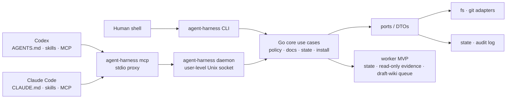
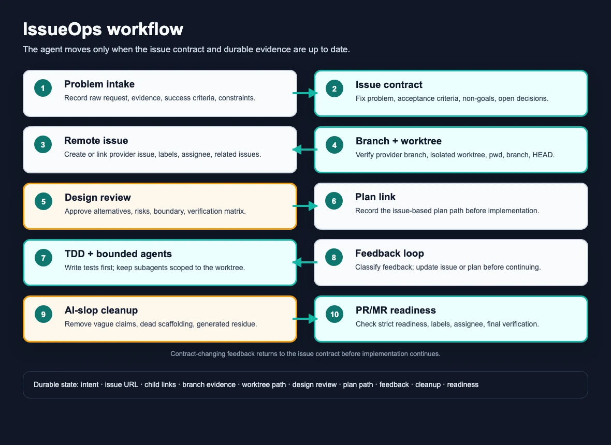

# agent-harness

<p align="center">
  <a href="#english">English</a> ·
  <a href="#한국어">한국어</a>
</p>

<p align="center">
  
</p>

<a id="english"></a>

## English

**agent-harness** is a local automation harness for AI coding agents. It gives Codex, Claude Code, MCP clients, and a human shell the same Go binary, the same command-policy rules, the same user-state store, and the same shared skill source tree.

The reusable behavior lives in a host-neutral Go core. Codex and Claude Code integrations are thin adapters: they install skills, hooks, and MCP wiring, then call the same core instead of reimplementing policy or state per host.

Many harnesses focus on making one agent code faster. agent-harness also focuses on making team work repeatable: it turns the author's working habits into an enforced workflow so issue context, decisions, plans, feedback, and verification evidence are shared in the same shape no matter which agent or host did the work.

The problem it addresses is not only agent capability. It addresses the coordination failures around capable agents: context trapped in private chats, ambiguous requests becoming code too early, plan changes disappearing from the issue, feedback losing its source of truth, and PR/MR reviews receiving work that cannot be traced back to the original decision. IDD defines the working contract; IssueOps makes that contract durable and enforceable.

Current status: early but functional MVP. The CLI, daemon-backed MCP proxy, native skill installer, project-doc tools, IssueOps state, command policy, read-only evidence runner, guard/verify-work gates, API-doc review gate, state checkpoints, worker MVP, self-verification, and self-augmentation surfaces exist. The worker remains state-first and policy-gated; it is not a general writable shell runner.

### What It Is For

Use agent-harness when you want to:

- run the same agent workflow from Codex, Claude Code, MCP, or a shell;
- enforce a common issue -> plan -> worktree -> feedback -> PR/MR workflow across a team;
- keep shared skills in `skills/` instead of copying host-specific versions;
- make decisions, constraints, rejected alternatives, and verification evidence easy for teammates to find;
- expose repository operating docs through a structured docs index;
- check shell commands against a shared policy before execution;
- store small agent checkpoints in user state rather than source files;
- verify and improve the harness itself with repeatable gates.

### First Commands

From a fresh clone:

```bash
./install.sh
```

After the binary exists:

```bash
go build -o bin/agent-harness ./cmd/harness
./bin/agent-harness version
./bin/agent-harness inspect --json
./bin/agent-harness docs --json
```

For ongoing refreshes from the current checkout:

```bash
agent-harness update
agent-harness bootstrap --sync
```

`update` and `bootstrap` rebuild from the current checkout and refresh user-level integrations. They do not run `git pull`.

### Command Pillars

| Pillar | Command | Purpose |
| --- | --- | --- |
| Install | `./install.sh`, then `agent-harness update` | Build the binary, install user-level Codex/Claude skills, hooks, MCP wiring, and PATH shim. |
| Project docs | `agent-harness project bootstrap --repo /path/to/repo --dry-run --json` | Plan AGENTS routing and `.agent-harness/` operating docs for a target repo. |
| IssueOps | `agent-harness issueops start --repo "$PWD" --branch "$(git branch --show-current)" --json` | Start durable state for issue -> plan -> worktree -> feedback -> PR/MR workflows. |
| Policy | `agent-harness policy check --workspace-root "$PWD" --cwd "$PWD" --json -- git status --short` | Decide whether a command is safe before execution. |
| Verification | `agent-harness self-verify --seed=100 --target-score=95 --json` | Run the quick harness quality gate before claiming the harness is healthy. |

### Core Surfaces

| Surface | Commands / files | What it does |
| --- | --- | --- |
| CLI health | `version`, `inspect`, `preflight`, `status`, `doctor`, `docs` | Inspect installation, repository state, docs, daemon, and health signals. |
| MCP backend | `mcp`, `daemon start/status/stop` | Run a stdio MCP proxy backed by a user-level daemon. |
| Command policy | `policy check`, `policy fake-run`, `policy run --read-only`, `policy audit` | Evaluate argv, workspace root, cwd, write/network intent, timeout, shell use, and audit metadata. |
| Project docs | `project bootstrap/docs/route-docs/record`, `project draft-wiki ...` | Bootstrap, index, route, record, stage, approve, reject, and promote project knowledge. |
| IssueOps | `issueops start/status/intent/link-issue/link-plan/feedback/pr-readiness` | Preserve issue-driven workflow evidence across sessions and hosts. |
| Quality gates | `guard check`, `verify-work`, `trace analyze`, `contract check`, `api-doc check` | Catch anti-patterns, evidence gaps, response-contract drift, trace issues, and API-doc drift. |
| State | `state write/read/list/prune/doctor/migrate` | Store small JSON checkpoints in user state. |
| Worker MVP | `worker enqueue/status/list/cancel`, `worker run --read-only`, `worker draft-wiki` | Record lifecycle jobs and run policy-gated read-only evidence commands. |
| Self-improvement | `self-verify`, `self-verify history/compare/promote/candidates`, `self-augment`, `self-augment lesson` | Run verification loops, compare/promote checkpoints, and record safe improvement candidates. |

### Architecture



Rules that matter:

1. Core behavior belongs in Go, not in Codex or Claude host glue.
2. CLI JSON, MCP responses, daemon responses, and host adapters must keep the same meaning.
3. Default installs write user-level host configuration only; target repos get files only through explicit project bootstrap or project-local opt-in.
4. Shared skills live in `skills/<name>/`; user-level Codex and Claude skill paths point back to that source.
5. Worker execution stays read-only and policy-gated until writable/background execution has explicit audit, timeout, cancellation, and redaction coverage.
6. agent-harness does not reimplement upstream tools such as LLM Wiki, CodeGraph, claude-mem, LazyCodex, or Headroom. It can install or wire them through opt-in paths.

### Repository Map

```text
cmd/harness/              Go binary entrypoint, CLI, MCP, daemon, hook, and gate surfaces
internal/core/            Host-neutral use cases and policy/state/docs behavior
internal/port/            Core-facing interfaces and DTOs
internal/adapter/         Host/install adapter contracts and tests
configs/codex/            Codex MCP and hook templates
configs/claude/           Claude MCP template
skills/                   Shared native skills used by Codex and Claude Code
.agent-harness/           Project operating docs, ADRs, cautions, testing rules
docs/                     Supporting project documents and assets
scripts/                  Installer, diagnostic, and smoke scripts
bin/agent-harness         Locally built binary
```

### Install Notes

`./install.sh` is the first-run entrypoint before `agent-harness` is on `PATH`. It computes the checkout root, builds `bin/agent-harness` when needed, and runs the installer. In a real terminal with no arguments, it opens the interactive installer.

```bash
./install.sh
./install.sh --dry-run --json
./bin/agent-harness install --interactive
./bin/agent-harness install --dry-run --json
```

The installer owns PATH and environment setup. Normal users should not export `HARNESS_ROOT`; the installer records it in Codex/Claude MCP config. `CODEX_HOME` is honored when already set and otherwise defaults to `~/.codex`.

Default user-level install updates:

- Codex skills: `~/.codex/skills/* -> <agent-harness>/skills/*`
- Claude skills: `~/.claude/skills/* -> <agent-harness>/skills/*`
- Codex MCP config and lifecycle hooks
- Claude user-scope MCP registration and lifecycle hooks
- PATH shim at `~/.local/bin/agent-harness` when selected

Default install does not create target-repo `.claude/skills`, `.claude/settings.json`, or `.mcp.json`. Use explicit project-local options only when a repo should own those files.

### Issue-Driven Development

Issue-Driven Development, or IDD, is the preferred collaboration model for this repository. It comes from the author's day-to-day way of working: do not let an agent jump from a vague request straight into edits; first turn the work into an inspectable issue contract, then make every later step prove that it still follows that contract.

<p align="center">
  
</p>

The workflow was created to solve recurring failures in agent-assisted development:

- context stayed inside a private chat, so teammates and future sessions could not see why a branch existed;
- agents started from ambiguous requests and implemented before the real problem, non-goals, and acceptance criteria were written down;
- plan changes, rejected alternatives, and review feedback were forgotten because they were not tied back to the issue;
- implementation happened in the wrong checkout, branch, or worktree because the execution context was not verified;
- PR/MR drafts reached review without a clear issue link, verification trail, cleanup pass, or explanation of changed decisions.

IDD fixes those failures by moving the work contract out of the conversation and into durable artifacts. The issue records the problem and acceptance criteria, the plan records the chosen approach and tradeoffs, IssueOps state records branch/worktree/feedback/readiness evidence, and the final PR/MR points back to that chain.

In this model, a private chat transcript is not the source of truth. The durable source of truth is the issue, the issue updates, the linked child or follow-up issues, the plan, and the verification evidence. A reviewer should be able to understand why the branch exists, what was accepted or rejected, which constraints changed, and what evidence supports the final PR/MR without reading the agent conversation.

That makes IDD a team workflow standard, not only a personal productivity trick. Each agent is forced to leave the same artifacts in the same places, so a teammate can join later, review the context, continue the work, or audit a decision without reverse-engineering a session transcript.

IssueOps is the harness implementation of that working style. The `skills/issueops/SKILL.md` file defines the advisory agent workflow, while `agent-harness issueops ...` stores durable state so Codex, Claude Code, MCP, and shell sessions can continue the same cycle after compaction, handoff, or host changes.

The intended loop is:

1. Capture the problem, evidence, acceptance criteria, non-goals, verification, open decisions, and related issues.
2. Link decisions when one depends on, blocks, supersedes, splits from, or follows another.
3. Create or link the remote issue before planning when credentials and project ownership are clear.
4. Prepare a provider-linked issue branch and isolated worktree, then verify `pwd`, branch, `HEAD`, and expected path before implementation.
5. Write the plan from the issue contract and record a design review with alternatives, risks, and verification.
6. Keep TDD, subagent work, and QA inside the isolated worktree.
7. Classify feedback as issue, plan, test, implementation, review, or follow-up evidence; update the issue when the contract changes.
8. Run AI-slop cleanup before PR/MR drafting so generated residue, vague claims, dead scaffolding, and unnecessary abstractions do not leak into review.
9. Draft the PR/MR only when issue links, plan links, worktree evidence, verification, cleanup, labels, assignment, and review notes are ready.

The split between the skill and the CLI is intentional:

| Layer | Role |
| --- | --- |
| `skills/issueops/SKILL.md` | Tells the agent how to run the work cycle: problem intake, domain grilling, issue contract, planning, TDD/subagents, cleanup, feedback, and PR/MR drafting. |
| `agent-harness issueops` | Persists the state record: intent, issue URL, child links, branch evidence, worktree path, design review, plan path, feedback, cleanup, readiness, and remote artifact checks. |
| Hooks | Surface reminders and enforce safety boundaries, but do not create issues, edit files, run tests, or open PRs/MRs by themselves. |

IssueOps is strict because the failure mode it prevents is expensive: an agent can otherwise implement in the wrong checkout, forget why a plan changed, skip updating the issue after review feedback, or draft a PR that has no inspectable link back to the original decision.

Minimal local IssueOps flow:

```bash
agent-harness issueops start --repo "$PWD" --branch "$ISSUE_BRANCH" --json
agent-harness issueops intent record --id "$ISSUEOPS_ID" \
  --raw-request "$RAW_USER_REQUEST" \
  --interpreted-intent "$INTERPRETED_INTENT" \
  --success-criteria "$SUCCESS_CRITERION" \
  --json
agent-harness issueops link-issue --id "$ISSUEOPS_ID" --issue-url "$ISSUE_URL" --json
agent-harness issueops branch prepare --id "$ISSUEOPS_ID" --provider github --issue-url "$ISSUE_URL" --branch "$ISSUE_BRANCH" --base-branch main --link-verified --json
agent-harness issueops link-worktree --id "$ISSUEOPS_ID" --worktree-path "$EXPECTED_WORKTREE" --json
agent-harness issueops design review --id "$ISSUEOPS_ID" --problem-summary "$PROBLEM" --proposed-design "$DESIGN" --verification "$VERIFY" --approved --json
agent-harness issueops link-plan --id "$ISSUEOPS_ID" --plan-path "$PLAN_PATH" --json
agent-harness issueops feedback add --id "$ISSUEOPS_ID" --source user --body "$FEEDBACK" --json
agent-harness issueops pr-readiness --id "$ISSUEOPS_ID" --strict --json
```

See [`docs/IDD_IMPLEMENTATION_NEEDS.md`](docs/IDD_IMPLEMENTATION_NEEDS.md) for remaining IDD gaps.

### Verification

For documentation-only changes, run at least:

```bash
find . -maxdepth 3 -type f | sort
find .agent-harness -maxdepth 1 -type f -name '*.md' | sort
go build -o bin/agent-harness ./cmd/harness
./bin/agent-harness docs --json
```

For Go changes, run:

```bash
go test ./... -count=1
go test -race ./... -count=1
go vet ./...
go build -o bin/agent-harness ./cmd/harness
```

For full harness confidence, use:

```bash
./bin/agent-harness self-verify --seed=100 --target-score=95 --json
./bin/agent-harness self-verify --full --iterations=10 --seed=100 --target-score=95 --progress=jsonl --json
```

### Project Docs

The most important operating documents are:

| Document | Role |
| --- | --- |
| `AGENTS.md` | Root agent rules and project decisions. |
| `CLAUDE.md` | Claude Code entrypoint and pointer to shared rules. |
| `.agent-harness/CONSTITUTION.md` | Instruction hierarchy and safety principles. |
| `.agent-harness/ARCHITECTURE.md` | System structure and boundaries. |
| `.agent-harness/CONVENTIONS.md` | Implementation and integration conventions. |
| `.agent-harness/TESTING.md` | Verification expectations. |
| `.agent-harness/OPERATIONS.md` | Install, CLI, MCP, and skill usage map. |
| `.agent-harness/ADR.md` | Decisions, rationale, and roadmap. |

Focused operation docs live under `.agent-harness/operations/`:

- `install.md`
- `hosts.md`
- `cli-and-mcp.md`
- `verification.md`
- `project-docs.md`

### License

MIT. See [`LICENSE`](LICENSE).

---

<a id="한국어"></a>

## 한국어

**agent-harness**는 AI 코딩 에이전트를 위한 로컬 자동화 하네스입니다. Codex, Claude Code, MCP client, 사람이 쓰는 shell이 같은 Go 바이너리, 같은 command-policy 규칙, 같은 user-state 저장소, 같은 shared skill 원본을 사용하게 만듭니다.

재사용 가능한 동작은 host-neutral Go core에 둡니다. Codex와 Claude Code 통합은 얇은 adapter입니다. skill, hook, MCP wiring을 설치하고 같은 core를 호출할 뿐, host마다 policy나 state를 다시 구현하지 않습니다.

많은 하네스는 한 에이전트가 코드를 더 빨리 쓰게 하는 데 집중합니다. agent-harness는 거기에 더해 팀 작업의 반복 가능성을 목표로 합니다. 작성자의 작업 습관을 강제 가능한 workflow로 정리해 issue 맥락, 결정, plan, feedback, verification evidence가 어떤 agent나 host에서 수행됐든 같은 형태로 공유되게 합니다.

해결하려는 문제는 agent의 코딩 능력만이 아닙니다. 능력 있는 agent 주변에서 생기는 협업 실패를 다룹니다. 맥락이 private chat에 갇히고, 모호한 요청이 너무 빨리 코드가 되고, plan 변경이 issue에 남지 않고, feedback의 source of truth가 사라지고, 원래 결정과 추적되지 않는 PR/MR이 review로 넘어가는 문제입니다. IDD는 작업 contract를 정의하고, IssueOps는 그 contract를 durable하고 강제 가능한 상태로 만듭니다.

현재 상태: 초기이지만 동작 가능한 MVP입니다. CLI, daemon-backed MCP proxy, native skill installer, project-doc tooling, IssueOps state, command policy, read-only evidence runner, guard/verify-work gate, API-doc review gate, state checkpoint, worker MVP, self-verification, self-augmentation 표면이 있습니다. worker는 아직 state-first 및 policy-gated입니다. 범용 writable shell runner가 아닙니다.

### 무엇을 해결하나

agent-harness는 다음 상황을 위해 존재합니다.

- Codex, Claude Code, MCP, shell에서 같은 agent workflow를 실행하고 싶을 때
- 팀 전체에 공통 issue -> plan -> worktree -> feedback -> PR/MR workflow를 강제하고 싶을 때
- shared skill을 host별로 복사하지 않고 `skills/` 하나를 원본으로 쓰고 싶을 때
- 결정, constraint, 기각한 대안, verification evidence를 팀원이 쉽게 찾게 만들고 싶을 때
- repo 운영 문서를 agent가 구조적으로 읽게 하고 싶을 때
- agent가 shell command를 실행하기 전에 공통 policy로 먼저 판단하게 하고 싶을 때
- 작은 agent checkpoint를 source file이 아니라 user state에 저장하고 싶을 때
- 하네스 자체를 반복 가능한 gate로 검증하고 개선하고 싶을 때

### 처음 실행할 명령

fresh clone에서는:

```bash
./install.sh
```

binary가 있으면:

```bash
go build -o bin/agent-harness ./cmd/harness
./bin/agent-harness version
./bin/agent-harness inspect --json
./bin/agent-harness docs --json
```

현재 checkout 기준으로 갱신할 때:

```bash
agent-harness update
agent-harness bootstrap --sync
```

`update`와 `bootstrap`은 현재 checkout에서 다시 build하고 user-level integration을 갱신합니다. `git pull`은 실행하지 않습니다.

### 핵심 명령

| 영역 | 명령 | 용도 |
| --- | --- | --- |
| 설치 | `./install.sh`, 이후 `agent-harness update` | binary build, user-level Codex/Claude skill, hook, MCP wiring, PATH shim 설치. |
| 프로젝트 문서 | `agent-harness project bootstrap --repo /path/to/repo --dry-run --json` | 대상 repo의 AGENTS routing과 `.agent-harness/` 운영 문서 계획. |
| IssueOps | `agent-harness issueops start --repo "$PWD" --branch "$(git branch --show-current)" --json` | issue -> plan -> worktree -> feedback -> PR/MR workflow state 시작. |
| Policy | `agent-harness policy check --workspace-root "$PWD" --cwd "$PWD" --json -- git status --short` | 명령 실행 전에 안전성 판단. |
| Verification | `agent-harness self-verify --seed=100 --target-score=95 --json` | 하네스 health를 주장하기 전 quick 품질 gate 실행. |

### 주요 표면

| 표면 | 명령 / 파일 | 역할 |
| --- | --- | --- |
| CLI health | `version`, `inspect`, `preflight`, `status`, `doctor`, `docs` | 설치, repo state, docs, daemon, health signal 점검. |
| MCP backend | `mcp`, `daemon start/status/stop` | user-level daemon 뒤의 stdio MCP proxy 실행. |
| Command policy | `policy check`, `policy fake-run`, `policy run --read-only`, `policy audit` | argv, workspace root, cwd, write/network intent, timeout, shell use, audit metadata 평가. |
| Project docs | `project bootstrap/docs/route-docs/record`, `project draft-wiki ...` | 운영 지식 bootstrap, index, route, record, stage, approve, reject, promote. |
| IssueOps | `issueops start/status/intent/link-issue/link-plan/feedback/pr-readiness` | issue-driven workflow evidence를 session과 host를 넘어 보존. |
| Quality gates | `guard check`, `verify-work`, `trace analyze`, `contract check`, `api-doc check` | anti-pattern, evidence gap, response-contract drift, trace issue, API-doc drift 검사. |
| State | `state write/read/list/prune/doctor/migrate` | 작은 JSON checkpoint를 user state에 저장. |
| Worker MVP | `worker enqueue/status/list/cancel`, `worker run --read-only`, `worker draft-wiki` | lifecycle job 기록과 policy-gated read-only evidence command 실행. |
| Self-improvement | `self-verify`, `self-verify history/compare/promote/candidates`, `self-augment`, `self-augment lesson` | 검증 loop, checkpoint 비교/승격, 안전한 개선 후보 기록. |

### 아키텍처


중요한 규칙:

1. 핵심 동작은 Codex/Claude glue가 아니라 Go core에 둡니다.
2. CLI JSON, MCP response, daemon response, host adapter는 같은 의미를 유지해야 합니다.
3. 기본 설치는 user-level host 설정만 씁니다. 대상 repo 파일은 명시적 project bootstrap 또는 project-local opt-in에서만 생성합니다.
4. shared skill 원본은 `skills/<name>/`이고, user-level Codex/Claude skill 경로는 이 원본을 가리킵니다.
5. worker 실행은 writable/background execution에 필요한 audit, timeout, cancellation, redaction 경계가 생기기 전까지 read-only 및 policy-gated로 유지합니다.
6. agent-harness는 LLM Wiki, CodeGraph, claude-mem, LazyCodex, Headroom 같은 upstream 도구를 재구현하지 않습니다. 필요한 경우 opt-in 경로로 설치하거나 연결합니다.

### 저장소 구조

```text
cmd/harness/              Go binary entrypoint, CLI, MCP, daemon, hook, gate 표면
internal/core/            host-neutral usecase와 policy/state/docs 동작
internal/port/            core-facing interface와 DTO
internal/adapter/         host/install adapter contract와 test
configs/codex/            Codex MCP와 hook template
configs/claude/           Claude MCP template
skills/                   Codex와 Claude Code가 공유하는 native skill 원본
.agent-harness/           project operating docs, ADR, caution, testing rule
docs/                     보조 문서와 asset
scripts/                  installer, diagnostic, smoke script
bin/agent-harness         local build binary
```

### 설치 메모

`./install.sh`는 `agent-harness`가 아직 `PATH`에 없을 때 쓰는 첫 실행 entrypoint입니다. checkout root를 계산하고 필요하면 `bin/agent-harness`를 build한 뒤 installer를 실행합니다. 실제 terminal에서 인자 없이 실행하면 interactive installer가 열립니다.

```bash
./install.sh
./install.sh --dry-run --json
./bin/agent-harness install --interactive
./bin/agent-harness install --dry-run --json
```

installer가 PATH와 환경 설정을 소유합니다. 일반 사용자는 `HARNESS_ROOT`를 직접 export하지 않습니다. installer가 Codex/Claude MCP config에 기록합니다. `CODEX_HOME`은 이미 있으면 존중하고 없으면 `~/.codex`를 사용합니다.

기본 user-level install은 다음을 갱신합니다.

- Codex skills: `~/.codex/skills/* -> <agent-harness>/skills/*`
- Claude skills: `~/.claude/skills/* -> <agent-harness>/skills/*`
- Codex MCP config와 lifecycle hook
- Claude user-scope MCP registration과 lifecycle hook
- 선택한 경우 `~/.local/bin/agent-harness` PATH shim

기본 설치는 대상 repo의 `.claude/skills`, `.claude/settings.json`, `.mcp.json`을 만들지 않습니다. repo가 이 파일을 소유해야 할 때만 명시적 project-local option을 사용합니다.

### Issue-Driven Development

Issue-Driven Development, 즉 IDD는 이 저장소의 권장 협업 모델입니다. 이 모델은 작성자의 실제 작업 방식을 정리한 것입니다. 에이전트가 모호한 요청에서 곧바로 파일을 고치지 않고, 먼저 작업을 검토 가능한 issue contract로 바꾼 뒤 이후 모든 단계가 그 contract를 계속 따르는지 증명하게 만드는 방식입니다.

<p align="center">
  
</p>

이 workflow는 agent-assisted development에서 반복해서 생기는 문제를 해결하기 위해 만들었습니다.

- 맥락이 private chat 안에만 남아 팀원이나 다음 session이 branch가 왜 생겼는지 알기 어렵습니다.
- agent가 모호한 요청에서 시작해 실제 문제, non-goal, acceptance criteria를 쓰기 전에 구현부터 합니다.
- plan 변경, 기각한 대안, review feedback이 issue와 다시 연결되지 않아 나중에 이유를 잊습니다.
- 실행 위치를 검증하지 않아 잘못된 checkout, branch, worktree에서 구현할 수 있습니다.
- PR/MR이 issue link, verification trail, cleanup pass, 변경된 결정 설명 없이 review로 넘어갑니다.

IDD는 작업 contract를 대화 밖의 durable artifact로 옮겨 이 문제를 해결합니다. issue는 문제와 acceptance criteria를 기록하고, plan은 선택한 접근과 tradeoff를 기록하며, IssueOps state는 branch/worktree/feedback/readiness evidence를 보존합니다. 최종 PR/MR은 이 흐름으로 다시 연결됩니다.

이 모델에서 private chat transcript는 source of truth가 아닙니다. durable source of truth는 issue, issue update, linked child/follow-up issue, plan, verification evidence입니다. 리뷰어는 agent 대화를 읽지 않아도 branch가 왜 생겼는지, 어떤 선택이 승인/기각됐는지, 어떤 constraint가 바뀌었는지, 최종 PR/MR이 어떤 근거를 갖는지 이해할 수 있어야 합니다.

그래서 IDD는 개인 생산성 기법이 아니라 팀 workflow 표준입니다. 모든 agent가 같은 위치에 같은 형태의 산출물을 남기도록 강제하므로, 다른 팀원이 나중에 합류해도 session transcript를 역추적하지 않고 맥락을 읽고, 작업을 이어가고, 결정을 검토할 수 있습니다.

IssueOps는 이 작업 방식을 하네스에 구현한 것입니다. `skills/issueops/SKILL.md`는 agent가 따라야 할 advisory workflow를 정의하고, `agent-harness issueops ...`는 durable state를 저장합니다. 그래서 Codex, Claude Code, MCP, shell session이 compaction, handoff, host 변경 뒤에도 같은 cycle을 이어갈 수 있습니다.

의도한 loop는 다음과 같습니다.

1. 문제, 근거, acceptance criteria, non-goal, 검증, 열린 결정, 관련 issue를 기록합니다.
2. 어떤 결정이 다른 결정을 의존, 차단, 대체, 분리, 후속 처리하는지 연결합니다.
3. credentials와 project ownership이 명확하면 planning 전에 remote issue를 만들거나 연결합니다.
4. provider-linked issue branch와 isolated worktree를 준비하고, 구현 전에 `pwd`, branch, `HEAD`, expected path를 확인합니다.
5. issue contract에서 plan을 만들고 alternatives, risk, verification을 포함한 design review를 기록합니다.
6. TDD, subagent 작업, QA는 isolated worktree 안에서만 수행합니다.
7. feedback을 issue, plan, test, implementation, review, follow-up evidence로 분류하고, contract가 바뀌면 issue를 갱신합니다.
8. PR/MR 작성 전에 AI-slop cleanup을 수행해 generated residue, 모호한 주장, dead scaffolding, 불필요한 abstraction이 review로 넘어가지 않게 합니다.
9. issue link, plan link, worktree evidence, verification, cleanup, label, assignee, review note가 준비된 뒤 PR/MR을 작성합니다.

skill과 CLI를 나눈 이유는 명확합니다.

| 계층 | 역할 |
| --- | --- |
| `skills/issueops/SKILL.md` | problem intake, domain grilling, issue contract, planning, TDD/subagents, cleanup, feedback, PR/MR drafting을 agent가 어떻게 수행할지 정의합니다. |
| `agent-harness issueops` | intent, issue URL, child link, branch evidence, worktree path, design review, plan path, feedback, cleanup, readiness, remote artifact check를 state record로 보존합니다. |
| Hooks | reminder와 safety boundary를 제공합니다. Hook 자체가 issue를 만들거나, 파일을 고치거나, 테스트를 실행하거나, PR/MR을 열지는 않습니다. |

IssueOps가 엄격한 이유는 막으려는 실패가 비용이 크기 때문입니다. 에이전트가 잘못된 checkout에서 구현하거나, plan 변경 이유를 잊거나, review feedback 이후 issue를 갱신하지 않거나, 원래 결정과 연결되지 않은 PR을 작성하는 일을 막기 위한 장치입니다.

최소 local IssueOps 흐름:

```bash
agent-harness issueops start --repo "$PWD" --branch "$ISSUE_BRANCH" --json
agent-harness issueops intent record --id "$ISSUEOPS_ID" \
  --raw-request "$RAW_USER_REQUEST" \
  --interpreted-intent "$INTERPRETED_INTENT" \
  --success-criteria "$SUCCESS_CRITERION" \
  --json
agent-harness issueops link-issue --id "$ISSUEOPS_ID" --issue-url "$ISSUE_URL" --json
agent-harness issueops branch prepare --id "$ISSUEOPS_ID" --provider github --issue-url "$ISSUE_URL" --branch "$ISSUE_BRANCH" --base-branch main --link-verified --json
agent-harness issueops link-worktree --id "$ISSUEOPS_ID" --worktree-path "$EXPECTED_WORKTREE" --json
agent-harness issueops design review --id "$ISSUEOPS_ID" --problem-summary "$PROBLEM" --proposed-design "$DESIGN" --verification "$VERIFY" --approved --json
agent-harness issueops link-plan --id "$ISSUEOPS_ID" --plan-path "$PLAN_PATH" --json
agent-harness issueops feedback add --id "$ISSUEOPS_ID" --source user --body "$FEEDBACK" --json
agent-harness issueops pr-readiness --id "$ISSUEOPS_ID" --strict --json
```

남은 IDD gap은 [`docs/IDD_IMPLEMENTATION_NEEDS.md`](docs/IDD_IMPLEMENTATION_NEEDS.md)에 있습니다.

### 검증

문서만 바꿨을 때 최소 검증:

```bash
find . -maxdepth 3 -type f | sort
find .agent-harness -maxdepth 1 -type f -name '*.md' | sort
go build -o bin/agent-harness ./cmd/harness
./bin/agent-harness docs --json
```

Go 변경 검증:

```bash
go test ./... -count=1
go test -race ./... -count=1
go vet ./...
go build -o bin/agent-harness ./cmd/harness
```

하네스 전체 신뢰도 확인:

```bash
./bin/agent-harness self-verify --seed=100 --target-score=95 --json
./bin/agent-harness self-verify --full --iterations=10 --seed=100 --target-score=95 --progress=jsonl --json
```

### 프로젝트 문서

중요한 운영 문서:

| 문서 | 역할 |
| --- | --- |
| `AGENTS.md` | root agent rule과 project decision. |
| `CLAUDE.md` | Claude Code entrypoint와 shared rule pointer. |
| `.agent-harness/CONSTITUTION.md` | instruction hierarchy와 safety principle. |
| `.agent-harness/ARCHITECTURE.md` | system structure와 boundary. |
| `.agent-harness/CONVENTIONS.md` | implementation/integration convention. |
| `.agent-harness/TESTING.md` | verification expectation. |
| `.agent-harness/OPERATIONS.md` | install, CLI, MCP, skill usage map. |
| `.agent-harness/ADR.md` | decision, rationale, roadmap. |

세부 운영 문서는 `.agent-harness/operations/` 아래에 있습니다.

- `install.md`
- `hosts.md`
- `cli-and-mcp.md`
- `verification.md`
- `project-docs.md`

### 라이선스

MIT. [`LICENSE`](LICENSE)를 확인하세요.
