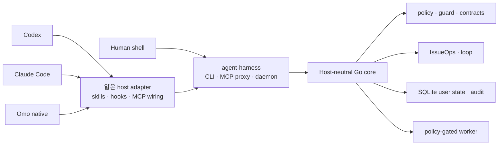

# agent-harness

<p align="center">
  <a href="README.en.md">English</a>
</p>

<p align="center">
  
</p>

**agent-harness**는 Codex, Claude Code, Omo native, 그리고 사람의 셸을 하나의 로컬 실행 계약으로 연결합니다. 모든 호스트는 같은 Go 코어, CLI/MCP 계약, 명령 정책, 사용자 상태 저장소, 스킬 원본을 사용합니다.

호스트를 대체하거나 작업을 자동 승인하지 않습니다. 작업 상태, 실행 경계, 검증 근거를 호스트 외부에 유지해 세션이 바뀌어도 동일한 규칙을 적용합니다.

## 왜 필요한가

에이전트의 코딩 능력만으로는 팀 작업을 재현 가능하게 만들기 어렵습니다. 맥락이 대화에 갇히고, 모호한 요청이 곧바로 구현으로 이어지며, 계획 변경과 피드백이 이슈에서 사라지고, 검증 근거 없는 PR/MR이 만들어질 수 있습니다.

agent-harness는 다음 공통 구성요소로 이 문제를 다룹니다.

- host-neutral Go core와 얇은 host adapter
- CLI와 daemon-backed MCP가 공유하는 response contract
- issue, plan, worktree, feedback, 검증 근거를 잇는 IssueOps state
- 실행 전 command policy와 변경 후 quality gate
- repo source와 분리된 SQLite user state
- `skills/` 하나를 원본으로 사용하는 native skill 설치

## 빠른 시작

새로 복제한 저장소에 처음 설치할 때:

```bash
./install.sh
./bin/agent-harness inspect --json
./bin/agent-harness doctor --repo . --json
```

설치기는 로컬 바이너리를 빌드하고 사용자 수준의 호스트 통합을 갱신합니다. 대상 저장소에는 명시적으로 요청하지 않은 호스트 설정을 만들지 않습니다. 설치 후 `ah`를 찾지 못하면 새 셸을 열거나 셸의 명령 캐시를 갱신하세요.

하네스의 품질 게이트를 확인하려면:

```bash
./bin/agent-harness self-verify \
  --seed=100 \
  --target-score=95 \
  --llm-eval=false \
  --json
```

현재 체크아웃의 코드와 설정으로 설치를 갱신할 때:

```bash
git pull --ff-only
ah update
ah inspect --json
```

`agent-harness`가 정식 명령이며 `ah`는 설치기가 관리하는 짧은 심볼릭 링크입니다. 기존 `ah` 파일이나 다른 심볼릭 링크가 있으면 덮어쓰지 않고 설치에 실패합니다. `ah update`는 현재 체크아웃의 코드를 빌드하고 사용자 수준 통합을 갱신하지만 `git pull`은 실행하지 않습니다.

## Host 통합

기본 설치기는 세 가지 공식 호스트 어댑터를 같은 실행 계약에 연결합니다.

| 호스트 | 기본 사용자 수준 통합 |
| --- | --- |
| Codex | `~/.codex/skills/`, MCP config, lifecycle hooks |
| Claude Code | `~/.claude/skills/`, user-scope MCP, lifecycle hooks |
| Omo native | `~/.omo/agent/skills/`, `~/.omo/mcp.json`, lifecycle extension |

기본 설치는 대상 저장소에 호스트 설정을 만들지 않습니다. 저장소 로컬 스킬, hook, MCP 파일은 프로젝트 로컬 옵트인을 명시한 경우에만 생성합니다.

## 아키텍처



다음 경계를 유지합니다.

1. 핵심 동작은 host plugin이나 hook이 아니라 Go core에 둡니다.
2. CLI JSON, MCP response, daemon response는 같은 의미를 유지합니다.
3. host adapter는 인증, command policy, workspace 경계를 우회하지 않습니다.
4. hooks는 context와 deterministic guard를 제공하지만 issue/PR 생성, 파일 편집, 테스트 실행을 대신하지 않습니다.
5. worker는 lifecycle job과 policy-gated read-only evidence command를 다루며 범용 writable shell runner가 아닙니다.

## 주요 명령 영역

| 영역 | 대표 명령 | 역할 |
| --- | --- | --- |
| 설치와 갱신 | `install`, `update`, `bootstrap` | binary, skills, hooks, MCP wiring 갱신 |
| 상태 진단 | `inspect`, `status`, `doctor`, `docs` | 설치, daemon, state, project docs 상태 확인 |
| 안전과 품질 | `policy`, `guard`, `quality`, `verify-work`, `trace`, `contract`, `api-doc` | 실행 정책, 변경 품질, evidence와 public contract 검사 |
| 작업 흐름 | `issueops`, `loop` | durable workflow와 verify-until-done 계약 관리 |
| 상태와 실행 | `state`, `daemon`, `mcp`, `worker` | user state, MCP backend, 제한된 local job 관리 |
| 개선과 조사 | `self-verify`, `self-augment`, `web-fetch` | 하네스 검증, 개선 후보 탐색, 실패에 대응하는 공개 웹 조회 |

전체 명령과 MCP 도구 계약은 빌드된 바이너리에서 확인할 수 있습니다.

현재 체크아웃의 response contract 스키마에는 최상위 CLI 명령 27개와 MCP 도구 44개가 정의되어 있습니다.

```bash
agent-harness --help
agent-harness contract schema --json
agent-harness contract check --json
```

## 현재 검증 상태

다음은 이 체크아웃에서 검증한 결과입니다. README에서 별도로 산정한 점수가 아니라 현재 바이너리의 contract와 quality projection입니다.

| 검증 축 | 현재 상태 |
| --- | --- |
| public contract | CLI command 27개, MCP tool 44개 |
| pioneer skill coverage | benchmark 12/12, reproduction 12/12 |
| fresh-context evaluation | 36 cases, 24 executions, 34 pass, 2 capability-blocked, 0 fail |
| deterministic benchmark | 18 fixtures, 평균/최저 100, critical failure 0 |
| release gate | full test, full race, vet, build, contract, self-verify 통과 |

두 사례는 Boehm 검증에 필요한 `Kordoc document surface`와 원본 문서가 없어 `capability-blocked`로 남겼습니다. 재현 fixture는 hidden holdout으로 집계하지 않았습니다.

현재 값을 다시 확인할 때:

```bash
agent-harness contract schema --json
agent-harness quality inspect --json
agent-harness issueops benchmark run \
  --fixtures testdata/issueops/fixtures \
  --json
```

`quality inspect`의 `collection_status`, `health_status`, `gate_status`는 각각 수집 성공 여부, 관찰된 상태, 차단 여부를 나타냅니다. 수집 실패는 `gate=block`으로 처리하고, low coverage처럼 차단하지 않는 부채는 `report_only`로 남깁니다.

## IssueOps

IssueOps는 대화 속 작업 맥락을 issue, plan, worktree, feedback, verification evidence로 기록해 세션이나 호스트가 바뀌어도 동일한 작업 계약을 유지합니다.

정식 단계는 다음 순서입니다.

```text
problem → grill → plan → compatibility-review → implement
        → ai-slop-clean → feedback → pr → done
```

`remote issue`, `branch/worktree`, `design review`, `Brooks devil's-advocate review`, `plan link`, `execution decision`은 각 단계에 필요한 durable evidence와 gate로 기록합니다. Hook은 누락된 경계를 알리거나 deterministic violation을 차단하지만 워크플로 동작을 대신 실행하지 않습니다.

원격 issue 생성은 기본적으로 dry-run입니다. `--confirm` 경로는 provider 호출 전에 project authority, request digest, operation marker를 durable intent로 저장합니다. 호출 결과가 불확실하면 자동 재시도를 막고 `reconcile-issue`에서 같은 project의 단일 live candidate만 연결합니다.

시작과 상태 확인:

```bash
agent-harness issueops start \
  --repo "$PWD" \
  --branch "123-short-description" \
  --json

agent-harness issueops status --id "<start 출력의 id>" --json
```

`create-issue`는 `--confirm`이 없으면 preview만 출력하고 intent를 만들지 않습니다. `reconcile-issue`는 확인된 원격 호출의 결과가 불명확해 durable intent가 남은 경우에만 사용하며, candidate 연결은 별도의 `--confirm`이 필요합니다. 세부 명령과 provider별 제약은 [IssueOps provider 가이드](.agent-harness/operations/guides/issueops-providers.md)에 정의되어 있습니다.

cycle과 remote artifact의 세부 규칙은 [`skills/issueops/SKILL.md`](skills/issueops/SKILL.md)와 [운영 문서](.agent-harness/OPERATIONS.md)에 정의되어 있습니다.

## 스킬

공용 스킬의 원본은 [`skills/`](skills/)입니다. 설치기는 각 호스트의 사용자 수준 스킬 경로가 이 디렉터리를 참조하도록 구성합니다.

- 계획과 비판: `von-neumann`, `boehm`, `brooks`, `karpathy`
- 실행과 검증: `turing`, `hopper`, `dijkstra`, `codd`, `shannon`
- 조사와 팀 기억: `berners-lee`, `engelbart`
- Git과 작업 운영: `torvalds`, `atomic-commit-push`, `issueops`, `self-verify`, `self-augment`

각 스킬의 사용 계약은 해당 `SKILL.md`에 정의되어 있습니다.

12개 pioneer skill은 primary, boundary, operational case로 나눠 검증합니다. committed case는 재현 입력이고 정답 fixture가 아닙니다. 실행 receipt, case hash, semantic verdict는 [`testdata/pioneer-holdouts/`](testdata/pioneer-holdouts/)에서 확인할 수 있습니다.

## 안전 경계

- 기본 설치는 사용자 수준 호스트 설정만 갱신합니다. 대상 저장소는 명시적 bootstrap이나 project-local opt-in을 사용한 경우에만 변경됩니다.
- 명령 실행은 workspace root와 cwd를 제한하고, write/network/shell intent, timeout, redaction을 정책으로 관리합니다.
- MCP tool argument는 공개 schema에 대해 unknown field와 missing/wrong-type field를 거부합니다.
- executable shell fence는 셸을 실행하지 않고 syntax, failure swallowing, destructive command, dynamic shell, symlink 우회를 검사합니다.
- secret 원문은 문서, 상태 응답, audit log, test fixture에 남기지 않습니다.
- 외부 도구는 native install, update, readiness, self-verification의 dependency가 아닙니다.
- Orca supervised execution 같은 연동은 선택적 adapter이며 IssueOps가 계속 durable authority를 가집니다.
- GitOps kubectl guard를 활성화하면 direct mutating cluster command를 차단하고 live access에 host별 명시적 승인을 요구합니다.

## 저장소 구조

```text
cmd/harness/          composition root와 CLI/MCP/daemon/hook 진입점
internal/contract/    transport와 저장소가 공유하는 versioned DTO
internal/domain/      I/O를 모르는 순수 규칙, reducer, classifier
internal/application/ domain과 port를 조합하는 use case
internal/port/        외부 capability interface와 error contract
internal/adapter/     host, filesystem, process, DB 등 boundary 구현
internal/architecture/ production import graph fitness test
configs/              Codex, Claude Code, Omo native 설정 template
skills/               모든 host가 공유하는 skill 원본
.agent-harness/       architecture, operations, testing, ADR 등 project docs
scripts/              install, release, smoke, validation script
docs/                 보조 문서와 asset
```

## 릴리스와 롤백

현재는 tarball/manual archive를 우선하며, Homebrew 배포는 release gate 검증이 끝날 때까지 보류합니다. release 검증은 로컬 build artifact를 갱신하고 rollback은 checkout과 설치 상태를 변경하므로, 실행 전 [release reproducibility와 rollback 기준](.agent-harness/operations/release-reproducibility.md)을 확인하세요. README는 destructive rollback 명령을 제공하지 않습니다.

## 검증

README를 변경한 뒤 빠르게 확인하려면:

```bash
./bin/agent-harness contract check --json
./bin/agent-harness docs --json
./bin/agent-harness quality inspect --json
python3 scripts/verify-skill-shell.py skills/
git diff --check
```

Go 코드나 public contract를 변경한 경우:

```bash
go test ./... -count=1
go test -race ./... -count=1
go build -o bin/agent-harness ./cmd/harness
```

변경 종류별 기준은 [`.agent-harness/TESTING.md`](.agent-harness/TESTING.md)를 따릅니다.

## 프로젝트 문서

| 문서 | 용도 |
| --- | --- |
| [`AGENTS.md`](AGENTS.md) | 저장소 작업 규칙과 검증 우선순위 |
| [`.agent-harness/CONSTITUTION.md`](.agent-harness/CONSTITUTION.md) | instruction hierarchy와 안전 원칙 |
| [`.agent-harness/ARCHITECTURE.md`](.agent-harness/ARCHITECTURE.md) | component 경계와 책임 |
| [`.agent-harness/OPERATIONS.md`](.agent-harness/OPERATIONS.md) | 설치, host, CLI/MCP, runtime 운영 map |
| [`.agent-harness/TESTING.md`](.agent-harness/TESTING.md) | 테스트와 verification gate |
| [`.agent-harness/operations/quality-dashboard.md`](.agent-harness/operations/quality-dashboard.md) | quality projection과 pioneer evidence 해석 |
| [`.agent-harness/ADR.md`](.agent-harness/ADR.md) | 구조적 결정, 근거, 기각한 대안 |

설치와 운영 절차는 [install](.agent-harness/operations/install.md), [hosts](.agent-harness/operations/hosts.md), [CLI/MCP](.agent-harness/operations/cli-and-mcp.md), [verification](.agent-harness/operations/verification.md) 문서로 나뉘어 있습니다.

## 라이선스

MIT. [`LICENSE`](LICENSE)를 확인하세요.
