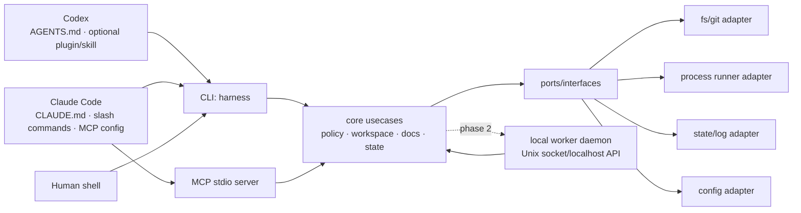

# agent-harness 아키텍처

이 문서는 에이전트가 변경 영향을 빠르게 판단하기 위한 문서다. 현재 저장소는 Go CLI/MCP 기반 MVP가 구현된 상태이며, 아래 구조는 구현 계획의 source of truth다.

---

## 1. 핵심 판단: plugin-only가 아니라 외부 하네스 코어

| 선택지 | 장점 | 단점 | 판단 |
|--------|------|------|------|
| Codex plugin/skill 중심 | Codex 경험에 깊게 통합 가능, 설치 UX가 좋음 | Claude Code와 공유가 어렵고, plugin API 변화에 core가 종속됨 | 단독 core로 부적절 |
| Claude Code command/hook 중심 | Claude 사용성이 좋고 MCP와 맞음 | Codex에서 같은 동작을 재사용하기 어렵고, hook에 정책이 흩어짐 | 단독 core로 부적절 |
| 외부 CLI/MCP/worker 중심 | 양쪽 host에서 같은 binary와 schema를 호출, 테스트 가능, 상태 관리 일관 | 초기 설치/IPC/보안 설계 필요 | **채택** |
| Hybrid | 외부 core + host별 얇은 래퍼 | adapter 관리 비용이 있음 | **최종 구조** |

결론: **Go로 작성한 외부 하네스 코어를 만들고, Codex plugin과 Claude Code 설정은 core를 호출하는 얇은 adapter로 둔다.**

---

## 2. Target Architecture

Mermaid는 보조 자료다. 규칙·경계·검증 명령은 아래 텍스트를 우선한다.

---

## 3. 실행 모드

| 모드 | 도입 단계 | 용도 | 원칙 |
|------|----------|------|------|
| `harness` CLI one-shot | 구현됨 | 모든 host에서 공통으로 호출 가능한 최소 표면 | `bin/harness inspect/preflight/docs/policy/state/self-augment` 사용 |
| `harness mcp` stdio server | 구현됨 | Claude Code 및 MCP-capable host에서 tool로 사용 | `harness_inspect`, `atomic_commit_preflight`, `commit_policy`, `skill_manifest`, `docs_index`, `command_policy_*`, `state_*`, `self_augment`, `self_augment_history`, `self_augment_compare`, `self_augment_promote` 제공 |
| `harness worker` local daemon | Phase 4 | 장기 작업, cross-turn state, concurrent job, file watch | socket 권한, stale lock, audit log, shutdown 검증 후 도입 |
| Codex plugin/skill | Phase 5 | Codex에서 설치·명령·문서 UX 개선 | core 로직 금지, CLI/MCP 호출 래퍼만 허용 |
| Claude commands/hooks | Phase 6 | Claude Code UX 개선 | core 정책 우회 금지 |

---

## 4. Planned package boundaries

| 경로 | 책임 | 금지/주의 |
|------|------|----------|
| `cmd/harness` | binary entrypoint, CLI flag 처리, MCP JSON-RPC mapping, self-augment orchestration | host별 정책 복제 금지 |
| `internal/core` | host-neutral core usecase. 현재 inspect, preflight, docs index, state store, command policy/fake runner 구현 | host-specific API 의존 금지 |
| `internal/port` | core interface, DTO, error contract | adapter concrete type 의존 금지 |
| `internal/adapter/cli` | flag parsing, stdout/stderr, exit code mapping | core 정책 복제 금지 |
| `internal/adapter/mcp` | MCP tool schema, stdio server, JSON-RPC mapping | CLI와 다른 의미의 schema 금지 |
| `internal/adapter/worker` | local IPC, job lifecycle, daemon state | shell policy 우회 금지 |
| `internal/adapter/fs` | filesystem, git, process runner | workspace boundary 검증 필요 |
| `configs/codex` | Codex plugin/skill 템플릿 | core 로직 금지 |
| `configs/claude` | Claude Code MCP/slash/hook 템플릿 | core 로직 금지 |
| `skills` | Codex/Claude 공용 skill source of truth | host별 복사본을 만들어 drift 유발 금지 |
| `.mcp.json` | Claude Code project MCP server 설정 | 로컬 절대경로 drift 시 `scripts/install-native.sh` 재실행 |
| `scripts/install-native.sh` | native skill/MCP 설치 및 갱신 | 기존 non-symlink skill을 덮어쓰지 않음 |

---

## 5. Docs / state / config / logs

현재 `harness docs`는 에이전트가 읽어야 할 markdown source of truth를 index로 노출한다.

- 대상: `AGENTS.md`, `CLAUDE.md`, `agent_docs/*.md`
- 필드: relative path, absolute path, title, headings, byte size
- 제공 표면: CLI `docs --json`, MCP `docs_index`, resource `harness://docs`

현재 `harness state`는 작은 에이전트 체크포인트를 JSON 파일로 저장한다.

- 기본 위치: `~/.local/state/agent-harness/`
- override: `HARNESS_STATE_DIR`
- 파일: `<key>.json`
- key 제한: `[A-Za-z0-9._-]`, 최대 128자, `/`, `\`, `..` 금지
- schema: current `schema_version=1`; version이 없는 legacy record는 read-compatible하고 `state migrate`로 승격한다.
- 제공 표면: CLI `state write/read/list/prune/doctor/migrate`, MCP `state_write/state_read/state_list/state_prune/state_doctor/state_migrate`, resource `harness://state`
- cleanup: `state prune --max-age DURATION`은 기본 dry-run이고, 실제 삭제에는 `--confirm`이 필요하다.
- integrity: `state doctor`는 checkpoint 파일을 수정하지 않고 invalid JSON, key mismatch, byte count drift, timestamp 오류를 보고한다.
- migration: `state migrate`는 기본 dry-run이고, 실제 legacy schema rewrite에는 `--confirm`이 필요하다.
- self-augment summary checkpoint는 `self-augment history/compare/promote`와 MCP `self_augment_history/self_augment_compare/self_augment_promote`로 조회·비교·승격한다.

기준:

| 종류 | 권장 위치 | 추적 여부 |
|------|-----------|----------|
| 프로젝트 지식 | `agent_docs/`, `AGENTS.md`, `CLAUDE.md` | git 추적 |
| 사용자 전역 설정 | `~/.config/agent-harness/config.yaml` | git 비추적 |
| 사용자 전역 state/log | `~/.local/state/agent-harness/` 또는 OS별 state dir | git 비추적 |
| workspace local cache | `.harness/` | `.gitignore` 대상 |
| secret | OS keychain 또는 env reference | 원문 저장 금지 |

구현 시 XDG base directory를 우선 검토하고, macOS에서도 예측 가능한 fallback을 둔다.

---

## 6. Command / policy model

명령 실행 기능은 가장 위험한 capability이므로 별도 policy로 관리한다.

현재 구현은 실제 shell runner가 아니라 **policy check + fake runner**다.

- CLI: `policy check`, `policy fake-run`
- MCP: `command_policy_check`, `command_fake_run`
- Resource: `harness://command-policy`
- fake runner는 policy 결과와 audit id만 반환하며 명령을 실행하지 않는다.
- allow/deny 목록은 `internal/core/policy.go`의 catalog table이 source of truth이며, `CommandPolicySummary()`의 `catalog` 필드로 노출된다.

필수 필드:

- `workspace_root`
- `cwd`
- `argv` 배열(shell string보다 우선)
- `timeout`
- `env_allowlist` 또는 scrub rule
- `network_allowed` 여부
- `write_allowed` 여부
- `audit_log_id`

기본 정책:

- read-only inspection은 허용 범위를 넓게, write/process/network는 명시적으로 좁게 시작한다.
- shell interpolation이 필요한 경우 이유를 기록하고, 가능하면 argv 실행을 사용한다.
- stdout/stderr에서 secret pattern을 redaction한다.

현재 기본 거부:

- `cwd`가 `workspace_root` 밖인 요청
- shell interpreter(`sh`, `bash`, `zsh` 등) without reason
- `network_allowed=false`에서 network성 명령
- `write_allowed=false`에서 write성 명령
- read-only allowlist 밖 명령
- secret-like path/argument

현재 catalog 범주:

- shell interpreters: `sh`, `bash`, `zsh`, `fish`, `dash`, `ksh`
- network commands/subcommands: `curl`, `wget`, `ssh`, package manager류, `git fetch/pull/push/clone` 등
- write commands/subcommands: 파일 변경 명령, `go build/test/run`, `git add/commit/reset/...` 등
- read-only commands/subcommands: `ls`, `cat`, `rg`, `git status/diff/log`, `go env/list/version` 등

---

## 7. Codex / Claude integration map

| Host | 최소 통합 | 권장 통합 | 주의 |
|------|----------|----------|------|
| Codex | `AGENTS.md` + shell에서 `harness` 실행 | `~/.codex/skills/atomic-commit-push` native skill + `~/.codex/config.toml` MCP server | plugin에 core logic을 넣지 않는다 |
| Claude Code | `CLAUDE.md` + shell에서 `harness` 실행 | `~/.claude/skills`/`.claude/skills` native skill + `.mcp.json` MCP server | hook에서 위험 명령을 직접 실행하지 않는다 |

---

## 8. 변경 체크리스트

- core behavior 변경: CLI, MCP, worker adapter가 같은 결과를 내는지 테스트한다.
- command policy 변경: CAUTIONS와 TESTING에 위험과 검증을 업데이트한다.
- host adapter 변경: core contract를 복제하지 않았는지 확인한다.
- shared skill 변경: `skills/<name>` 원본과 `configs/*/skills/<name>` 연결이 같은 대상을 가리키는지 확인한다.
- state 위치 변경: migration/backward compatibility와 cleanup 전략을 문서화한다.
