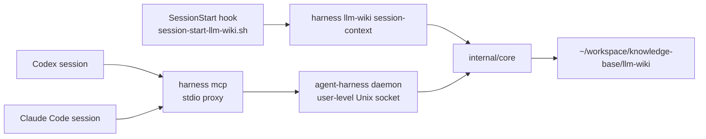

# LLM Wiki 통합 설계

이 문서는 `agent-harness`가 Codex와 Claude Code에서 공통으로 `~/workspace/knowledge-base/llm-wiki`를 쓰게 하는 구조의 source of truth다.

---

## 1. 목표

- 한 컴퓨터에서 여러 Codex/Claude Code 세션이 열려도 같은 개인 LLM Wiki vault를 참조한다.
- 각 host는 host-specific plugin logic을 갖지 않고 `agent-harness` MCP schema와 CLI를 통해 같은 동작을 사용한다.
- 세션 시작 시에는 전체 vault를 주입하지 않고, bounded session context(운영 규칙 + 현재 index/inventory 요약)만 주입한다.
- 실제 지식이 필요할 때만 검색/읽기 도구를 호출하고, 재사용 가능한 결과만 wiki capture로 환원한다.

Canonical vault root:

```text
~/workspace/knowledge-base/llm-wiki
```

Override:

```bash
LLM_WIKI_ROOT=/path/to/llm-wiki
```

---

## 2. 현재 구현 구조



`harness mcp`는 직접 MCP server를 매번 띄우지 않고 user-level daemon에 stdio를 proxy한다. daemon은 `HARNESS_DAEMON_DIR` 또는 기본 `~/.local/state/agent-harness/daemon/`에 Unix socket, pid, lock, log를 둔다.

주요 명령:

```bash
harness daemon start --json
harness daemon status --json
harness daemon stop --json
harness llm-wiki inventory --json
harness llm-wiki session-context --json
harness llm-wiki search --query "llm wiki" --json
harness llm-wiki read --page llm-wiki-pattern --json
harness llm-wiki capture --title "..." --content "..." --json
harness mcp
```

주요 MCP tools/resources:

- `llm_wiki_inventory`
- `llm_wiki_session_context`
- `llm_wiki_search`
- `llm_wiki_read`
- `llm_wiki_capture`
- `harness://llm-wiki/session-context`
- `harness://llm-wiki/inventory`
- `harness://llm-wiki/index`
- `harness://llm-wiki/schema`

---

## 3. 세션 시작 주입 방식

### MCP-first

`initialize` 응답의 `instructions`는 host에게 `harness://llm-wiki/session-context` 또는 `llm_wiki_session_context`를 세션 시작 표면으로 쓰라고 안내한다. MCP resource가 지원되는 host에서는 이 resource를 읽는 것이 가장 작은 주입 경로다.

### Hook helper

`./scripts/session-start-llm-wiki.sh`는 Claude Code `SessionStart` hook용 JSON을 출력한다. Claude Code 공식 hook 문서는 `SessionStart`가 세션 시작/재개 시 실행되고, `hookSpecificOutput.additionalContext`로 Claude에게 context를 추가할 수 있다고 설명한다. 참고: https://code.claude.com/docs/en/hooks

템플릿:

```text
configs/claude/hooks/session-start-llm-wiki.settings.json
```

Codex-compatible hook runner가 plain stdout 주입을 지원하는 경우에는 다음 adapter를 사용한다.

```text
configs/codex/hooks/session-start-llm-wiki.sh
```

Codex hook semantics는 버전별 변동 가능성이 있으므로, 현재 하네스의 안정 계약은 MCP initialize/resource와 native skill을 우선한다.

---

## 4. 리서치 근거와 설계 판단

### Karpathy LLM Wiki pattern

Karpathy의 gist는 raw sources, mutable/interlinked wiki core, schema/control surface를 나누고, 인간은 sourcing·질문·방향 설정을 담당하며 LLM은 요약·cross-reference·bookkeeping을 수행하는 패턴을 제안한다. 또한 작은 scale에서는 index file만으로 충분하지만 vault가 커지면 local search/CLI/MCP 같은 도구가 필요하다고 본다. 참고: https://gist.github.com/karpathy/442a6bf555914893e9891c11519de94f

적용:

- `00-meta/AGENTS.md`, `00-meta/index.md`, `00-meta/log.md`를 session context의 canonical entry point로 둔다.
- `10-sources/`는 read-only evidence, `20-wiki/`는 synthesized mutable knowledge, `30-sessions/`는 session capture로 분리한다.
- capture는 schema 존재를 확인한 뒤 frontmatter와 changelog를 포함해 작성한다.

### RAG baseline

Lewis et al.의 RAG 논문은 외부 지식 검색이 knowledge-intensive task에서 factuality와 specificity를 개선할 수 있음을 보였다. 참고: https://arxiv.org/abs/2005.11401

적용:

- 하네스는 모델의 parametric memory에 의존하지 않고 local vault를 필요 시 검색한다.
- 그러나 모든 prompt에 자동 검색하지 않고, durable knowledge나 citation-backed context가 필요한 경우에만 검색한다.

### GraphRAG / structured retrieval

Microsoft GraphRAG 논문은 일반 RAG가 corpus 전체의 theme 같은 global sensemaking 질문에서 약하고, graph index와 community summary가 global 질문에 유리하다고 설명한다. 참고: https://www.microsoft.com/en-us/research/publication/from-local-to-global-a-graph-rag-approach-to-query-focused-summarization/ 및 https://arxiv.org/abs/2404.16130

LightRAG도 flat representation의 한계와 graph/context-aware retrieval의 이점을 지적한다. 참고: https://arxiv.org/abs/2410.05779

적용:

- 현재 구현은 dependency 없이 lexical search와 curated markdown graph를 먼저 제공한다.
- 향후 필요하면 wikilink graph, aliases, source fidelity metadata를 search score에 반영한다.

### Long-term agent memory

MemGPT는 제한된 context window 바깥의 memory tier를 관리해야 multi-session chat과 large document analysis가 가능하다고 본다. 참고: https://arxiv.org/abs/2310.08560

적용:

- session context는 작은 working set이고, vault는 long-term memory tier다.
- `llm_wiki_search/read/capture`는 context paging 역할을 한다.

### Local-first 원칙

Local-first software 논문은 사용자의 local device에 primary data를 두면 offline access, privacy, long-term ownership에 유리하다고 설명한다. 참고: https://www.inkandswitch.com/local-first/static/local-first.pdf

적용:

- vault는 cloud service가 아니라 사용자의 local markdown directory를 canonical source로 둔다.
- daemon state와 logs는 user state dir에 두고 repo source나 vault에 runtime cache를 섞지 않는다.

---

## 5. 현재 vault 분석

2026-05-27 로컬 확인 기준:

- Root: `~/workspace/knowledge-base/llm-wiki`
- Markdown files: 274
- `10-sources/`: 115 source cards/snapshots
- `20-wiki/concepts/`: 59
- `20-wiki/entities/`: 29
- `20-wiki/summaries/`: 3
- `30-sessions/`: 3
- Canonical entry points: `00-meta/AGENTS.md`, `00-meta/index.md`, `00-meta/log.md`

구조는 Karpathy pattern과 잘 맞는다. 개선 우선순위는 새 대형 dependency 도입이 아니라 다음이다.

1. session-start context를 bounded하게 유지한다.
2. 검색은 lexical baseline에서 시작하고, 실제 miss/false-positive가 확인되면 wikilink/alias/metadata score를 추가한다.
3. write는 source fidelity와 frontmatter 규칙을 깨지 않는 thin tool로 제한한다.

---

## 6. 운영 규칙

- `llm-wiki`는 cross-repo durable knowledge에만 사용한다.
- project-local runtime state, daemon logs, cache는 vault에 쓰지 않는다.
- `10-sources/` 본문은 하네스 tool이 수정하지 않는다.
- source-backed claim은 wikilink로 cite하고, synthesis/unverified claim은 명시한다.
- high-stakes 또는 version-sensitive fact는 source card만 믿지 말고 upstream/snapshot을 재검증한다.
