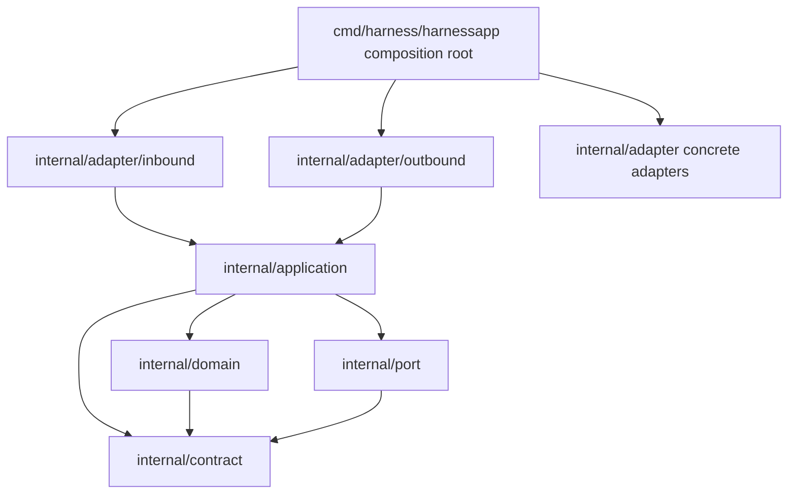

# Dependency Ratchet

`internal/architecture` is a **test-only fitness boundary** over the production
import graph. It exists so that layering rules — dependency direction, adapter
isolation, contract-only ports, single composition root — are enforced
deterministically by `go test`, not by code review alone. The original decision
is recorded in
[ADR 2026-07-27](../../.agent-harness/adr/decisions/2026-07-27-architecture-dependency-fitness-ratchet.md):
collect direct production import edges deterministically, fail unconditional
layer rules immediately, and (historically) allow pre-existing coupling only
through an aligned baseline. A later decision replaced the baseline with a
zero-invariant (see below).

Scope matters: this ratchet measures **imports only**. Production runtime
behavior, CLI/MCP contracts, and runtime wiring itself are outside the
ratchet's reach — those are owned by the contract golden tests and the
response-contract suite. Conversely, moving a production package or reworking
runtime wiring does not require touching the ratchet unless an import edge
changes.

Related pages: [Architecture Overview](overview.md),
[Source Map](source-map.md), [Contract Surface](../concepts/contract-surface.md),
[Verification Gates](../testing/verification-gates.md).

## What the ratchet measures

`loadProductionEdges` runs `go list -json ./...` at the repo root, keeps only
packages of the `agent-harness/` module, and turns each package's **direct
`Imports`** into `importer -> imported` edges (the module prefix is trimmed by
`normalizeImport`). The edge set is deduplicated and sorted; diagnostics are
always rendered as `rule: importer -> imported`.

Deliberate blind spots:

- **Test imports are not collected.** `loadProductionEdges` reads only
  `Imports`, never `TestImports`/`XTestImports`, so test files may import
  anything. This is intentional: tests are expected to inject the *same
  concrete implementations* that production wires (see
  [Adapter tail and composition-root injection](#adapter-tail-and-composition-root-injection)).
- **Transitive dependencies are not collected.** Only direct import edges
  count, which keeps diagnostics precise (`importer -> imported`) and avoids
  over-sensitivity to implementation churn — exactly the trade-off recorded in
  the 2026-07-27 ADR (full transitive-graph comparison was rejected).
- **The inventory must be byte-stable.** The whole-graph check loads the edge
  list twice and requires `reflect.DeepEqual`, so nondeterministic tooling
  output fails loudly instead of producing a misleading baseline diff.

## Allowed dependency directions

The canonical direction graph that the tests allow:

*Dependency directions allowed by the layer and ownership tests; imports that
point "upward" (application/domain toward adapters or cmd, adapters toward cmd,
inbound toward outbound) are rejected without a baseline.*

Everything else is rejected. The unconditional layer rules live in
`evaluateEdges` and are enforced over the **entire** production graph by
`TestProductionGraphHasNoLegacyAdapterEdges`:

| Rule | Fires when |
|---|---|
| `core_must_not_import_adapter_or_cmd` | anything under `internal/core/` imports an adapter or `cmd/...` |
| `adapter_must_not_import_cmd` | any adapter imports `cmd/...` |
| `port_must_not_import_internal` | `internal/port` imports `internal/...` other than contract or another port |
| `domain_must_not_import_implementation` | `internal/domain` imports application, adapter, cmd, contract, `os`, `os/exec`, `net`, `net/http`, `database/sql`, `syscall`, or anything sqlite |
| `application_must_not_import_implementation` | `internal/application` imports adapters, cmd, or transport stdlib (including `path/filepath`) |
| `inbound_adapter_must_not_import_outbound_adapter` | an inbound adapter imports an outbound adapter |

Per-vertical rules add narrower restrictions for migrated IssueOps
capabilities (publication, completion, preparation, lease), e.g.
`publication_contract_must_not_import_internal`,
`completion_outbound_adapter_must_not_import_core`, and
`leasevertical_contract_must_not_import_production_issueops`. Both the rule
name and the exact diagnostic string are pinned by
`TestEvaluateEdgesRejectsForbiddenDependencies`, so the failure output an agent
sees is part of the contract.

Two vocabulary allowances are deliberate and documented in
[ADR 2026-08-08](../../.agent-harness/adr/decisions/2026-08-08-port-contract-vocabulary.md)
and the contract-composition ADR:

- **Ports speak contract vocabulary.** `port -> contract` and `port -> port`
  are allowed; only ports reaching domain/application/adapter/cmd fail. The
  alternative (contract may not import port, port may not import contract)
  left DTOs that no layer could own.
- **Contract-to-contract references are composition, not implementation
  coupling.** `contract_must_not_import_internal` only fires when a contract
  imports domain/application/adapter/cmd/port. DTOs referencing another
  capability's DTO stay legal; vertical-specific stricter rules are retained.

## Ownership manifest rules

`evaluateOwnershipEdges` (exercised by `ownership_manifest_test.go`) applies a
second, stricter lens:

- `ownership_forbids_core_package` — the `internal/core/...` prefix is banned
  outright, on both the importer and imported side, including the nested
  `internal/core/issueops/model` prefix. The core layer has been dissolved;
  the rules exist to prevent reintroduction.
- `contract_must_not_import_internal`, `domain_must_only_import_contract`,
  `application_must_not_import_adapter_or_cmd`, and
  `port_must_not_import_internal` with the allowances described above.

Strict checking is scoped by `isFoundationOwner` (a fixed allowlist of
foundation packages such as `internal/contract/state`,
`internal/application/nativeactivation`, `internal/domain/policy`), plus a
package-level sweep that flags any `internal/core/issueops/model` package.
`TestOwnershipManifestAllowsTargetDirections` pins the legal directions,
including `adapter/outbound -> application` and
`cmd/harness/harnessapp -> adapter/outbound` — the composition root is the one
place allowed to import concrete adapters.

## The zero-baseline invariant

The ratchet began with a baseline file
(`internal/architecture/testdata/legacy_imports.txt`) that recorded pre-existing
coupling while unconditional rules blocked new regressions. That baseline is
**gone and replaced by an invariant**: legacy adapter edges are **zero**.

- `TestProductionGraphHasNoLegacyAdapterEdges` fails if `legacyEdges(edges)`
  returns anything. There is no registration path for a new legacy edge — it
  is simply rejected.
- The ratchet can only shrink: a change that removes a legacy edge must do so
  in the same review that justifies the architecture improvement
<!-- openwiki: broken internal link [../../.agent-harness/architecture/hexagonal-core.md#L101-L107] heading anchor "L101-L107" does not exist in "../../.agent-harness/architecture/hexagonal-core.md". Fix the href or restore the target, then delete this comment. -->
  ([hexagonal-core.md](../../.agent-harness/architecture/hexagonal-core.md#L101-L107),
  2026-07-27 ADR consequence). History: the baseline started at 263 edges and
  was ratcheted to zero
  ([ADR 2026-08-08 — legacy baseline invariant](../../.agent-harness/adr/decisions/2026-08-08-legacy-baseline-invariant.md)).

`legacyEdges` classifies an edge as legacy (and therefore forbidden at zero
tolerance) when any of these hold:

1. `internal/core/...` imports legacy infrastructure (`os`, `os/exec`, `net`,
   `net/http`, `database/sql`, `syscall`, anything containing `sqlite`).
2. An adapter imports `internal/core/...` and is not one of the migrated
   inbound adapters (`inbound/issueopslease`, `issueopspublication`,
   `issueopscompletion`, `issueopspreparation`).
3. A concrete adapter is imported from outside the composition root
   (`cmd/harness/harnessapp`), minus the two exception classes below.

## Capability boundary semantics

Rule 3 would count *any* adapter-to-adapter edge, which produced a perverse
incentive: splitting one adapter's 52-file package into subpackages *increased*
the baseline. [ADR 2026-08-08 — capability boundary](../../.agent-harness/adr/decisions/2026-08-08-dependency-ratchet-capability-boundary.md)
fixed the measurement:

- A capability is the first path element after `internal/adapter/`.
  `outbound`/`inbound` are **direction classifiers, not capabilities**, so
  `adapterCapability` reads one more element for them
  (`outbound/state` and `outbound/sqlstore` are different capabilities).
- `isSameCapabilityAdapter` makes edges between packages of the **same
  capability** non-legacy: splitting a package is implementation cleanup, not
  layering violation. In-capability coupling is a code-review concern, not a
  ratchet concern.
- Only **cross-capability** concrete-adapter edges count as legacy, and those
  are zero. The rejected alternative — extending the same-capability exception
  into the unconditional `evaluateEdges` rules — would have allowed inbound
  adapters to call same-capability outbound adapters directly, so the
  `inbound_adapter_must_not_import_outbound_adapter` rule still fails
  immediately.

`TestLegacyEdgesExcludeSameCapabilityAdapterPackages` pins both halves of the
classification (e.g. `internal/adapter/issueops -> internal/adapter/issueops/linking`
is exempt; `internal/adapter/trace -> internal/adapter/policy` and
`outbound/state -> outbound/webfetch` are legacy).

## Narrow outbound exceptions

The only canonical exceptions to "adapters are imported solely by the
composition root" are the shared storage primitives, owned jointly by
`isSharedStorageEngineEdge` in `dependency_test.go` and the exception list in
<!-- openwiki: broken internal link [../../.agent-harness/architecture/hexagonal-core.md#L101-L107] heading anchor "L101-L107" does not exist in "../../.agent-harness/architecture/hexagonal-core.md". Fix the href or restore the target, then delete this comment. -->
[hexagonal-core.md](../../.agent-harness/architecture/hexagonal-core.md#L101-L107):

- `outbound/sqlstore` is a **shared storage engine, not a capability**. Any
  `internal/adapter/outbound/*` adapter and `internal/adapter/issueops` may
  import it directly.
- `outbound/issueopsrecord` is the shared IssueOps record codec/lock
  primitive; only `internal/adapter/outbound/issueops*` adapters may import it.

The exception is one-directional and narrow by test:
`TestSharedStorageEngineExceptionIsOneDirectionOnly` proves that `cmd/...`,
inbound adapters, and domain code may not reach the engine, and that the
exception does not widen beyond it. Wrapping the engine in a port was
considered and rejected: it would force nearly every test package in the repo
to carry the wiring, and engine replacement is not an actual requirement.

**This is not a bypass menu.** The canonical rule
<!-- openwiki: broken internal link [../../.agent-harness/ARCHITECTURE.md#L27-L46] heading anchor "L27-L46" does not exist in "../../.agent-harness/ARCHITECTURE.md". Fix the href or restore the target, then delete this comment. -->
([ARCHITECTURE.md](../../.agent-harness/ARCHITECTURE.md#L27-L46)) says new
packages must not reuse existing exception edges as a general escape hatch —
e.g. relocating code under `internal/adapter/outbound/` purely to reach
`sqlstore` is exactly what the one-direction test and the capability rules are
built to catch.

## Adapter tail and composition-root injection

Because cross-capability adapter imports are banned and the baseline is zero,
capabilities that need each other's I/O implementations receive them via
**composition-root injection of function variables**, not imports:

- Consumer packages declare their needs in a dedicated file — named
  `adapter_dependencies.go`, `*_dependencies.go`, or
  `adapter_tail_dependencies.go` — as package-level `var X func(...)`
  slots. Examples: `internal/adapter/issueops/adapter_dependencies.go`
  (`GitCmd`/`GitCmdRaw`/`GitOut`), `internal/adapter/audit` and
  `internal/adapter/worker` (`EvaluateCommandPolicy`,
  `RunReadOnlyCommand`), `internal/adapter/claude/adapter_tail_dependencies.go`
  (install-plan and activation-evidence functions typed over `port` DTOs).
- The composition root assigns implementations in
  `cmd/harness/harnessapp/*_wiring.go`. `configurePolicyAndGitObservers` is the
  canonical example: every policy/git consumer (CLI packages, adapters, MCP)
  receives `policyadapter.EvaluateCommandPolicy` and `preflightadapter.GitCmd`
  through function variables, and each file's comment states that *the
  composition root, not the consumer, decides which executor runs*.
- `adapter_tail_wiring.go` owns the "adapter tail": `configureAdapterTail`
  installs installation-planning and project-doc observation implementations
  (`installutiladapter`, `installadapter`, `projectdocsadapter`) into the host
  adapters (`claude`, `codex`, `omo`), fingerprint, and the install/project
  leaf CLIs. It is one of ~30 `configure*` functions invoked in sequence by
  `wireBasicCLIDeps` in `cli_facade.go`; `adapter_tail_wiring.go` /
  `adapter_dependencies.go` are the tail of that sequence where leaf
  dependencies are set.

Why injection instead of imports:

1. The ratchet stays at zero without baseline entries — a cross-capability
   import would fail `TestProductionGraphHasNoLegacyAdapterEdges` outright.
2. Implementation knowledge stays in exactly one place (the composition root).
   Consumers know request/result shapes only; "how to spawn a process" is not
   duplicated.
3. Wiring removal is *detectable*: if a wiring file is deleted and only the
   implementation remains, the consumer package stops being imported and the
   orphan guard fires (below). The `gatesgate` package shows the pattern for
   composition: it extends IssueOps PR readiness with a gates-ledger gate while
   receiving `DiscoverGateFiles`/`CheckGateLedger` as function variables rather
   than importing the gates adapter across the capability boundary.

Two hard rules complete the pattern
<!-- openwiki: broken internal link [../../.agent-harness/conventions/go-and-packages.md#L74-L105] heading anchor "L74-L105" does not exist in "../../.agent-harness/conventions/go-and-packages.md". Fix the href or restore the target, then delete this comment. -->
([go-and-packages.md](../../.agent-harness/conventions/go-and-packages.md#L74-L105)):

- **No default implementations.** A default would point back at a concrete
  package and recreate the edge; an un-injected dependency must surface as a
  structured error (fail closed), never silently pass.
- **Tests inject the same concrete implementations** that production wires
  (`harnessapp`'s `TestMain` calls `wireDependencies` to mirror
  `RunRootCommand`). Swapping in stubs would change what is being verified.
  The fitness graph ignores test imports, so none of this shows up in the
  ratchet.

## Orphan package guard

`orphan_package_test.go` closes a blind spot that the dependency tests alone
cannot see: a package whose wiring file is deleted keeps its tests green while
enforcing nothing at runtime, because `deadcode` analysis only inspects the
graph reachable from `main`. `TestProductionPackagesHaveImporters` fails any
non-main package with production Go files that no module package imports.

The motivating incident is on record: the 2026-08-27 legacy-hook removal
silently orphaned `internal/adapter/remoteartifact`, its PR/MR target guard
disappeared, and a bad-target MR subsequently landed. The guard test caught
`remoteartifact`, `draftmeta`, and then `searchrouting` in sequence
<!-- openwiki: broken internal link [../../.agent-harness/cautions/2026-08-28-record.md#L13] heading anchor "L13" does not exist in "../../.agent-harness/cautions/2026-08-28-record.md". Fix the href or restore the target, then delete this comment. -->
([cautions/2026-08-28-record.md](../../.agent-harness/cautions/2026-08-28-record.md#L13)).
Remedy: revive the wiring or delete the package.

Intended test-support-only packages are handled by
`orphanPackageAllowlist`, and each entry requires a written reason (e.g.
`internal/adapter/skillcontract`, a doc-only skill-contract test package).
`TestOrphanPackageAllowlistHasNoStaleEntries` keeps the allowlist honest: an
entry must still exist, still have production files, and still be unimported —
otherwise it is masking a live package or a dead one and must be removed.

## Vertical boundary tests

Migrated IssueOps capabilities carry their own focused fitness tests, so a new
capability package set is checked in one place:

- **Five-layer ownership.** `issueops_decision_vertical_test.go`,
  `issueops_inventory_vertical_test.go`, `issueops_retention_vertical_test.go`,
  `issueops_routing_vertical_test.go`, `issueops_status_vertical_test.go`, and
  `issueops_artifact_vertical_test.go` each require the capability's
  `contract`/`domain`/`application`/`inbound`/`outbound` packages to exist,
  and forbid those packages from importing the legacy
  `internal/adapter/issueops` root. Companion assertions make legacy symbols
  and legacy files (`issueops_decision.go`, ...) fail if they reappear.
- **One shared record store.** `issueops_record_store_test.go` requires the
  six outbound verticals to import `internal/adapter/outbound/issueopsrecord`
  and fails if duplicate record codecs (`codec.go` in individual verticals)
  reappear — this is the enforcement half of the `issueopsrecord` exception.
- **Narrow port surfaces.** `issueops_base_sync_boundary_test.go` restricts
  `internal/port/issueopsbasesync` to the exported types `Request`,
  `Receipt`, `Inspector` and a single `context` import — a port may not
  accumulate behavior.

## Documentation canonicality

`documentation_test.go` keeps prose aligned with the code, because stale docs
are how layering rules get "softly" violated: canonical documents
(`README.md`, `README.en.md`, `AGENTS.md`,
`.agent-harness/ARCHITECTURE.md`, `.agent-harness/CONVENTIONS.md`,
`architecture/hexagonal-core.md`, `conventions/go-and-packages.md`) must
reference the current layer paths (`cmd/harness/`, `internal/contract/`,
`internal/domain/`, `internal/application/`, `internal/port/`,
`internal/adapter/`) and must not mention the removed paths `internal/core`,
`internal/adapter/cli`, or `internal/adapter/fs`. A companion test requires
first-party host docs to name every host (`Codex`, `Claude`, `Omo`). Adding a
new top-level layer or renaming one means updating these documents in the same
change.

## Other checks in the same suite

A few related fitness tests live beside the dependency tests and run with the
same suite:

- `TestStateSQLNetworkSourcePrefixesAbsent` — the dissolved
  `internal/core/{sqlstore,state,webfetch}` source prefixes may not reappear as
  packages or imports.
- `TestStateSQLNetworkImplementationImportsStayOutbound` — state/webfetch
  capability code outside `outbound/` may not import `database/sql`, `os`,
  `os/exec`, `net/http`, or sqlite; implementations live only in outbound
  adapters.
- Routing legacy-fallback tests (`productionReseedRoutingViolations`,
  `productionResumeRoutingViolations`, `productionReconcileRoutingViolations`,
  preparation/publication variants) require exactly one invocation of the
  injected handler per route and fail on legacy orchestration symbols
  (`PrepareExecution`, `ResumeExecutionWithDependencies`,
  `reconcileOrcaExecutionIntent`, `provider.Resolve` in publication callers).
- `TestCurrentIssueOpsVerticalOnly` — retired compatibility-oracle/facade
  identifiers may not reappear anywhere in `cmd/` or `internal/`.
- `errors_astype_test.go` — production code uses `errors.AsType`, not
  `errors.As` (a coding-convention ratchet riding the same suite).

## Extending the code without tripping the ratchet

Adding a package is safe when you follow the prescriptions. The checklist:

1. **Classify what you consume before you import** (concrete-adapter removal
   ordering): pure rules go to `internal/domain/<cap>`, types go to
   `internal/contract/<cap>`, I/O is injected via an `adapter_dependencies.go`
   function variable wired from the composition root. Type moves and function
   injection usually go together — a consumer that needs both will still
   import the adapter if you only do one.
2. **New adapter package?** It may import contract/domain/port/application
   downward but must not import `cmd/...`, other capabilities' adapters, or
   `internal/core/...`. Declare cross-capability needs as function variables
   and wire them in a `harnessapp` `*_wiring.go` function.
3. **New IssueOps capability?** Create the five vertical layers, add a
   `<cap>_vertical_test.go` in `internal/architecture`, and make the vertical
   use the shared `outbound/issueopsrecord` store.
4. **Do not touch exceptions.** No new baseline entries exist to add; the
   `sqlstore`/`issueopsrecord` exceptions are fixed by test and must not be
   widened or reused as a general bypass; same-capability grouping must not be
   gamed by relocating code under `outbound/` to inherit the engine exception.
5. **Every production package needs an importer** (or a justified allowlist
   entry with a reason). If you delete wiring, delete the orphaned package too.
6. **Keep canonical docs in sync** if layers or paths change.

Focused tests to run per change:

| Change | Focused test | Enforcing file |
|---|---|---|
| Any new/removed package | `go test ./internal/architecture -run 'ProductionPackagesHaveImporters|OrphanPackageAllowlist' -count=1` | `orphan_package_test.go` |
| Adapter imports, zero baseline | `go test ./internal/architecture -run TestProductionGraphHasNoLegacyAdapterEdges -count=1` | `dependency_test.go` |
| Same-capability vs cross-capability classification | `go test ./internal/architecture -run TestLegacyEdges -count=1` | `dependency_test.go` |
| Touching `sqlstore`/`issueopsrecord` | `go test ./internal/architecture -run TestSharedStorageEngineExceptionIsOneDirectionOnly -count=1` | `ownership_manifest_test.go` |
| Contract/domain/port/application edges in foundation packages | `go test ./internal/architecture -run 'TestOwnershipManifest|TestProductionFoundationOwnership' -count=1` | `ownership_manifest_test.go` |
| New unconditional rule diagnostics | `go test ./internal/architecture -run TestEvaluateEdges -count=1` | `dependency_test.go` |
| New IssueOps capability | `go test ./internal/architecture -run 'IssueOps.*(Vertical|RecordStore)' -count=1` | `issueops_*_vertical_test.go`, `issueops_record_store_test.go` |
| Layer path renamed / docs edited | `go test ./internal/architecture -run 'TestCanonicalArchitectureDocs|TestCanonicalHostDocs' -count=1` | `documentation_test.go` |
| Error handling convention | `go test ./internal/architecture -run TestProductionCodeUsesErrorsAsTypeInsteadOfErrorsAs -count=1` | `errors_astype_test.go` |

Before pushing, run the full fitness suite once:
`go test ./internal/architecture -count=1` (it is also part of the standard
`go test ./... -count=1` gate). Failures arrive as sorted
`rule: importer -> imported` diagnostics — the rule name is the contract; fix
the edge (or its prescription), never the diagnostic.
