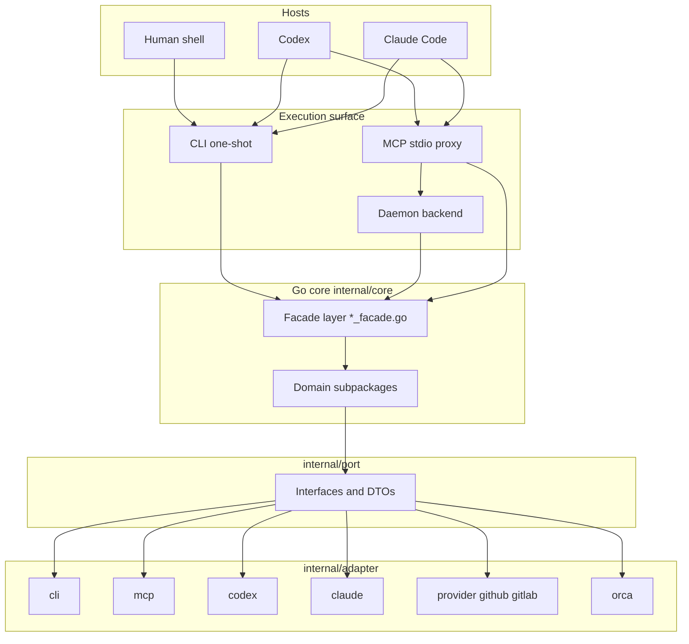

# Architecture Overview

agent-harness uses a **hybrid architecture**: a host-neutral Go core provides all policy, state, workflow, and contract logic, while thin host adapters (Codex, Claude Code) handle installation, skill symlinks, MCP registration, and lifecycle hooks. The core never depends on a specific host's SDK or config format.

## Core Decision: External Harness, Not Plugin-Only

The project explicitly rejected plugin-only approaches in favor of an external binary:

| Option | Why rejected |
|--------|-------------|
| Codex plugin/skill only | Cannot be shared with Claude Code; core logic becomes hostage to plugin API changes |
| Claude Code command/hook only | Cannot be reused by Codex; policy scatters across hooks |
| **External CLI/MCP/worker core** | **Adopted** — same binary and schema callable from both hosts, testable, state-managed |

Source: [`.agent-harness/ADR.md`](/.agent-harness/ADR.md) §1.1, [`.agent-harness/ARCHITECTURE.md`](/.agent-harness/ARCHITECTURE.md) §1.

## Layer Boundaries



The three execution surfaces (CLI, MCP proxy, daemon) all converge on the same core facades, so identical inputs produce identical results.

### Facade Rule

The `core` package exposes a **stable public surface** via `*_facade.go` files. Callers import `core`, not `core/issueops` or `core/lifecycle` directly (with narrow exceptions for cmd-local tooling). Facades may only:

1. Re-export subpackage types as type aliases
2. Convert types across boundaries
3. Compose multiple subpackage results
4. Enforce domain boundaries

New domain logic belongs in subpackages, never in facades.

Source: [`internal/core/doc.go`](/internal/core/doc.go).

## Package Structure

| Layer | Path | Responsibility |
|-------|------|---------------|
| Binary entrypoint | `cmd/harness/` | CLI flag parsing, MCP JSON-RPC, daemon lifecycle, hook dispatch |
| Core use cases | `internal/core/*_facade.go` | Intended public surface: issueops, workflow, policy, state, project_doc |
| Core subpackages | `internal/core/<domain>/` | Split domains: issueops, lifecycle, state, policy, guard, worker, docs, inspect |
| Ports | `internal/port/` | Interfaces, DTOs, error contracts — no concrete adapter types |
| CLI adapter | `internal/adapter/cli/` | Flag parsing, stdout/stderr, exit codes, command catalog |
| MCP adapter | `internal/adapter/mcp/` | MCP tool schemas, dispatch groups, catalog |
| Host adapters | `internal/adapter/codex/`, `internal/adapter/claude/` | User-level skill/MCP/hook installation |
| Provider adapter | `internal/adapter/provider/` | GitHub/GitLab issue and PR/MR operations via gh/glab |
| Orca adapter | `internal/adapter/orca/` | Optional Orca supervised execution |
| Config templates | `configs/codex/`, `configs/claude/` | Host MCP and hook config templates |
| Skills | `skills/` | Single source of truth for all shared skills |
| Project docs | `.agent-harness/` | Architecture, operations, testing, ADR, conventions |

## Execution Modes

| Mode | Status | Purpose |
|------|--------|---------|
| `agent-harness` CLI one-shot | Implemented | Common minimum surface callable from any host |
| `agent-harness mcp` stdio proxy | Implemented | Codex/Claude connect via same MCP schema to daemon |
| `agent-harness daemon` | Implemented | Shared user-level MCP backend, state sharing across sessions |
| `agent-harness issueops` | Implemented | Durable issue-driven workflow with direct/Orca execution v1 |
| `agent-harness loop` | Implemented | Verify-until-done loop contracts with PR readiness gates |
| `agent-harness worker` | Partial | No-shell lifecycle jobs and draft-wiki queue processing |

Source: [`.agent-harness/ARCHITECTURE.md`](/.agent-harness/ARCHITECTURE.md) §3.

## Architectural Invariants

1. **Core behavior lives in Go core**, not host plugins or hooks.
2. **CLI JSON, MCP response, daemon response share the same DTO.**
3. **Host adapters must not bypass** authentication, command policy, or workspace boundaries.
4. **Hooks provide context and deterministic guards** but do not create issues, edit files, or run tests.
5. **Worker is policy-gated and state-first** — not a general-purpose writable shell runner.

These invariants are enforced by the [command policy](../operations/policy-guard-testing.md), the [lifecycle guard](../workflows/execution-model.md#lifecycle-guard), and tested via golden contracts.

The [lifecycle guard](../workflows/execution-model.md) is a pre-tool-use hook that enforces the execution workspace safety boundary: unclassified commands are blocked during active mutation authority, and only explicitly enumerated read-only or typed-control-plane commands pass.

## Adding a New Host

The `port.HostInstaller` interface defines the contract:

```go
type HostInstaller interface {
    Name() string
    Install(NativeInstallRequest) (HostInstallResult, error)
}
```

A new host requires only a new `HostInstaller` implementation in `internal/adapter/<host>/` — no core modifications. See [State and Storage](../operations/state-and-storage.md) for the install flow.
