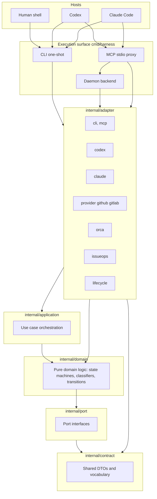

# Architecture Overview

agent-harness uses a **hexagonal (ports-and-adapters) architecture**: pure domain logic lives in `internal/domain/`, use case orchestration in `internal/application/`, boundary implementations in `internal/adapter/`, shared DTOs and interfaces in `internal/contract/`, and port interfaces in `internal/port/`. The core never depends on a specific host's SDK or config format.

## Core Decision: External Harness, Not Plugin-Only

The project explicitly rejected plugin-only approaches in favor of an external binary:

| Option | Why rejected |
|--------|-------------|
| Codex plugin/skill only | Cannot be shared with Claude Code; core logic becomes hostage to plugin API changes |
| Claude Code command/hook only | Cannot be reused by Codex; policy scatters across hooks |
| **External CLI/MCP/worker core** | **Adopted** — same binary and schema callable from both hosts, testable, state-managed |

Source: [`.agent-harness/ADR.md`](/.agent-harness/ADR.md) §1.1, [`.agent-harness/ARCHITECTURE.md`](/.agent-harness/ARCHITECTURE.md) §1.

## Layer Boundaries



The three execution surfaces (CLI, MCP proxy, daemon) all converge on the same adapter implementations, which delegate to application use cases and domain logic, so identical inputs produce identical results.

### Hexagonal Rules

1. **`internal/domain/`** contains pure logic — no I/O, no file system, no network. State machines, classifiers, decision functions.
2. **`internal/application/`** orchestrates domain logic with port dependencies. Use case services that compose multiple domain decisions.
3. **`internal/adapter/`** implements port interfaces with concrete I/O — SQLite, `gh`/`glab` CLI, Orca API, file system, process probes.
4. **`internal/contract/`** holds DTOs and vocabulary types shared across layers. Ports speak in contract vocabulary, not adapter types.
5. **`internal/port/`** defines interfaces that adapters implement. No concrete adapter types leak here.

Source: [`internal/architecture/dependency_test.go`](/internal/architecture/dependency_test.go) (dependency-direction enforcement), [`internal/architecture/ownership_manifest_test.go`](/internal/architecture/ownership_manifest_test.go).

## Package Structure

| Layer | Path | Responsibility |
|-------|------|---------------|
| Binary entrypoint | `cmd/harness/` | CLI flag parsing, MCP JSON-RPC, daemon lifecycle, hook dispatch |
| Domain logic | `internal/domain/` | Pure state machines, classifiers, transitions (issueops, lifecycle, policy, guard, state) |
| Application | `internal/application/` | Use case orchestration (issueops lease/completion/preparation, state, webfetch) |
| Contracts | `internal/contract/` | Shared DTOs and vocabulary types across all layers |
| Ports | `internal/port/` | Port interfaces — provider, Orca, install, execution workspace, tool conformance |
| Adapters | `internal/adapter/` | Boundary implementations: issueops, lifecycle, cli, mcp, codex, claude, provider, orca, policy, guard, install, operationalhealth |
| CLI adapter | `internal/adapter/cli/` | Command catalog (`usage.go`), flag parsing |
| MCP adapter | `internal/adapter/mcp/` | MCP tool schemas and dispatch groups |
| Host adapters | `internal/adapter/codex/`, `internal/adapter/claude/` | User-level skill/MCP/hook installation |
| Provider adapter | `internal/adapter/provider/` | GitHub/GitLab issue and PR/MR operations via gh/glab |
| Orca adapter | `internal/adapter/orca/` | Optional Orca supervised execution, Run inventory reader |
| Architecture tests | `internal/architecture/` | AST-level dependency direction and convention enforcement |
| Test support | `internal/testsupport/` | Shared test helpers (stdout capture, fixtures) |
| Config templates | `configs/codex/`, `configs/claude/` | Host MCP and hook config templates |
| Skills | `skills/` | Single source of truth for all shared skills |
| Project docs | `.agent-harness/` | Architecture, operations, testing, ADR, conventions |

## Execution Modes

| Mode | Status | Purpose |
|------|--------|---------|
| `agent-harness` CLI one-shot | Implemented | Common minimum surface callable from any host |
| `agent-harness mcp` stdio proxy | Implemented | Codex/Claude connect via same MCP schema to daemon |
| `agent-harness daemon` | Implemented | Shared user-level MCP backend, state sharing across sessions |
| `agent-harness issueops` | Implemented | Durable issue-driven workflow with direct/Orca execution v1 |
| `agent-harness loop` | Implemented | Verify-until-done loop contracts with PR readiness gates |
| `agent-harness worker` | Implemented | No-shell lifecycle jobs and draft-wiki queue processing |

Source: [`.agent-harness/ARCHITECTURE.md`](/.agent-harness/ARCHITECTURE.md) §3.

## Architectural Invariants

1. **Domain behavior lives in `internal/domain/`**, not host plugins or hooks.
2. **CLI JSON, MCP response, daemon response share the same DTO** from the contract layer.
3. **Host adapters must not bypass** authentication, command policy, or workspace boundaries.
4. **Hooks provide context and deterministic guards** but do not create issues, edit files, or run tests.
5. **Worker is policy-gated and state-first** — not a general-purpose writable shell runner.

These invariants are enforced by the [command policy](../operations/policy-guard-testing.md), the [lifecycle guard](../workflows/execution-model.md#lifecycle-guard), tested via golden contracts, and pinned by AST-level [architecture tests](/internal/architecture/).

## Conventions

### errors.AsType (Go 1.26)

The repository uses the Go 1.26 standard library `errors.AsType[E](err) → (E, bool)` generic form for typed error matching instead of the older `errors.As(err, &target)` out-parameter form. An AST ratchet test in [`internal/architecture/errors_astype_test.go`](/internal/architecture/errors_astype_test.go) enforces zero `errors.As` calls in production code.

### Adding a New Host

The `port.HostInstaller` interface defines the contract:

```go
type HostInstaller interface {
    Name() string
    Install(NativeInstallRequest) (HostInstallResult, error)
}
```

A new host requires only a new `HostInstaller` implementation in `internal/adapter/<host>/` — no core modifications. See [State and Storage](../operations/state-and-storage.md) for the install flow.
