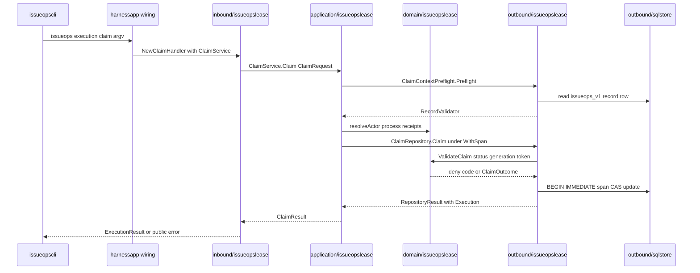

# Source Map

This page maps each major source tree to its one-line responsibility, the
dependencies it may use, and the imports it must not take — so a change lands
in the right layer the first time. The rules summarized here are owned by
[`.agent-harness/architecture/hexagonal-core.md`](../../.agent-harness/architecture/hexagonal-core.md)
and enforced mechanically by the zero-baseline import ratchet in
`internal/architecture` (see [Dependency Ratchet](dependency-ratchet.md) for
the enforcement details).

Related pages: [Architecture Overview](overview.md),
[Dependency Ratchet](dependency-ratchet.md),
[Contract Surface](../concepts/contract-surface.md),
[State and SQLStore](../concepts/state-and-sqlstore.md),
[IssueOps Cycle](../workflows/issueops-cycle.md).

## The layer table

| Tree | Responsibility | Must not |
| --- | --- | --- |
| `cmd/harness` | composition root (`harnessapp`) plus per-command CLI packages; flag/parse/dispatch, MCP stdio/JSON-RPC wiring, daemon lifecycle | duplicate host-specific policy or domain judgment |
| `internal/contract/<capability>` | versioned DTOs, `schema_version` markers, and error vocabulary shared by CLI/MCP/state | judgment logic and any I/O |
| `internal/domain/<capability>` | pure rules, reducers, classifiers; the CLI and MCP catalogs | adapters/`cmd`, filesystem/process/DB I/O; clock is injected by default (`internal/domain/auditid` timestamp IDs are the one documented exception) |
| `internal/application/<capability>` | use cases that combine contract, domain, and narrow port interfaces | concrete adapters and transport dependencies |
| `internal/port` | external capability interfaces and typed error contracts | anything outside `internal/contract` (and other port packages) |
| `internal/adapter/inbound/<capability>` | capability request → application call mapping | outbound adapters directly |
| `internal/adapter/outbound/<capability>` | state, SQL, webfetch, and IssueOps persistence implementations | transport policy or domain judgment duplication |
| `internal/adapter/*` (concrete) | host installers, process/git/provider/worker I/O, tooling adapters | imported anywhere except `cmd/harness/harnessapp` (zero legacy edges) |
| `internal/architecture` | test-only fitness boundary over the production import graph | production code never imports it |

Everything below expands a row, names the boundary-relevant packages only, and
finishes with the capability-vertical pattern that most new work should follow.

## `cmd/harness` — the composition root and CLI transport packages

`cmd/harness/main.go` is a three-line shell: it calls
`harnessapp.RunRootCommand(os.Args[1:])` and exits with the returned code.
`cmd/harness/harnessapp` is the **only composition root** in the module — the
ratchet's `isCompositionRoot` allows exactly this path to import concrete
adapters, and any other concrete-adapter edge is a legacy edge, and the legacy
baseline is zero. Wiring is explicit, not `init()`-driven:
`wireDependencies()` runs once under `sync.Once` at startup and assigns
implementations into leaf packages' function-variable slots; `harnessapp`'s
own `TestMain` calls the same function so package tests exercise production
wiring, not stubs.

`harnessapp` is also a facade library, not a command implementation: each
command's flag/parse/render/dispatch lives in a sibling `cmd/harness/*cli`
package (`issueopscli`, `mcpcli`, `daemoncli`, `policycli`, `installcli`,
`workercli`, `gatescli`, `channelcli`, `loopcli`, `hookcli`, `statecli`,
`statuscli`, `updatecli`, `projectcli`, `qualitycli`, `validationcli`,
`contractcli`, `webfetchcli`, `apidoc`, plus `basiccli`, `rootcmd`,
`selfworkflow`, `riskqa`, `commandstep`, `pathutil`, `contractgolden`).
`rootcmd.Command` owns only dispatch, `help`/`version`, and exit-code policy
(e.g. policy/guard denial → 3, gates usage error → 2); the runner map lives in
`harnessapp/root_command_facade.go`.

Two catalogs anchor the human/machine surface so it cannot drift:

- `internal/domain/cli` owns the canonical top-level command list
  (`Commands()`) and the usage text (`Usage(version)`); `harnessapp` renders
  it, and the `issueops` lines are composed solely from the
  `issueOpsUsageCatalog` so a command cannot exist in two hand-written places.
- `internal/domain/mcp` owns the advertised MCP tool catalog and dispatch
  groups; `AdvertisedTools()` and `DispatchMap()` both derive from the single
  ordered `catalogSections()` slice, so registering a tool in one catalog
  function makes it advertised *and* routable. `cmd/harness/mcpcli` owns the
  stdio/JSON-RPC transport and handler wiring over the official MCP Go SDK;
  `internal/adapter/mcp` is limited to the capture-only conformance probe.

`cmd/harness/daemoncli` owns the daemon (identity, admission, socket) and the
MCP stdio proxy (bounded reconnects, `-32002` `daemon_generation_changed` when
the daemon restarts mid-flight). `cmd/harness/workercli` plus
`internal/adapter/worker` provide lifecycle job records and the policy-gated
`run --read-only` executor; there is no long-resident job daemon — the daemon
backs only the MCP proxy.

Golden tests pin the whole surface: `cmd/harness/contractgolden` pins the CLI
usage text and MCP tool/resource catalogs under `cmd/harness/testdata`, and
the `harnessapp` response-contract suite runs the full CLI+MCP surface under a
temporary state dir and goldens the combined snapshot.

## `internal/contract` — shared DTO vocabulary

`internal/contract/<capability>` holds the request/result shapes, schema
versions, and error vocabulary that CLI, MCP, and state transports share.
Contracts must not import implementation layers: the ownership rules fail any
`contract -> domain/application/adapter/cmd/port` edge
(`contract_must_not_import_internal`), while contract-to-contract references
are composition, not coupling. Some contracts exist purely to pin durable
bytes — e.g. `internal/contract/issueopslease/stable_v1.go` re-declares the
persisted v1 record shape without touching any implementation type, so
canonicalization of durable state cannot drift, and vertical-specific rules
forbid the lease contract from importing production IssueOps code.

## `internal/domain` — pure rules and catalogs

`internal/domain/<capability>` owns deterministic rules, reducers, and
classifiers with no filesystem, process, or database I/O. The ratchet bans
`domain -> {application, adapter, cmd, contract, os, os/exec, net, net/http,
database/sql, syscall, sqlite}` outright. Clocks are injected by default;
`internal/domain/auditid`, whose audit IDs embed `time.Now()`, is the recorded
exception. Two catalog packages are special: `internal/domain/cli` and
`internal/domain/mcp` (above) own the command/tool vocabulary, and
`internal/domain/pioneerskill` pins the 12 canonical pioneer skill names.

## `internal/application` — capability use cases

`internal/application/<capability>` composes contract, domain, and narrow
port interfaces into a use case and returns domain-shaped results. It must not
import concrete adapters, `cmd/...`, or transport stdlib
(`application_must_not_import_implementation` includes `path/filepath`).
Applications declare the operations they actually need as small local
interfaces (`ports.go`) rather than consuming fat ports.

## `internal/port` — capability interfaces

`internal/port` declares external capability interfaces and typed error
contracts in contract vocabulary: `port -> contract` and `port -> port` are
allowed, everything else internal is banned
(`port_must_not_import_internal`). Representative surfaces: the root
`port.TransactionalRecordStore`/`RecordCASStore` span+CAS operations,
`IssueProvider*` request/result DTOs for remote issues and PR/MRs,
`port.HostInstaller`, the `port/state` reader/span-store interfaces, and the
IssueOps owner-model defaults in `port/orca.go`. Ports are kept deliberately
narrow — a fitness test restricts `internal/port/issueopsbasesync` to the
exported types `Request`, `Receipt`, and `Inspector` plus a single `context`
import, so a port cannot accumulate behavior.

## `internal/adapter` — concrete boundaries

Two direction classifiers plus capability packages:

- `internal/adapter/inbound/<capability>` maps capability requests to
  application calls and re-projects results/errors for transport. It must not
  import outbound adapters.
- `internal/adapter/outbound/<capability>` implements the external I/O:
  `state` (checkpoint store), `sqlstore` (the shared SQLite engine), `webfetch`,
  `upstream`, `nativeactivation`, and the per-vertical IssueOps stores.
  State/SQL/network implementation imports (`database/sql`, `os`, `os/exec`,
  `net/http`, sqlite) must stay inside outbound adapters for the capabilities
  that own them.
- `internal/adapter/outbound/sqlstore` is the **shared storage engine**: each
  store root owns `harness.db` (records as `bucket`/`id`/JSON rows) and
  `harness.lock.db` (cross-process `BEGIN IMMEDIATE` span locks that die with
  the holder process). It satisfies `port.TransactionalRecordStore` and the
  `port/state` interfaces. The shared-storage exception is the only
  non-composition-root concrete-adapter edge set: any `outbound/*` adapter and
  `internal/adapter/issueops` may import `sqlstore`; only
  `outbound/issueops*` may import the shared `outbound/issueopsrecord`
  codec/lock primitive; `cmd`, inbound, and domain reaching the engine
  directly still fail.

Concrete (non-vertical) adapters each own one external boundary:
`codex`, `claude`, `omo` (host installers implementing `port.HostInstaller`),
`install`/`installutil` (host-neutral install engine + shared install file
primitives), `issueops` (the record-backed IssueOps capability adapter, with
subpackage composition like `loopgate` and `gatesgate`), `orca` (bounded
argv/timeout/envelope projection of the optional Orca CLI — no IssueOps policy
duplication), `policy` (command-policy catalog/evaluate/audit and the
read-only executor), `worker`, `hostprobe` (isolated live host probes),
`toolconformance` (fixture I/O + behavioral replay), `failurecause`,
`operationalhealth` (read-only git/Orca inventory), `channel`, `looprun`,
`gates`, `gitworktree`, `provider` (github/gitlab resolution behind
`port.IssueProvider`, so no core package imports concrete providers), `mcp`
(capture-only conformance probe), `audit`, `preflight`, `docs`, `inspect`,
`projectdocs`, `projectbootstrap`, `lifecycle`, `trace`, `guard`, `hookprompt`,
`doctor`, `repopath`, `commitsuggest`, `lintdiagnose`, and `skillcontract`.

Host adapter scope is contractual: default installs write only user-level
surfaces (skill symlinks, MCP registration, `SessionStart` context hooks) and
nothing into target repositories — repo-local files require explicit
`--project-local`. The host-neutral engine `install.InstallNative` normalizes
inputs and skill lists and delegates to exactly the three first-party
installers passed by `harnessapp`; adding a host means one `port.HostInstaller`
implementation plus composition-root wiring, never duplicated policy.

### Cross-capability injection, not imports

Because cross-capability adapter imports are banned at zero tolerance,
consumers declare their needs as package-level function variables in a
dedicated `adapter_dependencies.go` / `*_dependencies.go` file — e.g.
`internal/adapter/issueops`' `GitCmd`/`GitCmdRaw`/`GitOut`, `gatesgate`'s
`DiscoverGateFiles`/`CheckGateLedger`, the host adapters' install-plan and
activation-evidence functions — and `harnessapp` wiring files
(`configurePolicyAndGitObservers`, `configureAdapterTail`,
`configureStateDatabases`, `configureStateStores`,
`configureIssueOpsCLIRuntime`, …) assign implementations. There are no default
implementations: an un-injected dependency must surface as a structured,
fail-closed error, and tests inject the same concrete implementations that
production wires.

## `internal/architecture` — the test-only fitness boundary

This tree contains only `_test.go` files. It runs `go list -json ./...`,
collects direct production import edges, and enforces: unconditional layer
rules, the zero legacy-adapter baseline, ownership-manifest directions, the
shared-storage exceptions, per-vertical boundary tests (five-layer existence,
no legacy imports, shared record store), the orphan-package guard
(`TestProductionPackagesHaveImporters`, motivated by a wiring deletion that
silently disabled a PR-target guard), the documentation-canonicality test
(canonical docs must name current layer paths and not the removed
`internal/core`, `internal/adapter/cli`, `internal/adapter/fs`), and coding
convention ratchets. Production code never imports it; full rule detail lives
in [Dependency Ratchet](dependency-ratchet.md).

## Support trees

- `configs/` — host configuration templates and the optional provisioning
  catalog. The Codex installer writes `configs/codex/mcp.config.toml` and
  `configs/codex/hooks.json` templates; `configs/claude/` and `configs/omo/`
  hold the analogous surfaces; `configs/upstream.json` declares the optional
  post-activation Claude plugin/skill provisioning that must never become a
  core dependency. The repo-root `.mcp.json` is dogfood-only project-local MCP
  configuration — default installs must not copy it into target repos.
- `skills/` — the single host-neutral source of truth for shared skills
  (34 `SKILL.md` directories: 12 pioneer-namesake + 22 operational). Default
  install symlinks the same sources into each host's user skill directory;
  host-specific copies are forbidden drift.
- `.agent-harness/` — the agent-facing knowledge base and git-tracked
  lifecycle layout: canonical architecture/conventions docs (pinned by the
  documentation test), ADRs, cautions, evidence, and per-issue artifact
  folders (`.agent-harness/issues/<issue-number>/` with `plan.md` and the
  canonical `gates.md` ledger that PR readiness reads). `project bootstrap`
  manages only its marker block inside a target repo's `AGENTS.md`.
- `scripts/` — operational entry points. `scripts/install-native.sh` builds
  `bin/agent-harness` and drives `agent-harness install` as a staged
  activation transaction (begin/commit/abort with SHA-256-verified binary
  candidates); the Python scripts guard skill contracts and shell-skill
  behavior. Install/update paths stay independently runnable and never
  provision external tools on core's behalf.
- `testdata/` (repo root) — cross-cutting fixtures: `issueops/fixtures`,
  `webfetch/live`, and `pioneer-holdouts` inputs. `cmd/harness/testdata`
  holds the contract goldens. `internal/holdoutdeleak` mechanically guarantees
  the pioneer-holdout fixtures contain inputs only, never recorded answers.
- `internal/testsupport` — shared test helpers (stdout/stderr capture).
  `internal/holdoutdeleak` is itself a test-support-only package; intended
  orphan packages are listed, with reasons, in `orphanPackageAllowlist`.

## The capability-vertical pattern

A **capability vertical** is the standard packaging for a migrated capability:

```
internal/contract/<cap>          persisted/request shape + error vocabulary
internal/domain/<cap>            pure decisions, deny codes, reducers
internal/application/<cap>       use case over narrow local interfaces
internal/adapter/inbound/<cap>   transport request → application call
internal/adapter/outbound/<cap>  persistence + side effects
cmd/harness/harnessapp           the only place these are wired together
```

The contract owns the shape, the domain owns the decision, the application
owns the orchestration behind `ports.go` interfaces, the inbound adapter maps
transport, and the outbound adapter touches the world. Fitness tests require
all five layers to exist for migrated capabilities, forbid them from importing
the legacy `internal/adapter/issueops` root, and require the outbound
verticals to share `outbound/issueopsrecord` instead of duplicating codecs.

### Worked example: `issueopslease`

`issueops execution claim` flows through every layer. The composition root
opens the store, builds the outbound pieces, composes the application service,
and hands the inbound handler to the IssueOps dispatcher:

```go
db, _ := sqlstore.Open(stateRoot)
preflight := leaseoutbound.NewClaimContextPreflight(db, readIssueSnapshot)
service := leaseapp.NewClaimService(
    leaseoutbound.NewSQLiteRepository(db),
    leaseoutbound.UTCClock{},
    leaseoutbound.InspectNativeProcess,
    preflight,
)
return leaseinbound.NewClaimHandler(service)(ctx, stateRoot, request, deps)
```

From there:

1. The inbound handler (`adapter/inbound/issueopslease`) translates the
   transport DTO into `leaseapp.ClaimRequest` and maps failures back to public
   errors via domain deny codes — never via string matching.
2. The application `ClaimService` runs preflight → actor resolution →
   repository claim, using only the interfaces in its `ports.go`
   (`ClaimRepository`, `ClaimContextPreflight`, `Clock`, `ProcessInspector`).
3. The domain (`domain/issueopslease`) owns the pure validation — lease
   status/generation/authority/canonical-CWD/token checks returning typed deny
   codes — and constructs the claim outcome from an injected clock.
4. The outbound adapter (`adapter/outbound/issueopslease`) executes the record
   CAS transition inside a `WithSpan` over `port.TransactionalRecordStore`,
   and its claim preflight validates the sealed issue/context digests against
   the stored record and the live remote issue snapshot.



*The issueopslease claim request through one vertical: only harnessapp knows
the store and concrete adapters; each arrow crosses exactly one boundary.*

### Worked example: `issueopspublication`

`issueopspublication` (remote PR/MR creation and `remote_pr_create` recovery)
follows the same shape with a different flavor of domain decision:

- `internal/application/issueopspublication` declares narrow `Repository`,
  `Provider`, and `Verifier` interfaces — intent lifecycle
  (Preview/Begin/Load/MarkRetry/RecordFailure/Complete) plus provider create
  and inspect operations.
- `internal/domain/issueopspublication` owns the pure reconcile decision:
  one candidate → adopt; multiple candidates, non-authoritative zero, unknown
  invocation, or exhausted retries → preserve; only a proven `not_invoked`
  outcome is retryable. Ambiguity is fail-closed by construction.
- `harnessapp` composes outbound `NewRepository`/`NewProviderGateway`/
  `NewVerifier` into `CreateService`/`ReconcileService` and wraps them in the
  inbound `NewCreateHandler`/`NewReconcileHandler`; CLI create and CLI/MCP
  reconcile share the same request-scoped handler pair, and a missing handler
  fails closed rather than falling back to a legacy full flow.

## Where a change lands

- New pure rule or classifier → `internal/domain/<cap>`.
- New DTO or persisted shape → `internal/contract/<cap>`.
- New external capability → `internal/port` interface, then the vertical.
- New transport command → a `cmd/harness/<cli>` package plus a
  `harnessapp` facade; the canonical description goes in
  `internal/domain/cli` and the usage golden forces agreement.
- New MCP tool → one `catalogSections()` entry in `internal/domain/mcp`.
- New host → one `port.HostInstaller` implementation plus wiring; the install
  contract matrix golden detects surface drift.
- New IssueOps capability → the five vertical layers, a
  `<cap>_vertical_test.go` in `internal/architecture`, and shared record
  access via `outbound/issueopsrecord`.
- Cross-capability need inside an adapter → a function-variable slot plus
  `harnessapp` wiring — never an import.
