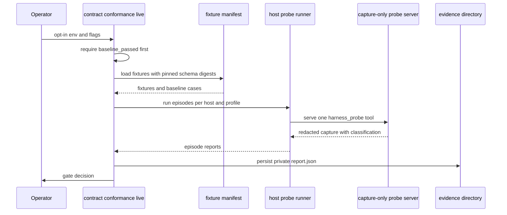

# Response Contract Surface

agent-harness exposes the same capability surface over three transports —
the `agent-harness` CLI, the MCP stdio server (51 advertised tools), and the
daemon-backed proxy — and keeps all three honest with a machine-checkable
**compatibility contract**: a versioned document that names every CLI command,
every MCP tool, and every public response's required fields, pinned by
`contractgolden` and `harnessapp` golden snapshots and summarized by
`agent-harness contract schema` / `contract check`.

Related pages: [Source Map](../architecture/source-map.md),
[Domain Glossary](domain-glossary.md),
[Verification Gates](../testing/verification-gates.md),
<!-- openwiki: broken internal link [../workflows/execution-lease.md] file "../workflows/execution-lease.md" does not exist. Fix the href or restore the target, then delete this comment. -->
[Execution Lease](../workflows/execution-lease.md),
[Runtime Surfaces](../workflows/runtime-surfaces.md).

## The compatibility contract document

`BuildCompatibilityContract()` in `cmd/harness/contractcli/contract.go`
assembles the whole surface into one `CompatibilityContract`:

| Field | Content |
| --- | --- |
| `name` / `version` | `agent_harness_cli_mcp_compatibility`, version 3 |
| `cli_commands` | the canonical top-level command list from `internal/domain/cli.Commands()` |
| `mcp_tools` | every advertised MCP tool name, sorted |
| `response_fields` | map from named response to its required fields |
| `adapter_tools` | the adapter-owned tool descriptors from `mcpadapter.AdapterOwnedTools()` |
| `verification` | the commands that verify the contract |
| `hash` | SHA-256 over name, version, commands, tools, and response fields |

`contract schema [--json]` prints this document;
`contract check [--json]` prints `contract ok: <hash>` or fails with
`warnings`. The same document is reachable from inside an MCP session: the
`contract_schema` and `contract_check` tools return it through
`harnessapp.CompatibilityContract()`, so an agent can read the surface without
shell access.

```text
agent-harness contract schema --json | jq '.mcp_tools | length'
51
```

The check fails closed on two drift families:

- the three load-bearing MCP tools `contract_schema`, `worker_enqueue`, and
  `command_fake_run` must exist (`missing_mcp_tool:<name>` warnings);
- the `issueops_*` MCP surface must be exactly one tool, `issueops_execution`
  (`issueops_mcp_surface_mismatch` otherwise).

`ResponseFields` is the machine-readable half of the contract: each named
response — `self_verification_summary`, `harness_doctor`, `command_run`,
`guard_check`, `trace_analysis`, `tool_conformance_report`, `worker_job`, the
`issueops_*` family, `command_audit`, `verify_work`, `web_fetch`, and more —
is listed with its required top-level fields. The self-verification contract
itself feeds the map via `selfworkflow.BuildSelfVerificationContract()`.

The document embeds its own verification list: `go test ./... -count=1`, the
contractgolden + harnessapp Golden tests, `contract conformance baseline
--json`, and `contract check --json`. Install validation
(`cmd/harness/validationcli/contractauditworker`) consumes exactly these
commands and treats a failed or hash-empty `contract check --json` as a
validation failure.

## One catalog, three derived surfaces

<!-- openwiki: mermaid parse failed and this diagram was converted to a text fence so it does not break rendering. Fix the diagram source and restore the mermaid fence. Parser error: Heuristic: an unescaped angle bracket inside a label breaks rendering; rephrase the label. -->
```text
flowchart TD
    CT["internal/contract/<capability> DTOs"] --> RF["ResponseFields registry in contractcli"]
    USG["internal/domain/cli issueOpsUsageCatalog + Commands()"] --> U1["usage.golden.txt (contractgolden)"]
    USG --> U2["agent-harness --help text"]
    CAT["internal/domain/mcp catalogSections()"] --> ADV["AdvertisedTools()"]
    CAT --> DM["DispatchMap()"]
    CAT --> ALL["AllTools()"]
    ADV --> TL["tools/list + mcpcli/catalog.Tools()"]
    ADV --> MJ["mcp_tools.golden.json"]
    DM --> RT["registerAllTools handler resolution"]
    ADV --> DESC["conformance descriptors"]
    ADV --> OMO["HARNESS_MCP_CATALOG_SHA256"]
    RF --> CD["CompatibilityContract"]
    TL --> CD
    CD --> SC["contract schema / check"]
    CD --> CJ["contract_schema / contract_check MCP tools"]
```

*Catalog-to-surface derivation: each arrow is computed, not hand-maintained.*

### Surface 1 — CLI usage text (`internal/domain/cli`)

`internal/domain/cli` owns the canonical top-level command list
(`Commands()`) and the usage text (`Usage(version)`). The comment on
`Usage()` records the rule: the `issueops` lines are never hand-written there.
`issueOpsUsageCatalog` in the same package is the *only* source of issueops
usage lines, and `Usage()` renders a filtered projection of it (abridged keys
for top-level help, full render for `issueops --help`). The motivating
incident: `execution switch-mode` once lived in neither hand-maintained list,
and no test could catch a command missing from both. Two focused tests now
close the residual risk of the single-catalog design — every abridged key must
match exactly one catalog line, and the rendered output must contain exactly
the abridged key set.

### Surface 2 — MCP tools/list and dispatch (`internal/domain/mcp`)

`internal/domain/mcp` owns the MCP catalog. `catalogSections()` is the single
ordered source of truth: each entry binds one catalog function (e.g.
`coreProjectTools`, `CommandPolicyTools`, `StateTools`, `IssueOpsBasicTools`,
`LoopTools`, `GatesTools`, `ChannelTools`, `AdapterOwnedTools`,
`LocalAssistantTools`) to a `DispatchGroup` handler group and an `advertised`
flag. Everything else derives from it:

- `AdvertisedTools()` — the tools/list order pinned by
  `mcp_tools.golden.json`;
- `AllTools()` — everything, advertised or not;
- `DispatchMap()` — tool name → handler group, so routing cannot drift from
  the catalog.

Registering a tool in a catalog function therefore makes it both advertised
*and* routable — editing exactly one place. The `advertised: false` slot is
how the `self_augment_*` alias tools stay routable without being listed.
The transport layer re-declares nothing: `cmd/harness/mcpcli/catalog/tools.go`
builds the tools/list payload from `mcpadapter.AdvertisedTools()`, and the
Go-SDK server's `registerAllTools` resolves each tool's handler through
`DispatchMap` → `handlerGroupLookup`, a mapping that stays stable as tools are
added (only new *groups* need transport edits).

`mcpcli.HandleToolCallWithDependencies` validates every incoming call against
the advertised `inputSchema` before dispatch — via the toolconformance
validator over the schema's closed projection — so unknown keys, missing
required keys, enum mismatches, and type errors reject with `-32602` instead
of reaching handlers. Tool-level failures mirror the CLI's `{ok:false}`
payload as an `isError` text result rather than a JSON-RPC protocol error.

### Surface 3 — the schema snapshot

`contract check --json` output is itself a checkable snapshot: its
`response_fields` map is compared field-by-field by focused tests (for
example, `issueops_execution` must be exactly
`ok,id,execution,issue_snapshot_source,next_command`, and legacy
`issueops_handoff_claim` must not reappear), and `contractgolden` pins the
same document inside `response_contracts.golden.json`.

## Golden snapshots

Two test suites pin the surface under `cmd/harness/testdata/`:

- **`contractgolden`** pins `usage.golden.txt`, `mcp_tools.golden.json` (the
  full advertised catalog, byte-for-byte), and `mcp_resources.golden.json`.
  Update only with `go test ./cmd/harness/contractgolden -run Golden -update`.
- **`TestResponseContractsGolden`** (`harnessapp`) executes the *live* CLI and
  MCP surface — inspect, docs, daemon status, preflight, policy, the whole
  state lifecycle, an end-to-end IssueOps lifecycle sequence, self-verify and
  self-augment, trace, worker, plus ~25 MCP tool calls — inside temporary
  state/workspace/git/home/worker directories with fake `gh`/`glab` binaries,
  normalizes every JSON body, and asserts equality against
  `response_contracts.golden.json`. On mismatch it prints the first
  structural difference as a JSON path, not a full blob diff.

### Normalization: keeping goldens deterministic

The live responses contain unavoidable machine state. The shared normalizer
`responsecontract.NormalizeContractValue` rewrites it to placeholders:

| Dynamic content | Placeholder |
| --- | --- |
| time keys `updated_at`/`generated_at`/`cutoff`/`started_at`/`finished_at`, and any RFC3339-like string | `$TIMESTAMP` |
| `duration_ms` on command-run shapes | `$DURATION_MS` |
| state checkpoint / record `bytes` | `$STATE_BYTES` / `$STATE_RECORD_BYTES` |
| `audit_log_id` | `$AUDIT_ID` |
| `pid` | `$PID` |
| `head`/`sha` values and git-subject-prefixed strings | `$GIT_SHA` |
| `id` starting `job-` / `io-` | `$WORKER_JOB_ID` / `$ISSUEOPS_ID` |
| gitignored project skill presence | `$PROJECT_SKILL_PRESENCE` |
| `score` floats | rounded to 2 decimals |
| test-supplied absolute paths (state dir, workspace, harness root, executable path and its SHA-256, audit log, …) | caller-provided tokens, replaced longest-first |

`NormalizeMCPTextJSON` additionally unwraps JSON encoded inside MCP `text`
content into a `json` key, so an MCP tool result and its CLI twin normalize to
the same shape. On top of the shared normalizer, the harnessapp suite applies
shape-only normalizers for known non-contract volatility:

- numeric `docs_count`/`docs_indexed` become `$DOCS_COUNT` — but *only* when
  numeric, so a type regression in the docs counters still fails the golden;
- the self-augment `implementation_delta` goal's working-tree observation
  (`evidence`/`score`/`passed`) is placeholdered — the golden must not record
  whether the current tree happens to be dirty;
- IssueOps state keys `/issueops-v1/<16-hex>/` keep only their path shape;
- the docs/inspect projections drop raw byte counts and non-required
  documents, keeping schema, counts as placeholders, and required-doc
  presence — so editing `.agent-harness/*.md` prose does not break the golden
  while structural doc regressions still do.

The dynamic-time-key vocabulary is shared with
`internal/domain/contextregion.VolatileContextFields`, so the immutable-prefix
determinism contract and the golden normalizer cannot drift apart; byte-level
determinism of both the tools list and the contract schema's immutable prefix
is itself asserted by tests.

## Checklist: adding a command or tool without drift

**New MCP tool**

1. Add the tool to exactly one catalog function referenced by
   `catalogSections()` — choosing its dispatch group and advertised flag.
2. Add a case to the owning group's handler in `cmd/harness/mcpcli`
   (`handleProjectMCPToolCall`, `handlePolicyStateMCPToolCall`, …). No
   transport wiring changes are needed unless a new dispatch group is
   introduced.
3. Put the response DTO in `internal/contract/<capability>` with its
   `schema_version`.
4. Register the response's required fields in
   `BuildCompatibilityContract().ResponseFields` if it is a new response
   shape.
5. Add snapshot runners to `buildMCPResponseContractSnapshot` (and the CLI
   twin, where applicable) and regenerate `mcp_tools.golden.json`,
   `response_contracts.golden.json` (and `usage.golden.txt` if CLI flags
   changed) with `-update`.
6. If the change touches **advertised argument semantics** of a probed tool,
   see the conformance gate below first — the fixture manifest pins the schema
   digest and will fail closed.

**New CLI command**

1. Add the canonical `{Name, Description}` to `cliadapter.Commands()` and the
   usage line. For `issueops` commands, add the line to
   `issueOpsUsageCatalog` only, and add an abridged key only if the command
   belongs in top-level help; the two catalog tests guard against silent
   disappearance.
2. Add the runner in the composition root; regenerate `usage.golden.txt` and
   the response golden if the command emits a contract response.

## Cross-host tool conformance: the evidence gate

Host LLMs do not always call tools exactly as advertised. The
`agent-harness contract conformance baseline|live|replay|serve` surface
measures what real hosts actually send, before anyone changes advertised
argument semantics.

- **baseline** — deterministic and CI-safe. It classifies the 10 synthetic
  baseline cases from the embedded fixture manifest
  (`internal/adapter/toolconformance/testdata/fixture_manifest.json`; each
  fixture pins the exact `CanonicalSchemaSHA256` of its production source
  tool) and replays every tracked regression fixture under
  `internal/adapter/toolconformance/testdata/regressions/`, requiring
  **zero handler calls and an unchanged state digest** — a drift-classifying
  probe must never reach production handlers. Failure yields the
  `inconclusive` gate.
- **live** — opt-in (`HARNESS_TOOL_CONFORMANCE_LIVE=1`), and refuses to run
  unless the baseline passes. It drives `codex`/`claude` host probe runners
  over `AdvertisedTools()` descriptors with `clean` or `context-pressure`
  profiles, bounded attempts, and resumable reports; episode reports persist
  under `.agent-harness/evidence/tool-conformance/<run>/` with 0700 dirs and
  0600 files. Gate decisions include `defer_hardening`,
  `needs_reproduction`, and `authorize_hardening`; only a signature confirmed
  by ≥ 2 completed episodes *within one host+fixture* authorizes a new tracked
  candidate regression fixture.
- **replay** — re-executes one regression fixture against a temporary state
  dir and fails unless handler calls are 0 and state is unchanged.
- **serve** — spawns the capture-only probe MCP server from
  `internal/adapter/mcp`: a server advertising a **single** `harness_probe_*`
  tool, intentionally isolated from the production catalog and dispatch path
  (a test asserts the production catalog never advertises probes). The probe
  enforces single-call semantics, run-token binding, and schema-digest
  equality, then captures redacted canonical arguments and the
  `toolconformance.Classify` verdict — one of `exact_valid`, `unknown_key`,
  `missing_required`, `enum_mismatch`, `coercible_type_drift`,
  `noncoercible_type_drift`, `valid_but_semantically_different`, and the
  structural `invalid_json`/`no_call`/`multiple_calls`.



*Live conformance: baseline first, real hosts against an isolated probe,
evidence persisted privately.*

Two downstream consumers share the same catalog source, so a catalog edit
ripples deliberately: conformance descriptors default to
`mcpdomain.AdvertisedTools`, and the Omo native install bakes
`HARNESS_MCP_CATALOG_SHA256` — computed from the same `AdvertisedTools()` —
into the installed server environment, tying install parity evidence to
catalog drift.

## Operations quick reference

```text
agent-harness contract schema --json        # print the versioned surface document
agent-harness contract check --json         # verify tool presence + issueops surface, print hash
agent-harness contract conformance baseline --json   # deterministic drift-classification gate
HARNESS_TOOL_CONFORMANCE_LIVE=1 agent-harness contract conformance live \
  --hosts codex,claude --profile clean --target-completed 1 --json
agent-harness contract conformance replay --fixture PATH --json
go test ./cmd/harness/contractgolden -run Golden -count=1
go test ./cmd/harness/harnessapp -run TestResponseContractsGolden -count=1
go test ./cmd/harness/contractgolden ./cmd/harness/harnessapp -run Golden -update -count=1
# ^ only for an intentional contract change
```

Failure semantics: `contract check` exits non-zero and prints warnings when a
required tool or the issueops surface drifts; `conformance baseline` returns
`baseline_failed` with gate `inconclusive`; `conformance live` returns
`live_opt_in_required` without the env opt-in and `baseline_failed_before_live`
if the baseline is red; replay fails on any handler call or state mutation;
golden mismatches print the first differing JSON path.
