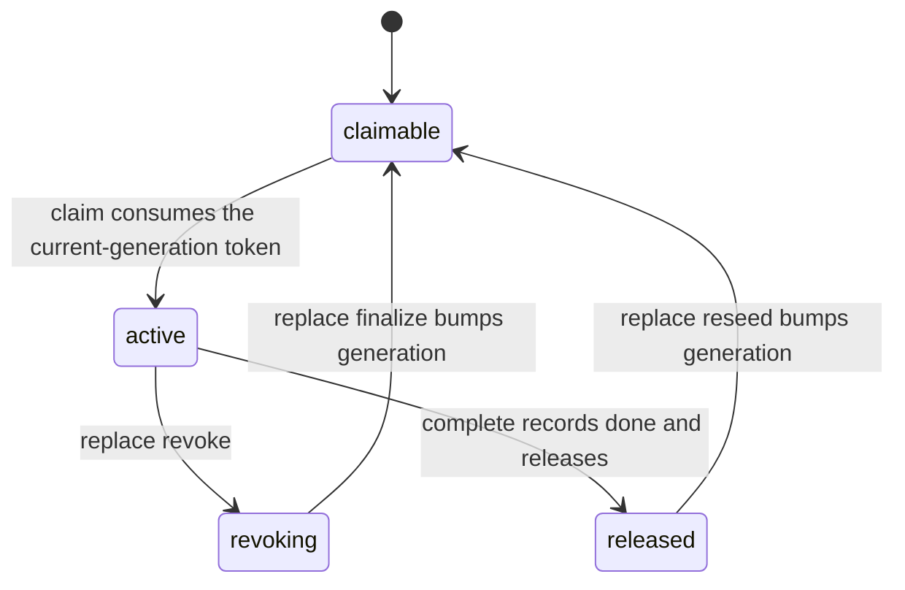

# Domain Glossary

Short definitions for the terms this repository uses over and over. Each entry
gives the definition, the failure the term exists to prevent, and one or two
authoritative pointers (owning code or `.agent-harness` doc). Deeper treatments
live in [Response Contract Surface](contract-surface.md),
[State and SQL Store](state-and-sqlstore.md),
<!-- openwiki: broken internal link [../workflows/execution-lease.md] file "../workflows/execution-lease.md" does not exist. Fix the href or restore the target, then delete this comment. -->
[Execution Lease](../workflows/execution-lease.md), and
[IssueOps Cycle](../workflows/issueops-cycle.md).

## IssueOps cycle

**Definition.** One task's durable lifecycle, stored as exactly one row in
`~/.local/state/agent-harness/issueops_v1/harness.db` (bucket `issueops_v1`).
The row holds lifecycle evidence plus at most one `Execution`: canonical
worktree, direct/orca mode, generation-fenced lease, native process receipt,
pending external intent, Orca resource identity, generation-sealed digests, and
completion receipt. The write schema is pinned at `schema_version=1`; missing,
zero, or future schema rows and legacy write-authority keys fail closed as a
generic `invalid state` — there is no auto-conversion and no reset command, so a
non-current record means restart the record. Freeform values are stored only
after secret-like redaction.

**Failure it prevents.** Parallel coordinators or schema drift resurrecting a
half-executed task, and secrets leaking into durable state. All record
read-modify-write spans serialize through `BEGIN IMMEDIATE` sqlstore spans on
the state root's `harness.lock.db`, and no Git, provider, or Orca process call
runs while the cycle lock is held.

**Pointers.** `.agent-harness/architecture/issueops.md` ("IssueOps v1 execution
state and schema authority"); `internal/contract/issueops/execution.go`
(`IssueOpsSchemaVersion`).

## IssueOps phase enum

**Definition.** The durable lifecycle labels, in fixed rank order:
`problem | grill | plan | compatibility-review | implement | ai-slop-clean |
feedback | pr | done`. Transitions are forward-only by rank; `done` is
terminal; entering `pr` runs strict readiness (loop + gates included) and
entering `done` additionally requires `pr`, a verified remote artifact, and a
released execution lease. Only `implement`, `ai-slop-clean`, and `feedback` are
resettable on a stale worktree — `pr` never resets because its work product
lives remotely. The enum deliberately has no artifact-linkage or cleanup labels:
explicit IssueOps commands own CAS, lease authority, remote writes, and cleanup.

**Failure it prevents.** Hosts and skills inventing their own stage names,
backward transitions overwriting verified state, and cleanup semantics leaking
into the durable enum.

**Pointers.** `internal/contract/issueops/phase.go`;
`internal/adapter/issueops/issueops_phase.go`
(`validateIssueOpsPhaseTransition`); `internal/domain/issueops/phase.go`.

## Phase ledger

**Definition.** `IssueOpsPhaseLedger` — a map keyed by the authoritative phase
identity, recording observed `entered_at`/`completed_at` timestamps, artifact
keys, and missing keys per phase. It is an *index over* the existing
source-of-truth fields, never their replacement. A successful forward
transition stamps the leaving phase complete and the entering phase entered; a
devil's-advocate regress retains plan/compatibility-review entries as audit but
marks them stale; status derivation backfills a derived display ledger in
memory and does not persist it.

**Failure it prevents.** "Done" claims with no observed evidence, and a
duplicated source of truth drifting from the readiness checks that actually
gate transitions.

**Pointers.** `internal/contract/issueops/types.go` (ledger types);
`internal/adapter/issueops/issueops_phase_ledger.go`
(`stampIssueOpsForwardTransition`); `internal/domain/issueopsstatus/projector.go`.

## Execution lease

**Definition.** `WriteLease` — the record's single write authority: a
`generation` starting at 1 plus one status of `claimable | active | revoking |
released`. Validation pins each status shape: claimable has one claim-token
hash and no holder; active has a validated holder and no token; revoking keeps
the fenced holder for quiescence diagnosis only; released retains neither. One
record has one active execution (not one per source repository), so parallel
cycles stay independent. Direct preparation grants generation 1 to the caller;
Orca preparation stores a claimable generation.

*Execution lease lifecycle; every mutation re-fences on generation, native
actor receipt, and canonical cwd. In direct mode prepare grants generation 1
already active to the caller.*

**Failure it prevents.** Two sessions writing one worktree, and stale holders
keeping authority after release.

**Pointers.** `internal/contract/issueops/execution.go` (`WriteLease`,
`validateWriteLease`); `internal/domain/issueopslease`.

## Generation fence

**Definition.** Every mutating transition must carry the currently active
generation plus the matching native actor and canonical cwd; a stale generation
is rejected before the record CAS. Replacement and reseed advance the
generation; post-completion base-sync authority binds to the released lease's
stamped completion generation, and completion history never restores current
authority. Generated `next_command` output embeds the same generation so
callers cannot replay an older one.

**Failure it prevents.** A zombie or restarted process replaying superseded
authority against a lease that replacement or reseed has already moved past.

**Pointers.** `.agent-harness/architecture/issueops.md` ("Generation fence and
sealed owner context"); `internal/adapter/issueops/execution_lease.go`
(`executionRecordAtGeneration`); `internal/domain/issueopslease/reseed.go`.

## Native actor receipt

**Definition.** The trust boundary is the exact native actor: host restricted
to `codex | claude | omo`, a session/agent ID, and a PID-reuse-safe
`NativeProcessReceipt` (PID + started-at + executable), evaluated against the
canonical worktree cwd. Process ancestry is observed by first-party adapters
and never accepted from JSON. A reverse lease-holder index (one active lease
per session key) fails closed when a native session already holds a different
active lease.

**Failure it prevents.** PID reuse, generic session bindings, or terminal
handles impersonating the current writer.

**Pointers.** `internal/contract/issueops/execution.go` (`NativeActor`,
`ValidateNativeActor`); `internal/domain/issueopsauthorization/authorization.go`;
`internal/adapter/issueops/execution_state.go` (lease-holder index).

## Sealed owner context

**Definition.** At Orca prepare the harness seals, per generation: SHA-256
digests of the issue body, a private context packet, and the fully rendered
owner prompt, plus owner host/model/effort and stable Orca resource IDs —
written as bounded 0600 files inside the canonical worktree. Resume re-reads
the packet and re-verifies its identity and digests against the durable record
before the owner restarts; the Orca claim consumes the current-generation claim
token exactly once, and token contents never enter state, prompts, or logs.
After the terminal preparation intent is deleted, identity version 1 and these
digests are the resume trust root — the prompt is never re-rendered. Staged
artifacts (plan/spec/turing-loop) share the record's lifetime.

**Failure it prevents.** Prompt, issue-body, or packet drift between prepare
and claim, and mutation-time context differing from what the owner was
actually dispatched with.

**Pointers.** `internal/adapter/issueops/execution_owner_context.go`;
`internal/adapter/issueops/execution_resume.go`
(`validateExecutionResumePacket`).

## Intent-first external mutation

**Definition.** Workspace creation, Orca owner launch/dispatch, remote PR/MR
creation, and parent issue creation persist a pending intent (operation ID,
marker, generation, digests) *before* calling the external adapter. Timeout or
error is ambiguity, not absence: retries and mode fallback stay blocked until
reconcile proves one exact outcome. Only a proven `not_invoked` outcome is
retryable; once invocation has started, mismatched results require
reconciliation instead of automatic retry.

**Failure it prevents.** Duplicate worktrees, issues, or pull requests from
blind retries after an unknown-outcome failure.

**Pointers.** `internal/contract/issueopspreparation/intent.go`;
`internal/adapter/issueops/issue_create_intent.go`;
`.agent-harness/architecture/issueops.md` ("External intent and lock
discipline").

## Reconcile

**Definition.** The only path that resolves a pending external intent. It
inspects authoritative external inventory, then a pure planner
(`PlanReconcileStage`) picks one action: `adopt` (exactly one candidate, one
CAS), `invoke` (bounded retry with attempts), `preserve` (ambiguous — record a
finding), or `clear` (authoritative zero proves nothing was left behind, so
deleting the intent is record cleanup, not a retry). The application service
records failures and never repeats an uncertain mutation.

**Failure it prevents.** Ambiguity hardening into duplicate external resources,
and intents that could previously never be cleared (#280).

**Pointers.** `internal/domain/issueopslease/reconcile.go`;
`internal/application/issueopslease/reconcile.go`.

## Durable authority

**Definition.** The IssueOps record — not Orca, not the direct adapter, not a
host hook — is the single write authority for an execution. Branch names,
source cwd, generic session bindings, terminal handles, and stable diffs are
*not* write authority. Hooks are default-deny guards that observe, block, or
relay; they never grant leases, execute phases, or count as ownership evidence.
Generated `next_command` binds the canonical executable literal, its SHA-256,
and the lease generation; on observation failure, stale binary, or generation
drift the harness emits a structured error instead of a fallback command.

**Failure it prevents.** A second scheduler emerging inside Orca, host hooks,
or pretty-printed commands that "look right" but are not bound to observed
authority.

**Pointers.** `.agent-harness/ARCHITECTURE.md` ("IssueOps ownership");
`.agent-harness/operations/hosts.md` ("IssueOps Host Rule");
`internal/contract/commandparse/generated_command_provenance.go`.

## Gate ledger

**Definition.** The unlazy-compatible acceptance-criteria file: `- [ ] G1:
<outcome>` plus indented `CHECK:`/`EXPECT:`/`EVIDENCE:` lines plus `ABANDON:`.
The checkbox is a claim and EVIDENCE is the proof; checked-but-pending is
judged unmet (classified worse than unchecked). The parser preserves unmodified
lines byte-for-byte, so CRLF, prose, and comments survive round-trips. The
canonical IssueOps path is `.agent-harness/issues/<n>/gates.md`; legacy paths
(root `GATES.md`, `.agent-harness/gates/*.md`, `gates/*.md`) are read
compatibly. Creating a ledger opts the cycle in: unmet gates block `pr` entry
as `gates_incomplete:<file>`, a missing ledger adds no requirement, canonical
and legacy ledgers for the same issue number fail closed as
`duplicate_issue_artifact:<n>`, and other issues' ledgers are skipped with a
warning. CHECK commands run only through the command-policy path — never raw
shell.

**Failure it prevents.** Acceptance criteria living only in the agent's head,
and gate-filling commands bypassing the policy boundary.

**Pointers.** `internal/domain/gates/ledger.go`; `internal/domain/gates/evaluate.go`;
`internal/adapter/issueops/gatesgate/gates_gate.go`;
`.agent-harness/adr/decisions/2026-08-22-task-gate-ledger.md`.

## Loop contract

**Definition.** `agent-harness loop start/record-attempt/status/stop` — a
durable verify-until-done contract keyed by normalized repo + name. The
harness records `verify_argv`, evidence-required attempts, and terminal status
but never executes the verification itself. `stop --success` requires the
latest attempt to be `pass`; a failing attempt at the attempt cap auto-flips
the loop to `exhausted`. Same-repo `active`/`exhausted` loops block strict PR
readiness as `loop_incomplete:<loop-id>`, and `doctor` reports incomplete loop
contracts per repo.

**Failure it prevents.** Verification debt — an agent declaring done with no
recorded, passing verification attempt for that repo.

**Pointers.** `internal/adapter/looprun/lifecycle.go`;
`internal/adapter/issueops/loopgate/loop_gate.go`;
`.agent-harness/adr/decisions/2026-07-09-loop-contracts.md`.

## Channel

**Definition.** Minimal session-to-session messaging over the shared harness
state: `channel send` appends and `channel recv` reads with a `since` cursor
and `--wait` blocking (250 ms poll, 300 s default). Nanosecond hex message IDs
make storage-key order the arrival order. One contract (schema v1) serves both
the CLI and MCP transports across Codex/Claude/Omo sessions. Deliberately not
an authentication boundary: only sessions that already share the state are
trusted; semantics stop at sender/body/time.

**Failure it prevents.** Every host pair reinventing ad-hoc coordination on
`state write`, and the primitive accreting unproven request/response or
broadcast semantics.

**Pointers.** `internal/contract/channel/types.go`;
`.agent-harness/adr/decisions/2026-08-22-cross-session-channel.md`.

## Policy catalog

**Definition.** The built-in allow/deny catalog for command execution — shell
interpreters, network commands/subcommands, write commands/subcommands, and a
read-only allowlist — owned by `internal/adapter/policy/policy_catalog.go` and
exposed via `CommandPolicySummary()`. Workspace `.agent-harness/policy.json`
overrides are additive only and can never remove built-in entries. Decisions
resolve to tiers (`read_only`, `workspace_write`, `network_access`,
`shell_exception`) with rationale, and are audited in redacted form. Gate
CHECK commands, `policy run --read-only`, and worker execution all pass through
this one catalog.

**Failure it prevents.** Shell interpolation or network/write capability
sneaking in through any executor — including the gates runner and worker.

**Pointers.** `internal/adapter/policy/policy_catalog.go`;
`internal/domain/policy/decision.go`; `.agent-harness/architecture/runtime.md`
("Command / policy model").

## Capability vertical

**Definition.** The layering rule for each capability (e.g. `execution
release`, `issueopspublication`): stable contract DTOs → pure domain decision →
capability-local application service → inbound/outbound adapters, with only
`cmd/harness/harnessapp` wiring concrete adapters. Cross-capability adapter
edges are banned: one capability consumes another via injected function
variables installed at the composition root (the `loopgate`/`gatesgate`
pattern), and the dependency ratchet in `internal/architecture` keeps the
production import graph clean by test.

**Failure it prevents.** Capability entanglement — a vertical reaching into
another vertical's adapter instead of going through the composition root.

**Pointers.** `.agent-harness/architecture/issueops.md` ("Capability
verticals"); `cmd/harness/harnessapp/gates_wiring.go`;
`.agent-harness/architecture/hexagonal-core.md` ("Dependency fitness ratchet").
