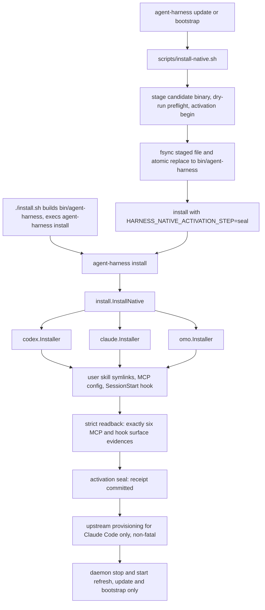

# Host Integrations (Codex / Claude Code / Omo)

agent-harness reaches coding agents through exactly three first-party host
adapters — **Codex**, **Claude Code**, and **Omo native** — all driven by one
host-neutral install engine. Every adapter obeys the same thin-adapter rules:
it owns only the concrete files its host reads, it links shared skills instead
of copying them, it registers only a `SessionStart` context hook by default,
and it never duplicates domain or application policy. The same
`agent-harness` CLI/MCP core serves all three hosts.

Related pages: [Architecture Overview](../architecture/overview.md),
[Source Map](../architecture/source-map.md),
[Contract Surface](../concepts/contract-surface.md),
[Project Docs Workflow](../workflows/project-docs.md).

## The host-neutral install engine

`install.InstallNative` (`internal/adapter/install`) is the only installation
orchestrator. It validates shared inputs, resolves the stable root, discovers
the shared skill list once, and then delegates every concrete filesystem write
to host adapters through the `port.HostInstaller` interface (`Name()` +
`Install(request)`). The composition root (`cmd/harness/harnessapp`) is the
only place that assembles installers; it passes exactly the three first-party
implementations, so the aggregate result covers all hosts in the deterministic
order codex → claude → omo, with per-host errors joined into the final result.

| Host | User-level surfaces written by default |
| --- | --- |
| Codex | `~/.codex/skills/*` symlinks (`CODEX_HOME` override honored), `[mcp_servers.agent_harness]` in `~/.codex/config.toml`, `SessionStart` hook in `~/.codex/hooks.json` |
| Claude Code | `~/.claude/skills/*` symlinks, user-scope MCP server `agent_harness` in `~/.claude.json`, `SessionStart` hook in `~/.claude/settings.json` |
| Omo native | `~/.omo/agent/skills/*` symlinks, `agent_harness` in `~/.omo/mcp.json`, `~/.omo/extensions/agent-harness.js` (`session_start`/`session_compact`) |

Each installer also refreshes the repo-owned templates under `configs/`
(`configs/codex/mcp.config.toml`, `configs/codex/hooks.json`,
`configs/claude/mcp.project.json`, `configs/claude/hooks.settings.json`,
`configs/omo/mcp.json`, `configs/omo/agent-harness.js`) so the checked-in
templates cannot drift from what the installer writes into user homes.

Before delegating, the engine normalizes the request
(`install.DefaultNativeInstallRequest`): it maps a linked Git worktree to the
source checkout that owns the common `.git` directory
(`ResolveStableNativeRoot`), requires the target binary to stay inside that
stable root (`ValidateStableNativeRuntime`, so installed hooks always execute
an installer-owned binary), defaults `CodexHome` to `~/.codex`, and derives
the skill list from `skills/<name>/SKILL.md` when not given, sorted.

One host-neutral engine serves every entry path; the script owns the staged
binary activation transaction, and the final daemon refresh belongs to the
`update`/`bootstrap` path only.

## Command matrix: install, update, bootstrap

The public setup UX has three entry commands plus two scripts:

- `agent-harness install [--interactive] [--project-local] [--path-mode=auto|manual|skip] [--adopt-command-file] [--dry-run] [--json]` — the canonical installer.
- `agent-harness update` and `agent-harness bootstrap` — refresh wrappers that
  locate `scripts/install-native.sh` and forward
  `--project-local --dry-run --path-mode=... --interactive --json --skip-build`;
  after a non-dry-run run they refresh the shared daemon (`daemon stop` then
  `daemon start` with the installed binary) so the MCP backend uses the rebuilt
  binary. They never run `git pull`.
- `./install.sh` — fresh-clone entry: builds `bin/agent-harness` and execs
  `agent-harness install`, adding `--interactive` automatically when run in a
  terminal with no arguments.
- `scripts/install-native.sh` — the automation entry used by
  `update`/`bootstrap`: it builds and stages the binary, then drives the whole
  activation transaction described below. `--skip-build` reuses an existing
  `bin/agent-harness`.

Flag semantics that matter for operations:

- `--interactive` requires a terminal and prompts for project-local opt-in and
  PATH mode; it states plainly that most installs should keep project-local
  files disabled.
- `--dry-run` plans every file and link without writing: results expose
  `WouldWrite`/`WouldCreate` entries, no paths are created, and the
  plugin-provisioning path must not even spawn the `claude` CLI (spawning it is
  itself a write — see [Upstream provisioning](#optional-upstream-provisioning-claude-only)).
- `--project-local` is the explicit opt-in for repo-local files. The default is
  user-level only.
- `--path-mode` controls the command shims `~/.local/bin/agent-harness` and the
  managed `ah` shorthand: `auto` (default) also appends a marked
  `export PATH="$HOME/.local/bin:$PATH"` line to the preferred shell rc when
  `~/.local/bin` is not already on PATH; `manual` and `skip` create the shims
  but leave the rc alone. `ah` is a symlink, not a wrapper — install refuses to
  replace a regular-file or foreign `ah`.
- `--adopt-command-file` is the only way to replace an existing *regular file*
  at `~/.local/bin/agent-harness`: it is admitted only when the file and the
  staged/canonical candidate both carry the static Go build identity, and the
  replacement runs as a transaction with a `0600` backup, atomic exchange, and
  rollback of original bytes on pre-seal failure.

`--sync` is **not** part of the host-install flag set. The only `--sync` that
changes state today is `agent-harness project bootstrap --sync`, which
refreshes a *target repo's* operating docs and profile metadata; it has nothing
to do with host MCP/skill/hook installation. The top-level usage text still
advertises `[--sync]` on `bootstrap`, but the `update`/`bootstrap` flag set
defines no such flag — the durable rule is: docs sync = `project bootstrap
--sync`, host refresh = `install`/`update`/`bootstrap`.

Default install touches **only user-level config**. The adapter contract matrix
asserts that a default install creates no `.claude/`, `.omo/`, or `.mcp.json`
inside the target repo, and that repo-local files appear only when
`project_local=true`. Even with `--project-local`, the surfaces differ per
host: Claude Code gets `.claude/skills/*` links plus `.mcp.json` (server name
`agent_harness_project`, to avoid scope collisions with the user-scope
`agent_harness`) but *never* a repo-local `.claude/settings.json` (hooks can be
committed by project-local files, so they stay out of target repos); Omo gets
`.omo/skills/*` plus `.omo/mcp.json`; Codex has no project-local surface at
all.

## Skills: one source of truth, symlinked everywhere

`skills/` is the single host-neutral source of truth for shared skills
(34 `SKILL.md` directories: the 12 pioneer-namesake skills fixed by
`internal/domain/pioneerskill` plus operational skills). Installation never
copies skill content: `PlanHostSkillLinks` symlinks each enabled skill from the
host's user skill directory to `<checkout>/skills/<name>`. Host-local copies
that drift from `skills/` are forbidden drift — after editing a shared skill,
the user-level host links must still resolve to the same original.

Two refinements keep the link set correct across installs and updates:

- Per-skill `install.json` host filter: a skill may declare
  `{"hosts": ["codex"]}` to be linked only for that host; a missing or invalid
  config keeps the historical default of installing for every host. Skipped
  skills are reported as `skip skill for <host>: <name>` messages.
- Stale-link pruning: `PruneStaleSkillLinks` removes only harness-owned
  symlinks (those pointing under this checkout's `skills/`) whose target no
  longer exists — what a removed or renamed shared skill leaves behind in every
  host skill directory. Links that point elsewhere, links that still resolve,
  and non-symlink entries are left untouched; `--dry-run` reports them as
  `would_remove`.

## Lifecycle hooks: SessionStart owns the catalog

Default installs register **exactly one** hook event, `SessionStart`, for both
Codex (`~/.codex/hooks.json`) and Claude Code (`~/.claude/settings.json`),
calling the shared context CLI — `'<bin>' hook session-start --host codex` /
`--host claude` — with a 5-second timeout. The design follows two verified host
facts (recorded in ADRs 2026-08-10 and 2026-08-27):

- Both Claude Code 2.1.247 and codex-cli 0.150.1 re-run `SessionStart` with
  `source: "compact"` after compaction, and on both hosts only `SessionStart`
  output can carry model-facing `additionalContext`. `PostCompact` output is
  user-display-only (Claude renders raw stdout as a display string; Codex's
  `post-compact.command.output` schema has no `hookSpecificOutput`), so the
  catalog is re-established through `SessionStart` and `PostCompact` is not
  registered.
- Upgrade still cleans up: the hook merge removes any managed `PostCompact`
  group from previously installed configs while preserving non-harness groups
  and their order.

The hook CLI itself has only two subcommands, `hook session-start` and `hook
post-compact`. Both read the static project-doc catalog and emit host-compatible
JSON; they never touch IssueOps, lifecycle reminders, runtime state, telemetry,
SQLite, worker recovery, or any durable state — hook output is neither an
enforcement path nor ownership evidence. `post-compact` remains available for
Omo (whose `session_compact` has no `SessionStart` re-run) and for diagnosis
(`agent-harness hook post-compact --host codex --json`). `HARNESS_DISABLE_HOOKS=1`
turns the registered hooks into silent no-ops, so a single host-level
registration can coexist with repositories the harness does not own.

Host output differences are isolated in `internal/domain/hook` adapters:
Claude Code separates the readable `systemMessage` (user) from
`hookSpecificOutput.additionalContext` (model); Codex renders
`additionalContext` in its TUI, so the readable user view replaces the compact
string and `systemMessage` is never emitted. When there is nothing to inject,
both emit `{}`.

### Merge semantics (never clobber the host's config)

Hook and MCP registration is a merge, not an overwrite. `writeClaudeSettings`
and `writeCodexHooks` read the existing JSON, validate its hook shape
(malformed known events fail the install), replace only agent-harness-owned
groups on known lifecycle events, and keep third-party groups intact. The
installers also emit two families of diagnostics: `HookTargetDriftMessages`
reports installer-owned hooks whose executable path no longer matches the
canonical binary, and `HookTargetGenerationMessages` reports the subtler case
(#328) where the path is unchanged but the file's build generation differs from
the running CLI — including the exact recovery command. Codex's
`config.toml` merge is equally conservative: it backs the file up once as
`config.toml.harness.bak`, strips only the harness-owned
`mcp_servers.agent_harness` (and obsolete hyphenated `agent-harness`) sections,
and appends the canonical block with `HARNESS_ROOT` pointing at the stable
root, writing with mode `0600`. Claude's user MCP lands as
`mcpServers.agent_harness` in `~/.claude.json` (mode `0600`, hyphenated alias
deleted); Omo's `~/.omo/mcp.json` merges the same way, preserving unrelated
servers.

## Per-host notes

### Codex

- Skills: `~/.codex/skills/<skill>` symlinks; `CODEX_HOME` overrides the home
  (the request's `CodexHome` field defaults to `~/.codex`).
- MCP: `[mcp_servers.agent_harness]` in `~/.codex/config.toml` with
  `startup_timeout_sec = 30` and `HARNESS_ROOT` env.
- Hooks: `~/.codex/hooks.json` with the single `SessionStart` group.
- System skills under `~/.codex/skills/.system` are host-managed; the harness
  never patches them, and its own skill validation uses
  `python3 scripts/validate-skill.py` so it does not depend on upstream Codex
  system-skill internals.

### Claude Code

- Skills: `~/.claude/skills/<skill>` symlinks by default;
  `.claude/skills/*` in a target repo only with `--project-local`.
- MCP: user-scope `agent_harness` server written directly into `~/.claude.json`;
  `claude mcp list` / `/mcp` verify it.
- Hooks: `~/.claude/settings.json` `SessionStart` only; repo-local
  `.claude/settings.json` is never created, because Claude project-local hooks
  get committed.

### Omo native

- Skills: `~/.omo/agent/skills/<skill>` symlinks (the Senpi agent directory);
  `.omo/skills/*` only with `--project-local`.
- MCP: `~/.omo/mcp.json` merges `agent_harness`; the installer also writes the
  current advertised MCP tool catalog digest into the server env as
  `HARNESS_MCP_CATALOG_SHA256`. Omo reuses a `tools/list` schema keyed by its
  server-config hash for up to ~7 days, so changing the catalog changes the
  config hash and forces the next session to re-fetch tools. The value is a
  cache revision token only; it does not steer MCP handler behavior.
- Lifecycle extension: `~/.omo/extensions/agent-harness.js` maps Omo
  `session_start` and *accepted* `session_compact` events to
  `agent-harness hook session-start --json` / `hook post-compact --json`,
  injecting the compact project-doc payload as a hidden custom message
  (`triggerTurn: false`); hook failures surface as UI warnings, never aborting
  the session.
- The Omo runtime itself is never installed or gated by agent-harness; install
  it through its own distribution path. Omo native became the third first-party
  host precisely so Omo MCP and lifecycle activation would come under the same
  strict readback as Codex and Claude Code.

## Activation: begin, replace, seal, rollback

Installation is a transaction, not a sequence of best-effort writes:

1. **Preflight** — `install --dry-run` runs against the staged candidate; any
   failure aborts before activation state exists.
2. **Begin** — the activation service persists a pending transition with a
   transition ID and the candidate binary's SHA-256. `scripts/install-native.sh`
   then fsyncs the staged file and `os.replace`s it onto `bin/agent-harness`
   atomically; a test pins the required `begin → replace → seal` ordering.
3. **Apply and seal** — the seal-step install runs `InstallNative`, snapshots
   every affected file, symlink, mode, and created parent directory first
   (`installHostTransaction`), then requires strict readback: exactly six
   activation evidences — `mcp` and `hooks` for each of codex, claude, omo —
   each carrying a semantic SHA-256 of the expected surface plus filesystem
   identity (regular single-link file, device/inode/mode, re-stat to detect
   concurrent modification). Claude and Omo readbacks also reject the obsolete
   hyphenated `agent-harness` alias; Omo additionally compares the extension
   bytes exactly.
4. **Commit or rollback** — on seal success the receipt is committed
   (`committed=true`); on *any* host-write or seal failure the snapshots are
   restored (including removing created parents and shims) and the pending
   transition is aborted, with `abort_required` surfaced when the failure
   happened during a seal step.

Upstream provisioning runs only *after* the seal, so a third-party CLI can
never participate in the activation transaction.

## Optional upstream provisioning (Claude-only)

`configs/upstream.json` is a declarative catalog of optional third-party
plugins and Git skills that `install` (and therefore `update`) provisions when
missing. It is deliberately separate from the shared skill layer and is
currently **Claude-only**: Codex and Omo receive only the first-party `skills/`
links. The catalog holds `version`, `plugins` (`name`, `marketplace`,
`source`; id is `name@marketplace`) and `skills` (`name`, `repo`, `path`,
`ref`) — four plugins and one skill (`cua-driver` from `trycua/cua`) at
present.

Provisioning follows the standard layering — the domain decides, the
application applies, adapters touch the host:

- The domain planner (`internal/domain/upstream`) skips any declared entry the
  host already has (`claude plugin list --json` reports the plugin in any
  scope; the skill name exists in `~/.claude/skills`, whoever created it), and
  skips plugin entries entirely when the `claude` CLI is absent — an absent
  CLI turns plugins into *skips*, never failures.
- The application service observes, plans, and applies; with `--dry-run` it
  reports plugins as `planned` without executing the CLI at all, because
  spawning `claude` creates `$HOME/.claude` and `$HOME/.claude.json` — a dry
  run that mutates the home it is only describing is not a dry run.
- Upstream skills are fetched with a shallow sparse `git clone` into a
  harness-owned cache at `<state dir>/upstream/skills/<name>` and symlinked
  into `~/.claude/skills/<name>`, mirroring first-party link shape. A fetched
  directory without `SKILL.md` is rejected and leaves neither cache copy nor
  link. The cache lives outside `skills/`, so the stale-link prune never
  touches upstream links.

Non-failure guarantees are contractual: provisioning is capped at five minutes,
runs only after the native activation receipt is sealed, and every outcome —
including total sync failure — is recorded as an `upstream ...` message while
the harness install itself stays `ok`. A missing `SyncUpstream` dependency makes
install skip upstream entirely. Prefer declaring a project as a plugin (its own
documented, versioned install path) over a skill entry, and note that a skill
entry whose name matches a first-party skill can never install — the presence
check always skips it.

## External tools are never native-install dependencies

Install, update, self-verify, and IssueOps readiness must reproduce on a
machine with none of the external tools present. This is enforced, not
aspirational: `TestInstallNativeScriptDoesNotWireCompanionTools` fails if
`scripts/install-native.sh` regains any companion-tool installer path (claude-mem,
agentmemory, llm-wiki, codegraph, npm-based installers, and so on), and the Omo
ADR forbids making the external Omo runtime an install prerequisite or readiness
gate. External tools referenced by the user are consumed at ordinary
file/command/MCP boundaries only.

## Extension seam: adding a host

Adding a fourth host is deliberately narrow:

1. Implement `port.HostInstaller` (`Name()` + `Install(NativeInstallRequest)`)
   in a new `internal/adapter/<host>` package, planning user-level skills, MCP
   registration, and lifecycle hooks through the shared `installutil`
   primitives (plan accumulator, `WriteTextPlan`/`WriteJSONPlan`,
   `EnsureSymlinkPlan`, `PlanHostSkillLinks`, hook merge helpers, activation
   evidence capture).
2. Wire it in the composition root only: append the installer to the
   `InstallNative` closure in `harnessapp.installDependencies`, add the host's
   `VerifyActivation` readback to `hostActivationReadback`, and inject the
   package's function-variable dependencies (install plan, file writers, hook
   helpers) in `configureInstallPlans`/`configureAdapterTail`.
3. Extend the contract matrix golden — nothing else. Domain and application
   policy must not be duplicated per host, and cross-adapter imports stay
   banned at zero tolerance; adapters declare their needs as function variables
   that the composition root injects, and an un-injected dependency must fail
   closed (e.g. `native installer is not configured`).

Because `install.InstallNative` fans out over whatever installers the
composition root passes, a new host automatically appears in install output,
dry-run plans, and readback requirements without touching the CLI layer.

## Verification and operations

- **Contract matrix golden**: `TestNativeInstallAdapterContractMatrix` runs
  user-global and project-local cases through all three installers and pins
  the full plan — file kinds, normalized paths/contents, link targets and
  resolution — into
  `internal/adapter/testdata/native_install_contract_matrix.golden.json`.
  Its semantic assertions lock deterministic host order, sorted skill names,
  symlinks resolving under `$ROOT/skills/*`, `SessionStart`-only hooks (with
  removed lifecycle events asserted absent), exact MCP config content, and the
  no-repo-local-writes rule.
- **Dry-run no-write**: `TestNativeInstallDryRunDoesNotWrite` asserts that
  `--dry-run --project-local` creates nothing while still exposing planned
  writes and links; the self-verification suite carries a standalone
  `install dry-run smoke` step (temporary `HOME`/`CODEX_HOME`/`HARNESS_ROOT`),
  and `scripts/release-repro-smoke.sh` re-runs it on clean machines.
- **Live checks**: `test -f ~/.codex/skills/<skill>/SKILL.md`,
  `codex mcp get agent_harness`, `claude mcp list`, `test -f ~/.omo/mcp.json`,
  `test -f ~/.omo/extensions/agent-harness.js`; hook smoke via
  `printf '{"cwd":"%s","source":"compact"}' "$PWD" | agent-harness hook session-start --host codex`.
- **Diagnostics**: `agent-harness inspect` reports Codex/Claude skill install
  paths, MCP configuration, and project-local state; `doctor` diagnoses
  install, state, hooks, MCP, daemon, and project docs together.
- **Architecture checklist**: any host-adapter change must verify it did not
  clone core contract logic and that the contract matrix golden shows no
  install-surface drift; any shared-skill change must verify the user-level
  host links still resolve to the same `skills/<name>` originals.
