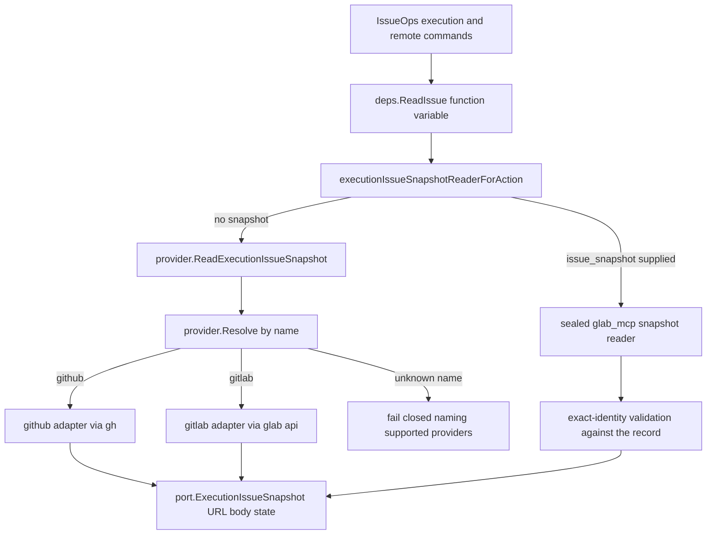
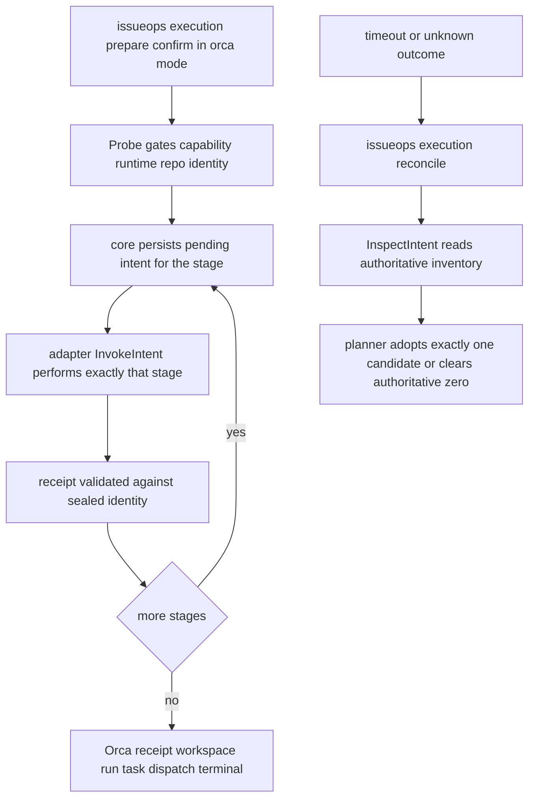

# Providers & Orca Boundary

IssueOps mutates two kinds of external systems through two adapter families:

- **Issue providers** — GitHub via `gh` and GitLab via `glab`, selected by name
  behind `port.IssueProvider`. They create/read back issues, PRs/MRs, children,
  and managed body sections.
- **Orca** — an *optional* supervised-execution adapter that wraps the installed
  `orca` CLI to provision worktrees, terminals, Runs, tasks, and dispatches for
  Orca-mode cycles.

Both families obey the same discipline: only normalized DTOs cross
`internal/port`; the durable IssueOps record — not the adapter — owns write
authority; every external mutation persists a pending intent *before* the
adapter call, and ambiguity after the call is treated as *unknown*, never as
absence, until `execution reconcile` (or `remote reconcile-issue`) adopts
exactly one candidate.

Related pages: [Domain Glossary](../concepts/domain-glossary.md),
<!-- openwiki: broken internal link [../workflows/execution-lease.md] file "../workflows/execution-lease.md" does not exist. Fix the href or restore the target, then delete this comment. -->
[Execution Lease](../workflows/execution-lease.md),
[IssueOps Cycle](../workflows/issueops-cycle.md),
[Operations Runbook](../operations/runbook.md).

## Provider dispatch: gh vs glab

`internal/adapter/provider/resolve.go` is the only name-based dispatch point.
`Resolve(name)` switches on `"github"` and `"gitlab"` and returns a
`port.IssueProvider`; any other name fails with an error that names the
supported list (`supported: github, gitlab`). The package comment states the
hexagonal reason it lives in the adapter layer: `internal/core` never imports
concrete provider implementations — core depends only on the `port.IssueProvider`
abstraction and receives a resolved provider from its caller (in production,
the composition root, `cmd/harness/harnessapp`).

The same file exposes `ReadExecutionIssueSnapshot(ctx, name, req)`: it resolves
the provider by name, then type-asserts the narrower
`port.ExecutionIssueSnapshotReader` capability and fails closed with a distinct
error when the provider cannot read snapshots. `Resolve` failure ("unknown
provider") and missing-reader failure are deliberately distinguishable, and a
cancelled context fails before any remote call
(`resolve_dispatch_test.go` locks both behaviors).

*Provider dispatch and issue-snapshot sourcing; every path converges on the
same normalized snapshot DTO before it can be sealed into Orca preparation.*

## The provider port and mutation contract

`internal/port/provider.go` defines the whole normalized surface:

- `IssueProvider` — `Name`, `CreateIssue`, `CreatePullRequest`,
  `CreateChild`, `CloseChild`, `CloseIssue`, `UpdateIssueBodySection`.
  Every mutating operation requires `Confirm=true`; with `Confirm=false` the
  adapter returns only a redacted dry-run preview and performs no I/O.
- `IssueProviderIssueCreateReconciler` (`FindIssueCreateCandidates`) and
  `IssueProviderRemoteCreateReconciler` (`ReconcilePullRequest`) — read-only
  candidate search used by reconciliation; `ReconcilePullRequest` results carry
  `AuthoritativeZero` so "the provider really has nothing" is provable, not
  assumed.
- Request/result DTOs carry verified canonical project authority
  (`HOST/OWNER[/NAMESPACE]/REPO`), expected head SHA, labels, assignees, and
  provider-reported lifecycle state (`opened/merged/closed` for GitLab,
  `open/merged/closed` for GitHub).

All provider subprocess I/O goes through `internal/adapter/provider/providerutil`
with hard bounds: 15 s readback timeout, 60 s mutation timeout, 256 KiB output
limit, 4096-byte diagnostics, and `policy.RedactArgv`-redacted previews.

Created artifacts are always verified by readback before the adapter reports
success: GitHub re-reads the created PR and compares title, body, branches,
draft flag, labels, assignees, and canonical URL; GitLab does the same for the
MR including head SHA and source project. A custom GitLab web authority
(explicit port or non-443) additionally requires proven `glab >= 1.82.0`
capability before any mutation. Per-provider flag-level details are owned by
`.agent-harness/operations/guides/issueops-providers.md` — this page
deliberately does not duplicate them.

## Issue snapshots for GitLab-linked Orca preparation

A GitLab-linked cycle can be prepared for Orca in two ways, and the choice is
recorded in the response as the snapshot `source`:

1. **Host-observed MCP snapshot (`glab_mcp`)** — the host agent finds a trusted
   tool exposing the semantic leaf capability `glab_api` with a compatible
   input schema (the MCP server namespace and any personal wrapper identity are
   *not* the capability identity), reads
   `projects/<URL-escaped-project>/issues/<iid>` (with `flags.hostname` when
   the schema supports it), and supplies exactly five fields —
   `provider=gitlab`, `source=glab_mcp`, `web_url`, `body`, `state` — through
   the MCP `issueops_execution.issue_snapshot` input (schema in
   `internal/domain/mcp/issueops_catalog.go`) or a `0600` file via
   `--issue-snapshot-file` on the CLI. The harness pins no specific MCP server
   name or wrapper.
2. **Generic provider adapter (`glab_cli`)** — when no MCP evidence was
   supplied, `gitlab.Provider.ReadIssueSnapshot` runs
   `glab api projects/<escaped>/issues/<iid> --hostname <host>` through the
   bounded runner, verifies the returned `web_url` matches the linked issue,
   and tags the snapshot `source=glab_cli`.

Both paths converge on one normalized DTO
(`contract/executionissue.ExecutionIssueSnapshot`, re-exported by the port
package) holding only URL, body, state, and source. Exact identity is
structural: canonical HTTPS host (lowercased authority) + project path + IID,
with `/-/issues/:iid` and `/-/work_items/:iid` accepted as the *same* identity
only when authority, project, and IID all match (GitLab 18.10+ redirects
issues to work items, so both aliases must resolve). The body must be
non-empty and at most 512 KiB (`1 << 19` bytes, mirrored by the MCP schema
`maxLength`), and state must be `opened` or `closed`.

Fail-closed rules for this boundary:

- A supplied `issue_snapshot` must have `source=glab_mcp`; anything else is
  rejected, never silently re-read via CLI.
- Already-supplied but invalid evidence is never CLI-fallback — the
  preparation fails closed. The generic CLI adapter is used only when *no*
  successful exact-identity MCP evidence existed.
- The snapshot reader is injected per action
  (`executionIssueSnapshotReaderForAction`); the MCP-evidence reader re-checks
  the linked record identity, provider, repo, and URL on every call.

## Intent-first: ambiguity is unknown, never absence

Both adapter families share one semantic, and it is the most important
behavioral contract on this page:

- The core persists a pending intent (operation ID, sealed request digests,
  marker, generation, actor) **before** invoking the provider or Orca adapter.
- `IssueProviderCreateError.Invoked` distinguishes a call that never started
  (`Invoked=false` — the only retryable case, by rerunning the exact sealed
  request) from one that started (`Invoked=true`). After invocation, a timeout,
  error, malformed output, failed live verification, or a canonical URL whose
  number cannot be projected all return "needs reconciliation; not retried"
  errors. The GitHub adapter, for example, refuses to report success when the
  created issue URL has no canonical number, because retrying would duplicate
  a remote mutation that already happened.
- Recovery goes through the reconcile path: `remote reconcile-issue` searches
  durable markers via `FindIssueCreateCandidates` (or `ReconcilePullRequest`
  for PRs/MRs); zero or multiple marker candidates stay blocked, and exactly
  one candidate is adopted only after its title/body digest and live
  labels/assignees verify. `AuthoritativeZero` (nothing found, provably) is
  the only outcome that clears an intent as record cleanup rather than retry.
- Orca intents behave identically: `InspectIntent` produces candidate
  inventories with `AuthoritativeZero`, and the reconcile planner
  (`adopt`/`invoke`/`preserve`/`clear`, see the Domain Glossary) never repeats
  an uncertain mutation.

## The Orca boundary: optional adapter, core-owned fences

Orca integration is an **optional execution adapter — not a native-install
dependency and not a second scheduler**. `self-verify` and native installation
do not require Orca. `issueops execution prepare --mode auto` probes readiness
at the pre-mutation boundary and resolves to *direct* (the plain git-worktree
driver) whenever Orca is absent or unready; only a successful probe selects
Orca. After any possible Orca mutation, the durable pending intent and the
explicit reconcile path are authoritative — retry and mode fallback stay
blocked until reconcile proves one exact outcome.

Fences are owned by the core, never the adapter: the generation-fenced lease,
native actor receipt (host, session/agent ID, PID/executable receipt), and
canonical CWD checks all live in the IssueOps contract/application layers. The
adapter receives the full sealed identity in
`port.ExecutionOrcaIntentRequest` and treats `TerminalHandle` as transient
observation only — adapters must re-resolve the handle from the persisted
worktree ID + PTY ID and the core never persists it.

### Bounded argv / timeout / envelope projection

`internal/adapter/orca` is, per the architecture boundary table, a *bounded
argv/timeout/envelope projection* of the installed Orca CLI. It must not
duplicate IssueOps state or recovery policy, host a generic driver registry,
or install Orca. Concretely:

- Fixed argv shapes with `path:`/`id:` selectors; host agent commands are
  built by `ownerAgentCommand` (single-quoted `codex --model … [-c
  model_reasoning_effort=…] [--dangerously-bypass-hook-trust]`,
  `claude --model … --effort …`, `omo --model …`), only for `codex`, `claude`,
  and `omo`.
- Timeouts: 10 s reads, 2 min create/mutations, 15 s terminal close.
- Every response must be an `orca --json` envelope (`ok`, `result`, `error`,
  `_meta.runtimeId`) within 2 MiB; stream buffers are bounded and oversized
  output is a typed error. `runtimeId` is carried into every DTO and validated
  for stability across inventory pages.
- Failures become typed `port.OrcaError{Code, Detail, Invoked, Timeout}` with
  redacted, length-bounded diagnostics; `Invoked` preserves the
  intent-first not-started vs started distinction. A non-zero exit with a
  well-formed `ok:false` envelope restores the Orca error code instead of
  collapsing to `command_failed`, which keeps consumers' `not_found`
  idempotent normalization working.
- The runner retries once without inherited Orca relay environment variables
  (`ORCA_RELAY_DIR`, `ORCA_RELAY_SOCKET_PATH`,
  `ORCA_RELAY_CREDENTIAL_FILE`) when the "no owning Orca client is connected
  to the relay" diagnostic appears — the relay identity stays outside the
  harness.

`Probe` gates readiness before anything mutates: it checks the `orca` binary,
runtime/graph `ready` state, runtime ID resolution, repo identity (ID, exact
path match, remote name, worktree base path must equal the repo's
`<repo>.worktrees` sibling), exact help-flag capability checks for *every*
Orca subcommand the harness will call (including the provider-specific
`worktree create` flags), the host agent binary plus its model-selection
flags (and, for codex, `--dangerously-bypass-hook-trust`), and orchestration
inventory runtime consistency. Any gap yields a typed code
(`capability_missing`, `worktree_base_mismatch`, `codex_hook_trust_bypass_unsupported`,
…) rather than a partial readiness.

*Per-stage Orca preparation: each stage is intent-first, the adapter performs
one bounded mutation, and ambiguity can only exit through reconcile.*

### Intent stages, worktree sealing, and reconciliation

Preparation decomposes into six sequential intent stages — `worktree_create`,
`terminal_create`, `run_create`, `run_bind`, `task_create`, `dispatch` — each
persisted by the core before `InvokeIntent` may run, with strict per-stage
receipt monotonicity (a worktree intent must not already contain a terminal or
run receipt, and so on). `InspectIntent` re-reads authoritative Orca inventory
per stage and emits candidates for the reconcile planner;
`AuthoritativeZero` distinguishes a proven-empty stage from observation
failure.

Worktree receipts must match the sealed workspace identity exactly: absolute
path, requested branch, the sealed base SHA as HEAD, and the comment marker.
Provider linkage differs:

- **GitHub**: a positive linked issue number is required and passed as
  `--issue`; the receipt's linked issue must match.
- **GitLab**: the public Orca CLI has no GitLab IID write flag, so the exact
  comment marker is the required seal, and the native linked-issue field is
  cross-checked only when observed.

**Namespace canonicalization.** Orca's `worktree create` may return the
requested branch under a namespace prefix. The adapter renames the branch with
`git branch -m` only when the created branch is exactly
`<namespace>/<requested>`, and restores the upstream afterwards: when the
sealed base is an exact Git object ID (40/64 hex chars, the IssueOps base-SHA
seal) and the remote ref `refs/remotes/origin/<branch>` provably resolves to
that SHA, the upstream is re-attached to that remote ref (GitLab's reserved
numeric branch suffixes are tolerated only under that proof); otherwise the
upstream falls back to the base branch name when the base is a plain branch
name. Execution-level fixtures additionally pin that creation stays pinned to
the sealed base *without* an absent upstream — the remote branch is required
not to exist before Orca create.

**Explicit parent lineage.** Umbrella child cycles seal a canonical parent
worktree path; `validateExecutionWorktree` then rejects any receipt that does
not prove explicit lineage: `lineageConfidence=explicit`, source
`explicit-cli-flag` (from create's `--parent-worktree`) or `manual-action`,
and an exact `repoID::parentPath` match. Independent cycles use `--no-parent`.

### Owner launch and the deliberately unwired worker-done path

`LaunchOwner` chains terminal → Run → bind → task → dispatch with receipt
validation at each hop (terminal connected+writable in the owned worktree,
Run objective matching the marker, task title sealing
`lifecycle=<id> intent=<digest>`, dispatch assignee equal to the terminal
handle). Codex and Claude are dispatched with `--inject`; **Omo is not** —
inject delivery is unproven for Omo, so the adapter validates the dispatch
preamble and delivers it as one bracketed-paste `terminal send --enter`, and
reconcile explicitly rejects Omo dispatch inspection ("prompt delivery is
unproven after dispatch").

Two Orca-task capabilities exist in the adapter but are intentionally *not*
wired into IssueOps completion: `SendWorkerDone` and
`UpdateTask`/`SettleTask`. The durable rationale is recorded on
`port.OrcaWorkerDoneClient`: IssueOps `execution complete` records only a
durable lifecycle receipt, and the Orca dispatch's terminal transition belongs
to the dispatched owner holding the sealed capability — wiring both would
create two competing completion authorities. `SettleTask` does document the
Orca Run-consumer fence recovery (on `consumer_fenced`, re-bind exactly once
via `UseRun` and retry).

## The port boundary: what crosses, what stays out

Only normalized DTOs cross `internal/port`:

- Provider port DTOs (requests, results, candidates, snapshots) plus the
  capability interfaces; the issue-snapshot DTO itself is owned by
  `internal/contract/executionissue` and merely re-exported by the port
  package, so the contract layer never imports port.
- Orca port DTOs (`OrcaProbe*`, `OrcaWorktree`, `OrcaTerminal`, `OrcaRun`,
  `OrcaTask`, `OrcaDispatch`, intent requests/receipts, owner inventory), the
  `OrcaClient` / `ExecutionOrcaProvisioner` / `ExecutionOrcaOwnerInspector` /
  `CleanupOrcaTerminals` interfaces, and the per-host implementer/planner
  model defaults that `execution prepare` applies when `--owner-model` is
  omitted.

Everything environment- or identity-flavored stays outside core: MCP server
namespaces and wrapper identity, credential profiles and tokens, Orca relay
environment, claim-token file contents (which never enter state, prompts, or
logs), and terminal handles as authority. GitLab- and provider-specific URL
parsing accepts self-hosted instances structurally (no literal "gitlab"
substring requirement), and the `CleanupOrcaTerminals` narrow surface keeps
cleanup's terminal observation/close needs (exact handle + PTY-killed receipt;
`selector_not_found` normalized to "no terminals") off the main client
interface.

## Composition and enforcement

`cmd/harness/harnessapp` is the only place concrete adapters are constructed:
`productionIssueOpsExecutionDependencies` wires `orca.NewExecution()` as both
provisioner and owner inspector and `provider.ReadExecutionIssueSnapshot` as
the snapshot reader, alongside the direct git-worktree provisioner; the CLI
and MCP facades receive injected handlers and never resolve adapters
themselves. `internal/architecture/dependency_test.go` enforces the edges:
`internal/core/issueops` must not import `internal/adapter/provider`, the
application layer must not import adapters, concrete construction
(`provider.Resolve`, `orca.NewExecution`) outside composition-root wiring is
flagged, and only `cmd/harness/harnessapp` may import
`internal/adapter/provider` as the composition root.

Representative tests that pin this boundary: `resolve_dispatch_test.go`
(dispatch + fail-closed snapshot reader), `gitlab/issue_snapshot_test.go`
(bounded exact `glab api` snapshot, `work_items` alias identity),
`execution_worktree_upstream_test.go` (sealed base without absent upstream),
and the large `client_test.go` / `execution_test.go` matrices in
`internal/adapter/orca` (envelope codes, capability probe, stage receipts).

## Operations

- Provider/Orca operational contracts, per-provider command recipes
  (`create-issue`, `reconcile-issue`, prepare preview/confirm), the
  GitHub+Orca linked-branch ordering, and the GitLab `VCS.md` snapshot
  preparation recipe live in
  `.agent-harness/operations/guides/issueops-providers.md`; the execution
  lifecycle, recovery, and owner sequence live in
  `.agent-harness/operations/guides/issueops-execution.md`.
- Remember the two one-liners: *ambiguity after a provider/Orca call is
  unknown, not absence — reconcile, don't retry*, and *Orca is optional —
  `--mode auto` falls back to direct only before mutation, never after*.
