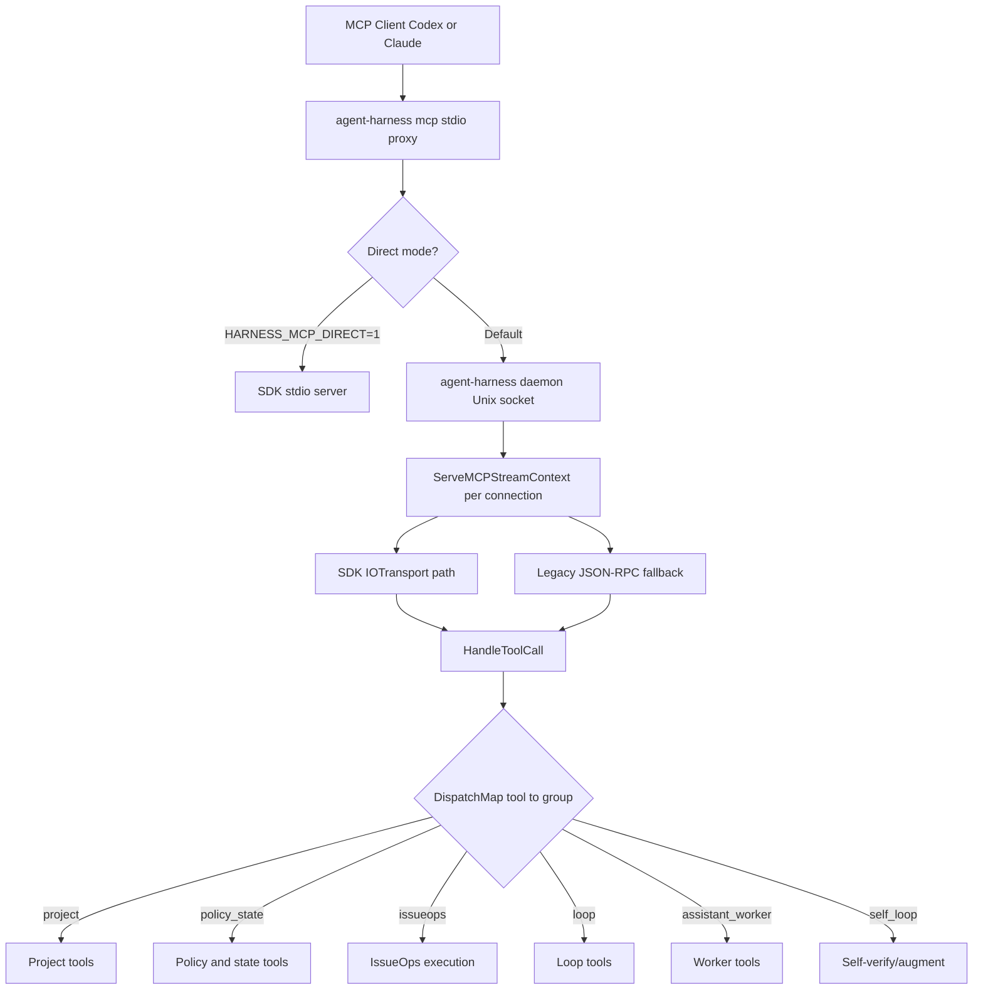

# CLI and MCP Surface

agent-harness exposes three execution surfaces — CLI one-shot, daemon-backed MCP stdio proxy, and local worker — that all converge on the same [core facades](../architecture/overview.md). The same input produces the same result regardless of which surface or host is used.

## CLI Command Tree

The binary entrypoint is [`cmd/harness/main.go`](/cmd/harness/main.go), which calls `harnessapp.RunRootCommand(os.Args[1:])`. The root command is constructed in [`harnessapp/root_command_facade.go`](/cmd/harness/harnessapp/root_command_facade.go) with a `Runners` map of subcommand-name to handler function.

The canonical command catalog is owned by [`internal/domain/cli/usage.go`](/internal/domain/cli/usage.go), which returns a deterministic `[]Command` list. This is the single source of truth — the catalog and the help text cannot drift.

### 28 Top-Level Commands

```
agent-harness
├── inspect          Installation diagnostics
├── preflight        Readiness checks
├── status           Daemon and session status
├── doctor           Cross-system health gate
├── docs             Document index
├── policy           Command policy check and fake-run
├── guard            Anti-pattern code guard
├── quality          Quality gate
├── verify-work      Work verification
├── state            State read/write/list/prune/doctor/migrate
├── issueops         Issue-driven workflow (start, execution, cleanup, benchmark)
├── loop             Verify-until-done loop contracts
├── api-doc          API documentation generation and review
├── hook             Lifecycle hooks (session-start, post-compact, user-prompt, pre/post-tool-use, stop)
├── project          Project bootstrap, draft-wiki, doc routing
├── mcp              MCP stdio proxy
├── daemon           Daemon start/stop/status
├── worker           Local job lifecycle
├── install          Native install
├── install-native   Native skill/MCP/hook install
├── update           Bootstrap and update
├── bootstrap        Full bootstrap
├── self-verify      Harness quality verification loop
├── self-augment     Improvement candidate identification
├── contract         Schema and contract check
├── web-fetch        Resilient public web fetch
└── trace, version   Diagnostics and version
```

### Exit Codes

| Code | Meaning |
|------|---------|
| 0 | Success |
| 1 | General failure |
| 2 | Bad usage/flags |
| 3 | Policy denial or guard block |
| 4 | Workspace/config problem |

Source: [`.agent-harness/CONVENTIONS.md`](/.agent-harness/CONVENTIONS.md) §3.

## MCP Server Architecture



### Transport Layer

The transport ([`mcp_transport.go`](/cmd/harness/mcpcli/mcp_transport.go)) detects whether input and output are the same bidirectional `io.ReadWriter` (e.g., a `net.Conn` from the daemon):

- **SDK path**: Uses the official `modelcontextprotocol/go-sdk` IOTransport.
- **Legacy path**: Falls back to a hand-rolled line-scanner JSON-RPC parser for backward compatibility with test harnesses.

### SDK Server

The SDK server ([`mcp_sdk_server.go`](/cmd/harness/mcpcli/mcp_sdk_server.go)) creates a singleton `*mcp.Server` with `Name: "agent_harness"`, registers all tools and resources, then serves requests. Each tool call is dispatched through `HandleToolCall`.

### Daemon Model

The daemon is a persistent user-level process managed via `daemoncli` (start, stop, status). It listens on a Unix socket under `HARNESS_DAEMON_DIR` or `~/.local/state/agent-harness/daemon`. Multiple host sessions share the same daemon for common state. The daemon handles stale locks, PID files, and socket cleanup.

## MCP Tool Dispatch

Tool dispatch is routed through six handler groups defined in [`internal/domain/mcp/catalog.go`](/internal/domain/mcp/catalog.go):

| Dispatch Group | Catalog File | Representative Tools |
|---------------|-------------|---------------------|
| `project` | `catalog.go` | `project_docs_bootstrap_plan`, `project_docs_route` |
| `policy_state` | `command_policy_catalog.go`, `state_catalog.go` | `command_policy_check`, `command_fake_run`, `state_write`, `state_read` |
| `issueops` | `issueops_catalog.go` | `issueops_execution` (single tool, action-based dispatch) |
| `loop` | `loop_catalog.go` | `loop_start`, `loop_record_attempt`, `loop_status`, `loop_stop` |
| `assistant_worker` | `adapter_owned_catalog.go`, `local_assistant_catalog.go` | `daemon_status`, local assistant tools |
| `self_loop` | self-loop catalog | `self_verify_*`, `self_augment_*` |

`HandleToolCall` ([`mcp_tools.go`](/cmd/harness/mcpcli/mcp_tools.go)) iterates handlers in order; the first handler returning `outcome.Handled` wins. Both CLI and MCP paths converge on the same core implementations.

## Contract Golden Testing

CLI and MCP contracts are pinned by golden files in [`cmd/harness/testdata/`](/cmd/harness/testdata/):

| Golden File | Pins |
|-------------|------|
| `usage.golden.txt` | Canonical CLI help text |
| `response_contracts.golden.json` | CLI and MCP response schemas |
| `mcp_tools.golden.json` | MCP tool list and ordering |
| `mcp_resources.golden.json` | MCP resource list |

Golden files are intentionally updated only when the schema is deliberately changed:

```bash
go test ./cmd/harness/contractgolden ./cmd/harness/harnessapp -run Golden -update -count=1
```

Dynamic fields (timestamps, temp paths, audit IDs) are normalized to prevent drift from host/session differences.

## Lifecycle Hooks

Default native hooks are **thinned to context-only catalog injection**. Only `SessionStart` and `PostCompact` are installed as managed hooks. Enforcement hooks (`PreToolUse`, `Stop`, `UserPromptSubmit`, `PostToolUse`, `PreCompact`) are **no longer installed by default** but are cleaned up on re-install — groups containing agent-harness hooks for removed events are deleted during merge, and empty event keys are removed.

| Hook Event | CLI Subcommand | Installed by default? | Role |
|-----------|---------------|----------------------|------|
| SessionStart | `hook session-start` | Yes | Project-doc catalog context injection |
| PostCompact | `hook post-compact` | Yes | Project-doc catalog context injection |
| UserPromptSubmit | `hook user-prompt` | No (cleaned up on re-install) | Routing and lifecycle guidance |
| PreToolUse | `hook pre-tool-use` | No (cleaned up on re-install) | Default-deny guard for mismatched mutation |
| PostToolUse | `hook post-tool-use` | No (cleaned up on re-install) | Record doc upkeep events |
| PreCompact | `hook pre-compact` | No (cleaned up on re-install) | Context preservation |
| Stop | `hook stop` | No (cleaned up on re-install) | Surface pending events and reminders |

The `--host claude` / `--host codex` flag is appended only for `session-start` and `post-compact`. Context hooks route through a lightweight dispatch path that skips the full enforcement stdin/stdout machinery. The catalog is massively simplified: `SessionStart` no longer runs runtime diagnostics, log pruning, worker-job detection, or state-store maintenance — it only injects project-doc catalog context.

Third-party hooks are preserved during merge. The merge logic detects agent-harness hooks by command prefix (`HookGroupContainsCommand`) for precise cleanup.

The [lifecycle guard](../workflows/execution-model.md) still uses hooks as default-deny enforcement points when they are configured — the thinning only affects what is **installed by default**, not what the guard enforces when present.

Source: [`internal/adapter/codex/install_hooks.go`](/internal/adapter/codex/install_hooks.go), [`internal/adapter/claude/install_hooks.go`](/internal/adapter/claude/install_hooks.go), [`cmd/harness/hookcli/hookcatalog/catalog.go`](/cmd/harness/hookcli/hookcatalog/catalog.go).
