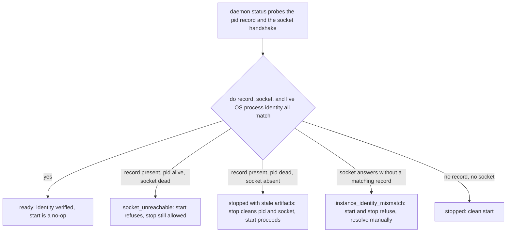
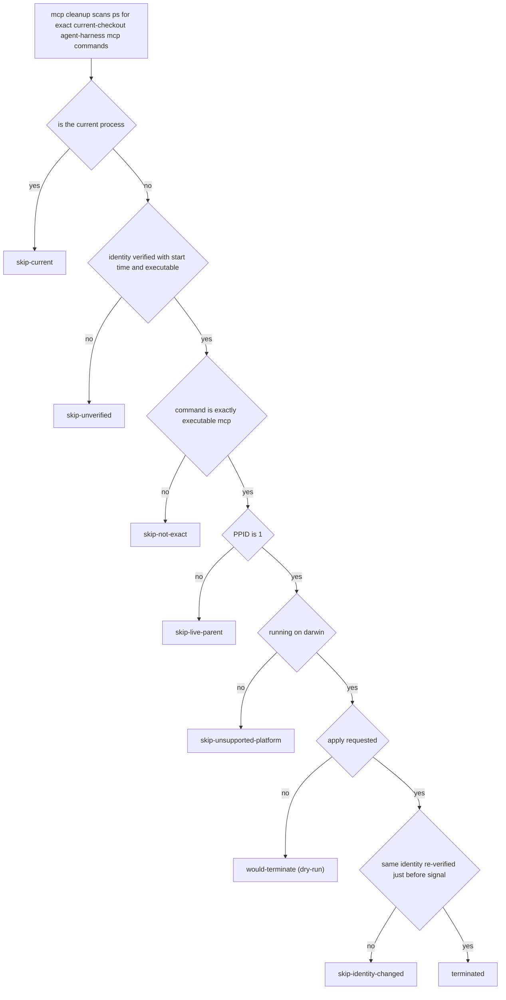

# Operations Runbook

This page collects the day-to-day operational procedures for agent-harness and
the concrete commands each procedure uses. It is organized by task: first-run
install, refresh via `ah update`, daemon won't start, stale MCP proxy
processes, state integrity, and release build/rollback. The canonical internal
owners are `.agent-harness/OPERATIONS.md` and the focused references under
`.agent-harness/operations/`; this runbook routes an operator to the right
command without duplicating their normative content.

Related pages: [Host Integrations](../integrations/hosts.md),
[Providers and Orca](../integrations/providers-and-orca.md),
[Verification Gates](../testing/verification-gates.md),
[Project Docs Workflow](../workflows/project-docs.md).

## Command identity: `agent-harness` and `ah`

`agent-harness` is the canonical command identity. `ah` is not an alias or a
wrapper — the installer creates the managed symlink
`~/.local/bin/ah -> ~/.local/bin/agent-harness`. Install/update **refuse to
overwrite** a regular file, a directory, or a foreign symlink at
`~/.local/bin/ah`; resolving the conflict is a manual step. The only sanctioned
way to replace an existing *regular file* at `~/.local/bin/agent-harness` is
`--adopt-command-file`, which admits the file only when it and the staged
candidate both carry the static Go build identity, then performs the swap as a
transaction (mode-`0600` backup, atomic exchange, displaced-identity
revalidation, restore of original bytes/mode on pre-seal failure). The `ah`
shorthand is never subject to that adoption path.

Both shims point at the checkout's `bin/agent-harness`, and executable
symlinks are resolved back to the checkout — so `ah update` works from any
working directory.

## First-run install

```bash
# From a fresh clone, before agent-harness is on PATH:
./install.sh --dry-run --json   # review the full plan
./install.sh                    # apply
```

`./install.sh` computes the checkout root, builds `bin/agent-harness` when
needed, and execs `agent-harness install`. In a real terminal with no
arguments it adds `--interactive`; non-interactive automation passes explicit
flags such as `--dry-run --json`.

```bash
# Scriptable install or refresh after agent-harness is on PATH:
agent-harness install --dry-run --json
agent-harness install --path-mode=auto|manual|skip
agent-harness install --project-local        # explicit repo-local opt-in
```

What a default (user-level) install writes — and nothing else:

- Command shims: `~/.local/bin/agent-harness -> <checkout>/bin/agent-harness`
  and the managed `ah` symlink.
- Skill symlinks for all three hosts (`~/.codex/skills/*`,
  `~/.claude/skills/*`, `~/.omo/agent/skills/*`) plus `--path-mode=auto`
  shell rc PATH line.
- MCP registration (`~/.codex/config.toml`, `~/.claude.json`,
  `~/.omo/mcp.json`) and lifecycle hooks (`~/.codex/hooks.json`,
  `~/.claude/settings.json`, `~/.omo/extensions/agent-harness.js`).

Default install does **not** create target-repo `.claude/skills`,
`.claude/settings.json`, `.mcp.json`, `.omo/skills`, or `.omo/mcp.json`;
those appear only through explicit `--project-local`. Host install semantics
are owned by [Host Integrations](../integrations/hosts.md).

Two safety properties to rely on during install:

- `--dry-run` plans every file and link without writing; stale skill links
  (harness-owned links whose target under this checkout's `skills/` no longer
  exists) are reported as `would_remove`, not deleted.
- Before any non-dry-run activation, the installer renders the complete host
  and shell-path plan and snapshots every affected file, symlink, mode, and
  newly created parent directory. Any host write or activation-seal failure
  restores those snapshots together with the command shims before aborting. If
  only post-seal backup cleanup fails, the activation stays committed and the
  JSON receipt's `backup_retained` field names the recovery path.

`install` owns environment setup: it writes `HARNESS_ROOT` into the hosts'
MCP configuration (do not export it manually), honors a pre-set `CODEX_HOME`
(default `~/.codex`), and selects PATH handling with `--path-mode`.

## Refresh via `ah update`

```bash
ah update
ah inspect --json
```

`update` and `bootstrap` use the current checkout: they build
`bin/agent-harness`, run both shim refreshes through the same installer path,
perform native host installation, refresh the MCP registration, and — when the
shared daemon is already running — restart it so the MCP backend uses the
rebuilt binary. They **never run `git pull`**. Under the hood both commands
forward to `scripts/install-native.sh`, which stages the binary and drives the
activation transaction; use that script directly only for automation or
focused installer debugging.

Post-install daemon refresh performs, in order: `daemon stop` with the
installed binary, termination of leftover processes whose command line is
exactly `<checkout>/bin/agent-harness daemon --internal` (never the current
process), then `daemon start`. Host-owned stdio MCP proxies are deliberately
**not** enumerated or killed by update — a live proxy detects the daemon
generation replacement and re-initializes against the new generation under the
same protocol/capability contract.

Consequences for operators:

- Requests in flight at generation-replacement time are **not** auto-retried;
  the proxy answers them with the JSON-RPC error `-32002`
  `daemon_generation_changed`, `outcome=unknown`,
  `reconcile_required=true` — the caller must reconcile whether the operation
  happened.
- If the new daemon's handshake contract differs, the proxy exits so the host
  reconnects with a fresh session.
- Omo caches `tools/list` schemas keyed by server config hash for up to ~7
  days. The installer records the advertised tool-catalog SHA-256 as
  `HARNESS_MCP_CATALOG_SHA256` in the Omo server env, so a catalog change
  forces the next session to re-fetch. Replacing only the binary leaves the
  old schema visible to existing sessions.
- External GitLab MCP and personal wrapper registrations are **not** part of
  update. Check with `scripts/sync-glab-mcp.sh --dry-run`, then run
  `scripts/sync-glab-mcp.sh` explicitly when needed.

## Daily commands

```bash
agent-harness bootstrap --dry-run --json
agent-harness project bootstrap --repo /path/to/repo --dry-run --json
agent-harness project bootstrap --repo /path/to/repo --sync   # refresh repo docs/profile
agent-harness doctor --repo . --json
agent-harness status --json
agent-harness docs --json
```

`agent-harness doctor` is the daily health gate. The three read-only
projection commands have distinct scopes:

| Command | Scope |
| --- | --- |
| `status` | Daily summary. One `harness_status` payload combining inspect, doctor, daemon, state, workers, and the latest self-verify record. `ok` means no collection warnings and state/worker collection succeeded — it does not require doctor to be healthy; read `doctor.healthy` separately. |
| `inspect` | Install/native-integration detail projection: harness root, target repo, the shared skill list, and per-host integration facts (Codex/Claude skill installed, project Claude MCP config present). |
| `doctor` | Cross-system diagnosis: canonical Git state, IssueOps records/bindings, optional Orca inventory, user-state integrity, hooks, MCP, daemon admission, project docs, and the project lifecycle namespace. |

## Daemon won't start

```bash
agent-harness daemon status --json   # inspect first
agent-harness daemon stop --json
agent-harness daemon start --json
```

### Where the daemon lives

Daemon paths resolve in order: `HARNESS_DAEMON_DIR`, else
`$HARNESS_STATE_DIR/daemon`, else `~/.local/state/agent-harness/daemon`. The
directory holds `agent-harness.sock`, `agent-harness.pid`,
`agent-harness.lock`, and `agent-harness.log`.

### Reading `daemon status`

`daemon status` classifies the runtime into one code:

| Code | Meaning | Operator consequence |
| --- | --- | --- |
| `ready` | pid record, socket handshake, and live OS process identity all match; `identity_verified=true` | healthy; start is a no-op |
| `stopped` | no daemon; either clean or with a stale pid record for a dead process | start proceeds; `daemon stop` cleans stale pid/socket files idempotently |
| `socket_unreachable` | pid alive but socket does not answer | start refuses; `daemon stop` is still allowed for the recorded instance |
| `instance_identity_mismatch` | socket answers but no/foreign instance record, socket-vs-record drift, dead process, or OS start-time/executable mismatch | start **and** stop refuse; resolve manually before proceeding |
| `instance_record_unreadable` | pid/instance file cannot be read or fails validation | fix or clear the daemon state directory manually |



Daemon status resolution and the operator consequence of each code.

### What `daemon start` does

`start` is an ensure loop: it probes status first (a `ready` daemon returns
immediately; an unverified one aborts with the status code), then creates the
daemon dir `0700`, acquires the lock file, re-checks under the lock, spawns
`agent-harness daemon --internal` in a new session (`Setsid`), and polls every
50 ms until `ready` or a 15-second timeout. If another launcher holds the
lock, start waits for readiness instead of failing immediately.

### Stale lock / pid / socket recovery

- **Stale lock** (`agent-harness.lock`): the start lock treats a lock as stale
  when it is older than 30 seconds or when the recorded pid is no longer
  alive, removes it, and retries once. A live holder still causes a short wait
  and then a lock error — do not delete a fresh lock by hand.
- **Stale pid + missing socket**: `daemon stop` is idempotent here — it
  removes the leftover pid and socket files ("cleaned stale pid file") instead
  of refusing, so a crashed or externally killed daemon cannot wedge the
  post-install stop → start cycle. `daemon start` also proceeds over a dead
  pid record.
- **Socket unreachable with a live pid**: the process exists but is not
  serving. `daemon stop` can stop this instance (after identity
  verification); if identity cannot be verified, the code refuses to signal
  and the mismatch must be resolved manually.
- **Identity mismatch**: stop explicitly refuses to signal an unverified
  daemon ("refusing to stop unverified daemon"). Confirm no foreign
  `agent-harness` daemon from another checkout is bound to the socket before
  clearing daemon state by hand.

`daemon stop` signals `SIGTERM`, waits up to 3 seconds, re-verifies the OS
process identity (to avoid misreading PID reuse), and only then kills.

### Admission knobs

```bash
# before daemon start
HARNESS_DAEMON_MAX_CONNECTIONS=1024 agent-harness daemon start --json
```

Admission defaults to 256 concurrent MCP connections; `HARNESS_DAEMON_MAX_CONNECTIONS`
in `1..4096` raises it, and out-of-range or unparseable values fail safe back
to 256. Idle MCP connections are closed after `HARNESS_MCP_IDLE_TIMEOUT`
(default 30 minutes) so abandoned clients cannot pin connection slots
forever. `daemon status --json` exposes `active_connections`,
`max_connections`, `accepting`, and `draining`; doctor surfaces a saturated
daemon as the `daemon_connection_limit_reached` warning and inconsistent
admission telemetry as `daemon_admission_inconsistent`.

### MCP smoke

After changing daemon or proxy behavior, run the stdio smoke from a temp
state dir (initialize → tools/list → read the `harness://commit-policy`
resource, then stop the daemon) as documented in
`.agent-harness/operations/cli-and-mcp.md`.

## Stale MCP proxy processes

Hosts own their stdio proxy lifetimes; update never kills them, so orphaned
proxies (a host died without reaping its `agent-harness mcp` child) are
cleaned by an explicit boundary:

```bash
agent-harness mcp cleanup --json          # dry-run (default)
agent-harness mcp cleanup --apply --json  # terminate matching orphans
```

`mcp cleanup` is dry-run by default; `--dry-run` and `--apply` are mutually
exclusive. Termination is supported on darwin only — platforms where `PPID=1`
can be a live host (for example Linux containers) reject candidates with
`skip-unsupported-platform`.



Every candidate walks this gate; only `terminated` kills a process, and the
JSON result reports `matched`, `terminated`, and the per-pid action list.
Live host proxies, proxies from other checkouts, external MCP servers, and
identity-unresolvable processes are never touched. A candidate is
re-enumerated and its identity re-confirmed immediately before the signal, so
a PID that changed between scan and apply is skipped rather than mis-signaled.

## State integrity

```bash
agent-harness state write --key checkpoint-1 --value "note" --json
agent-harness state read --key checkpoint-1 --json
agent-harness state list --json
agent-harness state prune --max-age 720h --json            # dry-run
agent-harness state prune --max-age 720h --confirm --json  # delete
agent-harness state doctor --json
agent-harness state maintain --json
```

State commands operate on user-state storage (SQLite-backed), never on target
repo source files. `state prune` deletes nothing without `--confirm`;
`state doctor` is the narrow integrity check (valid records, corrupt/invalid
records, unexpected artifacts); `state maintain` compacts store WALs. When
doctor reports a `state_store` problem, its fix hint routes back to
`state doctor --json` for the narrow view.

Doctor's operational-state evaluation also folds in unexpected user-state
artifacts (unexpected files/directories), so an unexplained blob under the
state dir shows up as a doctor issue even when individual records parse.

### One-time full reconciliation

There is **no product cleanup command** for a full reconciliation. The
approved procedure uses an external mode-`0700` bundle at
`~/.local/state/agent-harness-backups/<repo-fingerprint>/<UTC-timestamp>/`;
Git and SQLite backups in it are restore-tested, while Orca snapshots are
archival evidence only (the CLI has global reset but no conditional
reset/import/restore). Stop before any reset if the final full digest drifts,
and after a reset or crash seam resume the sealed append-only journal forward
idempotently — never infer a partial rollback. See
`.agent-harness/operations/guides/troubleshooting.md` before attempting this.

## Doctor / status / inspect in practice

```bash
agent-harness doctor --repo . --json
agent-harness doctor --repo . --static-only --json     # skip live probes
agent-harness doctor --repo . --sealed --json          # strict residue profile
agent-harness doctor --repo . --preserve-cycle ID --preserve-terminal HANDLE --json
```

Doctor is the sole public cross-system health gate. Its checks cover: binary,
daemon admission, `state_store`, operational state (IssueOps cycles,
worktrees, refs, Orca inventory, unexpected artifacts), project lifecycle
namespace, project docs, repo-local runtime-state leakage, loop contracts,
pipe capacity, loopback MCP gateways (reachability and fd pressure), native
user-level integrations, and binary drift (`bin/agent-harness` older than the
newest `.go` source change → `binary_drift`, fixed by rebuilding).

Behavioral contract:

- Invocation-only preservation: `--preserve-cycle` / `--preserve-terminal`
  take repeatable exact values and apply to that invocation only. They never
  create persistent exceptions and never cure incomplete or duplicate
  identity. A plain doctor invocation writes no state.
- Profiles: the default interactive profile accepts the user's own open Orca
  terminals and message history; `--sealed` re-selects the strict residue
  contract used by sealed audits (unowned terminals and orchestration message
  history count as residue).
- `--static-only` skips the live operational, daemon, pipe-capacity, and MCP
  gateway probes but retains static checks such as `binary_drift` — this is
  the form self-verify runs against a freshly built temp binary.
- An active IssueOps execution is live only with a complete generation,
  native process receipt, canonical worktree, and mode-specific resource
  identity; process absence alone never authorizes interrupt, deletion, or
  lease replacement. Orca is optional: absence is healthy only when no durable
  cycle claims Orca resources — otherwise inventory is unknown and doctor
  fails closed.
- The stability audit builds the binary and then delegates operational
  judgment to doctor; `--preserve-terminal EXACT_HANDLE` takes precedence over
  an inherited non-empty `ORCA_TERMINAL_HANDLE`.

## Release build matrix and smoke

Release checklist (run in order on the release checkout):

```bash
git status --short --branch
go test ./... -count=1
go test -race ./... -count=1
go build -o bin/agent-harness ./cmd/harness
scripts/release-repro-smoke.sh
./bin/agent-harness self-verify --seed=100 --target-score=95 --json
```

### Clean-machine install smoke

```bash
scripts/release-repro-smoke.sh                                  # default
HARNESS_RELEASE_KEEP_TMP=1 scripts/release-repro-smoke.sh        # keep temp for debugging
HARNESS_RELEASE_SKIP_BUILD=1 AGENT_HARNESS_BIN="$PWD/bin/agent-harness" \
  scripts/release-repro-smoke.sh                                 # verify an existing binary
```

The smoke never writes to the operator's real `HOME`/`CODEX_HOME`. It runs
`install --dry-run --project-local --json` under temporary `HOME`,
`CODEX_HOME`, `HARNESS_STATE_DIR`, and a fixture `HARNESS_ROOT`, then asserts:
`ok=true`, `dry_run=true`, `project_local=true`, hosts exactly
`[codex, claude]` each with an ok dry-run, no `files[].written` and no
`links[].created`, and the fixture skill present in the plan. It then verifies
the clean `inspect` / `docs` / `state` write-read workflow under a temporary
state directory. Real installer changes should break this smoke first.

### Cross-platform build matrix

```bash
scripts/release-build-matrix.sh                                  # default matrix
HARNESS_RELEASE_OUT_DIR="$PWD/dist" scripts/release-build-matrix.sh   # keep artifacts
HARNESS_RELEASE_TARGETS="darwin/arm64 linux/amd64" scripts/release-build-matrix.sh
```

The default release matrix cross-builds `darwin/arm64`, `darwin/amd64`,
`linux/amd64`, and `linux/arm64` with `CGO_ENABLED=0` and `-trimpath`, failing
if any output is missing or empty. `windows/amd64` is excluded: the daemon
process setup uses Unix-oriented `syscall.SysProcAttr.Setsid`.

### Distribution decision gate

Tarball/manual archive is the current release distribution; **Homebrew is
deferred** behind the release gate (checklist green, clean-machine smoke
green, one-screen install/update/rollback user guide, identical
`inspect/docs/state` workflow in Codex and Claude Code, and current release
dogfood notes). The decision record lives in `.agent-harness/ADR.md`
("Distribution decision gate", 2026-06-13) and
`.agent-harness/operations/release-reproducibility.md` owns the criteria.

## Rollback caveats

Rollback criteria (any one triggers a rollback):

- `inspect --json`, `docs --json`, `state maintain --json`,
  `scripts/release-repro-smoke.sh`, `scripts/release-build-matrix.sh`, or
  `agent-harness self-verify --seed=100 --target-score=95 --json` fails on the
  release checkout.
- Codex or Claude Code cannot complete the same `inspect/docs/state` workflow
  with the rebuilt binary.
- The release checkout requires manual host-specific repair outside the
  documented install/update steps.

**Read `.agent-harness/operations/release-reproducibility.md` before running
anything in this section.** A rollback mutates both the checkout and the
installed state: the documented path resets the Git branch to a known-good
SHA and then runs `agent-harness update`, which re-runs the installer against
that checkout — replacing user-level shims, host config, and the daemon
binary, not just source files. The exact `git switch`/`git reset --hard`
commands are therefore intentionally not repeated in this wiki or in the
user-facing README; consult the owning document (and verify `git status` is
clean of unintended changes) before executing them. After rollback, confirm
recovery with `agent-harness inspect --json`, and remember that daemon and
proxy processes may still be running the pre-rollback binary until the
update-driven daemon refresh swaps them.

## Quick reference

| Symptom | Command path |
| --- | --- |
| `ah` not found after install | new shell or refresh shell command cache; confirm `~/.local/bin` on PATH |
| install refuses to write `ah`/`agent-harness` | expected protection; inspect conflict path with `--dry-run --json`, resolve manually (`--adopt-command-file` covers only an exact regular-file `~/.local/bin/agent-harness`) |
| new MCP tools invisible in host | `ah update`, reopen the host session, `ah inspect --json` |
| daemon state abnormal | `ah daemon status --json`, then `ah doctor --repo . --json` |
| orphaned `agent-harness mcp` processes | `agent-harness mcp cleanup --json` then `--apply` (darwin) |
| stale state records | `agent-harness state prune --max-age 720h --json` (add `--confirm` to delete) |
| suspect a stale binary | `agent-harness doctor --static-only --json` (`binary_drift`), then rebuild |
