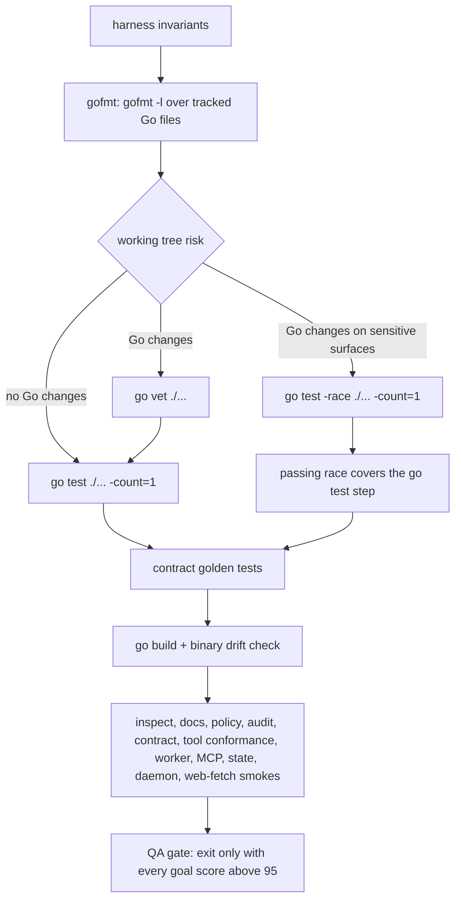

# Testing & Verification Gates

agent-harness is verified by a layered battery rather than a single test run:
Go unit/contract tests, format and vet gates, a test-only architecture fitness
suite, deterministic golden snapshots, a seed-pinned `self-verify` battery,
repo-owned Python validators, IssueOps execution verticals and benchmarks, and
a `quality inspect` health gate. The canonical owners of the rules are
`.agent-harness/TESTING.md` (the index) and its focused modules under
`.agent-harness/testing/`; this page explains what each gate guarantees, how it
fails, and where it lives. CI (`.github/workflows/ci.yml`) is a pure wiring of
the same commands — no LLM, external account, or live-skill invocation is
required at any point.

Related pages: [Dependency Ratchet](../architecture/dependency-ratchet.md),
[Response Contract Surface](../concepts/contract-surface.md),
[Operations Runbook](../operations/runbook.md),
[Safety & Policy](../operations/safety-and-policy.md),
[IssueOps Cycle](../workflows/issueops-cycle.md).

## The gate inventory

| Gate | Command / location | What it pins |
| --- | --- | --- |
| Format | `gofmt -l $(git ls-files '*.go')` | gofmt-clean tracked Go files; local twin of CI's Format check |
| Static analysis | `go vet ./...`; golangci-lint (CI/dev only) | vet diagnostics plus the golangci-lint default linter set |
| Unit/contract tests | `go test ./... -count=1` | all unit, fixture, golden, and contract regressions |
| Race | `go test -race ./... -count=1` (full) or the IssueOps focused race set | data-race freedom; conditionally elevated by the risk QA tier |
| Architecture fitness | `go test ./internal/architecture -count=1` | production import graph: layer directions, zero legacy-adapter baseline |
| Contract goldens | `go test ./cmd/harness/contractgolden ./cmd/harness/harnessapp -run Golden -count=1` | CLI usage, MCP tools/resources, and every JSON response shape |
| Install contract matrix | `go test ./internal/adapter -run TestNativeInstallAdapterContractMatrix -count=1` | Codex/Claude/Omo install files, links, and content hashes |
| Self-verify | `./bin/agent-harness self-verify --seed=100 --target-score=95 --llm-eval=false --json` | the whole battery plus the QA gate (every goal score > 95) |
| Skill validators | `python3 -m unittest discover -s scripts -p '*_test.py'`; `scripts/validate-skill.py`, `scripts/verify-skill-shell.py` | SKILL.md frontmatter and executable shell fences |
| IssueOps benchmark | `./bin/agent-harness issueops benchmark run --fixtures testdata/issueops/fixtures --judge none --json` | portable workflow evidence, deterministic scoring |
| Quality gate | `./bin/agent-harness quality inspect --json` | collection/health/gate status with fail-closed semantics |

## Minimum completion gate (even for docs-only changes)

`.agent-harness/TESTING.md` defines a minimum completion gate that applies to
*every* change, including pure documentation edits:

```bash
go test ./... -count=1
go build -o bin/agent-harness ./cmd/harness
./bin/agent-harness docs --json
./bin/agent-harness inspect --json
./bin/agent-harness self-verify --seed=100 --target-score=95 --llm-eval=false --json
```

The rationale: the harness ships docs as a first-class surface (`docs --json`
is itself a golden-pinned response), the binary must keep building, and
`self-verify` exercises the installed-behavior surface that docs describe. The
full document-stage battery in `testing/self-verification.md` adds the smoke
commands (bootstrap/install dry-runs, `guard check`, `hook session-start`,
`policy check/fake-run`, state/daemon commands, `issueops benchmark run`) on top
of this floor.

## The Go gates

```bash
gofmt -l $(git ls-files '*.go')
go test ./... -count=1
go test -race ./... -count=1
go vet ./...
go build -o bin/agent-harness ./cmd/harness
```

The gofmt gate checks exactly the file set `git ls-files '*.go'` — the same set
as CI's Format check — and passes only when `gofmt -l` prints nothing
(`gofmt -l` exits 0 even when it lists files, so the verdict is the empty
output). The parity is deliberate and load-bearing: CI stops at gofmt and never
shows later test/race/self-verify results when formatting fails, so a local
gate with a different file set would report "verified" states CI can never
produce (the 2026-08-26 lesson in `testing/unit-and-contract.md`).

`go vet` is the default static gate. golangci-lint (default linter set:
errcheck, gosimple, govet, ineffassign, staticcheck, unused; pinned to
v1.64.8 in CI via `goinstall` so the go.mod toolchain builds it) runs on top in
CI and developer workflows only — it is explicitly *not* part of the
install/update/self-verify readiness path, which must stay independently
runnable.

Small changes run targeted tests first, then the full suite before completion.
Domain/application changes have a targeted floor:
`go test ./internal/domain/... ./internal/application/... -count=1` and
`go test ./cmd/harness/harnessapp -count=1`.

## self-verify: the battery in one command

`agent-harness self-verify` plans an ordered step pipeline
(`cmd/harness/selfworkflow/steps/self_verify_steps.go`) and exits successfully
only when the QA gate finds every goal score above 95:



*The planned self-verify pipeline; the middle smoke steps run against the
freshly built temp binary in isolated temp state.*

- **gofmt** runs unconditionally, before the long `go test`, so the cheap
  deterministic failure surfaces first; the risk QA tier, by contrast, reacts
  only to working-tree changes.
- **risk QA tier** classifies the working tree: Go changes anywhere promote the
  tier to `static` (adds `go vet ./...`); Go changes touching sensitive
  surfaces (`cmd/harness/`, `internal/`, or paths containing daemon, worker,
  policy, state, mcp, adapter, install, hook, self-augment) promote to
  `elevated` (adds `go test -race ./... -count=1`). A successful full race run
  covers the plain `go test` step — the pipeline records "reused successful
  full-suite coverage from risk QA race test" instead of running the suite
  twice.
- **QA gate** checks the loop documents, `GENIUS_THINK.md`, shared skill
  metadata, native integration install state, redaction audit, bounded
  stdout/stderr metadata, and Mermaid document lint, and requires every goal
  score to exceed 95 before the run may end.

Deterministic invocations always pin `--llm-eval=false`, so an ambient
`HARNESS_SELF_VERIFY_LLM_EVAL=gate` can never silently convert the project gate
into the prompt-only diagnostic path; without an ingested external verdict the
`gate` mode stays non-passing by design. The standalone verification policy
applies to the whole battery: no external toolchains, accounts, or companion
MCP servers are prerequisites, and normal verification never clones, installs,
patches, or registers external tools. When a step fails, the summary emits
`rerun_commands` — each failed step maps to its exact reproduction command
followed by a full `self-verify --collect-all-steps` re-run.

## Architecture ratchet

`go test ./internal/architecture -count=1` is the architecture fitness gate,
owned in depth by [Dependency Ratchet](../architecture/dependency-ratchet.md).
For verification purposes, three properties matter:

- The production import inventory is collected twice per run
  (`go list -json ./...`, direct imports only) and must be byte-stable —
  nondeterministic tooling output fails loudly instead of producing a misleading
  diff.
- Unconditional layer rules (`core_must_not_import_adapter_or_cmd`,
  `domain_must_not_import_implementation`, and siblings) fail immediately over
  the entire graph; rule names and `importer -> imported` diagnostics are pinned
  by synthetic cases so the failure output an agent sees is itself part of the
  contract.
- The legacy-adapter baseline is the zero invariant:
  `TestProductionGraphHasNoLegacyAdapterEdges` fails if any legacy edge remains,
  and there is no registration path for new ones — the ratchet can only shrink.

## Contract goldens and update discipline

Golden tests freeze the observable CLI/MCP surface:

- `cmd/harness/contractgolden` pins `usage.golden.txt`,
  `mcp_tools.golden.json`, and `mcp_resources.golden.json`.
- `cmd/harness/harnessapp` `TestResponseContractsGolden` drives real CLI and
  MCP dispatch in isolated temp state and snapshots the normalized responses
  into `cmd/harness/testdata/response_contracts.golden.json`.
- `internal/adapter/install_contract_matrix_test.go` snapshots the native
  install contract (below).

Golden determinism is manufactured, not hoped for. Before comparison,
`responsecontract.NormalizeContractValue` walks the response tree and replaces
everything environment-dependent with placeholders: dynamic time keys and
RFC3339-like strings become `$TIMESTAMP`, `pid` becomes `$PID`, `head`/`sha`
become `$GIT_SHA`, `audit_log_id` becomes `$AUDIT_ID`, worker/issueops ids
become `$WORKER_JOB_ID`/`$ISSUEOPS_ID`, temp paths are replaced by
`$STATE_DIR`/`$WORKSPACE`/`$HOME`/`$HARNESS_ROOT` and friends, state-record
byte sizes are dropped, and MCP `text` payloads that parse as JSON are
normalized recursively. On top of that, three structural normalizations keep
the golden from recording repository facts that change for legitimate reasons:

- `docs_count`/`docs_indexed` numbers become `$DOCS_COUNT` — the golden
  records the response *shape*, not how many markdown files the repo happens to
  have (#109). A non-numeric docs count is a contract regression and stays in
  the golden so it fails.
- IssueOps state keys derived from lifecycle ids
  (`/issueops-v1/<16 hex>/`) become `$ISSUEOPS_STATE_KEY` — only the path
  structure is pinned.
- The `implementation_delta` goal's working-tree observation
  (evidence/score/passed) becomes a placeholder, so the golden never records
  whether the current checkout is dirty; that goal's logic is unit-tested
  separately.

Update discipline follows from determinism: goldens are updated **only when the
change to the CLI/MCP contract is intentional**, and only through the
documented regeneration commands — never by hand-editing the JSON:

```bash
go test ./cmd/harness/contractgolden ./cmd/harness/harnessapp -run Golden -update -count=1
go test ./internal/adapter -run TestNativeInstallAdapterContractMatrix -update-adapter-contract -count=1
```

The `-update` / `-update-adapter-contract` flags are the only write path
(`assertGolden` writes the file when the flag is set, otherwise compares). A
schema change must be documented with its intent and migration, and golden
files are kept small and readable. Failure output helps review the diff:
`response_contracts.golden.json` mismatches are reported as the first differing
JSON path (`$.cli.docs_index.field: got X, want Y`), not as a byte wall.

## Install contract matrix

`TestNativeInstallAdapterContractMatrix`
(`internal/adapter/install_contract_matrix_test.go`) drives the real
`install.InstallNative` with the Codex, Claude, and Omo installers over two
cases — `user-global-default` and `project-local-opt-in` — and snapshots every
written file (kind, path, content, SHA-256) and symlink (target, resolution)
into `internal/adapter/testdata/native_install_contract_matrix.golden.json`.
Companion tests prove the negative space: `--dry-run` plans writes and links
without creating any of them, and `scripts/install-native.sh` must not wire
companion tools (the test greps the script for banned lines). Changing a native
install adapter contract therefore requires regenerating this golden with
`-update-adapter-contract` in the same change.

## IssueOps execution verticals

The IssueOps execution vertical contract is owned by
`.agent-harness/testing/issueops-execution.md`; its verification shape:

- Normal tests and self-verification must stay green **without Orca** — the
  default suite uses injected workspace, provider, process, and Orca adapters.
  The current execution contract is `issueops_v1` with `schema_version=1`;
  legacy rows are reset through explicit fingerprint-CAS maintenance, never
  migrated or dual-read.
- The `execution release` production vertical is a differential test in
  `internal/adapter/issueops` comparing schema v1, missing/zero legacy schema,
  rich sidecar, holder index, and denial atomicity; the `issueopspublication`
  vertical compares frozen legacy-oracle vs new-vertical output byte-for-byte
  with fixed operation ids and a fixed clock.
- Focused package sets run before the full repository gates when touching the
  execution surface:

  ```bash
  go test ./internal/adapter/issueops/... ./internal/adapter/orca ./internal/adapter/codex ./internal/adapter/claude ./cmd/harness/issueopscli ./cmd/harness/hookcli ./cmd/harness/hookcli/hookinput ./cmd/harness/mcpcli -count=1
  go test -race ./internal/adapter/issueops/... ./internal/adapter/orca ./cmd/harness/issueopscli ./cmd/harness/hookcli ./cmd/harness/hookcli/hookinput ./cmd/harness/mcpcli -count=1
  ```

- Architecture tests in the same suite scan every production Go file in
  `internal/port/issueopsbasesync` and allow only `Request`, `Receipt`,
  `Inspector`, and the `context` import; generated-`next_command` tests must
  cover every production-reachable CLI and MCP adapter path.
- Orca live E2E is opt-in release evidence, never a default test dependency;
  when Orca is absent, explicit Orca mode must fail before mutation and `auto`
  must return the deterministic direct fallback projection.

## Python validators

Repo-owned validators and their unit tests live beside each other in
`scripts/`:

- `scripts/validate-skill.py` validates `SKILL.md` frontmatter without PyYAML:
  allowed properties are exactly `name`, `description`, `license`,
  `allowed-tools`, `metadata`; `name` must be hyphen-case, bounded to 64
  characters, without leading/trailing/double hyphens; `description` must be
  non-empty. Any unknown frontmatter key is an error.
- `scripts/verify-skill-shell.py` checks executable shell fences in shipped
  skills for syntax, swallowed failures, fabricated exit zeros, unsafe command
  expansion/word splitting, and destructive annotations; missing input or an
  unfound skill contract fails with exit 2.
- Their unit tests (`validate_skill_test.py`, `verify_skill_shell_test.py`,
  `engelbart_skill_contract_test.py`) run with
  `python3 -m unittest discover -s scripts -p '*_test.py'` — the same command
  CI runs, because the Go suite only shells out to the validators themselves.

CI's frontmatter step iterates `skills/*/` and runs `validate-skill.py` on each
directory containing a `SKILL.md`; `bash -e` fails the step on the first
invalid skill.

## IssueOps benchmark gate

`issueops benchmark run --fixtures testdata/issueops/fixtures --judge none
--json` is part of the document-stage battery. Its contract:

- Fixtures under `testdata/issueops/fixtures/` are **repo-agnostic**: they score
  portable workflow evidence (issue/PR section contracts, domain-invariant vs
  exact/equivalent mechanisms, API-doc gate evidence, live runtime evidence
  matrices, review-feedback accountability, completion hygiene), never one
  target repository's domain facts. A fixture must carry `id`, `title`,
  `user_prompt`, `repo_context`, and at least one `critical_failures` entry to
  load at all.
- Deterministic scoring checks 19 dimensions
  (`internal/adapter/issueops/benchmark/issueops_benchmark.go`), each 0 or 100;
  metadata-conditional dimensions are recorded as honest N/A and excluded from
  average/minimum/passed so an unexercised fixture neither gains a false 100
  nor loses points.
- A deterministic benchmark run passes only when `average_score == 100`,
  `minimum_score == 100`, and `critical_failure_count == 0`
  (`FinalizeIssueOpsBenchmarkRunResult` computes `OK` from exactly these
  conditions plus per-fixture `Passed`).
- `--judge file` merges an LLM judge map only after provenance validation
  against the saved source run (fail-closed, before merge), and judge scores
  can only lower a dimension, never raise it.

## Pioneer holdout fixtures

`testdata/pioneer-holdouts/` is honestly named a **reproduction harness**, not
a blind holdout: once fixtures are committed to the repo the pioneer skills
operate on, they can no longer be unseen. The committed tree holds inputs only
(broken seed files, `setup.sh` builders, `TASK.md`/`BOUNDARY.md`/
`OPERATIONAL.md` prompts) plus a redacted `evaluation-manifest.json` and
per-skill evidence records — never answers, scores, or root-cause analyses,
which live under the blanket-gitignored `.agent-harness/evidence/`.

Two gates keep this honest:

- `internal/holdoutdeleak` mechanically walks the fixture tree and fails if any
  committed file contains an answer token (`case_score`, `keep_discard_decision`,
  ...), checks that `.gitignore` still blanket-ignores `evidence`, and runs
  `git ls-files` to prove the answer tree is not force-tracked.
- `quality inspect` validates `evaluation-manifest.json` (schema 2) end to
  end: provenance invariants (`answers_committed` and `hidden_holdouts` must be
  false, sha256 receipt algorithm, execution/case counts consistent), per-run
  receipts (fresh-context child execution, bounded byte sizes, evidence-record
  digests), per-case file hashes recomputed from disk, verdict enums
  (`pass`/`blocked`/`fail`), and blocked cases carrying a `blocked_reason`.
  Blocked cases become a non-blocking p1 finding that must never be relabeled
  as pass.

## quality inspect: collection, health, and gate semantics

`agent-harness quality inspect` is the repository-health gate. Its JSON
carries three independent statuses with strict semantics
(`cmd/harness/qualitycli/quality_inspect.go`):

| Situation | `collection_status` | `health_status` | `gate_status` |
| --- | --- | --- | --- |
| Clean collect, no findings | `ok` | `healthy` | `pass` |
| Clean collect, only non-blocking findings (e.g. coverage debt) | `ok` | `needs_attention` | `report_only` |
| Clean collect, any blocking finding (p0 audit item, SNR regression) | `ok` | `needs_attention` | `block` |
| **Any collector failure** | `error` | **`unknown`** | **`block`** |

The fail-closed row is the important one: a collector that cannot run
(coverage command failure, unreadable pioneer manifest, baseline write error)
produces a p0 `quality-collector-error` finding, sets
`collection_status=error`, **refuses to claim health knowledge**
(`health_status=unknown` — the tool never reports "healthy" from incomplete
evidence), and blocks the gate. Coverage debt is the canonical
`report_only` case: the `low-coverage-packages` finding is p2 and non-blocking
(the coverage collector runs `go test -cover ./...` with a fingerprint cache
and a 10-minute timeout), as are `high-branch-functions` and
`pioneer-skill-coverage`; `project-audit-items` blocks only when a P0 item is
open, and a code-SNR regression versus the saved baseline is a blocking p1.
The exit code mirrors `gate_status`: `block` returns a
`quality gate blocked` error even in `--json` mode.

## CI parity

`.github/workflows/ci.yml` mirrors the local gates on every push and PR, in
order: checkout → setup-go (pinned by `go.mod`) → **Format check** (`gofmt -l`
over `git ls-files '*.go'`) → **Vet** → **Lint** (golangci-lint v1.64.8,
`goinstall`, default linter set; `.golangci.yml` only removes the per-linter
issue caps so local and CI report the same complete list) → **skill
frontmatter validation** (`scripts/validate-skill.py` per `skills/*/`) →
**script unit tests** (`unittest discover`) → **Build** → **Test**
(`go test ./... -count=1`, which catches golden drift) → **Race** (all
packages) → **deterministic self-verify gate** (native install with
`--skip-build --path-mode=skip` into a throwaway `HOME`/`CODEX_HOME`, then
`self-verify --seed=100 --target-score=95 --json`).

The pinned seed and `--judge none` make the CI gate a pure wiring of existing
deterministic commands: no model is called and no live skill is invoked.
Superseded runs on the same ref are cancelled (`cancel-in-progress`), and the
workflow requests only `contents: read`.

## The single-run evidence rule

Multi-stage verification has one non-negotiable contract, stated in
`TESTING.md` ("부분 검증 상태 금지" / no partial verification states) and owned
in full by `testing/self-verification.md`:

- If any stage fails, do **not** reuse the earlier stages' passes — re-run the
  whole sequence from the first gate.
- Completion-report evidence must come from the last single run in which *all*
  stages passed. Combining partial passes from different runs is forbidden.
- Even when re-running is expensive, a partial pass is never promoted to
  "verified"; if cost is the problem, split the scenario into smaller
  independent scenarios instead.

This is why the self-verify summary pairs every failed step with its exact
rerun command plus a full `--collect-all-steps` re-run: the artifact a reader
should trust is one complete pass, not a collage.
