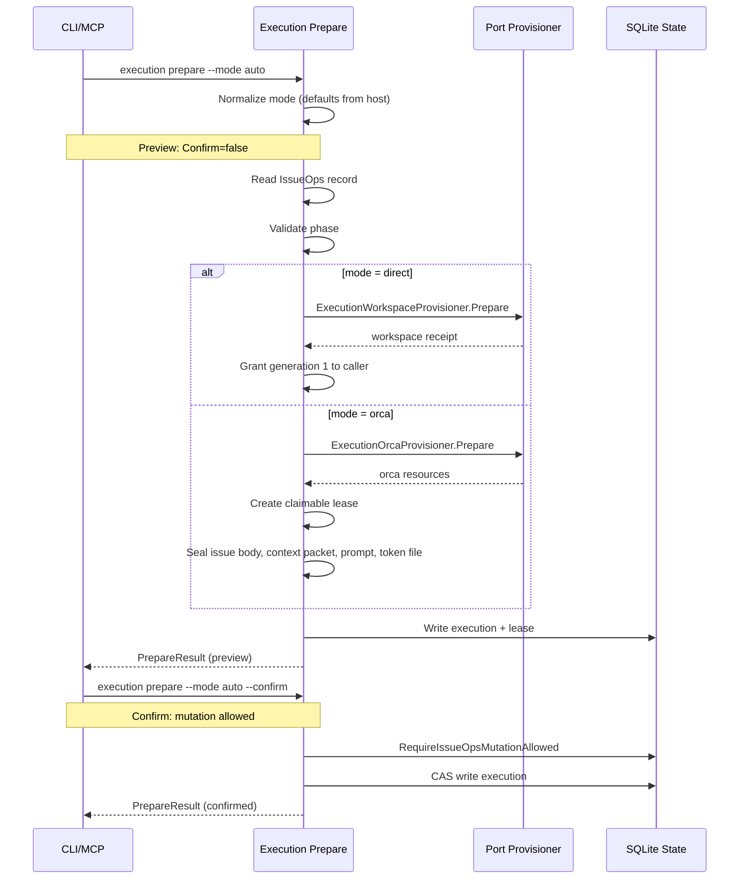
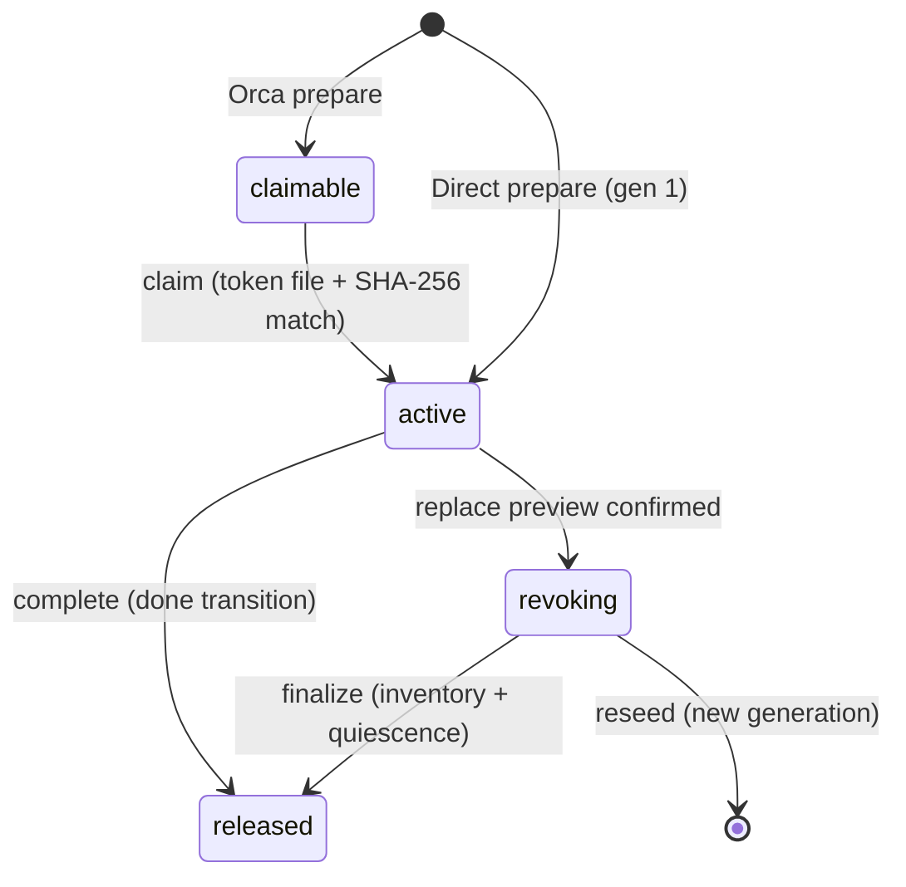
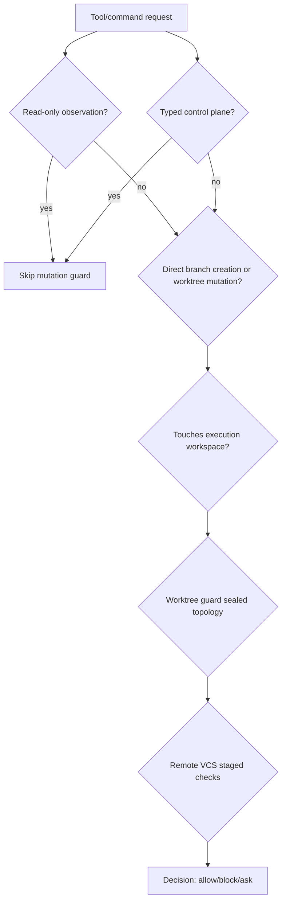
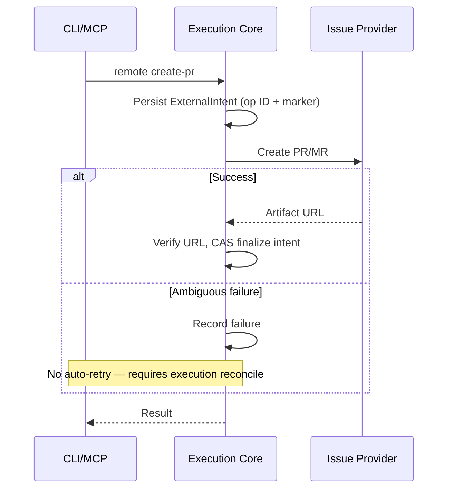

# Execution Model

IssueOps execution v1 is the system that provisions a workspace, grants a write lease to a native actor, and tracks implementation through to completion. It supports two modes — **direct** (local worktree, local agent) and **orca** (remote Orca runtime) — with a shared generation-fenced lease model.

One record has exactly one `Execution`, one canonical worktree, and one active generation at a time.

## Execution Modes

| Mode | Workspace | Lease holder | When used |
|------|-----------|-------------|-----------|
| `direct` | Local git worktree created from sealed base SHA | Caller agent gets generation 1 immediately | Default; Orca absent or unready |
| `orca` | Orca creates local worktree and branch | Claimable lease; fresh Orca owner claims via token file | `--mode orca` or `--mode auto` when Orca is ready |

The `auto` mode probes Orca readiness before any mutation. If Orca is absent or unready, it selects direct. For GitLab-linked cycles, `auto` reports `gitlab_issue_metadata_unsupported` and selects direct, because the Orca CLI currently has no sealed GitLab issue/work-item metadata mutation surface.

Source: [`internal/adapter/issueops/execution_prepare.go`](/internal/adapter/issueops/execution_prepare.go).

## Preparation Flow

Preparation seals the remote issue body SHA-256, context packet SHA-256, and owner prompt SHA-256. For Orca mode, a private claim-token file is written. Token contents never enter state, prompts, logs, or responses.

## Write Lease State Machine

Source: [`internal/adapter/issueops/execution_lease.go`](/internal/adapter/issueops/execution_lease.go), [`internal/domain/issueopslease/`](/internal/domain/issueopslease/).

### Lease Fields

| Field | Purpose |
|-------|---------|
| `Generation` | Monotonic `uint64`, incremented on replacement |
| `Status` | `claimable` → `active` → `revoking` → `released` |
| `Holder` | `*NativeActor` (host, session ID, agent ID, process receipt, ancestry) |
| `ClaimTokenSHA256` | SHA-256 of the claim token (Orca mode) |

### Generation Fence

The generation number is an optimistic concurrency fence. All claim, release, and replace operations carry `ExpectedGeneration` and reject mismatches. This ensures stale generations fail before CAS, preventing concurrent mutation.

The `reseed` action re-seals owner artifacts (issue body, context packet, owner prompt) under a new generation after replacement.

## Replacement Sequence

When an execution holder is dead or needs replacement, the sequence is:

1. **Preview** — inventory and quiescence fingerprints, expected generation, actor, cwd
2. **Revoke** — revoke the current lease
3. **Finalize-preview** — verify inventory and quiescence still match
4. **Finalize** — grant new generation
5. (or) **Reseed** — re-seal artifacts under new generation

There is no unsafe override. Inventory and quiescence fingerprints must match at each step.

Source: [`internal/adapter/issueops/execution_lease.go`](/internal/adapter/issueops/execution_lease.go), [`internal/domain/issueopslease/`](/internal/domain/issueopslease/).

## Completion Gate

Completion is the atomic transition from `pr` to `done`. It requires:

- Phase is `pr`
- Active generation
- Exact final HEAD SHA
- Committed Turing report path
- At least one verification entry
- Durable verified remote artifact at the exact URL

The completion receipt, `done` transition, and lease release are **one atomic state mutation**. Completion never merges or deletes local/remote resources — cleanup remains a separate human-authorized operation.

### Orca Task Settlement Deferred to Worker

The completion path no longer calls `SettleTask` on the Orca task. Previously, completion-side settlement terminalized the Orca task before the owner could report `worker_done`, violating the "exactly one worker_done" contract. The sealed owner `worker_done` transition is now the **only** Orca task terminal transition. The `TaskSettler` type was removed from the completion service entirely.

Source: [`internal/application/issueopscompletion/complete.go`](/internal/application/issueopscompletion/complete.go), [`internal/adapter/orca/client.go`](/internal/adapter/orca/client.go).

## GitHub Branch Ordering (Orca Mode)

GitHub + Orca mode reverses the normal branch creation order. IssueOps normally creates a linked branch first, but Orca `worktree create` always creates a new branch, so the names collide (`orca_branch_name_taken`).

The solution: prepare the branch record first (no actual branch), let Orca create the local branch, then call `createLinkedBranch` with the sealed base SHA. This works because `createLinkedBranch` fails only if the branch exists **remotely** — a local-only branch succeeds.

`gh issue develop` is explicitly not used because its `--base` takes a branch name and GitHub uses the current HEAD as `oid`, which can diverge from the sealed base SHA.

Source: [`.agent-harness/OPERATIONS.md`](/.agent-harness/OPERATIONS.md) "Optional Orca execution v1", [`internal/adapter/issueops/branchprepare/`](/internal/adapter/issueops/branchprepare/).

## Process Identity and PID Reuse Safety

Native process identity is established through OS-level observation, never from self-report or JSON:

- `NativeProcessReceipt` = `{PID, StartedAt, Executable}` — always read via `ps` fields (`lstart`, `comm`), never from state JSON.
- `ProcessAncestry` is tagged `json:"-"` — it is ephemeral, re-observed each evaluation.
- `normalizeNativeActor()` requires the session process receipt to appear in the local process ancestry (first-party observation) and the PID to be live with matching `StartedAt`/`Executable`.
- **Lease-holder reverse index** (`lease_holder_v1` bucket) maps `sha256(host\x00session_id\x00agent_id)` → `{lifecycle_id, generation}`, preventing one session from holding two active leases.

Source: [`internal/adapter/issueops/execution_process.go`](/internal/adapter/issueops/execution_process.go), [`internal/adapter/issueops/execution_state.go`](/internal/adapter/issueops/execution_state.go).

### Workspace Quiescence and Requester Ancestry Exclusion

`inspectWorkspaceProcesses` uses `lsof` to find processes holding the worktree (cwd/write/uniform access). The probe now uses the full open-file listing (`lsof -nPw -Fpcfna`) instead of recursive `+D root`, because large worktrees (e.g., `node_modules`) caused 6–8s timeouts on recursive stat.

`dropRequesterOwnedProcesses` excludes the requester's own ancestry — terminal shell, MCP servers, test runners — from quiescence candidates. These are the requesting session's own execution context, not competing writers. External session residue does not match the requester ancestry and remains fail-closed.

The probe's own `lsof` PID is excluded from results to prevent self-detection when the probe inherits the caller's CWD.

Source: [`internal/adapter/issueops/execution_process.go`](/internal/adapter/issueops/execution_process.go).

## Lifecycle Guard

The lifecycle guard is a pre-tool-use hook that intercepts every command/tool invocation and decides `allow | block | ask`. It is registered as the `hook pre-tool-use` CLI handler and is the default-deny enforcement point for execution workspace safety.

The lifecycle guard decides whether a tool/command request is admitted during active IssueOps mutation authority.

Three admission paths (all fail-closed by explicit enumeration — no rule-based classification):

1. **Observation** — read-only commands (`status`, `list`, `whoami`, `preview`, exact self-verify forms) and exact-read provider commands pass. Unclassified commands do not match. `gofmt -l` (listing mode) is admitted as read-only.
2. **Typed control plane** — `execution prepare/claim/release/replace/reconcile/complete/sync-base/switch-mode`, `cleanup orphan`, `branch await-link`. These skip the mutation block but the core still enforces lease/authority.
3. **Mutation decision** — for anything that may mutate lifecycle files: if an active lease exists and the actor matches the holder and the request stays inside the workspace root → **allow**; if the actor differs → **block** with `holder_identity_mismatch`. Exact single-commit cherry-picks (`git cherry-pick <40-char SHA>`) from completed children are admitted.

**Direct git branch creation and worktree mutation are blocked** — must go through `issueops execution prepare`.

### Pre-Link Await Window

In GitHub + Orca mode, Orca always creates a new local branch, so the remote linked branch must not exist before prepare. The owner launches in a pre-link window where the branch link is structurally absent. The lifecycle guard admits only two commands during this window: `branch await-link` (bounded polling at 15-second intervals, 10-minute default timeout) and `execution release`.

Source: [`internal/adapter/lifecycle/lifecycle_execution_guard.go`](/internal/adapter/lifecycle/lifecycle_execution_guard.go), [`internal/adapter/issueops/branch_await_link.go`](/internal/adapter/issueops/branch_await_link.go).

## Remote PR/MR Creation: Durable External Intent

`CreateRemotePullRequest` is the only PR/MR creation path. It uses a durable external intent protocol to survive ambiguous failures:

Provider reconcile matches candidate PRs against the sealed intent exactly: head SHA, title, body SHA256, labels, assignees, draft state. For GitLab draft MRs, the `Draft:` / `WIP:` title prefix is stripped before comparison. A merged or closed artifact is no longer draft, so a draft intent that was later marked ready and merged is not a contradiction.

Source: [`internal/adapter/issueops/execution_remote.go`](/internal/adapter/issueops/execution_remote.go), [`internal/port/provider.go`](/internal/port/provider.go).

## Provider Integration

The `port.IssueProvider` interface abstracts GitHub and GitLab operations. The core depends only on the interface; concrete implementations live in adapters.

| Capability | GitHub | GitLab |
|-----------|--------|--------|
| Create issues | `gh` CLI | `glab` CLI |
| Create PRs/MRs | With `ExpectedHeadSHA` optimistic concurrency | With ref-based base SHA |
| Reconcile PRs | Find existing open PRs by criteria | Find existing open MRs |
| Child work items | Provider-native subtasks | Provider-native subtasks |
| Issue body sections | Managed sections with durable markers | Managed sections with durable markers |
| Orca metadata | Sealed GitHub issue metadata | **Unsupported** (`gitlab_issue_metadata_unsupported`) |

Source: [`internal/port/provider.go`](/internal/port/provider.go), [`internal/adapter/provider/github/`](/internal/adapter/provider/github/), [`internal/adapter/provider/gitlab/`](/internal/adapter/provider/gitlab/).

## Orca Run-Scoped Inventory

All Orca inventory reads are now Run-scoped rather than ad hoc per-call. A single validated `OrcaRunInventory` snapshot (containing `RuntimeID` and `[]OrcaRun`) is fetched via cursor-based pagination, then task, dispatched-task, and gate reads fan out from that snapshot with bounded concurrency (`min(8, len(runs))` workers).

Fail-closed validation enforces: canonical runtime ID, valid Run IDs, non-empty objectives, no duplicate Runs, cursor completeness across pages, and runtime identity consistency on every task/gate response.

The [operational health](../operations/policy-guard-testing.md#operational-health) collector reuses this snapshot: one `ListRunInventory` call feeds all three typed projections concurrently via goroutines.

Source: [`internal/port/orca_context.go`](/internal/port/orca_context.go), [`internal/adapter/orca/client.go`](/internal/adapter/orca/client.go), [`internal/adapter/operationalhealth/collector.go`](/internal/adapter/operationalhealth/collector.go).

## Handoff Sealing

Claim tokens are resolved to a **deterministic current-generation path** derived from `tokenSHA256(record.ID)[:16]`, not an arbitrary user-supplied path. The token file is created with `O_CREAT|O_EXCL` and `0600` permissions; symlinks and non-regular files are rejected. The read path validates the file matches the computed path exactly and rejects oversized files (>256 bytes).

This sealing prevents generation confusion: a stale-generation token cannot be used to claim a new-generation lease. The Orca inventory port, timestamp boundary, and MCP schema are frozen as a sealed contract after handoff.

### Ghost Owner Recovery

A released Orca owner can leave a terminal row whose pane is no longer live. Previously, `PlanResume` treated this settled "ghost" as an identity conflict and blocked replacement. When the terminal is present but not live, and the prior dispatch is settled with matching sealed binding, the disposition is now `ResumeCreateTerminal` — admitting only the exact prior PTY identity.

### Absent-Workspace Lease Recovery

When the canonical worktree directory no longer exists, lease replacement finalizes directly to `Released` (not `Claimable`), since nobody can read a claim token from a missing workspace. This opens the `abandon` recovery path for leases with no holder process and no worktree.

Source: [`internal/adapter/issueops/execution_lease.go`](/internal/adapter/issueops/execution_lease.go), [`internal/domain/issueopslease/resume.go`](/internal/domain/issueopslease/resume.go).

## Adversarial Multi-Session Threat Model

Execution v1 is designed for adversarial multi-session environments:

- **Trust boundary is the exact native actor**: host, session/agent ID, process PID/start/executable receipt, canonical cwd, lifecycle ID, and generation. Branch names, source cwd, generic session bindings, and terminal handles are **not** write authority.
- **Hooks are default-deny guards** for mismatched mutation, not schedulers or lease grantors.
- **External intent is always stored first**. Timeout or ambiguous output is ambiguity, not absence. Retry and mode fallback remain blocked until `execution reconcile` proves one exact outcome.
- **No Git, provider, or Orca process call runs while the cycle lock is held**. sqlstore `BEGIN IMMEDIATE` spans serialize record CAS.
- **Self-revoke is refused**: a live holder cannot fence itself — `finalize` needs the holder dead, and `claim` needs `claimable`. This prevents a deadlock where neither path has an exit.

Source: [`.agent-harness/ARCHITECTURE.md`](/.agent-harness/ARCHITECTURE.md) "IssueOps execution v1 threat model and invariants", [`internal/adapter/lifecycle/lifecycle_execution_guard.go`](/internal/adapter/lifecycle/lifecycle_execution_guard.go).
