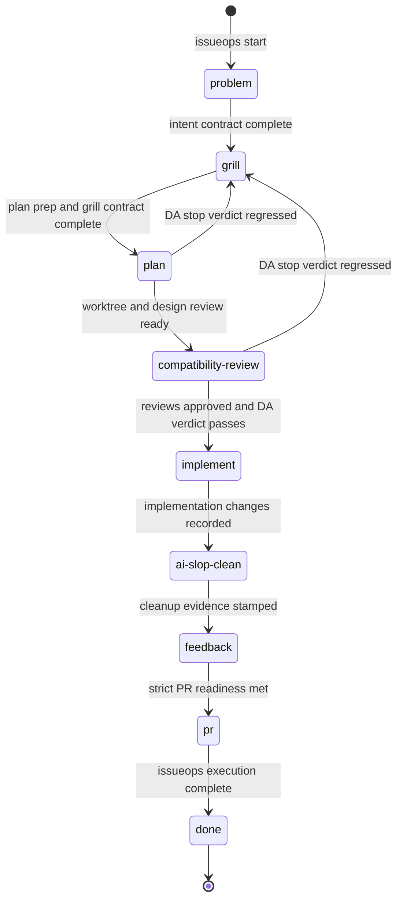
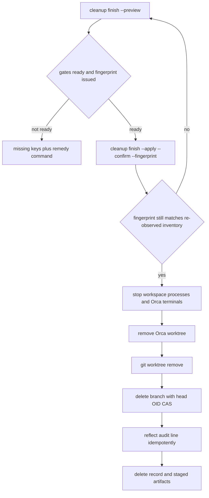

# IssueOps Cycle Workflow

One IssueOps **cycle** is the durable journey from a problem statement to a
merged, verified, and eventually deleted record. The lifecycle is owned by a
single persisted record per cycle in
`~/.local/state/agent-harness/issueops_v1/harness.db`, advanced through a
rank-ordered phase enum whose transitions are individually gated, published to
remote providers through intent-first commands, completed atomically, and
retired by human-authorized cleanup commands or by retention prune. This page
documents the end-to-end flow: the record and its invariants, the phase
machine and its gates, the phase ledger, PR-readiness composition, remote
artifact creation and reconciliation, completion, and the cleanup finish /
abandon ordering. Related pages: [Domain Glossary](../concepts/domain-glossary.md),
[State, SQLite Store, and Locking](../concepts/state-and-sqlstore.md),
[Providers and Orca](../integrations/providers-and-orca.md),
[Runbook](../operations/runbook.md),
[Verification Gates](../testing/verification-gates.md),
<!-- openwiki: broken internal link [execution-lease.md] file "execution-lease.md" does not exist. Fix the href or restore the target, then delete this comment. -->
[Execution Lease](execution-lease.md).

## The durable record and its invariants

**One row per cycle.** Every cycle lives as exactly one row in the
`issueops_v1` bucket of `issueops_v1/harness.db`. `issueops start` creates the
record with phase `problem` and a deterministic id — `io-` followed by the
first 12 hex characters of `sha256(repo + "\x00" + branch)` — so starting an
already-started repo/branch pair returns the existing record instead of
duplicating it (`internal/adapter/issueops/start/start.go`,
`internal/adapter/issueops/issueops_state.go`).

**Schema is fail-closed at `schema_version=1`.** Record decoding rejects
unknown JSON fields, non-EOF trailing data, and any row whose
`schema_version` differs from `issueops.IssueOpsSchemaVersion` (1) or whose id
does not match the row key; all of these surface as the generic
`statecontract.ErrInvalidState`. Encoding refuses to persist a record carrying
a non-current schema version. There is no migration, no legacy namespace
interpretation, and no promotion command: a record that is not current-schema
is invalid state, full stop (`internal/adapter/issueops/issueops_state.go`,
`.agent-harness/architecture/issueops.md`).

**Freeform values are secret-redacted at ingestion.** User-shaped text —
interpreted intent and raw request, plan-prep waives, compatibility-review
rollback plans and list entries, devil's-advocate findings and waiver
rationales, and remote PR titles/bodies — passes through
`policy.RedactFreeform` before it is stored or sent
(`internal/adapter/issueops/intentdesign/intent_design.go`,
`internal/adapter/issueops/compatibilityreview/compatibility_review.go`,
`internal/adapter/issueops/devilsadvocate/devils_advocate.go`,
`internal/adapter/issueops/execution_remote.go`).

**Read-modify-write spans are serialized.** Every durable mutation runs inside
`withIssueOpsLock`, which holds a sqlstore span — a `BEGIN IMMEDIATE`
transaction on the state root's `harness.lock.db` that dies with the holding
process — for the whole read-modify-write callback. No Git, provider, or Orca
process call runs while the cycle lock is held; long-running external steps
(reconcile, cleanup destruction) run outside the span and record receipts
afterwards. While a cleanup-abandon apply is armed, all other lifecycle
writers are rejected with "cleanup abandon apply is in progress"; only
`withCleanupAbandonLock` may renew or clear that fence
(`internal/adapter/issueops/issueops_lock.go`,
`internal/adapter/outbound/sqlstore/sqlstore.go`,
`.agent-harness/architecture/issueops.md`).

**Mutations are actor-bound once execution exists.** Planning-phase mutations
are actor-optional until `execution prepare` has created the Execution. After
that, every durable mutation requires the current write lease: an active lease
whose holder matches the caller's native actor identity, an observed process
receipt from the caller's ancestry, and the canonical worktree cwd
(`internal/adapter/issueops/issueops_actor.go`).

## The phase machine

The durable phase enum is `problem|grill|plan|compatibility-review|implement|ai-slop-clean|feedback|pr|done`
(`internal/contract/issueops/phase.go`). `KnownIssueOpsPhase` and
`IssueOpsPhaseRank` in `internal/domain/issueops/phase.go` define membership
and order: rank is the index in the canonical slice plus one, and an unknown
phase has rank 0.

Transitions are **forward-only by rank**: `validateIssueOpsPhaseTransition`
rejects leaving `done` outright and rejects any target whose rank is lower
than the current phase. Each target phase carries its own entry gate, and a
failed gate lists its missing keys in the error:

| Target phase | Entry gate (all keys must hold) |
| --- | --- |
| `grill` | problem readiness: the intent contract only — deliberately minimal so exploration stays free before remote artifacts exist |
| `plan` | plan readiness (intent contract, `issue_url`, plan-prep evidence for non-trivial intent classes) **plus** grill completion (`issue_url`, `branch`, plan-prep, `split_decision`, `domain_review`) |
| `compatibility-review` | plan-complete readiness (intent, issue, branch, plan prep, grill artifacts, design review, worktree, plan path) |
| `implement` | compatibility-review record, plan-bound devil's-advocate verdict, worktree, and a valid Execution v1 whose workspace matches the record and whose write lease is active |
| `ai-slop-clean` | implement-entry readiness plus recorded implementation changes |
| `feedback` | `ai_slop_clean_at` already stamped |
| `pr` | strict PR readiness (below) |
| `done` | current phase is `pr`, the remote artifact is verified, and the Execution has a completion receipt with a released lease |

*The IssueOps lifecycle. Forward edges are gated by the target phase's entry
readiness; the only backward edges are the devil's-advocate regression from
plan / compatibility-review to grill; `done` is terminal.*

**`done` is entered only by `issueops execution complete`.** The `issueops
phase --to done` CLI surface refuses explicitly ("done is entered atomically
by issueops execution complete"), and the generic transition check additionally
requires the pr phase, a verified remote artifact, and an execution completion
with a released lease (`cmd/harness/issueopscli/issueops_subcommands.go`,
`internal/adapter/issueops/issueops_phase.go`).

**Re-entering `ai-slop-clean` refreshes rather than advances.** When the
record is already past `ai-slop-clean` and the command targets it again (for
example after new work), readiness is re-checked and `AISlopCleanAt`, `AISlopCleanHead`,
and `AISlopCleanFingerprint` are re-stamped instead of failing the rank rule
(`internal/adapter/issueops/issueops_phase.go`,
`internal/adapter/issueops/issueops_phase_refresh.go`).

**Stale-worktree reset set.** `IssueOpsPhaseResettableOnStaleWorktree` admits
exactly `implement`, `ai-slop-clean`, and `feedback`. The `pr` phase is
intentionally excluded: its durable work product is the remote PR/MR and must
be resumed, not reset (`internal/domain/issueops/phase.go` and its contract
test).

**Devil's-advocate regression is the controlled backward edge.** `RegressIssueOpsForReplan`
moves a `plan` or `compatibility-review` cycle back to `grill` only when a
recorded devil's-advocate **stop** verdict exists and its findings have been
reflected to the linked issue; a `revise` verdict must be resolved in place
instead. Each successful regression appends an audit event and a `scope`
decision, un-approves the rejected design review, marks the
plan/compatibility-review ledger entries `stale:` (retained for audit), clears
the consumed devil's-advocate review so the implement-entry gate re-fires, and
refuses when active children exist or when `issueOpsRegressCap` (3
stop→re-plan rounds) is reached — past the cap a human must decide
(`internal/adapter/issueops/issueops_regress.go`).

## The phase ledger

`IssueOpsPhaseLedger` on the record is stamped only at real forward
transitions. `stampIssueOpsForwardTransition` marks the phase being left as
completed — recording the observed `now` as both `EnteredAt` (if empty) and
`CompletedAt`, filing the phase's canonical artifact keys, and clearing
`stale:` notes — and opens the entering phase's entry with its real
`EnteredAt`. Because stamping happens only at actual phase changes, records
that merely gain artifacts do not have their ledger (and goldens) disturbed
(`internal/adapter/issueops/issueops_phase_ledger.go`,
`internal/domain/issueopsstatus/projector.go`).

`IssueOpsPhaseCompletion` is the single derivation surface for "is phase X
complete": it indexes the existing readiness functions and never becomes a
second source of truth. The derived ledger shown by status is computed by the
`issueopsstatus` projector (entries note `"derived"`); a derived ledger is
never persisted as state (`internal/adapter/issueops/issueops_phase_ledger.go`,
`internal/domain/issueopsstatus/projector.go`).

## Phase gates: grill, plan, and the plan-bound devil's advocate

**Grill and problem.** Problem completion requires only the intent contract;
grill completion adds `issue_url`, `branch`, plan-prep evidence (when the
intent class is not `trivial`), a `split_decision` (derived: a `child` /
`splits-from` issue link proves a split, a `scope` decision proves the
decision not to split), and a `domain_review`
(`internal/adapter/issueops/issueops_phase_ledger.go`).

**The devil's advocate is plan-bound and fail-closed.** `devilsadvocate.Record`
validates the request — verdict `pass|revise|stop`, reviewer context
`subagent|inline`, a pass requires at least one finding, a stop/revise
requires findings or an explicit waiver, and a waiver requires a rationale —
then resolves the sha256 digest of the plan the cycle will implement (the
linked plan file, or the staged `plan` artifact when no file is linked) and
refuses to record when the cycle has no plan at all. Earlier rounds of the
same plan phase are kept in `History`. The verdict is stored with its
`ReviewedPlanDigest` so it is bound to the plan content it reviewed
(`internal/adapter/issueops/devilsadvocate/devils_advocate.go`,
`internal/adapter/issueops/issueops_devilsadvocate_reflect.go`).

The consumer is the **implement-entry gate**: a missing review blocks with
`devils_advocate_review`; an unwaived `stop`/`revise` blocks; and when a plan
file is linked, a review whose digest is empty, unresolvable (symlink, empty,
unreadable), or mismatched blocks with `devils_advocate_review_stale` — an
unidentifiable plan is treated as not the reviewed plan. A delegated child
inherits its parent's verdict by policy
(`delegation.ParentReviewPattern`) and is exempt from plan binding
(`internal/adapter/issueops/issueops_readiness.go`). The same binding is
re-enforced by the artifact-stage owner preflight: staging a plan whose digest
differs from the recorded verdict fails with the typed
`devils_advocate_review_stale` before an owner is launched into a gate it
cannot fill; the preflight stops applying once the cycle has reached
`implement` rank (`internal/adapter/issueops/issueops_artifact_stage.go`).

**Compatibility review.** `compatibilityreview.Record` first requires
plan/worktree readiness, then stores a review that must list at least one
backward-compatibility entry, one side effect, one verification item, and a
rollback plan; an approved review may not carry blockers. Recording advances a
lower-ranked phase to `compatibility-review`. Implement entry additionally
reports `compatibility_review`, `backward_compatibility`, `side_effects`,
`rollback_plan`, `compatibility_verification`, `compatibility_blockers`, or
`compatibility_approval` as missing keys
(`internal/adapter/issueops/compatibilityreview/compatibility_review.go`,
`internal/adapter/issueops/issueops_readiness.go`).

## Strict PR readiness: loop, gates ledger, and children

Non-strict `IssueOpsPRReadiness` checks branch/intent/design/plan evidence and
derives warnings without Git side effects. **Strict** readiness — the pr-phase
entry gate — adds live verification: the repo must be a Git worktree, the
checked-out branch must match the record, the worktree must be clean, an
upstream must exist, fetch must succeed, and the branch must be synced with
its upstream; it also compares stored fingerprints (ai-slop-clean and
implementation review) against the current change fingerprint and blocks
`ai_slop_clean_stale` / review-staleness drift, verifies the plan still exists
in the linked worktree, and requires the artifact target branch to match the
prepared base (`internal/adapter/issueops/issueops_pr_readiness_strict.go`).

Three compositions are layered onto strict readiness:

- **Loop gate.** `looprun.RepoGateMissing` scans loop runs for the record's
  repo and reports `loop_incomplete:<id>` for every loop still `active` or
  `exhausted`; a repo that cannot be normalized or scanned blocks with
  `loops_complete` (`internal/adapter/looprun/gate.go`,
  `internal/adapter/issueops/loopgate/loop_gate.go`).
- **Task-gate ledger.** If any gate-ledger file exists, unmet gates block PR
  entry with `gates_incomplete:<file>`; **no ledger files means no gate** —
  the capability is opt-in, like unlazy
  (`internal/adapter/issueops/gatesgate/gates_gate.go`).
- **Delegated children.** Every non-dropped child must be terminal (phase
  `done`) and validated: incomplete children report `child_incomplete:<id>`,
  unvalidated ones `child_unvalidated:<id>`, and rejected-but-unresolved ones
  `child_rejected_unresolved:<id>`
  (`internal/adapter/issueops/issueops_child_gate.go`).

The `gatesgate.StrictPRReadinessWithState` composition, and the pr-phase guard
used by `issueops phase`, are injected into the CLI by the composition root
(`cmd/harness/harnessapp/issueops_orphan_loopgate_wiring.go`), which also
wires the gates adapter's discovery/evaluation into `gatesgate`'s function
variables so no cross-capability adapter edge exists outside
`cmd/harness/harnessapp` (`cmd/harness/harnessapp/gates_wiring.go`,
`cmd/harness/issueopscli/loopgate_dependencies.go`). A record already in the
`pr` phase passes the guard, preserving the recovery path
(`internal/adapter/issueops/gatesgate/gates_gate.go`).

### Gate-ledger resolution order

`DiscoverGateFiles` reads ledgers in a fixed order: the **canonical**
per-issue ledger `.agent-harness/issues/<provider-issue-number>/gates.md`
first (numbered folders ascending, then non-numeric folders), then the
compatible paths — root `GATES.md`, `.agent-harness/gates/*.md`, and
`gates/*.md` (`internal/adapter/gates/check.go`). The ledger format is the
unlazy-compatible contract (`# Gates: <scope>`, `- [ ] G1:` checkboxes with
indented `CHECK:`/`EXPECT:`/`EVIDENCE:`, and `ABANDON: <id> <reason>`); a
checkbox is a claim and EVIDENCE is the proof, so checked-but-evidence-pending
is still unmet (`internal/domain/gates/ledger.go`,
`internal/adapter/gates/check.go`).

When the record links an issue number, only that number's ledgers and
anonymous ledgers are judged; ledgers belonging to other issue numbers are
skipped with a `gates_skipped:<count> (files)` warning. Folder matching is
exact string equality (`021` and `210` are not `21`), and legacy file names
`issue-<n>*.md` / `<n>-*.md` are parsed for the number
(`internal/adapter/issueops/gatesgate/gates_gate.go`). If the same issue has a
ledger at both the canonical path and a compatible path, readiness fails
closed with `duplicate_issue_artifact:<n>`; duplicates belonging to *other*
issues never block this cycle, and the check is skipped when no issue number
is linked (`internal/adapter/issueops/gatesgate/gates_gate.go` and its tests).

## Remote artifacts are intent-first

**Parent issue creation (`issueops remote create-issue`).** Without
`--confirm` the command is a dry-run preview and never calls the provider.
With `--confirm`, a sealed `IssueCreateIntent` is persisted before the
provider call: operation id, the body marker
`<!-- agent-harness:issue-create:<operation-id> -->`, provider, canonical
project authority, title, body sha256, labels, and assignees. After the intent
is sealed, only a proven `not_invoked` failure may be retried, and only with a
byte-identical sealed request; timeout/error/ambiguous outcomes record
`invoked_unknown`, `url_observed`, `verification_failed`, or `receipt_failed`
and demand reconciliation instead. On success the command live-verifies the
created issue carries the requested labels/assignees, then
`CompleteIssueCreateIntent` adopts the canonical URL with one CAS that checks
the observed project authority against the sealed one and — when plan
readiness already holds — advances the phase to `plan`
(`cmd/harness/issueopscli/remotecmd/remote.go`,
`internal/adapter/issueops/issue_create_intent.go`).

**Reconciliation (`issueops remote reconcile-issue`).** When an intent is
stuck unresolved, reconciliation searches the provider for marker candidates
through the `IssueProviderIssueCreateReconciler` capability; a truncated
search is rejected because uniqueness would be indeterminate, and anything
other than exactly one candidate is an error. The single candidate must match
the sealed project authority, title, and body digest. Without `--confirm` the
command reports `would adopt: <url>`; with `--confirm` it live-verifies
labels/assignees and runs the same completion CAS
(`cmd/harness/issueopscli/remotecmd/remote.go`).

**PR/MR creation (`issueops remote create-pr`) is generation-fenced.** The
preparation path requires the phase to be `pr` with no existing remote
artifact, provider `github|gitlab`, and — on `--confirm` — a valid Execution
v1 whose lease generation equals `--expected-generation`, the acting native
actor, no pending external intent, and a passing implementation review (Orca
mode hard-gates on this review; direct mode records the implementer's
self-review in the devil's-advocate ledger and is exempt). Head/base must
match the execution workspace branch and the prepared base branch, labels and
assignees are mandatory, secret-like title/body content is rejected, and the
created PR is a draft pinned with `ExpectedHeadSHA`. Before the provider call,
`beginRemotePullRequestIntent` re-validates authority under the cycle lock and
CAS-persists the pending external intent plus an `external_intent_v1` payload
(sealed with the generation and the body marker
`<!-- agent-harness:issueops-v1 operation=<id> -->`) with `RequireAbsent` —
the publication capability's handler must exist or the path fails closed.
Any ambiguous failure records `external_operation_ambiguous` on the record and
blocks retry until `execution reconcile` proves one outcome. The receipt CAS
(`finishRemotePullRequestIntent`) refuses a changed generation, holder, cwd,
or payload, projects and verifies the remote artifact, clears the pending
intent, and deletes the intent row
(`internal/adapter/issueops/execution_remote.go`,
`cmd/harness/issueopscli/remotecmd/remote.go`).

The same execution state machine is reachable over MCP through exactly one
tool, `issueops_execution`, which dispatches the same actions
(`.agent-harness/architecture/issueops.md`).

## Completion

`issueops execution complete` is the only way into `done`. It requires
`--confirm`, phase `pr`, an active lease at the submitted generation held by
the acting native actor, the canonical worktree cwd, a `final_head` equal to
the canonical worktree's current HEAD, a committed Turing report, verification
evidence, and a durable verified remote artifact at the exact submitted URL.
One repository update then applies the whole outcome: the completion receipt
is written, the lease is released, the ledger's `pr` entry is completed with
its artifact keys, and the phase becomes `done`. An identical retry of an
already-completed execution is accepted (idempotent); a completion that
exists with different evidence is rejected
(`cmd/harness/harnessapp/issueops_completion_wiring.go`,
`internal/application/issueopscompletion/complete.go`,
`internal/domain/issueopscompletion/decision.go`). Completion never merges or
deletes local/remote resources — that is cleanup's job, as a separate
human-authorized operation.

## Completion to cleanup: the ordering contract

Post-merge retirement is a fixed sequence: **`remote reflect-completion` →
`remote close-issue` → `cleanup finish`**. `reflect-completion` preserves the
completion section (final head, PR URL, verification summary, artifact bodies)
in the linked issue and stamps `RemoteCompletion.ReflectedAt`; `close-issue`
closes the parent issue and stamps `RemoteCompletion.IssueClosedAt`
idempotently. Both are preview-by-default (`--confirm` to write), both require
caller-verified provider merge evidence, and both fail closed when that
evidence or the issue link is missing
(`.agent-harness/architecture/issueops.md`,
`internal/adapter/issueops/issueops_completion_remote.go`).

## Cleanup finish

`issueops cleanup finish` retires a merged, done cycle: orca reclamation →
Git worktree removal → branch CAS delete → idempotent audit reflection →
record deletion, **resumable** at every step. `--preview` and `--apply` are
mutually exclusive, and exactly one mode is required; the merge readback
(`VerifyMergedHead`) must succeed — refusing to continue on readback failure —
and an unmerged original artifact is admitted only when a verified
`--superseded-by` replacement exists, observed through the provider
(#283) (`cmd/harness/issueopscli/feedbackcleanup/feedback_cleanup.go`).

Preview evaluates all gates and lists every missing key at once:
`phase_done`, `lease_released`, `remote_artifact_merged` (or verified
supersede), `completion_reflected`, `issue_closed`, `child_tasks_closed`,
`remote_branch_absent` (a leftover remote branch would strand the typed
`cleanup remote-branch` path), `worktree_clean`, `merged_base_branch_unobserved`
/ `base_branch_drifted` (stacked-PR retargeting is recognized only through the
two-observation rule, and unobservable is a refusal, not a pass), plus the
self-destruction guard `cwd_outside_worktree` (an unresolvable cwd is also a
refusal) and workspace-occupant observation. The preview issues a fingerprint —
sha256 over the inventory of id, repo, branch, worktree root/presence, branch
OID, Orca worktree id, remote URL, superseding evidence, workspace processes,
Orca terminals, Orca app pid, and runtime readiness — so any state change after
preview invalidates it
(`internal/adapter/issueops/issueops_cleanup_finish.go`).

*Cleanup finish apply. Every step is idempotent and every failure preserves
the record with a failure receipt, so a re-run resumes after a fresh preview.*

Apply re-checks `--confirm` and the fingerprint immediately before destroying
(TOCTOU), snapshots the completion payload **before** destruction so the audit
line can be rendered after the worktree is gone, then runs the ordered steps:
stop fingerprinted occupant processes and Orca terminals (HUP+TERM→KILL, then
prove zero occupancy — failing closed as `workspace_processes_stop`), remove
the Orca worktree ("already gone" is success by the idempotent contract),
`git worktree remove` (absence is success, and the path is re-observed after
Orca removal to avoid a double delete), delete the local branch via
`update-ref -d` with the previewed head OID — where an error is normalized to
idempotent success only by **re-observing** the ref, never by matching Git's
locale-dependent message (#291) — reflect the audit line best-effort against
the pre-destruction snapshot, and finally delete the record, which cascades
the staged-artifact bucket rows. A failing step records
`CleanupFinishFailure` (step, message) on the preserved record and returns the
preview command to re-issue
(`internal/adapter/issueops/issueops_cleanup_finish.go`,
`internal/adapter/issueops/issueops_state.go`).

## Cleanup abandon

`issueops cleanup abandon` ends the life of a cycle that will not merge —
abandoned scope, unmergeable work — without touching the remote. It requires a
reason (≤512 bytes; shell-active characters are rejected up front because the
lease guard parses the command exactly), and like finish it is
preview/apply-exclusive with a fingerprint TOCTOU
(`cmd/harness/issueopscli/feedbackcleanup/feedback_cleanup.go`,
`internal/adapter/issueops/issueops_cleanup_abandon.go`).

Its gates are deliberately different from finish's: a holder-less lease
(`claimable` or `released`) passes while `active`/`revoking` fail
`lease_terminal`; an artifact blocks unless unmerge-ness is **actually
observed** through the provider (observation failure keeps the gate closed,
#342); only unresolved children count against `no_children` (#437); a pending
external intent requires `pending_intent_safe` proven by a real Orca
inventory query against the sealed marker (a nil adapter is a refusal, not a
pass); `orca_resources_absent` re-checks Orca residue that the local-directory
gate cannot see (#136); the worktree must be canonical, clean, head-matched,
and not checked out elsewhere; a legacy `record.WorktreePath` that disagrees
with the execution workspace fails `worktree_identity_conflict`; leftover
residue on a record with no execution and no linked path fails
`local_residue_execution`; and a previous partial-failure receipt must match
the current inventory (`cleanup_failure_inventory`) before retry — including
the partial-branch-retry shape where the worktree is already gone. Asymmetric
residue (worktree gone, branch present, or vice versa) is intentionally
allowed, because each axis is independently verified and the fingerprint binds
both observations (#433) (`internal/adapter/issueops/issueops_cleanup_abandon.go`).

Apply stops occupant processes and Orca terminals, removes the worktree
(absence is success), deletes the branch with the same re-observation rule as
finish, then deletes the record **and** its external-intent rows atomically.
Failure receipts are sealed with a sha256 over the receipt inventory
(`InventorySHA256`) so a receipt cannot be replayed against different
resources, and the armed `applying` fence keeps all other lifecycle writers
out until the receipt is renewed or the record is deleted
(`internal/adapter/issueops/issueops_cleanup_abandon.go`,
`internal/adapter/issueops/issueops_lock.go`).

## Retention prune

`issueops prune` (default `--max-age 720h`, dry-run unless `--confirm`) is the
final safety net for records cleanup left behind. A record is prunable only if
**all** of the following hold: phase is `done`; the lease is absent or
`released`; the issue-create intent is absent or `Completed` (unresolved
intents retain reconciliation authority forever); the remote artifact is
absent, or its completion has a non-empty `ReflectedAt` (unreflected artifacts
are preserved regardless of age); and `UpdatedAt` parses as RFC3339Nano and is
before the cutoff. Reads and deletes that fail are reported with bounded
diagnostics (20-record cap) and make the run incomplete (`ErrIncomplete`)
rather than silently partial (`internal/domain/issueopsretention/retention.go`,
`internal/application/issueopsretention/service.go`,
`cmd/harness/issueopscli/issueops_prune.go`).
