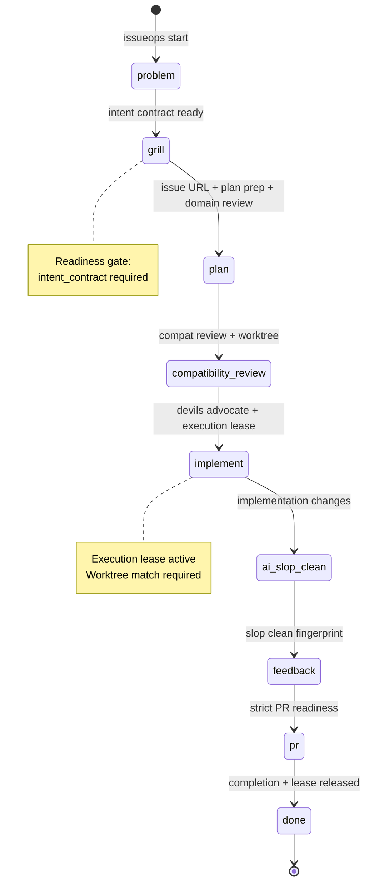
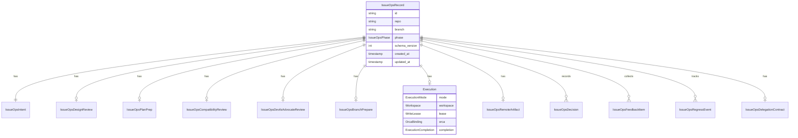
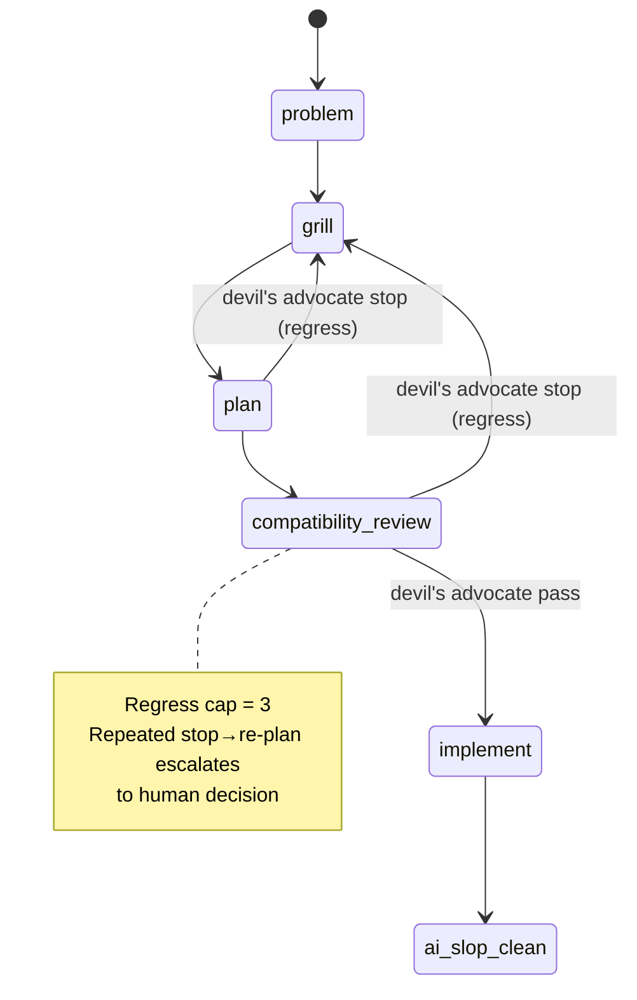

# IssueOps Workflow

IssueOps is the central workflow engine of agent-harness. It moves task context out of conversation and into a durable cycle connecting issue, plan, worktree, feedback, and verification evidence. The cycle survives across sessions and hosts because state is persisted in [SQLite](../operations/state-and-storage.md) under a dedicated namespace.

IssueOps is the **single workflow authority** — adapters like Orca provide execution capability but IssueOps retains durable authority over phase, lease, and completion.

## Phase State Machine

IssueOps enforces a strict 9-phase forward-only state machine. No backward transitions are allowed; once in `done`, no transitions occur.

Source: [`internal/core/issueops/model/phase.go`](/internal/core/issueops/model/phase.go), [`internal/core/issueops/issueops_phase.go`](/internal/core/issueops/issueops_phase.go).

### Phase Definitions

| Rank | Phase | Key Gate |
|------|-------|---------|
| 1 | `problem` | Entry — no gate (starting state) |
| 2 | `grill` | `intent_contract` (raw request + interpreted intent + success criteria) |
| 3 | `plan` | `issue_url`, `plan_prep` (4 items unless trivial), `split_decision`, `domain_review` |
| 4 | `compatibility-review` | `compatibility_review` (compat, side effects, rollback, verification, no blockers, approved), `worktree_exists`, `plan_in_worktree` |
| 5 | `implement` | All compat-review items + `devils_advocate_review` (pass or waived) + valid `execution` with active write lease + `execution_worktree_match` |
| 6 | `ai-slop-clean` | All implement items + `implementation_changes` evidence |
| 7 | `feedback` | `AISlopCleanAt` non-empty |
| 8 | `pr` | Strict PR readiness (state-root-aware gate) |
| 9 | `done` | Remote artifact verified, `execution.completion` present, `lease.status == released` |

### Worktree Expectations

Phases implement, ai-slop-clean, feedback, and pr expect a worktree (`IssueOpsPhaseExpectsWorktree`). However, only implement, ai-slop-clean, and feedback can reset on a stale worktree — pr artifacts live remotely so PR-phase records are excluded from stale-worktree reset.

## Readiness Gates

Every phase transition passes through a fail-closed readiness function. The gate checks for specific evidence fields in the `IssueOpsRecord`. Missing any required field blocks the transition.

The readiness model is layered: later phases inherit all earlier requirements. For example, entering `implement` requires everything from `compatibility-review` plus the devil's-advocate review and an active execution lease.

Source: [`internal/core/issueops/issueops_readiness.go`](/internal/core/issueops/issueops_readiness.go), [`internal/core/issueops/issueops_pr_readiness_strict.go`](/internal/core/issueops/issueops_pr_readiness_strict.go).

## Phase Ledger

Every forward transition is recorded in an additive audit index called the **Phase Ledger** — a `map[IssueOpsPhase]PhaseLedgerEntry` with `EnteredAt`, `CompletedAt`, `Artifacts`, `Missing`, and `Notes`. The ledger records what was observed, not what is enforced. Source-of-truth fields drive the gates; the ledger provides visibility and diagnostics.

Source: [`internal/core/issueops/issueops_phase_ledger.go`](/internal/core/issueops/issueops_phase_ledger.go).

## Brooks Regress Events

When a devil's-advocate review produces a `stop` or `revise` verdict, a regress event is recorded (`IssueOpsRegressEvent` with reason, from-phase, timestamp). A regress cap escalates to human decision after repeated rounds, preventing infinite revision loops.

Source: [`internal/core/issueops/issueops_regress.go`](/internal/core/issueops/issueops_regress.go).

## IssueOpsRecord — Root Aggregate

The `IssueOpsRecord` is the root aggregate, persisted as a single JSON row per IssueOps ID. The ID is deterministic: `io-` + first 12 hex chars of `SHA-256(repo + "\x00" + branch)`.

Source: [`internal/core/issueops/model/types.go`](/internal/core/issueops/model/types.go), [`internal/core/issueops/model/execution.go`](/internal/core/issueops/model/execution.go).

## Intent Class

The intent class controls plan-prep gate strictness: `trivial` (skips the gate), `standard` (default), `refactoring`, `architecture`, `research`. Empty normalizes to `standard`.

Source: [`internal/core/issueops/model/intent_class.go`](/internal/core/issueops/model/intent_class.go).

## State Persistence

IssueOps v1 state lives in a physically separate SQLite namespace: `issueops_v1/harness.db`, bucket `issueops_v1`. Schema version is `1`. Legacy authority fields are explicitly forbidden — their presence triggers a fail-closed error. The schema version is bumped in the bucket name, not via in-place migration.

All writes require `RequireIssueOpsMutationAllowed(stateRoot)` and are serialized through [sqlstore spans](../operations/state-and-storage.md) (BEGIN IMMEDIATE on a lock database).

Source: [`internal/core/issueops/issueops_state.go`](/internal/core/issueops/issueops_state.go).

## Brooks Devil's Advocate and Regress

A devil's-advocate review (verdict: `pass | revise | stop`) is a **fail-closed precondition** for `implement` entry. A `stop` or unwaived `revise` blocks the transition. When the devil's advocate returns `stop`, the cycle regresses from `plan` or `compatibility-review` back to **`grill`** for re-investigation and re-planning.

Regression does **not** delete the worktree, branch, or artifacts. It clears design approval and marks downstream ledger entries stale (retained as audit). The regress cap (`issueOpsRegressCap = 3`) prevents infinite revision loops.

Source: [`internal/core/issueops/issueops_regress.go`](/internal/core/issueops/issueops_regress.go), [`internal/core/issueops/devilsadvocate/devils_advocate.go`](/internal/core/issueops/devilsadvocate/devils_advocate.go).

## Cleanup and Post-Merge

Post-merge cleanup is a separate human-authorized operation, not part of phase completion. It has multiple paths:

| Command | Target | Key behavior |
|---------|--------|-------------|
| `cleanup finish` | Post-merge record-backed cycle | Preview → fingerprint CAS → resumable destructive steps |
| `cleanup orphan` | Recordless worktree (merged artifact) | Preview → fingerprint CAS → worktree+branch deletion |
| `cleanup abandon` | Cycle with Orca residue | Preview → fingerprint CAS → Orca cleanup |
| `cleanup remote-branch` | Remote branch | Ancestry-checked deletion |
| `cleanup close-children` | Provider-native child work items | Post-merge close |
| `prune` | Bulk stale cycles | Time-based pruning |

### Cleanup Status and Missing Polarity

`cleanupstatus.ForRecord` computes a `Missing` list that must be empty for cleanup readiness. Items are written in **requirement form** — `worktree_clean` means "cleanliness is required and not met," not "the worktree is dirty." This polarity convention was unified in [issue #185](https://github.com/m16khb/agent-harness/issues/185) to eliminate ambiguity.

Required items include: `pr_phase`, `remote_artifact` (with sub-fields for provider/kind/url/labels/assignees), `remote_artifact_merged`, `child_tasks_closed`, `worktree_path`, `worktree_exists`, `worktree_git_status`, `worktree_clean`, `branch`, `branch_match`, and remote branch checks.

### Cleanup Finish Protocol

The `cleanup finish` protocol uses a TOCTOU-safe compare-and-swap:

1. **Preview** — all gates must pass; compute fingerprint
2. **Apply** — `--apply --confirm --fingerprint <hash>` must match freshly recomputed fingerprint
3. **Destructive steps** (resumable on failure — failure point recorded in `CleanupFinishFailure`):
   - Orca worktree removal (`force=false`, absence = success)
   - `git worktree remove` (idempotent)
   - `git update-ref -d refs/heads/<branch> <head-OID>` (HEAD CAS, absence = skip)
   - Best-effort audit line reflection (completion payload snapshot taken **before** destruction)
   - Record deletion

Workspace process quiescence (`inspectWorkspaceProcesses`) blocks if processes hold the worktree (excluding requester ancestry).

### Orphan Cleanup

Orphan cleanup targets **recordless** worktrees whose remote artifacts are already merged — cycles that never completed formal phases. It requires: `repo_root_match`, `inventory_complete`, `canonical_repo_root`, exactly one target worktree, valid worktree HEAD, `record_absent`, no lease-holder authority, no Orca worktree authority. The remote branch is intentionally untouched — deletion requires separate explicit approval.

Source: [`internal/core/issueops/issueops_cleanup_finish.go`](/internal/core/issueops/issueops_cleanup_finish.go), [`internal/core/issueops/cleanupstatus/cleanup_status.go`](/internal/core/issueops/cleanupstatus/cleanup_status.go), [`internal/core/issueops/orphancleanup/orphan_cleanup.go`](/internal/core/issueops/orphancleanup/orphan_cleanup.go), [`internal/core/issueops/issueops_cleanup_abandon.go`](/internal/core/issueops/issueops_cleanup_abandon.go).

## Delegation and Child Cycles

IssueOps supports parent-child cycle delegation via `IssueOpsDelegationContract` (parent cycle ID, task scope, acceptance criteria) and `IssueOpsChildCycleRef` entries. This enables umbrella/topology workflows where a parent issue spawns child implementation cycles.

Source: [`internal/core/issueops/issueops_delegation.go`](/internal/core/issueops/issueops_delegation.go), [`internal/core/issueops/issueops_umbrella_topology.go`](/internal/core/issueops/issueops_umbrella_topology.go).

## IssueOps Skill

The `skills/issueops/` skill provides the operational reference for the workflow, with phase-specific reference files:

| Reference | Covers |
|-----------|--------|
| `operational-start.md` | Starting a cycle |
| `execution.md` | Orca execution mode details |
| `worktree-context.md` | Worktree provisioning |
| `remote-issue.md` | Remote issue creation and linking |
| `review-feedback.md` | Review and feedback phases |
| `ai-slop-clean.md` | AI slop clean phase |
| `cleanup-state.md` | Post-merge cleanup |
| `evidence-contract.md` | Evidence requirements |
| `orchestration.md` | Cross-phase orchestration |

The [Execution Model](execution-model.md) page covers the execution lease, generation fence, and completion gate in depth.
