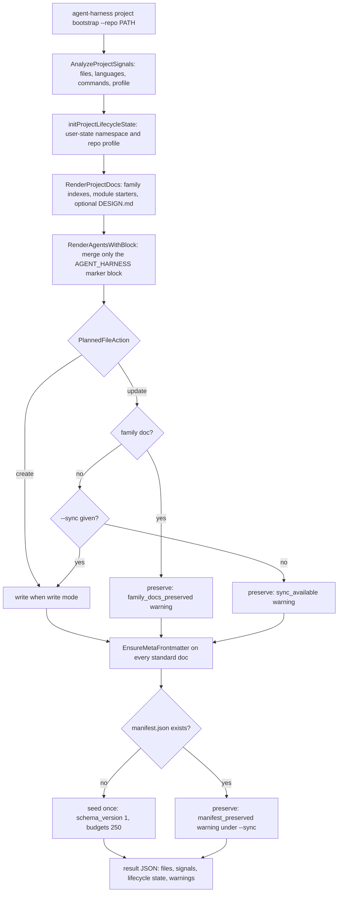

# Project Docs Workflow

agent-harness maintains two distinct documentation corpora. The **harness
corpus** is this repository's own agent-facing guidance — root `AGENTS.md`,
`CLAUDE.md`, `GENIUS_THINK.md`, everything under `.agent-harness/`, and
`skills/self-verify` + `skills/self-augment` — surfaced through `agent-harness
docs --json`. The **project-doc corpus** is the `.agent-harness/` family that
`project bootstrap` seeds into a *target* repository and that agents keep
current through MCP. This page documents the doc-family manifest contract, the
write-safety rules, the read paths that keep docs load-bearing (golden-pinned
index, MCP resources, `project route-docs`, SessionStart hook injection), the
skills pipeline, and the gates that catch drift. Related pages:
[Architecture Overview](../architecture/overview.md),
[Hosts](../integrations/hosts.md), [Runbook](../operations/runbook.md),
[IssueOps Cycle](issueops-cycle.md).

## The docs family structure: the manifest contract

The machine-readable ownership contract is
`.agent-harness/documentation/manifest.json` (`schema_version: 1`). It defines
**six families**, each pairing a required root index document with the module
directory that owns its detail:

| Family root | Module dir | Responsibility |
|---|---|---|
| `ADR.md` | `adr/` | accepted architecture decisions and roadmap |
| `ARCHITECTURE.md` | `architecture/` | dependency direction and runtime topology |
| `CAUTIONS.md` | `cautions/` | known risks and incident lessons |
| `CONVENTIONS.md` | `conventions/` | implementation and interface conventions |
| `OPERATIONS.md` | `operations/guides/` | installation and runtime operation |
| `TESTING.md` | `testing/` | test strategy and verification gates |

Roots and modules are bounded at **250 lines each** — a retrieval boundary, not
a reason to delete detail; an oversized module must be split by responsibility.
`single_owner_topics` maps root-level documents to their exclusive topic
(`COMMIT_POLICY.md`, `CONSTITUTION.md`, `OPEN_API_SPEC.md`, `TECH_STACK.md`,
`AGENT_WORKFLOW.md`). A root index owns exactly three things: the short
normative summary every agent needs, links into its module directory, and the
family's update instructions. Modules own procedures, rationale, examples, and
dated records, and link back to their root; cross-family references carry only
a link to the canonical owner.

The contract lives in code as well as JSON. `internal/domain/projectdoc`
defines the six families and `ManifestJSON()` renders the seeded manifest; a
test locks the family catalog shape (six families, `ADR.md` first,
`operations/guides` as the nested module dir) and the manifest schema
(`schema_version` 1, both budgets 250). The
[project-docs-optimize checker](#the-docs-family-checker) validates real
repositories against this schema.

**This repo dogfoods the contract.** Its own `.agent-harness/` tree carries all
six root indexes plus the module directories, and
`.agent-harness/documentation/` contains the manifest, the responsibility
audit (`AUDIT.md`, which measured the pre-modularization monoliths such as a
956-line `ADR.md`), and `README.md` owning the navigation model, ownership
map, budgets, link rules, and update workflow. Its manifest also demonstrates
that budgets and topics are repo-owned after seeding: it extends the five
seeded single-owner topics with two audit-record entries
(`archive/issueops-audit.md` and `PROJECT_AUDIT.md`, the latter retained at its
root because `quality inspect` parses it in place).

## Safety: what is allowed to write into a repository

The system has exactly two write surfaces into a target repo, both opt-in:

1. **Default native install writes nothing repo-local.** Host installers plan
   only user-level artifacts — Codex/Claude skill symlinks, MCP registration,
   and lifecycle hooks — plus in-repo *templates* under `configs/`. Repo-local
   files (`.mcp.json`, `.claude/skills/`, `.omo/`) are created only with
   explicit `--project-local`. The install contract matrix asserts that the
   default install leaves `.mcp.json`, `.claude/`, and `.omo/` absent, and the
   installer prints `Project-local repo files: unchanged by default; use
   --project-local only when you intentionally want repo-scoped files`.
2. **`agent-harness project bootstrap` creates the doc family**, with
   `--dry-run` planning before any write and `--sync` as an explicit
   template-refresh opt-in.

### `project bootstrap` control flow



*Caption: bootstrap planning. With `--dry-run` (`Write=false`) no branch
writes anything; the result carries the same plan plus a `dry_run_only`
warning.*

Key behaviors of the write pass:

- **AGENTS.md marker-block management.** `RenderAgentsWithBlock` never rewrites
  the whole file: it replaces only the content between
  `<!-- AGENT_HARNESS:START -->` and `<!-- AGENT_HARNESS:END -->` (the
  doc-per-concern routing bullets), preserving everything else. A missing
  `AGENTS.md` is created from the behavioral-guidelines block plus the routing
  block; the generic behavioral template is prepended only when the existing
  file does not open with its own `# ` heading, so repo-authored rules always
  stay authoritative.
- **Folder-first is create-only.** Family roots and module starters are written
  only when absent — never updated, *not even with `--sync`*. Roots are
  rendered as short indexes linking their `overview.md` module starter (e.g.
  `TESTING.md` → `testing/overview.md`); a module would-be-update sets
  `family_docs_preserved` and routes curation to `project_docs_revise` or
  `project-docs-optimize`. Non-family generated docs (e.g. `TECH_STACK.md` is
  family-free but `COMMIT_POLICY.md` is not a family root) refresh only with
  `--sync`; otherwise they are preserved with `sync_available`. `AGENTS.md` is
  the one file merged on every bootstrap when its block changes.
- **Legacy flat layouts are preserved, not half-migrated.** If family roots
  exist without `documentation/manifest.json`, bootstrap emits
  `legacy_flat_layout_preserved` and skips module starters and manifest
  seeding; restructuring belongs to `project-docs-optimize`.
- **The manifest is seeded once, then repo-owned.** `--sync` over an existing
  manifest reports `manifest_preserved` instead of resetting hand-tuned
  budgets.
- **Evidence-backed signals.** `AnalyzeProjectSignals` walks signal files
  (`go.mod`, `package.json`, `pyproject.toml`, `Cargo.toml`, CI workflows, task
  runners, existing agent docs) up to depth 4, deriving languages, package
  managers, candidate test/build/lint commands each tagged with evidence and
  confidence, and a profile (VCS provider, project types, frameworks, monorepo)
  from the git origin URL and configs. The same profile seeds the repo-scoped
  **lifecycle namespace** in user-state via `initProjectLifecycleState`.
- **Canonical frontmatter everywhere.** `EnsureMetaFrontmatter` guarantees each
  standard doc begins with `name:` + a fixed, name-keyed `description:`
  (e.g. `TESTING.md` → "Verification standards, test practices, and required
  checks."). It runs on bootstrap and `--sync` alike, so even preserved docs
  declare their category; the hook catalog falls back to the same table when
  frontmatter is absent.
- **Optional docs.** Only `VCS.md` and `DESIGN.md` are optional.
  `DESIGN.md` (design-system contract) is rendered only when the profile
  detects a client surface (`frontend` or `desktop-client`); bootstrap never
  creates `VCS.md` — route-docs attaches it only for VCS-related tasks.

## Read paths that keep the docs load-bearing

<!-- openwiki: mermaid parse failed and this diagram was converted to a text fence so it does not break rendering. Fix the diagram source and restore the mermaid fence. Parser error: Heuristic: a semicolon inside a label breaks rendering; rephrase the label. -->
```text
flowchart TD
    subgraph HOSTS["Host session start"]
        H1["Codex hooks.json SessionStart"]
        H2["Claude settings.json SessionStart"]
    end
    subgraph TASKTIME["Task-time retrieval"]
        R1["project route-docs --task or MCP project_docs_route"]
        R2["docs --json or MCP docs_index or harness://docs"]
    end
    H1 --> K["agent-harness hook session-start"]
    H2 --> K
    K --> L["BuildProjectDocCatalogContext"]
    L --> M["DiscoverProjectDocs: repo .agent-harness/*.md catalog"]
    M --> N["additionalContext compact menu plus readable user view"]
    R1 --> S["keyword-routed docs with family overview attachments"]
    R2 --> T["DocsIndex over harness root: git-tracked, hermetic"]
    T --> U["golden pins required docs; numeric counts become placeholder"]
```

*Caption: the three read surfaces. The hook injects a menu at session start;
route-docs selects per task; the index is contract-pinned.*

### `docs --json`: a golden-pinned index

`agent-harness docs [index] [--json]` returns the harness corpus: each doc's
rel path, title (first level-1 heading), up to 20 headings, and size, sorted by
path. The index is **hermetic**: candidates are filtered to git-tracked files
(root-relative comparison, NUL-delimited `git ls-files` so non-ASCII names
match), with a fallback to all candidates when git is unavailable or the
tracked set matches nothing; `.agent-harness/draft-wiki` and
`.agent-harness/evidence` are always excluded, so untracked session artifacts
cannot drift the index or the golden that snapshots it.

The response is one of the pinned contracts in
`cmd/harness/testdata/response_contracts.golden.json`: both the CLI `docs
--json` and MCP `docs_index` responses are snapshotted. Numeric
`docs_count`/`docs_indexed` values are replaced with a `$DOCS_COUNT`
placeholder — the structural fix for the trap where every committed plan doc
forced a manual golden sync (#109) — while a non-numeric counter still fails
the gate as a contract regression. The projection additionally pins the
presence of required entrypoints (`AGENTS.md`, `CLAUDE.md`, the
`.agent-harness/` roots, `skills/self-verify/SKILL.md`,
`skills/self-augment/SELF_AUGMENTATION.md`), so deleting or renaming a tracked
required doc drifts the golden.

### MCP: `docs_index`, `harness://docs`, and the project-doc tools

The MCP surface re-exposes the same readers: the `docs_index` tool and the
`harness://docs` resource both call `docs.DocsIndex` over the harness root;
`harness://project-docs` returns the default (task "general") route;
`harness://project-doc-upkeep` carries the route → read → revise/append
upkeep guidance. The maintenance tools are `project_docs_route`,
`project_docs_read`, `project_docs_revise`, `project_docs_append`, and
`project_docs_bootstrap_plan` (the dry-run plan).

### `project route-docs`: task-keyword routing

`agent-harness project route-docs --repo PATH --task TEXT` maps a free-text
task to the owning documents instead of injecting every doc. `AGENTS.md` is
always routed; keyword rules then select sets — e.g. `commit|pr|push` →
`COMMIT_POLICY.md` + `TESTING.md` + `CAUTIONS.md`; `test|spec|verify|ci` →
`TESTING.md` + `TECH_STACK.md` + `AGENT_WORKFLOW.md` + `CAUTIONS.md`; VCS
keywords add the optional `VCS.md`; unknown tasks fall back to
`CONSTITUTION.md`/`AGENT_WORKFLOW.md`/`CONVENTIONS.md`/`CAUTIONS.md`/
`TESTING.md`. Folder-first integration: when a routed doc is a family root and
its `overview.md` module exists, the module is attached automatically so agents
read the actual detail, not just the index. If `.agent-harness/` is missing the
result warns to run `project bootstrap`. Every entry reports `exists` so the
caller can distinguish seeded from missing docs.

### SessionStart hook: catalog injection

Default installs register **exactly one** hook event per host — `SessionStart`
in `~/.codex/hooks.json` and `~/.claude/settings.json` — invoking
`agent-harness hook session-start --host codex|claude` with a 5-second
timeout. The hook builds the static project-doc catalog and emits it as
model-facing `additionalContext` plus a readable user view. The design point:
both Claude Code and Codex re-run `SessionStart` with `source: "compact"`
after compaction, and only `SessionStart` output carries model-facing context
on either host, so one hook re-establishes the catalog for free;
`hook post-compact` remains for hosts without a re-run (Omo) and for
diagnosis. `HARNESS_DISABLE_HOOKS=1` turns both into no-ops so a single
host-level registration can coexist with unowned repositories. The catalog is
deliberately a **menu, not a relevance decision**: `DiscoverProjectDocs` scans
only the working repo's top-level `.agent-harness/*.md` (no symlinks, bounded
at 64 entries / 256 KiB per file / 2 MiB total, deterministically sorted) and
describes each doc by its frontmatter description or the canonical name-keyed
table; choosing what to read is left to the agent.

## MCP maintenance contract: route → read → revise/append

Incremental knowledge lands through the MCP contract with two shapes:

- **`project_docs_append` (default)** — writes one dated record file into the
  family module directory (`adr/YYYY-MM-DD-<slug>.md` or
  `cautions/YYYY-MM-DD-<slug>.md`, collision-suffixed) with canonical record
  frontmatter. The family root index is never touched, so append cannot churn
  the root SHA other agents hold; there is **no flat-layout fallback** — even
  a repo with no manifest gets record files, and missing family roots are
  flagged by the checker and repaired by bootstrap.
- **`project_docs_revise` (exception)** — full-document replacement gated by
  consensus: an existing doc requires `expected_sha256` from
  `project_docs_read` (mismatch refuses the write), a `summary`, `evidence`,
  and `confirm=true`; without `confirm` the call is a dry-run reporting
  `next_sha256`.

`NormalizeRelPath` accepts the required and optional doc names *plus* any
family module path (`adr/…`, `testing/…`), rejecting traversal and
non-markdown targets, so read/revise can address record files and module
starters in folder-first repositories. A CLI fallback,
`agent-harness project append --kind caution|adr`, covers records; there is no
CLI for full-document revision.

## The skills pipeline over these surfaces

Four skills map onto the CLI/MCP surfaces:

<!-- openwiki: mermaid parse failed and this diagram was converted to a text fence so it does not break rendering. Fix the diagram source and restore the mermaid fence. Parser error: Heuristic: an unescaped angle bracket inside a label breaks rendering; rephrase the label. -->
```text
flowchart LR
    PB["project-bootstrap<br/>orchestrator"] --> B["project-docs-bootstrap<br/>create or template refresh"]
    PB --> U["project-docs-update<br/>incremental refresh"]
    PB --> O["project-docs-optimize<br/>restructure"]
    B -->|"wraps"| S1["project bootstrap CLI or MCP plan"]
    B -->|"then"| E["agent enrichment pass PROMPT.md"]
    U -->|"wraps"| M["project_docs_route / read / revise / append"]
    O -->|"wraps"| CHK["scripts.check manifest validator"]
```

*Caption: the lifecycle is create → refresh → restructure; each sub-skill is
also usable standalone and each wraps one deterministic surface.*

- **`project-bootstrap`** owns orchestration and lifecycle routing: no
  `.agent-harness` docs or an explicit refresh request → bootstrap; completed
  work produced a caution/ADR/stale section → update; over-budget roots,
  duplicated ownership, or checker violations → optimize.
- **`project-docs-bootstrap`** runs the deterministic CLI pass
  (`project bootstrap --dry-run` plan, inspect `signals`/`files[].action`/
  warnings, then write, with `--sync` only on explicit request) followed by the
  **agent enrichment pass** (`PROMPT.md`). The boundary is fixed: the static
  pass fills skeletons, detected signals, candidate commands, routing, and
  generic guidance; the agent fills actual architecture, operations,
  conventions, testing, cautions/ADRs *from repository evidence*. The
  engineering-standards catalog (`references/engineering-standards.md`) is a
  checklist, not content: each topic (layered/hexagonal/clean architecture,
  DDD, SOLID, error handling, OpenAPI, testing practice) must be confirmed
  against evidence and written to its single owning document; unconfirmed
  topics are marked `Unknown / not confirmed`; repo conventions and doc
  language always outrank harness defaults.
- **`project-docs-update`** keeps docs current during work without
  restructuring: route first, read with SHA, then append cautions/ADRs by
  default or revise one document at a time. It never edits `AGENTS.md` outside
  the managed blocks, never restructures files, and refuses hypothetical
  CAUTIONS/ADR entries.
- **`project-docs-optimize`** owns restructure only: its deterministic report
  (`--mode report`) shows line-budget, single-owner, link-integrity, and
  required-entrypoint violations; modularization moves one family at a time,
  preserving every constraint verbatim ("move detail, do not summarize away"),
  then re-checks in strict mode.

### The docs-family checker

`skills/project-docs-optimize/scripts/check.py` is the executable half of the
manifest contract. Against `.agent-harness/**.md` plus root `AGENTS.md` it
reports, per family: `missing_root`, `line_budget_exceeded` (roots and
modules), `missing_module_dir`, `empty_module_dir`, `module_dir_unlinked`
(root must link into its module dir), plus `missing_owner` for single-owner
topics and `broken_link` for every local markdown target. `--mode check`
exits non-zero on any violation; `--mode report` is the audit entry point.

## Doctor and the minimum gate after doc changes

`agent-harness doctor` checks project-doc health alongside everything else:
`checkProjectDocs` lists any missing standard doc as the `project_docs_missing`
warning whose fix is `agent-harness project bootstrap --repo …`; the lifecycle
check reports a missing project namespace (`lifecycle_state_missing`) or a
fingerprint mismatch (`lifecycle_namespace_mismatch`), both pointing at
bootstrap. Repo-local runtime artifacts (`.agent-harness/state`,
`state.schema.json`, schema-talk in `STATE.md`) are flagged as
`repo_local_state_present` — docs and runtime state are deliberately separated.

Because the docs index feeds the golden, **editing `.agent-harness/*.md` can
drift response-contract goldens**: removing/renaming a tracked required doc
changes `required_docs`, and a regression that makes a docs counter non-numeric
fails the placeholder gate. The minimum gate after doc-only changes (owned by
this repo's `TESTING.md` index) is:

```bash
go test ./... -count=1
go build -o bin/agent-harness ./cmd/harness
./bin/agent-harness docs --json
./bin/agent-harness inspect --json
./bin/agent-harness self-verify --seed=100 --target-score=95 --llm-eval=false --json
```

The documentation update workflow adds the optimize checker
(`uv run --directory skills/project-docs-optimize python -m scripts.check
--root "$PWD" --mode check --json`) and a diff review for accidental
duplication or information loss.

## Wiring and focused tests

Doc readers are injected at the composition root rather than imported by
consumers: `configureDocsReaders` installs `docs.DocsIndex` into `mcpcli`,
`basiccli`, the self-augment planner/catalog, `qagate`, and `inspect`;
`configureProjectDocReaders` installs `DiscoverProjectDocs` /
`FormatProjectDocCatalog` into the hook prompt layer and `PlannedFileAction`
into both bootstrap and projectdocs; the CLI facade passes
`DocsIndex: docs.DocsIndex` into `basiccli.Configure`. Tests that pin the
behavior most likely to matter when changing this area:

- `internal/adapter/projectbootstrap/project_docs_test.go` — dry-run plans
  nothing and never plans `VCS.md`; write merges the AGENTS.md marker block,
  creates all roots + module starters + a valid manifest, persists profile
  metadata, and links every family root into its module dir.
- `internal/adapter/projectbootstrap/project_docs_append_test.go` — append
  lands dated record files and never creates/writes the family roots.
- `internal/domain/projectdoc/families_test.go` — family catalog shape,
  defensive copies, record-meta descriptions, and manifest/checker schema
  agreement.
- `cmd/harness/harnessapp/response_contract_*_test.go` — the golden, the
  `$DOCS_COUNT` normalization (numeric-only), and the required-docs projection
  for CLI and MCP `docs_index`.
- `internal/adapter/projectdoc/catalog_test.go` and
  `internal/adapter/hookprompt/catalog_test.go` — catalog discovery bounds,
  symlink rejection, frontmatter-then-canonical descriptions, and
  no-injection-without-docs.
- `internal/adapter/install_contract_matrix_test.go` — default install writes
  no repo-local paths; `--project-local` does.
