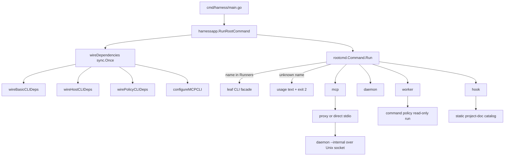
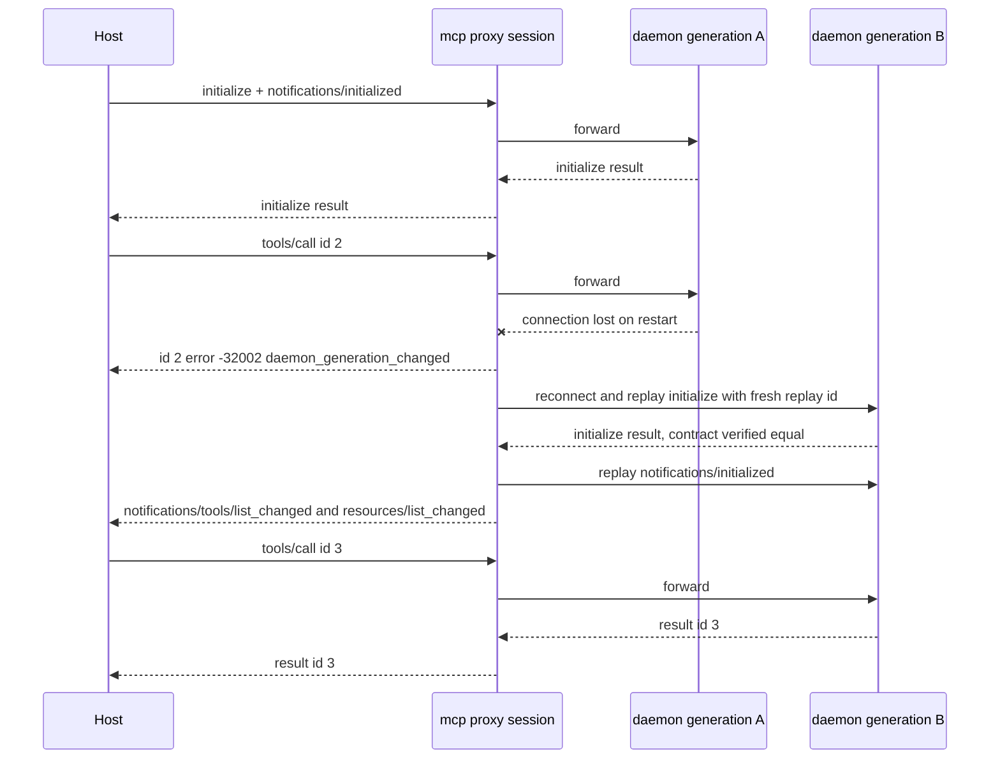
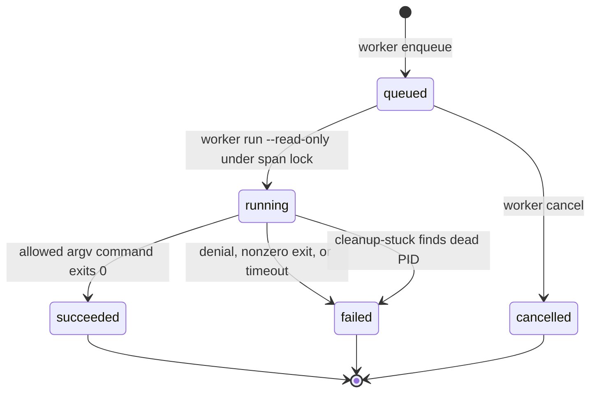

# Runtime Surfaces: CLI, MCP, Daemon, Worker, Hooks

agent-harness exposes one host-neutral Go core through five runtime surfaces:
CLI one-shot commands, the `agent-harness mcp` stdio proxy, the user-level
`agent-harness daemon` that backs the proxy, the `agent-harness worker`
(policy-gated read-only jobs), and the two `agent-harness hook` catalog
commands that hosts run at session start and compaction. Every surface is
entered through the same binary and the same composition root, and every
surface's command vocabulary is pinned by goldens so the human, agent, and
contract views of the system cannot drift apart. Related pages:
[Architecture Overview](../architecture/overview.md),
[Response Contract Surface](../concepts/contract-surface.md),
[Safety & Command Policy](../operations/safety-and-policy.md),
[State, SQLite Store, and Locking](../concepts/state-and-sqlstore.md),
[IssueOps Cycle](issueops-cycle.md).

## The dispatch chain

Every invocation starts at the same three-hop chain:

*One `main.go`, one composition root, one runner map; the MCP, daemon, worker,
and hook commands are just rows in the same map with their own subcommand
dispatch.*

1. `cmd/harness/main.go` does nothing but call `harnessapp.RunRootCommand`
   with `os.Args[1:]` and exit with the returned code.
2. `RunRootCommand` calls `wireDependencies()` and then hands off to
   `rootcmd.Command.Run`. `wireDependencies` is guarded by `sync.Once` and
   calls an explicit, ordered list of `configure*` functions
   (`wireBasicCLIDeps`, `wireHostCLIDeps`, `wirePolicyCLIDeps`,
   `configureMCPCLI`) — the composition root wires by call, never by package
   `init()` side effects, so wiring is ordered, visible, and not
   import-order sensitive. A concurrency test pins that 80 parallel root
   commands do not rewire MCP dependencies out from under each other.
3. `rootcmd.Command` owns only dispatch, `help`/`version`, usage printing, and
   exit codes. Its `Runners` map in
   `cmd/harness/harnessapp/root_command_facade.go` holds 28 entries
   (`inspect`, `preflight`, `status`, `doctor`, `docs`, `policy`,
   `verify-work`, `trace`, `guard`, `quality`, `self-verify`,
   `self-augment`, `contract`, `state`, `issueops`, `api-doc`, `hook`,
   `project`, `install`, `update`, `bootstrap`, `worker`, `loop`, `gates`,
   `channel`, `web-fetch`, `daemon`, `mcp`); `version` is answered by
   `rootcmd` itself.

**The canonical command vocabulary lives in `internal/domain/cli`, not in the
router.** `cli.Commands()` returns the deterministic top-level catalog and
`cli.Usage(version)` renders the human usage text (with the `issueops` block
projected from the single `issueOpsUsageCatalog` — never hand-duplicated). The
`contractgolden` golden tests pin `usage.golden.txt`,
`mcp_tools.golden.json`, and `mcp_resources.golden.json`, so a new command or
tool must be added to the domain catalog *and* have its golden refreshed, and
the usage a user sees is byte-identical to the surface the contract checks
audit. The MCP tool vocabulary has the same discipline one level down:
`internal/domain/mcp/catalogSections()` is the single ordered source from which
both the advertised `tools/list` (51 tools, golden-pinned order) and the
name→handler `DispatchMap()` derive.

**`ah` is the installer-managed shorthand.** Native install creates
`~/.local/bin/agent-harness` plus a collision-safe `~/.local/bin/ah` symlink in
every PATH mode; `agent-harness` stays the canonical name in CLI output, MCP
configuration, and host adapters, while `ah update` works from any directory
([ADR 2026-07-24](../../.agent-harness/adr/decisions/2026-07-24-canonical-command-ah-shorthand.md)).

## Exit-code contract

`rootcmd.Command.Run` and the composition root's `ErrorExitCode` hook define
the contract every caller (scripts, CI, host hooks) can rely on:

| Code | Meaning |
| --- | --- |
| `0` | success; also `help`/`--help`/`-h`, `version`, and any subcommand answering `--help` by returning `flag.ErrHelp` (no `flag: help requested` noise is printed) |
| `1` | general failure — the default for a runner error |
| `2` | usage problems: no arguments, unknown top-level subcommand (usage printed to stderr), and `gates` usage errors (`gatescli.UsageError`) |
| `3` | denial by a core gate: `policy` when `policycontract.IsPolicyDenied(err)` matches, `guard` when `guard.IsGuardBlocked(err)` matches |

Two details are load-bearing. First, the mapping is centralized in
`rootSubcommandErrorExitCode` — leaf packages return typed errors
(`PolicyDeniedError`, `GuardBlockedError`, `UsageError`,
`channelcli.TimedOutError`, which is deliberately mapped to `1` because a
timed-out wait is a normal outcome, not a usage fault) and only the
composition root decides what they mean for the process exit status. Second,
a `policy run`/`worker run` denial surfaces the same code `3` that the policy
evaluation records in its own result payload (`exit_code: 3` with
`executed: false`), so the JSON body, the typed error, and the process status
agree.

## MCP stdio proxy and the user-level daemon

`agent-harness mcp` is the agent-facing surface. With no arguments it starts
the MCP runtime; `mcp cleanup [--dry-run|--apply]` terminates stale proxy
processes. Two serving modes exist:

- **Default (proxy):** ensure the daemon is running, dial its Unix socket, and
  pump newline-delimited JSON-RPC frames between stdin/stdout and the socket
  (`cmd/harness/daemoncli/daemon_proxy.go`). The proxy understands enough of
  the protocol to survive daemon restarts; it does not interpret tool calls.
- **`HARNESS_MCP_DIRECT=1`:** serve MCP directly over stdio with no daemon,
  using the same go-sdk server and the same dependency wiring — a one-shot,
  daemon-free mode for isolated use.

Both modes end in the same server: `mcpcli.initSDKServer*` builds an
`mcp.Server` from the official `modelcontextprotocol/go-sdk`, registers every
advertised tool and every resource, and validates each call's arguments
against the catalog `inputSchema` before dispatch (schema violations are
JSON-RPC `-32602`, not tool results). Handlers resolve through
`mcpadapter.DispatchMap()` into eight stable handler groups
(`project`, `policy_state`, `issueops`, `loop`, `gates`, `channel`,
`assistant_worker`, `self_loop`); `issueops_execution` alone gets a
context-aware handler carrying the `MCPDependencies` snapshot. That
dependency struct is fixed when a server is constructed — there is no
request-time package-global dependency cache — so concurrent MCP servers never
see each other's handlers, and a wiring change takes effect only in a newly
started server/daemon process. Tool-level failures (not-found, validation,
lock errors) are returned as `isError` text results mirroring the CLI's
`{ok:false}` bodies; only genuine JSON-RPC violations become protocol errors.

*The proxy never replays an interrupted request's call: its outcome is unknown,
so it is failed explicitly and the host must reconcile.*

### Proxy session mechanics

The proxy tracks per-session state that makes reconnection safe:

- **Handshake caching.** The `initialize` request, the
  `notifications/initialized` notification, and the negotiated contract
  (canonicalized `protocolVersion` + `capabilities` JSON) are cached. On
  reconnect the proxy replays `initialize` under a fresh
  `agent-harness-reconnect-N` id with the negotiated protocol version and
  requires the new daemon's result to match the cached contract byte-for-byte;
  a mismatch aborts with "handshake contract changed" instead of silently
  serving a semantically different backend.
- **In-flight tracking.** Pending request ids (semantically canonicalized:
  `"a\u0062"` ≡ `"ab"`, `1.0` ≡ `1`, matching the SDK's numeric coercion) are
  recorded per session, batch-aware. When a connection dies, every pending
  request is answered before reconnecting.
- **`-32002` `daemon_generation_changed`, never auto-retried.** Interrupted
  requests receive `error.code -32002` with data
  `{code: "daemon_generation_changed", outcome: "unknown",
  automatic_retry: false, reconcile_required: true}`. The request may or may
  not have taken effect on the dying daemon, so the proxy refuses to guess:
  it does not replay the call to the new daemon, and the host is expected to
  reconcile (e.g. re-read IssueOps state) rather than blindly retry.
- **Bounded recovery.** Reconnect is capped at `daemonProxyReconnectAttempts`
  (48) tries within a 20-second budget with backoff capped at 250 ms; frames
  up to 4 MiB are supported; a saturated or unreachable daemon fails the
  proxy explicitly instead of producing empty output.
- **Post-reconnect refresh.** After a re-established session the proxy emits
  synthetic `notifications/tools/list_changed` and
  `notifications/resources/list_changed` to the host so stale tool caches are
  invalidated across the generation change.

### Daemon: identity, admission, idle reaping

`agent-harness daemon start|status|stop` manages the backend (the `--internal`
form, used by the launcher, runs the server loop). State lives under
`HARNESS_DAEMON_DIR`, else `<HARNESS_STATE_DIR>/daemon`, else
`~/.local/state/agent-harness/daemon`, holding `agent-harness.sock`, `.pid`
(the instance record), `.lock`, and `.log`.

- **Immutable-before-serving identity.** Before accepting, the server writes
  an instance record — PID, process start time, executable path, a
  crypto-random instance nonce, the executable's SHA-256 build hash, protocol
  version `"1"`, and a random generation token — atomically (temp file +
  rename, mode 0600). The socket is `chmod 0600`; stale lock/pid/socket files
  are cleaned up; startup is serialized by an `O_EXCL` lock file with
  stale-PID/age detection; shutdown waits up to 30 s for active connections.
- **Identity verification, not liveness folklore.** `daemon status` reads the
  instance record, then probes the socket with a **NUL-prefixed private
  request** (`\x00agent-harness-daemon-identity/1\n`) — a NUL first byte
  cannot begin a valid JSON-RPC message, so the probe can never be mistaken
  for MCP traffic and liveness checks never fabricate frames. The daemon
  answers with its record plus the admission snapshot. Status is `ready` only
  when record, probe, liveness, and OS process identity (start time, and
  executable where the platform reports it stably) all agree; anything else
  reports `instance_identity_mismatch`, `socket_unreachable`, or
  `instance_record_unreadable`. `daemon stop` refuses to signal an unverified
  process (SIGTERM, 3 s grace, then identity re-check before `Kill`), so a
  recycled PID can never be killed on the daemon's behalf.
- **Admission slots with a typed overflow error.** A slot channel caps
  concurrent MCP connections — default 256, `HARNESS_DAEMON_MAX_CONNECTIONS`
  (values outside 1..4096 fall back to the default). Each admitted connection
  gets a cancelable session context released on close; `draining` rejects new
  acquisitions. One extra "overflow classifier" slot is reserved so that when
  the pool is full a health-probe client can still be answered. An ordinary
  MCP connection that cannot get a slot receives a typed JSON-RPC error
  **`-32001`** ("daemon connection capacity exhausted") with data
  `{code: "daemon_connection_limit_reached", active_connections,
  max_connections, accepting, draining, retryable: true}`. The proxy checks
  the admission snapshot *before* dialing and refuses with the same
  classifier code when the daemon is not accepting, so saturation is
  observable rather than a hang.
- **Idle reaping.** Every connection is wrapped in an `idleConn` that resets a
  read deadline on each read — default 30 minutes, `HARNESS_MCP_IDLE_TIMEOUT`.
  An abandoned client therefore hits the deadline, the go-sdk `server.Run`
  returns, and the admission slot is freed instead of being pinned forever by
  a dead editor session.
- **Per-stream server.** The daemon serves each connection by building a
  go-sdk MCP server over the bidirectional socket with an immutable
  `MCPDependencies` value assembled by the composition root; go-sdk session
  routine events are downgraded to DEBUG in the daemon log (they were 99.9%
  of a 270k-line log in one measurement). Requests never mutate the
  dependency snapshot, so daemon wiring changes require a daemon restart —
  which is exactly the generation change the proxy is designed to surface.

`daemon start` is idempotent: `ensureDaemonRunning` reuses a ready daemon,
treats identity-mismatch states as blocking errors, and otherwise starts
`daemon --internal` as a detached (`Setsid`) child, then polls the identity
probe until ready (15 s budget).

## The worker: lifecycle records plus a policy-gated read-only run

To be precise about what the worker is: **there is no long-resident job
daemon.** `agent-harness worker` owns durable job *records* and a single
execution command; the shared daemon serves only the MCP proxy, and `worker
run` executes inside the invoking process.

- **Job records** live in the `worker` bucket of a SQLite store under
  `HARNESS_WORKER_DIR`, else `<HARNESS_STATE_DIR>/worker`, else
  `~/.local/state/agent-harness/worker`. `enqueue` creates a `queued` job with
  a deterministic id (`job-<UTC timestamp>-<12 hex sha256 of kind, payload,
  and time>`), a redacted payload (`policy.RedactFreeform`), and the standing
  safety notice that the MVP records lifecycle state only and never executes
  shell commands. `status`, `list` (with a queue histogram and depth),
  `cancel`, and `cleanup-stuck` read and mutate those records.
- **`worker run --read-only` is the only execution path.** The flag is
  mandatory. The job transitions `queued → running` under the store's span
  lock — recording the PID, the exact argv, `NoShell: true`, and the safety
  notice — then calls `policy.RunReadOnlyCommand`, which **forces write,
  network, and shell allowances off** before the same evaluation used
  everywhere else (`internal/adapter/policy/policy_run.go`), executes argv
  directly (no shell interpreter), with a 30 s default timeout, an
  env-allowlist filter, secret redaction, and a 32 KiB output budget per
  stream. Finally it transitions to `succeeded` or `failed` under the lock. A
  denied command is never executed and reports exit code 3 in the result
  payload; the CLI maps it to `PolicyDeniedError` and thus process exit 3; a
  timeout reports exit code 124.
- **Transitions are serialized.** Every read-modify-write span on the worker
  store takes the directory-wide sqlstore span lock, so `cancel` (legal only
  from `queued`) cannot race `run`'s transitions, and a crash mid-write can
  never leave a truncated record. `cleanup-stuck` finds `running` jobs whose
  PID is dead and re-marks them `failed` under the same lock with an explicit
  safety notice — the honest way a crashed runner is reconciled, since
  nothing else is watching.
- **The MCP tool reaches the same path.** `worker_run_read_only` (plus
  `worker_enqueue`, `worker_status`, `worker_list`, `worker_cancel`) is
  dispatched to the same `internal/adapter/worker` functions the CLI uses,
  injected by the composition root into both transports — the MCP tool is not
  a weaker side door.

*All transitions happen under the worker store's span lock; `run` is the only
transition that executes a process, and only in the caller's process.*

## Hooks: two catalog commands, nothing else

The current hook contract is deliberately minimal ([ADR
2026-08-10](../../.agent-harness/adr/decisions/2026-08-10-default-hooks-thin-static-context.md),
[ADR 2026-08-27](../../.agent-harness/adr/decisions/2026-08-27-session-start-owns-compaction-context.md)):
only two subcommands exist — `hook session-start` and `hook post-compact` —
and the enforcement-era surface (`user-prompt`, `pre-tool-use`,
`post-tool-use`, `pre-compact`, `stop`, failures/metrics ledgers, guard
chains) is deleted, not merely unregistered.

Both commands do exactly one thing: resolve the target repo (explicit
`--repo`, else the host's stdin JSON `cwd`/`repo`/`workspace` aliases, else
the harness target resolution), render the **static project-doc catalog** via
the `hookprompt` adapter (discover `.agent-harness` docs, format a compact
model-facing string and a readable user view), and print a host-compatible
JSON payload. They touch no durable state, write no telemetry, and carry no
IssueOps authority — a test drives both hooks across isolated worktrees and
asserts the harness state directory stays empty.

- **`session-start`** injects `hookSpecificOutput.additionalContext` for
  *every* SessionStart source (`startup`, `resume`, `clear`, and `compact`),
  because Claude Code and Codex both re-run SessionStart after compaction and
  only SessionStart output can carry model-facing context on those hosts.
  Claude additionally shows the readable catalog via `systemMessage`; Codex
  omits `systemMessage` and gets the readable view in `additionalContext`.
- **`post-compact`** keeps an explicit post-compaction surface for hosts
  without a SessionStart re-run (Omo's `session_compact`, which reads
  `--json`) and for diagnosis. Claude and Codex default installs do not
  register it, and neither host accepts model-facing output there, so the
  host shape carries only a user-facing `systemMessage`.
- **No docs, no output.** With no project docs both hooks print an empty JSON
  object rather than commentary.
- **Kill switch.** `HARNESS_DISABLE_HOOKS=1` turns either hook into a
  completely silent no-op — not even `{}` — so one host-level registration can
  stay installed while working in repositories the harness does not own.

Output formatting is host-polymorphic through `internal/domain/hook`
(`CodexHookOutput` vs `ClaudeHookOutput`), and the composition root injects
both the repo resolver and the catalog builder, keeping the hook packages
free of core behavior.

## Configuration and operations quick reference

| Variable | Surface | Effect |
| --- | --- | --- |
| `HARNESS_STATE_DIR` | daemon paths, worker dir | relocates the state root (default `~/.local/state/agent-harness`) |
| `HARNESS_DAEMON_DIR` | daemon | relocates socket/pid/lock/log |
| `HARNESS_DAEMON_MAX_CONNECTIONS` | daemon admission | concurrent MCP connection cap (default 256, hard range 1..4096) |
| `HARNESS_MCP_IDLE_TIMEOUT` | daemon | idle read deadline for connections (default 30m) |
| `HARNESS_MCP_DIRECT` | `mcp` | `1` serves stdio MCP without the daemon |
| `HARNESS_DISABLE_HOOKS` | `hook` | silent no-op for both catalog hooks |
| `HARNESS_WORKER_DIR` | worker | relocates job store |
| `HARNESS_ROOT` | daemon child, MCP root discovery | pins the harness checkout root |

Operational entry points: `daemon start|status|stop [--json]`,
`agent-harness status` / `doctor` (which include daemon identity and admission
state), and `mcp cleanup` for stale proxies. Health troubleshooting starts
with `daemon status --json`: its `code`
(`ready` / `stopped` / `socket_unreachable` / `instance_identity_mismatch` /
`instance_record_unreadable`) plus `active_connections`, `max_connections`,
`accepting`, and `draining` describe both identity and admission state in one
payload.

## Focused tests that pin this page

- `cmd/harness/main_test.go` — `main` exits with `run`'s code.
- `cmd/harness/rootcmd/root_command_test.go` — usage/version dispatch,
  unknown-subcommand exit 2, custom error exit codes, `flag.ErrHelp` → exit 0.
- `cmd/harness/contractgolden/contract_golden_test.go` — the usage and MCP
  catalog goldens that pin both vocabularies.
- `cmd/harness/daemoncli/daemon_admission_test.go` — slot accounting,
  draining, overflow-classifier probe, and the typed `-32001` rejection.
- `cmd/harness/daemoncli/daemon_proxy_test.go` /
  `daemon_proxy_session_test.go` — stream copying, reconnect-without-replay,
  `-32002` batch failure payload, handshake-contract change rejection,
  saturated-daemon pre-dial refusal.
- `cmd/harness/daemoncli/daemon_identity_test.go` /
  `daemon_ensure_test.go` / `daemon_server_loop_test.go` — probe/record
  agreement, ensure/start idempotence, accept-loop diagnostics.
- `cmd/harness/workercli/worker_test.go` and
  `internal/adapter/worker/*_test.go` — routing, read-only requirement,
  policy denial propagation, locked transitions, stuck-job repair.
- `cmd/harness/hookcli/hook_catalog_test.go` — host output shapes, compact
  source injection, empty-object noop, no-harness-state guarantee, and the
  `HARNESS_DISABLE_HOOKS` silent kill switch.
- `cmd/harness/harnessapp/mcp_concurrency_test.go` — concurrent root commands
  and MCP streams sharing immutable configuration.
