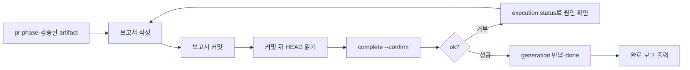

# IssueOps Complete

이 스킬의 일은 **`execution complete` 하나**다. publish되고 검증된 draft PR/MR을
근거로 완료 증거를 봉인하고 generation을 반납해 record를 `done`으로 옮긴다.
PR/MR을 만들지 않고, 머지하지 않으며, 워크트리·브랜치·이슈를 정리하지 않는다.

- 전체 흐름과 phase 라우팅: [`issueops`](../issueops/SKILL.md). 시작 전
  `agent-harness issueops next --id "$ISSUEOPS_ID" --json`의 `stage.key`가
  `pr.complete`인지 확인한다
- 직전 단계(PR/MR publication): [`issueops-create-pr`](../issueops-create-pr/SKILL.md)
- 직후 단계(머지 후 정리): [`issueops-cleanup`](../issueops-cleanup/SKILL.md)
- lease 회복 체인 전문: [`execution.md`](../issueops/references/execution.md)

## 흐름



## 시작 게이트

아래는 추정이 아니라 `complete`가 실제로 강제하는 조건이다. 하나라도 어긋나면
명령이 거부하므로 미리 확인한다.

| 조건 | 어긋났을 때의 거부 문구 |
|---|---|
| record의 phase가 `pr`이다 | `execution completion requires pr phase` |
| `remote verify-artifact`로 봉인된 artifact가 있다 | `execution completion requires a durable verified remote artifact` |
| `--remote-artifact-url`이 봉인된 artifact와 같다 | `completion remote_artifact_url must match the durable verified artifact` |
| artifact의 target branch가 준비된 base branch와 같다 | `remote artifact target branch must match prepared base branch` |
| lease가 active이고 이 세션이 홀더다 | generation·holder 계열 거부 |
| cwd가 canonical worktree다 | canonical cwd 계열 거부 |
| actor가 살아 있는 PID 재사용 안전 receipt를 포함한다 | `native actor requires a PID reuse-safe session_process receipt` / `native process identity is not live` |
| `--final-head`가 canonical worktree의 현재 HEAD와 같은 전체 SHA다 | `final_head must match canonical worktree HEAD` |
| `--turing-report`가 canonical worktree 안의 정규 파일이다 | `Turing report must be inside the canonical worktree` / `must be a regular file` |
| `--confirm`이 있다 | `execution complete requires confirm` |

```bash
agent-harness issueops status --id "$ISSUEOPS_ID" --json
agent-harness issueops execution status --id "$ISSUEOPS_ID" --json
agent-harness issueops execution whoami --json
```

`complete`에는 preview가 없다. 확신이 서지 않으면 위 세 관측을 먼저 읽고,
막혔을 때는 `execution status`가 돌려주는 `next_command`를 따른다.

## 증거를 만드는 순서

순서가 계약이다. 보고서를 커밋하면 HEAD가 움직이므로 **커밋한 뒤에** HEAD를
읽어야 한다. 먼저 읽어 둔 SHA를 그대로 쓰면 `final_head must match canonical
worktree HEAD`로 거부된다.

1. 보고서를 canonical worktree 안에 쓴다. 경로는 worktree root 기준 안전한
   상대 경로여야 하고, 심볼릭 링크나 상위 탈출은 거부된다. `/tmp` 같은
   worktree 밖 경로는 받지 않는다.
2. 보고서를 커밋한다. `complete` 자체는 커밋 여부를 검사하지 않지만,
   커밋하지 않으면 워크트리가 dirty로 남아 이후 `cleanup finish`가 막힌다.
   PR 본문이 가리키는 증거를 리뷰어가 볼 수 있게 하는 것도 커밋의 이유다.
3. 커밋 뒤 HEAD를 읽는다.

```bash
git -C "$WORKTREE" add "$REPORT_REL"
git -C "$WORKTREE" commit -m "docs(issueops): add execution report for issue #<n>"
git -C "$WORKTREE" push
git -C "$WORKTREE" rev-parse HEAD
git -C "$WORKTREE" status --porcelain
```

`--verification`은 반복 가능하다. **실행한 명령과 그 결과만** 적는다.
실행하지 않은 검증을 통과로 적지 않는다.

## Canonical 명령

```bash
agent-harness issueops execution complete --id "$ISSUEOPS_ID" \
  --generation "$GENERATION" \
  --final-head "$FINAL_HEAD" \
  --turing-report "$REPORT_REL" \
  --remote-artifact-url "$ARTIFACT_URL" \
  --verification "$COMMAND_AND_RESULT" \
  --host claude --session-id "$SESSION_ID" \
  --session-pid "$PID" --session-started-at "$STARTED_AT" \
  --session-executable "$EXECUTABLE" --cwd "$WORKTREE" \
  --confirm --json
```

`$GENERATION`은 기억이 아니라 `execution status`의 현재 값이다. actor 값은
`execution whoami --json`이 돌려주는 그대로 채운다.

## 멱등성과 실패 처리

- 같은 증거로 다시 실행하면 기존 completion을 그대로 돌려준다. 성공이다.
- 증거가 다르면 `execution completion already exists with different evidence`로
  거부한다. 이때 증거를 바꿔 다시 밀어 넣지 말고 무엇이 달라졌는지 먼저 읽는다.
- 거부 원인이 모호하면 `execution status`의 `next_command`를 따른다.
  `create-pr`을 다시 실행해 상황을 "고치지" 않는다. 이중 publication의 처분은
  `execution reconcile`이 소유한다.

## 완료 보고

`complete`가 성공해도 갱신되는 것은 durable record뿐이고 사용자 화면에는 JSON
한 덩어리만 남는다. 그래서 completion 직후 아래 다섯 블록을 출력한다. 이 보고는
스킬의 마지막 산출물이며, 생략하면 사용자가 무엇이 봉인됐는지 확인할 방법이
`--json`을 직접 읽는 것밖에 없다.

```text
최종 결과

Durable state record
  IssueOps id  : io-1732ae338313
  phase        : done
  issue        : #2852
  MR           : !5657 (draft)
  completion   : generation 1, final_head 0aee8ee05b, lease released

Phase routing
  problem → grill → issue(#2852) → plan → compatibility-review
  → implement → ai-slop-clean → feedback → pr → done

Flow evidence
  intent / plan-prep 4항목 / design review(approved)
  devils-advocate(pass, 결함 1건 발견·교정) / compatibility review(approved)
  TDD RED→GREEN, ai-slop-clean 기록, MR 검증(verify-artifact)

Cleanup/readiness
  pr-readiness --strict: ready
  cleanup 대기: pr_phase 통과, remote_artifact 확인됨
  남은 조건: MR merge → issueops-cleanup (워크트리·브랜치·이슈 정리)

MR: https://gitlab.example.com/group/project/-/merge_requests/5657

커밋 2개 (eb0ca1b604 fix, 0aee8ee05b ai-slop-clean), 최종 15 스위트 100개 테스트 통과.
```

위 예시의 숫자와 URL은 실제 cycle에서 나온 형태를 보여줄 뿐이므로 그대로 옮기지
않는다. 각 줄은 아래 출처에서 읽은 값으로만 채운다.

| 보고 줄 | 값의 출처 |
|---|---|
| IssueOps id·phase·issue | `issueops status --json` |
| PR/MR 번호와 draft 여부 | 봉인된 `remote_artifact` |
| generation·final_head·lease | `execution status --json`의 completion과 lease |
| Phase routing | record가 실제로 지나온 phase 전이 |
| Flow evidence | status에 기록된 review와 evidence |
| Cleanup/readiness | `issueops pr-readiness --id ID --strict --json`, `issueops cleanup status --id ID --json` |
| 커밋·테스트 | 실행한 git 명령과 테스트 명령의 실제 출력 |

- 확인하지 못한 줄은 지어내지 말고 빼거나 `미확인`으로 적는다. `--verification`에
  적용하는 규칙이 화면 보고에도 똑같이 적용된다.
- final_head는 화면에서 앞 10자로 줄여 보여주더라도 `--final-head`에는 전체
  SHA를 넘긴다.
- GitHub cycle이면 `MR : !iid`를 `PR : #n`으로 바꾸고 URL도 PR 주소를 쓴다.
- `complete`가 거부되면 이 보고를 출력하지 않는다. 대신 현재 phase, 막힌 지점,
  `execution status`가 돌려준 `next_command`를 보고한다.

## 종료 경계

completion은 generation을 반납하고 record를 `done`으로 옮긴다. 그것이 전부다.

- **머지하지 않는다.** `remote create-pr`이 만드는 것은 draft다. 머지 전에
  사람이 draft를 ready로 바꾸고 머지 결정을 내린다.
- **정리하지 않는다.** 이후 갈래는 둘이다. 머지가 확인되면
  [`issueops-cleanup`](../issueops-cleanup/SKILL.md)이 워크트리·로컬 브랜치 삭제와 이슈
  종료를 소유하고, 머지하지 않고 사이클을 버리기로 하면
  [`issueops-abandon`](../issueops-abandon/SKILL.md)이 원격 정리까지 소유한다.
- completion 이후의 리뷰 지적으로 코드를 고쳐야 하면 새 bounded execution을
  시작한다. 완료된 execution은 새 mutation lease가 아니다.

## 나쁜 예

| 나쁜 행동 | 문제 |
|---|---|
| 구현이 끝나자마자 `complete` | phase가 `pr`이 아니라 거부된다. "완료 처리"가 뜻하는 것은 phase 전이다 |
| 보고서를 커밋하기 전에 읽어 둔 SHA를 `--final-head`로 사용 | 커밋이 HEAD를 옮겼으므로 불일치로 거부된다 |
| 보고서를 `/tmp`에 두고 절대 경로 전달 | canonical worktree 안의 정규 파일만 받는다 |
| `verify-artifact` 없이 `complete` | 봉인된 artifact가 없어 거부된다 |
| 거부되자 `--confirm`을 빼고 "preview"를 시도 | `complete`에 preview는 없다. confirm 없이는 아무것도 하지 않는다 |
| generation을 기억으로 채움 | 현재 값은 `execution status`가 소유한다 |
| `complete` 성공을 머지 완료로 보고 cleanup 실행 | completion은 머지하지 않는다. cleanup은 머지 검증을 따로 요구한다 |
| 실행하지 않은 검증을 `--verification`에 기재 | 완료 기록은 durable artifact다. 연극이 그대로 남는다 |
| completion 성공을 `ok: true` 한 줄로만 보고 | 사용자가 봉인된 증거를 볼 수 없다. 완료 보고 다섯 블록을 출력한다 |
| 지나지 않은 phase까지 routing 줄에 나열 | 보고가 record와 어긋난다. 실제 전이만 적는다 |
| 예시의 id·SHA·테스트 개수를 그대로 복사 | 보고가 다른 cycle의 값을 말한다. 출처 표의 명령에서 읽는다 |

## 검증

```bash
python3 scripts/validate-skill.py skills/issueops-complete
python3 scripts/verify-skill-shell.py skills/issueops-complete
wc -c skills/issueops-complete/SKILL.md
```

phase, 봉인된 artifact, generation, actor receipt, final head, 보고서 경로 중
하나라도 모호하면 `--confirm`을 붙이지 않고 현재 상태와 막힌 지점을 보고한다.
