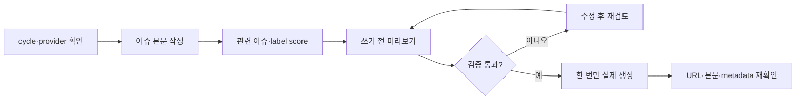

# IssueOps Create Issue

이 스킬의 일은 **Issue를 만들고, 읽히게 만들고, 확인하는 것**이다.
계획·구현·PR/MR은 하지 않는다.

- 전체 흐름: [`issueops`](../issueops/SKILL.md)
- PR/MR: [`issueops-create-pr`](../issueops-create-pr/SKILL.md)
- provider 세부 규칙: [`remote-issue.md`](../issueops/references/remote-issue.md)

## 먼저 고르는 것

| 요청 | 사용할 형식 | 분리 기준 |
|---|---|---|
| 결함·회귀 | `bug` | 재현 절차와 기대/실제 동작을 숫자 목록으로 쓴다 |
| 사용자 기능 | `feature` | 사용자 가치와 완료 조건을 짧은 checklist로 쓴다 |
| 구조·정책 결정 | `proposal` | 대안 비교가 핵심이면 표와 결정 근거를 쓴다 |
| 바로 실행할 작업 | `implementation_task` | 근거·범위·검증을 중심으로 쓴다 |
| parent의 독립 작업 | `child_task` | scope·의존성·wave를 metadata 표로 쓴다 |

정보를 모두 한 문단에 넣지 않는다. **결론은 위에, 근거는 해당 section에,
실행 명령은 검증 section에** 둔다. 다이어그램은 흐름·상태·경계가 문장보다
빠르게 읽힐 때만 쓴다.

## 템플릿을 정한 근거

공식 문서의 기능 범위와 이 저장소의 운영 계약을 맞췄다.

- [GitHub issue form 문법](https://docs.github.com/en/communities/using-templates-to-encourage-useful-issues-and-pull-requests/syntax-for-issue-forms):
  field type과 required validation을 사용한다.
- [GitHub PR template](https://docs.github.com/en/communities/using-templates-to-encourage-useful-issues-and-pull-requests/creating-a-pull-request-template-for-your-repository):
  본문에 반복되는 리뷰 정보를 미리 제공한다.
- [GitLab description templates](https://docs.gitlab.com/user/project/description_templates/):
  Issue와 MR 모두 Markdown template을 사용한다.

그래서 GitHub Issue는 입력 오류를 앞에서 막는 form으로, GitLab Issue와
PR/MR은 같은 읽기 순서를 유지하는 Markdown으로 관리한다. 필수 항목은
많이 넣기보다 완료·검증에 실제로 필요한 항목만 남긴다.

## 흐름



## 시작 게이트

1. `ISSUEOPS_ID`와 `agent-harness issueops list --repo "$PWD" --json`으로
   cycle을 찾는다. 찾은 record가 상태의 기준이다.
2. 기존 parent가 있으면 provider payload에서 **type, state, project,
   assignee, labels**를 다시 읽는다. GitLab은 URL만 보고 Issue와 Task를
   구분하지 않는다.
3. 최초 parent에 `issue_url`이 없으면 `--provider github|gitlab`을 명시하거나
   저장소 remote에서 단일 provider가 확인되는지 본다. 모호하면 쓰지 않는다.
4. closed umbrella를 다시 열거나 그 아래 sibling을 임의로 만들지 않는다.
   현재 품질·성능 parent와 child의 state/hierarchy를 먼저 확인한다.
5. provider 인증, project authority, owner, label score를 확인한 뒤에만
   `--confirm`을 고려한다. confirm이 없으면 preview다.

## Parent와 child

기본값은 `no split`이다. 한 owner가 한 번의 검토 가능한 변경으로 끝낼 수
있다면 다음 근거를 parent에 남기고 child를 만들지 않는다.

```text
Large Issue Breakdown Gate: no split
- 독립적인 acceptance와 rollback 경계가 없다.
- 한 owner와 한 MR로 검토할 수 있다.
- 이번 범위는 <파일/모듈> 안에 머문다.
```

다음 중 하나가 있을 때만 split한다.

- 한 Issue에 두면 독립된 delivery·rollback·review가 숨겨진다.
- 사용자가 병렬 ownership 또는 assignee 분리를 명시했다.

| 항목 | 규칙 |
|---|---|
| 실행 class | `[p]` 기본. `[s]`는 이름 있는 hard dependency가 있을 때만 |
| `[p]` | prerequisite `none`, 독립 검증, 보통 wave 1 |
| `[s]` | 선행 child URL/산출물과 순서를 반드시 명시 |
| 생성 | ordinary sibling이 아닌 `remote create-child` |
| parent 기록 | `## 하위 Task` 아래 URL·scope·wave·prerequisite를 본문에 기록 |

parent body를 안전하게 갱신할 IssueOps 경계가 없으면 raw `gh`/`glab`로
우회하지 말고 중지한다. 댓글만 남기는 것은 완료가 아니다.

## 읽기 좋은 body

### Implementation Issue 좋은 예

```markdown
## 문제
Issue와 PR/MR 생성 절차가 한 스킬에 섞여 있어 필요한 지침을 찾기 어렵다.

## 현재 근거
`skills/issueops/SKILL.md`가 lifecycle과 publication 규칙을 함께 안내한다.

## 관련 이슈/라벨 판단
threshold 0.70; 선택 `enhancement`; 거절 `documentation`; override 없음.

## 완료 기준
- [ ] Issue와 PR/MR 전용 스킬이 각각 독립 검증된다.
- [ ] 기존 lifecycle 라우팅과 provider contract가 유지된다.

## 비목표
provider API나 전체 IssueOps lifecycle을 재설계하지 않는다.

## 구현 범위
두 SKILL.md, router 링크, remote 입력 validation만 수정한다.

## 검증
`python3 scripts/validate-skill.py skills/issueops-create-issue`

## 위험과 트레이드오프
라우팅 누락 가능성은 focused skill validation과 router readback으로 줄인다.

## 피드백 기록
정보량보다 한국어 독자의 첫 읽기 순서를 우선했다.
```

### Bug Issue 좋은 예

```markdown
## 문제
`--label " bug "`가 공백을 제거하지 않고 provider에 전달된다.

## 재현 절차
1. label을 앞뒤 공백과 함께 두 번 전달한다.
2. `create-issue --confirm`을 실행한다.
3. provider request를 확인한다.

## 기대 동작
`bug` 한 번만 전달된다.

## 실제 동작
공백 label과 중복 label이 request에 남는다.

## 현재 근거
`cmd/harness/issueopscli/remotecmd/remote.go`의 repeated flag 경계.
```

로그는 secret을 제거한 짧은 code block으로만 붙인다. 긴 로그 전체나
스크린샷 대신 재현에 필요한 줄과 파일·명령을 적는다.

### 나쁜 예

| 나쁜 입력 | 왜 나쁜가 | 고치는 방법 |
|---|---|---|
| `버그 고쳐주세요` | 재현·완료 기준이 없다 | bug template의 재현/기대/실제 작성 |
| 파일 20개 목록 | 문제와 연결되지 않는다 | scope와 non-goals를 한 문단씩 작성 |
| `나중에 테스트` | 검증이 실행 가능하지 않다 | 명령과 기대 결과를 명시 |
| `task: 작업` | parent·class·wave가 없다 | `[p]`/`[s]`, prerequisite, wave 작성 |
| closed #18에 새 child 부착 | 종료된 umbrella 재사용 | 활성 parent를 확인하거나 새 parent 준비 |
| token이 든 로그 첨부 | secret이 durable artifact에 남는다 | redaction 후 최소 재현 출력만 첨부 |

## Canonical publication

score 결과를 보존하고, body file은 위 형식으로 먼저 읽어 본다. preview가
통과한 **동일 요청**에만 `--confirm`을 추가한다.

```bash
agent-harness issueops remote score \
  --input "$SCORE_INPUT" --judge none --json > "$SCORE_FILE"
agent-harness issueops remote create-issue \
  --id "$ISSUEOPS_ID" --provider "$PROVIDER" \
  --title "[enhancement] IssueOps 생성 경계를 분리한다" \
  --template implementation_task --body-file "$BODY_FILE" \
  --score-file "$SCORE_FILE" \
  --label enhancement --assignee "$ASSIGNEE" --json
```

confirmed write는 위 명령에 `--confirm`만 추가한다. 결과가 불명확하면
재호출하지 말고 다음처럼 marker를 reconcile한다.

```bash
agent-harness issueops remote reconcile-issue --id "$ISSUEOPS_ID" --json
agent-harness issueops remote reconcile-issue --id "$ISSUEOPS_ID" --confirm --json
```

child는 parent URL이 record에 연결되고 umbrella branch gate가 통과한 뒤 만든다.

```bash
agent-harness issueops remote create-child \
  --id "$ISSUEOPS_ID" --title "[p] Issue body 계약을 검증한다" \
  --template child_task --body-file "$CHILD_BODY" \
  --label enhancement --assignee "$ASSIGNEE" \
  --host "$HOST" --session-id "$SESSION_ID" --cwd "$WORKER_PATH" --json
```

child body에는 parent URL, scope, `[p]`/`[s]`, prerequisite, wave, acceptance,
verification, merge condition, cleanup을 넣는다. confirmed child 결과의
`hierarchy_verified`, type, URL, labels, assignee와 parent body readback을
확인한다.

## 품질·성능 게이트

- 품질: template critical validation 0, 한국어 body, score 기록, secret
  redaction, hierarchy/label/assignee readback.
- 성능: issue 단계에서만 이 스킬을 로드한다. PR/MR reference를 함께
  중복 로드하지 않는다. 변경 전후 byte 수와 focused 검증 시간을 기록하되
  측정 없는 성능 개선을 주장하지 않는다.
- 검증:

```bash
python3 scripts/validate-skill.py skills/issueops-create-issue
python3 scripts/verify-skill-shell.py skills/issueops-create-issue
wc -c skills/issueops-create-issue/SKILL.md
```

provider, project authority, owner, body, label/assignee, hierarchy, 또는
durable intent가 모호하면 쓰지 않는다.
