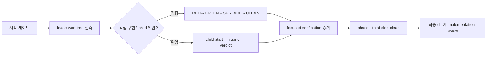

# IssueOps Implement

이 스킬의 일은 **implement 단계 하나**다. 승인된 plan을 canonical worktree에서
TDD로 구현하고, execution lease를 지키고, 증거를 남기고, ai-slop-clean 단계로
넘긴다. Issue·branch·PR publication과 전체 lifecycle 라우팅은 하지 않는다.

- 전체 흐름과 phase 라우팅: [`issueops`](../issueops/SKILL.md)
- 브랜치 정체성 준비: [`issueops-prepare`](../issueops-prepare/SKILL.md)
- lease 준비·회복 체인 전문: [`execution.md`](../issueops/references/execution.md)
- delegated child 전문: [`orchestration.md`](../issueops/references/orchestration.md)
- PR/MR publication: [`issueops-create-pr`](../issueops-create-pr/SKILL.md)

## 흐름



## 시작 게이트

다음 하나라도 확인되지 않으면 구현을 시작하지 않는다.

- record가 존재한다. `ISSUEOPS_ID`가 없고 `issueops list --repo "$PWD" --json`에도
  이 브랜치의 사이클이 없으면 **아직 사이클이 시작되지 않은 것**이다. 워크트리와
  브랜치만 먼저 만든 뒤 이 스킬로 들어오면 매번 여기서 걸린다. 이때는 상태만 보고하고
  멈추지 말고 [`issueops`](../issueops/SKILL.md)를 실행한다. 라우터가 problem·grill·
  plan·compatibility-review를 밟아 record·plan artifact·execution lease를 만들고,
  implement phase에 도달하면 이 스킬로 되돌아온다. "진행 방향은 사용자 결정"으로
  끝내는 것은 게이트 통과가 아니라 라우팅 누락이다.
- record의 phase가 `implement`다. 아직 전이 전이면 이 스킬이 아니라
  [`issueops`](../issueops/SKILL.md) 라우터의 게이트를 먼저 통과한다.
- design·compatibility·devils-advocate review가 approved 또는 명시적 waive다.
- staged plan artifact와 durable `plan_path`가 있다.
- current `Execution`의 generation·mode·native holder가 이 세션과 일치한다.
- canonical worktree의 branch·HEAD가 record와 일치하고 무관한 dirty 변경이 없다.

```bash
agent-harness issueops status --id "$ISSUEOPS_ID" --json
agent-harness issueops execution status --id "$ISSUEOPS_ID" --json
agent-harness issueops execution whoami --json
git -C "$WORKTREE" rev-parse --abbrev-ref HEAD
git -C "$WORKTREE" status --porcelain
```

`execution whoami`가 이 세션의 native receipt를 자동으로 해석한다. holder가 이
세션이 아니거나 generation이 다르면 구현하지 않고 아래 회복 표를 따른다.

## 구현 루프

- behavior change는 focused failing test에서 시작한다:
  RED→GREEN→SURFACE→CLEAN. RED에서 새 테스트가 곧바로 통과하면 버그 이해가
  틀린 것이므로 수정에 착수하지 않고 보고한다.
- 파일 수정은 canonical worktree 안에서만 한다. source checkout 수정은 변경
  규모와 무관하게 계약 위반이다. worktree는 이미 준비되어 있으므로 "시간이
  없다"는 source checkout 작업의 근거가 되지 않는다.
- 검증은 변경 범위에 집중한 명령을 실행하고 명령과 결과를 그대로 기록한다.
  실행하지 않은 검증을 `pass`로 적지 않는다.
- commit·push는 사용자 지시가 있을 때만 [`atomic-commit-push`](../atomic-commit-push/SKILL.md)로
  한다. 해석이 필요한 지시("PR 올려줘")는 해석을 밝힌 뒤 진행한다.
- API/DTO/OpenAPI 변경은 `.agent-harness/OPEN_API_SPEC.md` gate를 적용한다.

## Lease fencing

durable mutation(phase 전이, record 기록, artifact stage) 전마다 exact lifecycle
ID·generation·native actor·canonical cwd를 현재 record와 대조한다. record 기록은
`RECORD_ACTOR_FLAGS`, lease 전이·publication은 `ACTOR_FLAGS`를 쓴다. 두 축약의
정의는 `issueops --help`의 legend가 소유한다.

불일치는 stop이다. 사용자의 "그 세션은 내가 껐어"는 quiescence 증거가 아니다.
증명은 `replace --finalize-preview`의 결과만 한다.

## 회복은 next_command 체인만

lease가 없거나, holder가 다르거나, mutation 결과가 모호할 때는 아래 첫 명령을
실행하고 **각 결과가 돌려주는 `next_command`를 그대로 실행한다**.

| 상황 | 첫 명령 |
|---|---|
| 방향을 모르겠다 | `execution status --id ID --json` |
| holder 교체·회수가 필요하다 | `execution replace --id ID --expected-generation N --preview` |
| provisioning·publication 결과가 모호하다 | `execution reconcile --id ID --preview` 후 `--confirm` |

- `--revoke`·`--finalize`·`--reseed`와 fingerprint를 기억으로 조합하지 않는다.
  preview가 돌려준 정확한 명령만 실행한다.
- direct 회복의 종착은 `claim`, orca 회복의 종착은 `resume`이다. 서로 바꿔
  추정하지 않는다.
- 모호한 mutation 뒤에 같은 prepare/create를 반복 실행하지 않는다. 파일시스템을
  직접 관찰해서 "흔적이 없으니 재실행"으로 분기하지도 않는다. 처분은
  reconcile이 소유한다.
- 전체 replacement 체인과 legacy 예외는 [`execution.md`](../issueops/references/execution.md)가
  소유한다. 이 표는 진입점만 제공한다.

## Child 위임

세 조건이 모두 참일 때만 위임한다: parent가 implement phase다, 세 리뷰 게이트가
approved 또는 waive다, plan이 sub-agent pattern·scope·acceptance·verification·
fallback·tradeoff를 기록한다.

```bash
agent-harness issueops child start --parent "$ISSUEOPS_ID" \
  --branch "$CHILD_BRANCH" --title "$TITLE" \
  --scope "$SCOPE" --acceptance "$CRITERION" \
  --host claude --session-id "$SESSION_ID" --cwd "$WORKER_PATH" --json
agent-harness issueops child status --parent "$ISSUEOPS_ID" \
  --host claude --session-id "$SESSION_ID" --cwd "$WORKER_PATH" --json
```

- verdict는 `accept`·`reject`·`drop` 셋뿐이다. child scope를 고치는 amend 명령은
  없으므로 찾거나 발명하지 않는다.
- child의 branch·worktree·lease는 child cycle 자신의 `branch prepare`와
  `execution prepare`가 소유한다. worktree provisioning은 `execution prepare`
  몫이며, legacy `worktree prepare` 계열 명령은 v1 카탈로그에서 제거되었다.
  parent가 child worktree를 직접 만들거나 `orca worktree create`로 대체하지
  않는다.
- child가 scope drift를 보고하면 child를 조용히 넓히지 않는다. 사용자가
  승인해도 경로는 두 가지뿐이다: 새 scope를 **새 child**로 분리하거나, plan을
  개정하고 plan hash에 묶인 리뷰 freshness를 다시 확인한다.
- accept 전 rubric: 위임한 scope·expected worktree 준수, acceptance별 증거,
  선언한 검증 명령의 실행 결과, 무관한 diff·secret·stale scaffold 없음. 하나라도
  모호하면 accept하지 않는다.
- parent는 child record를 대신 수정하지 않는다. child contract prompt 템플릿과
  상세 rubric은 [`orchestration.md`](../issueops/references/orchestration.md)를 따른다.

## Publication evidence gates

구현 diff가 확정된 뒤, implementation review **전에** 두 게이트를 통과한다.
두 게이트 모두 검토한 change fingerprint를 봉인하므로, 문서를 고치는 일은
반드시 기록보다 먼저다. 순서를 뒤집으면 봉인한 fingerprint가 곧바로 stale이 된다.

### project-doc 반영 판정 (모든 사이클)

구현 diff를 `.agent-harness/` 운영 문서와 양방향으로 대조한다.

- **문서 → 구현**: CONSTITUTION의 원칙, CONVENTIONS의 계층·패키지 경계,
  ARCHITECTURE의 책임 분리, CAUTIONS의 기존 함정을 이번 diff가 어기지 않았는가.
  어겼으면 문서가 아니라 구현을 고친다.
- **구현 → 문서**: 이번 변경이 CAUTIONS에 남길 재발 함정이나 ADR에 남길 결정을
  만들었는가. 새 명령·컨벤션·구조가 생겼으면 해당 문서가 그것을 아직 모른다.

evidence에는 무엇을 대조했고 어느 쪽으로 판정했는지를 적는다. 갱신이 필요하면
[`project-docs-update`](../project-docs-update/SKILL.md)의 route → read(SHA) →
append/revise 계약으로 **문서를 먼저 고친 뒤** 기록한다.

```bash
agent-harness issueops project-docs-review record --id "$ISSUEOPS_ID" \
  --verdict updated --doc ".agent-harness/CAUTIONS.md" \
  --evidence "$WHAT_WAS_CHECKED" \
  --host claude --session-id "$SESSION_ID" --cwd "$WORKER_PATH" --json
```

- verdict는 `updated|no-change`이고 evidence는 항상 1개 이상이다.
- `updated`는 `--doc` 경로가 **실제 변경 집합 안에** 있어야 통과한다. 고치지
  않고 "갱신했다"고 기록하면 거부된다.
- `no-change`는 `--doc`을 받지 않는다. 무엇을 확인하고 왜 남길 것이 없다고
  판단했는지를 evidence에 적는다.
- direct·orca 모드 모두 대상이다. direct 사이클도 운영 문서에 남길 결정을 만든다.

### 스키마 실측 근거 (조건부)

변경 집합에 마이그레이션·엔티티·`.sql`·`schema.prisma` 파일이 있을 때만 활성화된다.
없으면 이 게이트는 아예 뜨지 않는다. 활성화되면 추정이 아니라 **실제 데이터베이스
관찰값**을 요구한다: 대상 테이블의 기존 인덱스 현황과 row 수, 그리고 그 값을
어디서 봤는지. 조회는 `codd` 스킬 또는 DB MCP 서버로 한다.

커넥션을 소모하는 대형 스캔을 던지지 않는다. `COUNT(*)` 전수 대신 카탈로그의
추정 row 수(`pg_class.reltuples`, `information_schema`, `SHOW INDEX`)를 쓰고,
필요하면 `LIMIT`을 건다. 운영 DB에서 무거운 쿼리 하나가 커넥션 풀을 마르게 한다.

```bash
agent-harness issueops schema-evidence record --id "$ISSUEOPS_ID" \
  --measurement "orders: 8.4M rows(reltuples), idx_orders_user_id 없음" \
  --source "mcp db-bc-prod execute_sql_bc_prod_market" \
  --host claude --session-id "$SESSION_ID" --cwd "$WORKER_PATH" --json
```

- measurement와 source는 짝이다. 출처 없는 수치는 추정과 구분되지 않는다.
- 관찰이 불가능하면 `--waive --waiver-rationale "..."`로 근거를 남긴다.
  rationale 없는 waive는 게이트를 열지 않는다.
- 실측 결과는 구현에 반영한다. row 수가 크면 인덱스 생성 전략(concurrent 여부),
  마이그레이션 잠금 시간, 백필 배치 크기가 달라진다.

## Implementation review gate

execution이 있는 모든 사이클은 publication 전에 구현 diff에 대한 적대 리뷰가
필수다. 모드는 이 게이트를 가르지 않는다. 게이트가 리뷰를 부르는 것이 아니라
**리뷰가 기록을 만든다**.

1. planner급 모델의 fresh 서브에이전트로 최종 diff의 brooks 적대 리뷰를 실제로
   실행한다. prepare가 기록한 `{REVIEWER_MODEL}`/`{REVIEWER_EFFORT}` 기본값을
   따른다.
2. 리뷰가 끝난 뒤에만 기록한다.

```bash
agent-harness issueops implementation-review record --id "$ISSUEOPS_ID" \
  --verdict pass --finding "$FINDING" --evidence "$EVIDENCE" \
  --reviewer-host claude --reviewer-model "$REVIEWER_MODEL" \
  --host claude --session-id "$SESSION_ID" --cwd "$WORKER_PATH" --json
```

- verdict는 `pass|revise|stop`이고 finding·evidence 각 1개 이상이 강제된다.
  리뷰를 실행하지 않은 `--verdict pass` 기록은 게이트 연극이다. "pr-readiness가
  요구할 때만 하면 된다"는 판단은 순서를 뒤집은 것이다.
- 기록은 implement phase 이후부터 가능하고, 리뷰가 검토한 change fingerprint를
  봉인한다. 이후 diff가 바뀌면 `implementation_review_stale`로 create-pr과 strict
  readiness가 거부하므로, 리뷰는 ai-slop-clean 재검증까지 끝난 diff에 수행한다.
- 모드에 따른 면제는 없다. direct 모드도 같은 기록을 요구한다 — 리뷰 없이
  게시된 변경은 어느 모드에서 만들어졌든 검토되지 않은 변경이다.

## 종료 게이트

implement 단계의 출구는 ai-slop-clean 전이다.

- focused verification 증거가 명령·결과로 남아 있는지, 위임한 child가 전부
  accepted 또는 dropped인지 확인한다. `child_incomplete`·`child_unvalidated`가
  남으면 전이가 거부된다.
- `phase --id ID --to ai-slop-clean`으로 전이한다. cleanup 작업과 기록은
  [`ai-slop-clean.md`](../issueops/references/ai-slop-clean.md)와 `shannon`이 소유한다.
- `execution complete`는 이 단계의 명령이 아니다. complete는 pr phase에서 검증된
  remote artifact URL·final head·turing report를 요구하며 그 전 호출은 거부된다.
  "구현 끝났으니 완료 처리해줘"가 뜻하는 것은 phase 전이지 complete가 아니다.

## 나쁜 예

| 나쁜 행동 | 문제 |
|---|---|
| record가 없는데 게이트 표만 보고하고 "진행 방향은 사용자 결정"으로 멈춤 | 게이트 통과가 아니라 라우팅 누락이다. 사이클이 없으면 `issueops`를 실행한다 |
| "3줄 수정이니까" source checkout에서 바로 수정 | canonical worktree 계약 위반, 이후 readiness의 head 증거와 어긋난다 |
| 사용자 구두 확인만으로 `replace --revoke --confirm` | quiescence 증명이 없다. finalize-preview 결과만 증거다 |
| direct인데 `resume`, orca인데 수동 `claim` 조합 | 모드별 종착 명령을 혼동했다. next_command를 따른다 |
| timeout 뒤 prepare/create 재실행 | 이중 mutation 위험이 있다. 처분은 reconcile이 소유한다 |
| 리뷰 없이 `implementation-review record --verdict pass` | 게이트 연극이다. 리뷰 실행이 기록보다 먼저다 |
| 문서를 고치지 않고 `project-docs-review record --verdict updated` | `--doc`이 변경 집합에 없어 거부된다. 문서 수정이 기록보다 먼저다 |
| 운영 DB에 `SELECT COUNT(*)` 전수 스캔으로 row 수 측정 | 커넥션을 소모한다. 카탈로그 추정치를 쓴다 |
| 실측 없이 "일반적으로 인덱스가 필요하다"로 schema evidence 기록 | source 없는 수치는 추정이다. 관찰 불가면 waive에 근거를 적는다 |
| implement 직후 `execution complete` | complete는 pr phase에서 remote artifact 검증 후에만 가능하다 |
| 구두 승인으로 child scope 확장 | sanctioned 경로는 새 child 분리 또는 plan 개정뿐이다 |
| 존재가 불확실한 서브커맨드를 --help 프로브로 확정 | 이 CLI의 --help 프로브는 신뢰할 수 없다. usage 카탈로그와 소스가 기준이다 |

## 검증

```bash
python3 scripts/validate-skill.py skills/issueops-implement
python3 scripts/verify-skill-shell.py skills/issueops-implement
wc -c skills/issueops-implement/SKILL.md
```

시작 게이트·lease·child verdict·리뷰 게이트·종료 게이트 중 하나라도 모호하면
durable mutation을 하지 않고 현재 상태와 막힌 지점을 보고한다.
